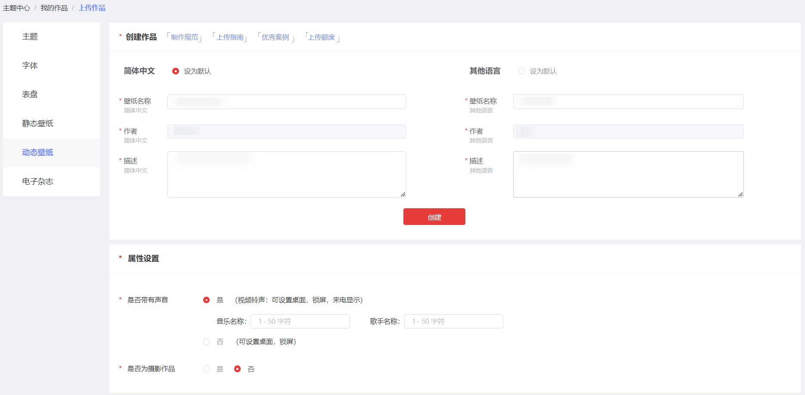
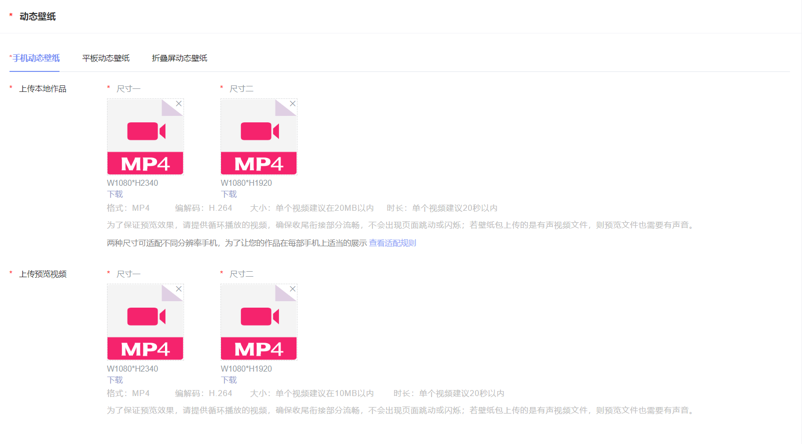
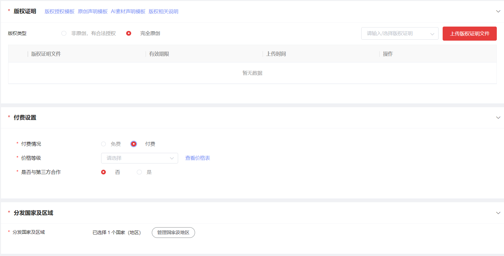
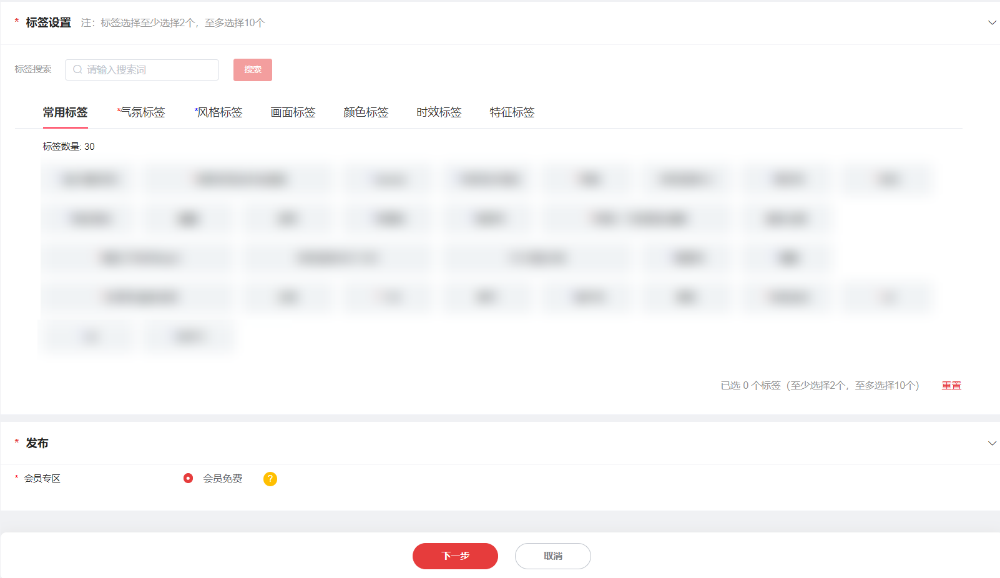
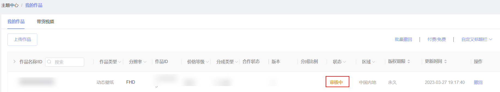
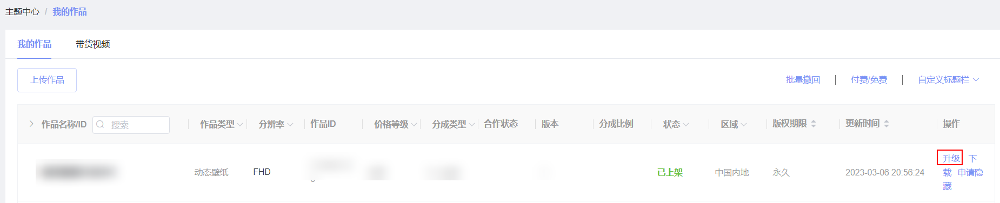
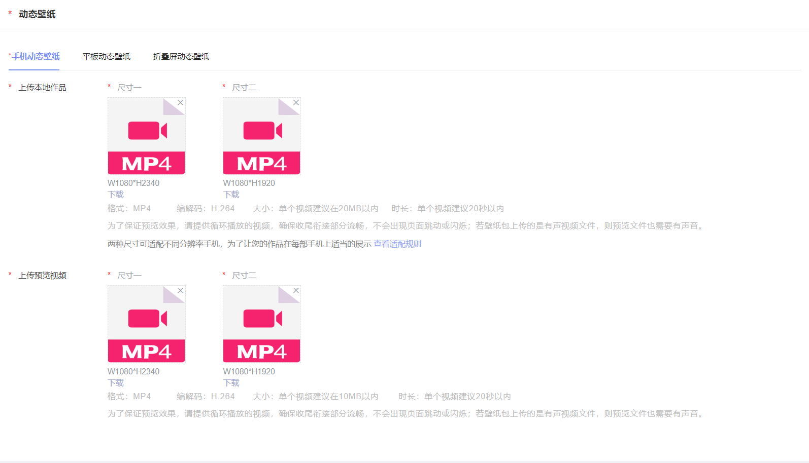
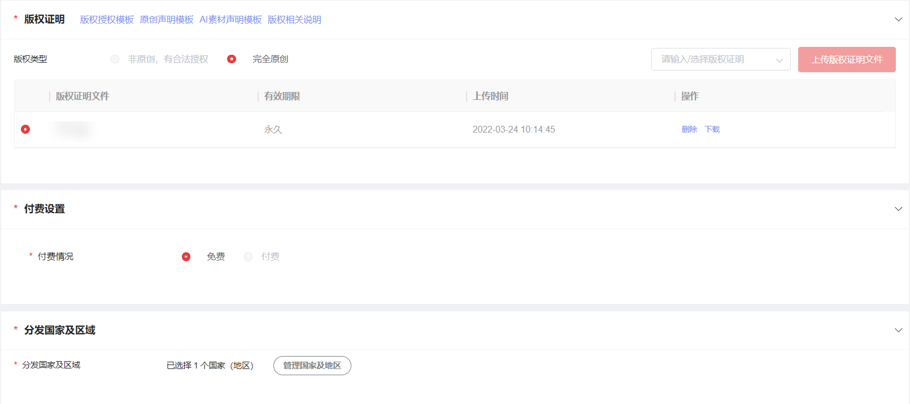
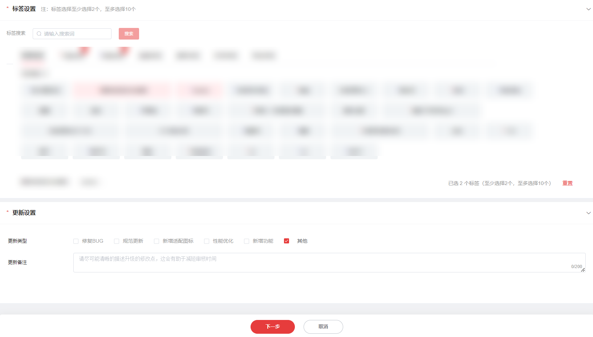
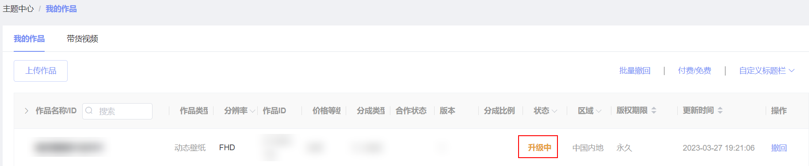

# 动态壁纸&视频铃声

## 1. 动态壁纸&视频铃声上传

第一次上传动态壁纸，请按以下操作：

1. 点击“作品上传”，左侧导航栏选择动态壁纸，完善作品信息后点击下一步创建作品。

   

   
2. 上传动态壁纸文件和预览视频。

   

   

   1. 上传平板、折叠屏动态壁纸为可选选项，如要上传平板、折叠屏动态壁纸，需同时上传手机动态壁纸。
   2. 如已上传平板、折叠屏动态壁纸文件，则需要上传平板、折叠屏动态壁纸的预览文件。
3. 上传版权文件。完善付费设置、分发国家及区域信息。

   
4. 设置动态壁纸标签。

   
5. 提交审核，作品列表页对应作品状态显示为“审核中”，表示上传成功。

   

## 2. 动态壁纸&视频铃声升级

1. 在“我的作品”列表找到需要升级的动态壁纸，点击“升级”。

   
2. 更新动态壁纸包和预览视频文件。

   
3. 更新版权证明文件。

   
4. 勾选更新类型并填写更新备注。

   
5. 提交审核，作品列表页对应作品的状态显示为“升级中”，表示上传成功。

   