# 表盘

## 1. 表盘上传

第一次上传表盘，请按以下操作：

1. 点击“作品上传”，左侧导航栏选择表盘，在“创建作品”处编辑并保存好“表盘名称”。

   

   表盘包description.xml文件中的“&lt;title-cn&gt;”字段内容需要与编辑的“表盘名称”保持一致，否则无法上传成功。

   

   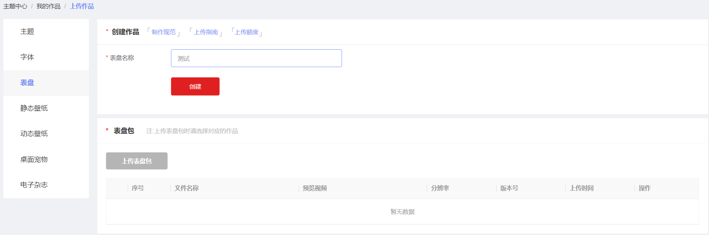
2. 然后上传表盘包。表盘包上传完成后，补充上传表盘的预览视频。

   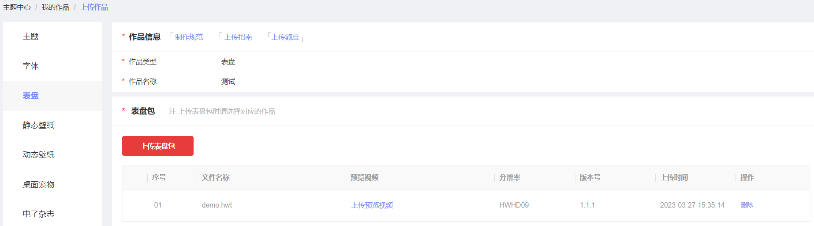
3. 上传表盘的版权文件或原创声明。

   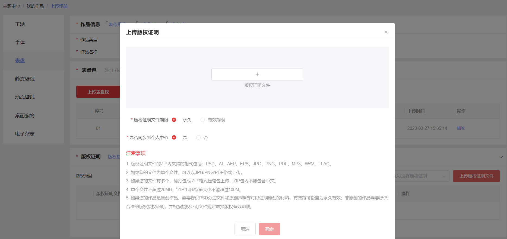
4. 完善表盘付费设置、分发国家及区域、标签设置、发布等信息，点击下一步。

   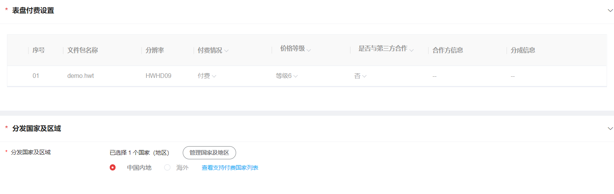

   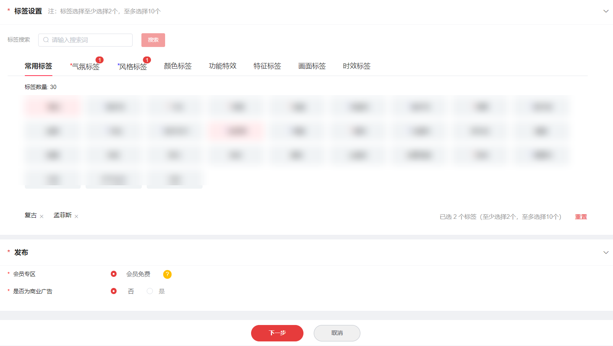
5. 信息确认无误后，点击“提交”。

   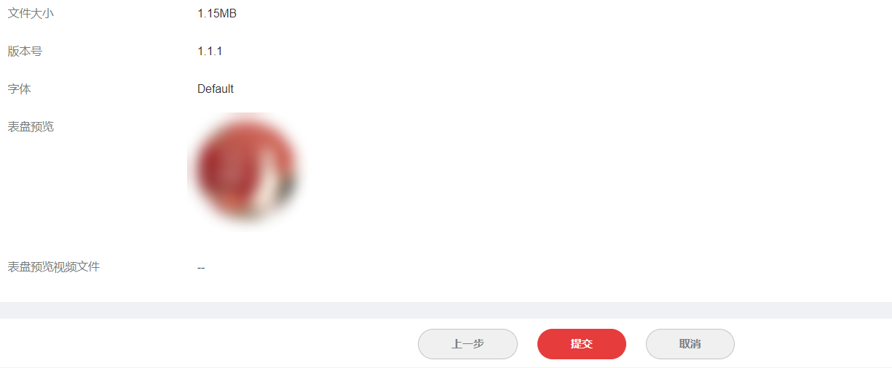
6. “我的作品”列表页对应作品的状态显示为“审核中”，表示上传成功。

   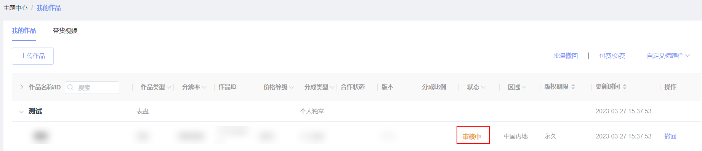

## 2. 表盘升级

1. 在“我的作品”页找到需要升级的表盘，点击“升级”。

   
2. 点击“上传表盘包”，上传准备好的表盘包。

   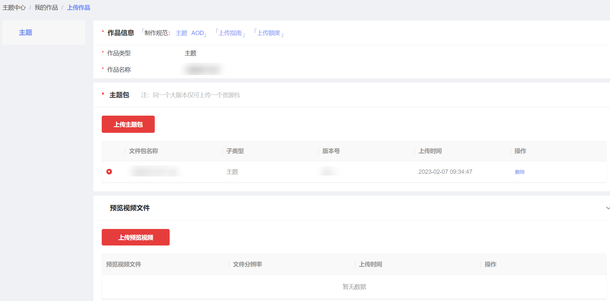
3. 选中新上传的表盘包，表盘付费设置不允许修改，勾选更新类型，点击“下一步”。

   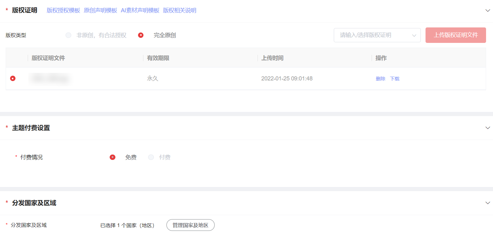

   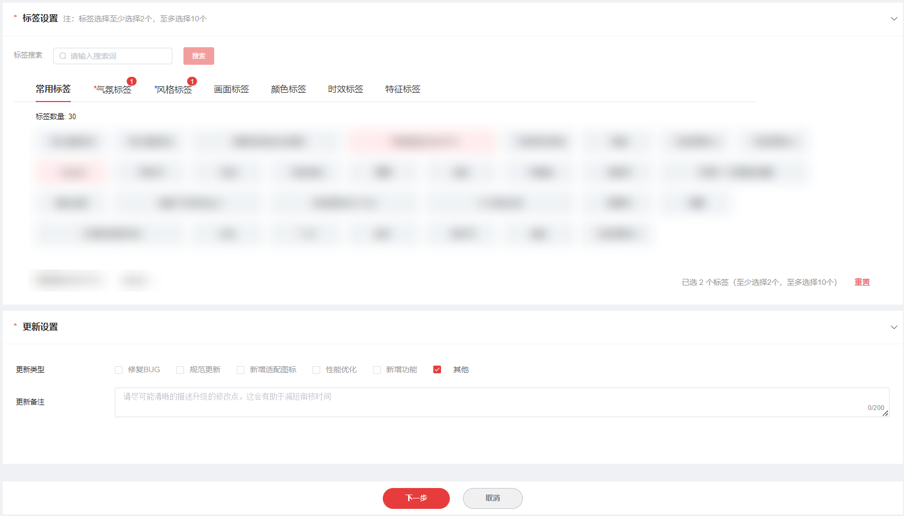
4. 信息确认无误后，点击“提交”。

   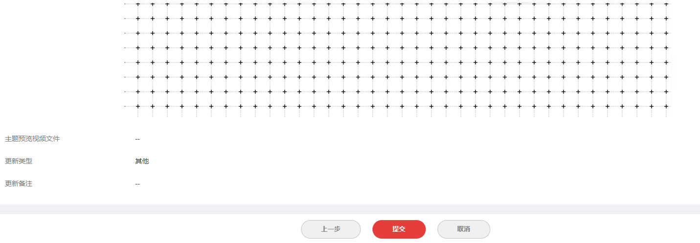
5. “我的作品”列表页对应作品的状态显示为“升级中”，表示上传成功。

   