# 主题&熄屏显示&桌面万象小组件

## 1. 主题上传

第一次上传该主题，请按以下操作：

1. 点击“上传作品”，左侧导航栏选择主题，然后在“创建作品” 处，选择主题下的作品类型，并点击“上传”上传主题包。

   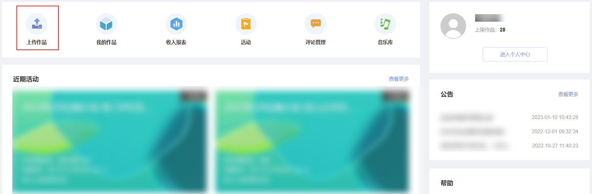

   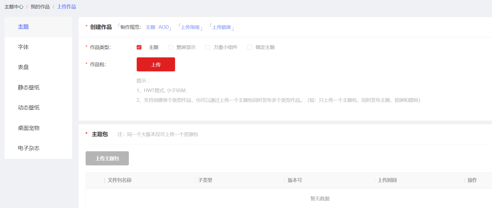
2. 在“主题包”处，选中成功上传的主题包，然后上传视频预览文件 ，上传完成后，点击“提交”。

   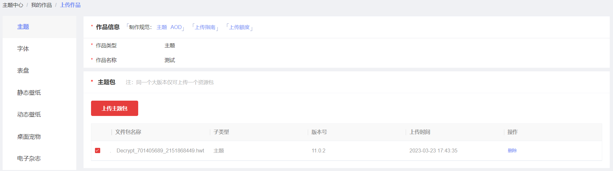

   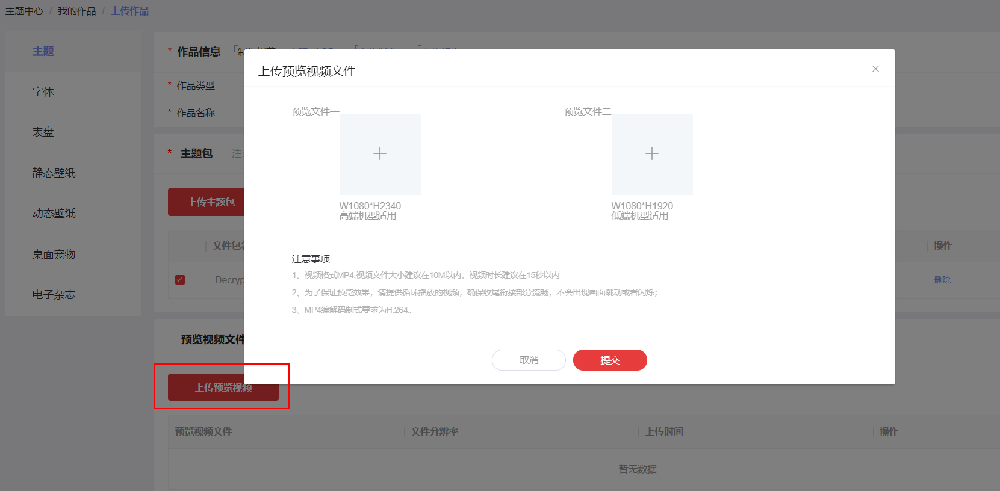
3. 上传版权证明文件，成功后，点击“确定”。

   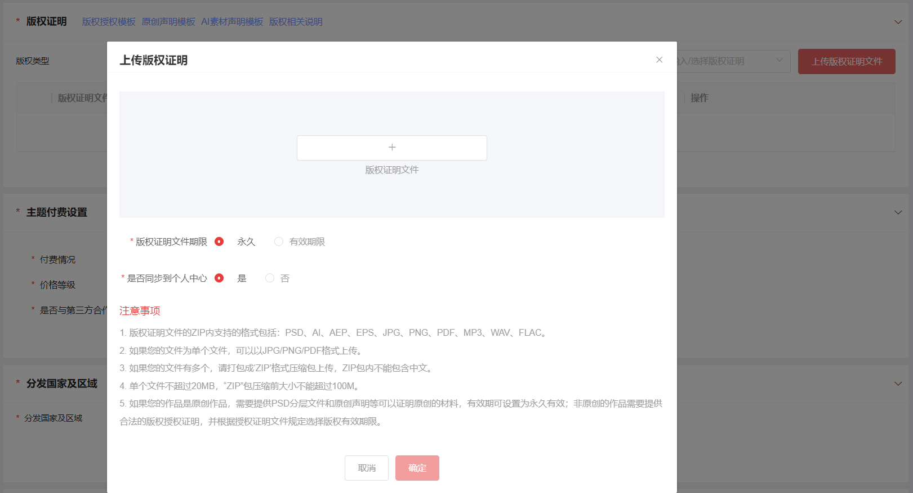
4. 完善主题付费设置、分发国家及区域、标签设置、发布等信息，点击下一步。

   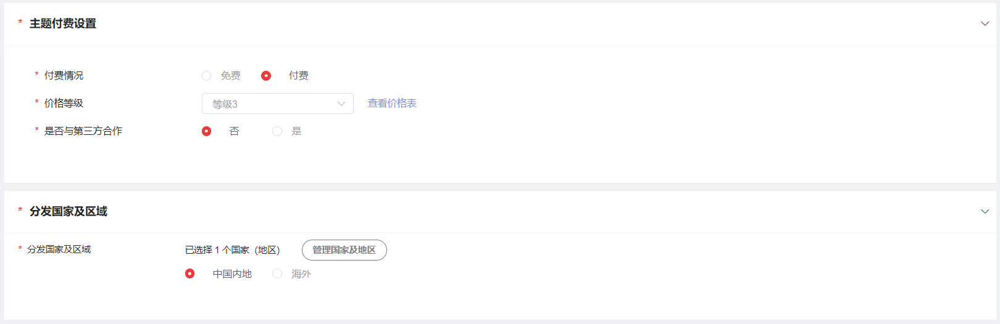

   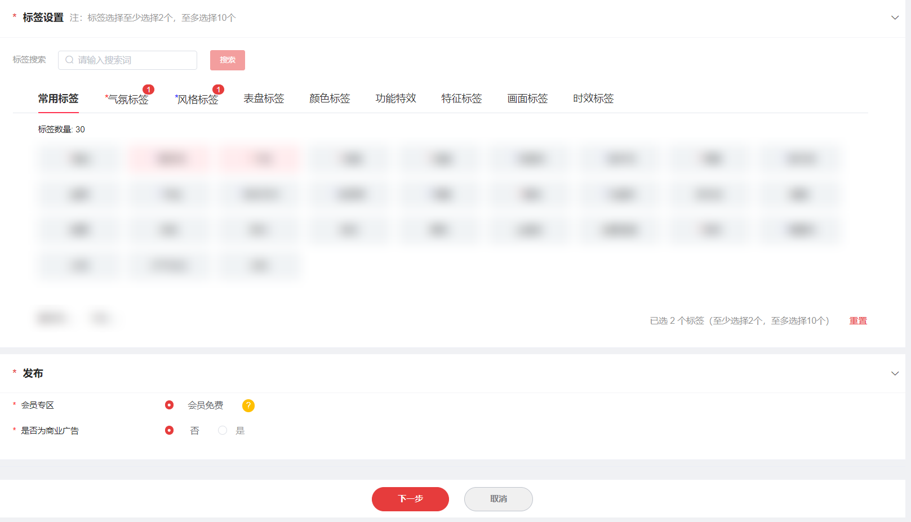
5. 信息确认无误后，点击“提交”。

   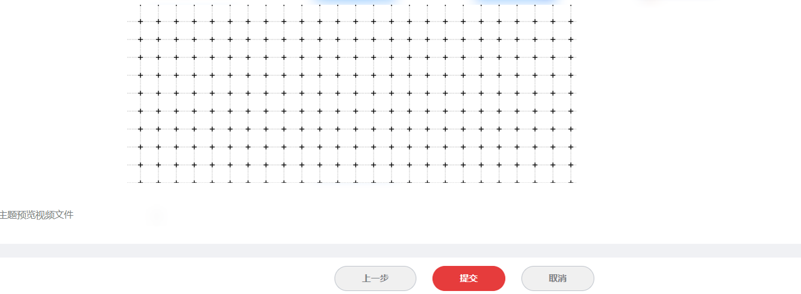
6. “我的作品”列表页对应作品的状态显示为“审核中”，表示上传成功，请耐心等待审核结果。

   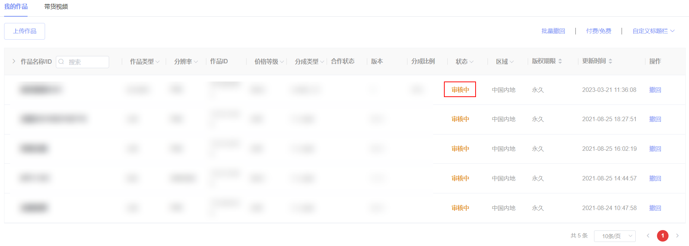

## 2. 主题升级

1. 在“我的作品”页找到需要升级的主题作品，点击“升级”。

   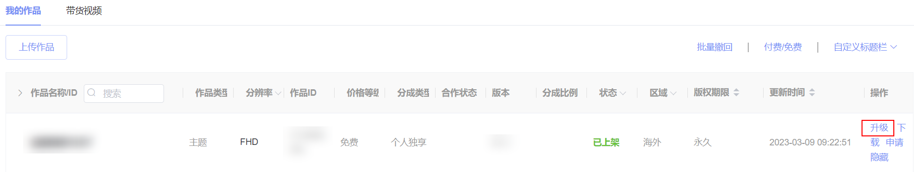
2. 点击“上传主题包”，并上传准备好的主题包。

   
3. 上传成功后，选中新上传的主题包，付费设置不允许修改，然后勾选更新类型，点击“下一步”。

   

   
4. 信息确认无误后，点击“提交”。

   
5. “我的作品”列表页对应作品的状态显示为“升级中”，表示上传成功，请耐心等待审核结果。

   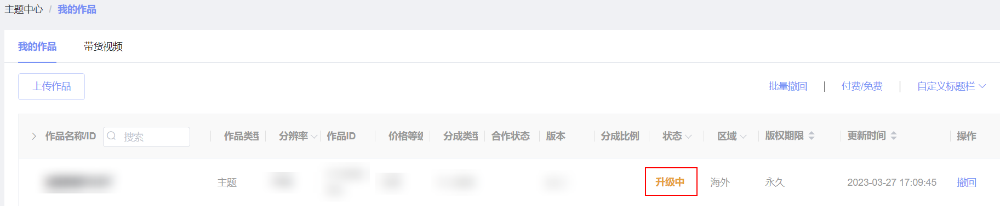