# 静态壁纸

## 1. 壁纸上传

第一次上传壁纸，请按以下操作：

1. 点击“作品上传”，左侧导航栏选择静态壁纸，完善作品信息后点击“创建”。

   

   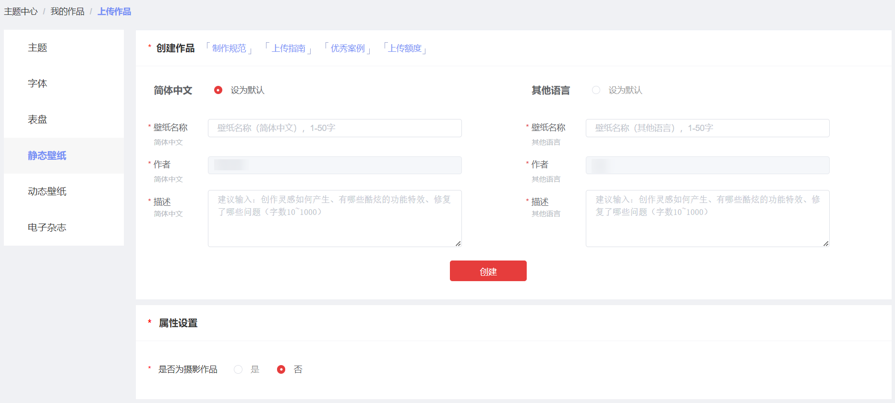
2. 上传静态壁纸文件和版权证明文件。

   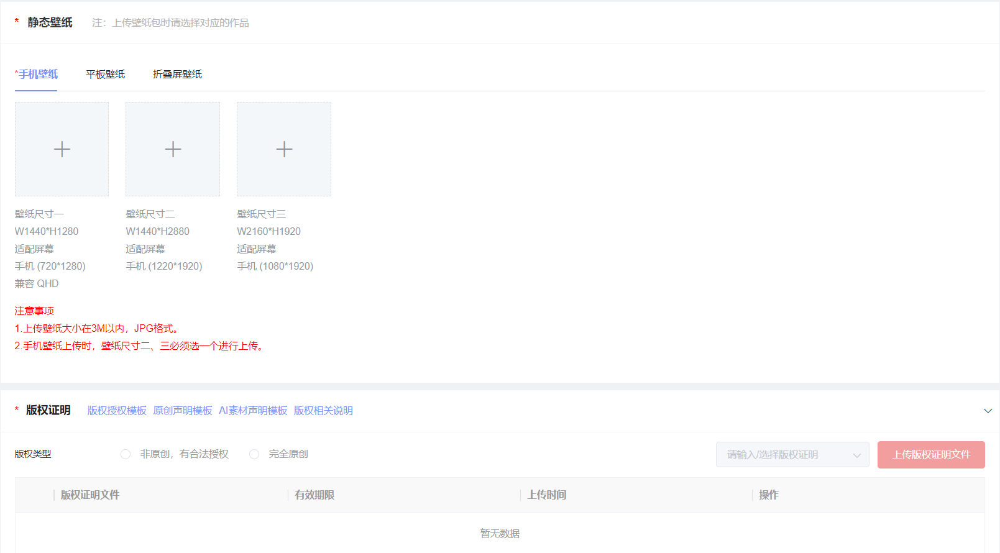

   

   1. 上传壁纸大小在3M以内，JPG格式。
   2. 手机壁纸上传时，壁纸尺寸二、三必须选一个进行上传。
   3. 若上传平板壁纸，可以选择一种或多种分辨率进行上传。
3. 完善壁纸付费设置、分发国家及区域、标签设置等信息，点“下一步”。

   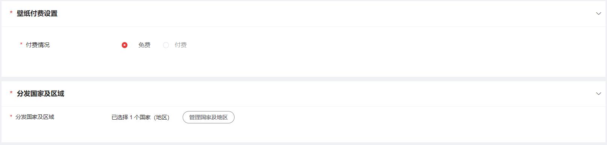

   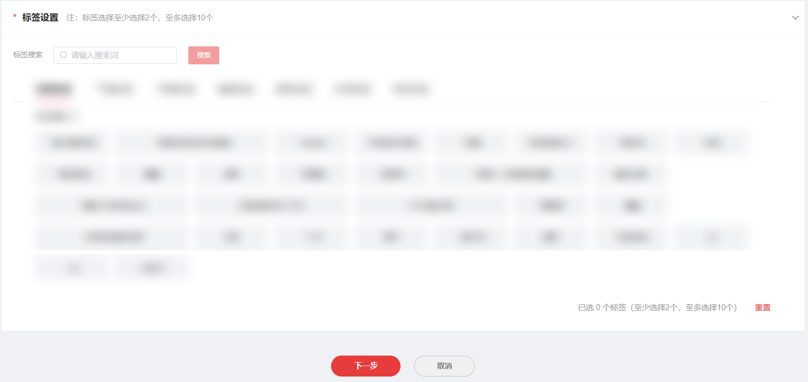
4. 信息确认无误后，点“提交”。

   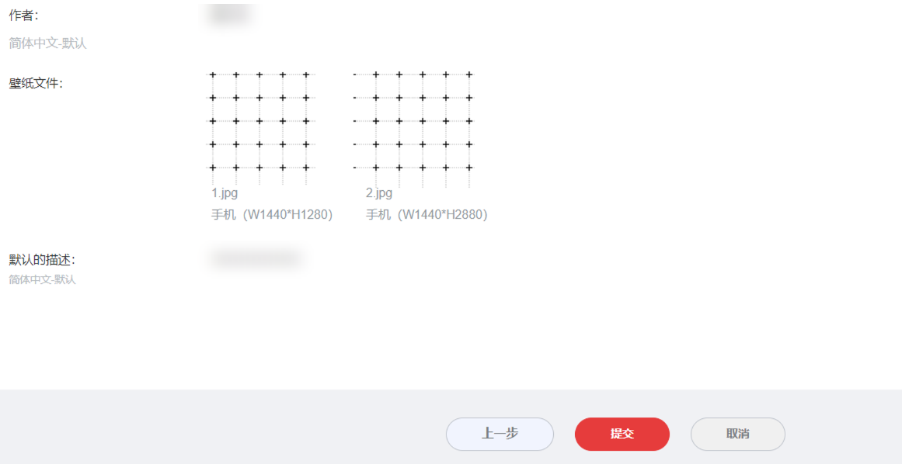
5. 作品列表页对应作品的状态显示为“审核中”，表示上传成功。

   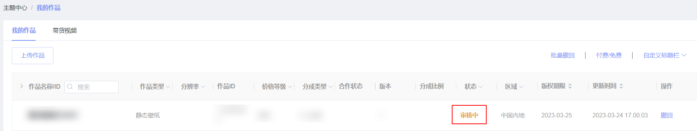

## 2. 壁纸升级

1. 在“我的作品”页找到需要升级的静态壁纸，点击“升级”。

   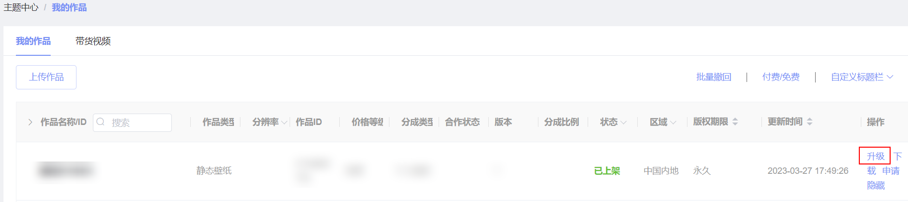
2. 上传新的静态壁纸文件。

   
3. 再次编辑标签设置，付费和分发信息不允许修改。勾选更新类型，点击“下一步”。

   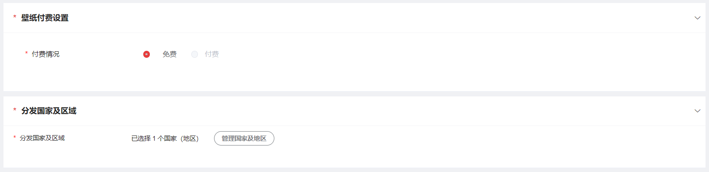

   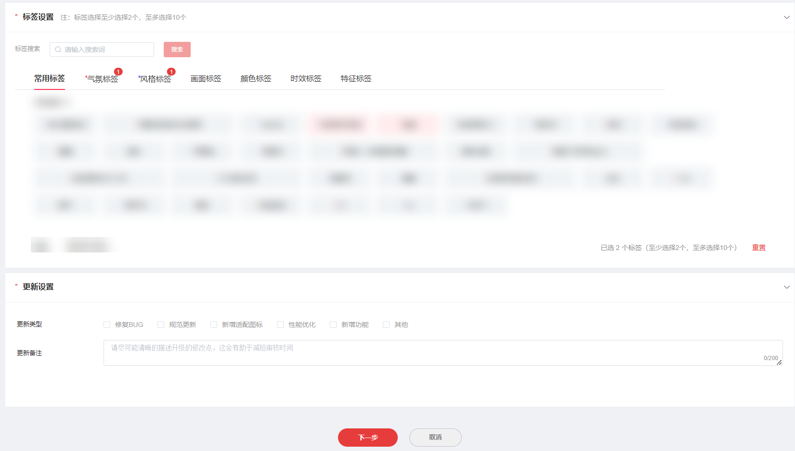
4. 信息确认无误后，点击“提交”。

   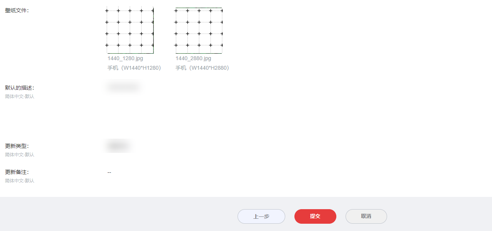
5. 作品列表页对应作品的状态显示为“升级中”，表示上传成功。

   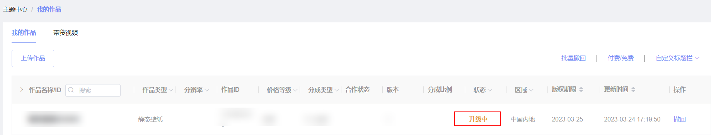