# 字体设计指导及规范

## 1. 字体设计类型

目前可设计的字体类型为：

* 静态字体：系统应用换字，支持国内和海外使用。
* 可变字体：系统应用换字，应用后用户可调节字体的大小和粗细（粗细调节仅HarmonyOS系统支持），支持国内使用。

## 2. 字体的制作流程

* 字体设计制作、预览图制作和XML文件制作（可变字体需制作XML文件）。
* 字体打包。
* 字体自检。
* 上传开发者联盟等待审核。

## 3. 字体设计制作规范

* 字体目前没有明确的宽度和高度标准，可以参考系统默认字体宽度和高度值。
* 字体大小、线条粗细、字符风格需要保持统一，必须适配的字符集参考文件：[GB2312-80简体中文字符集.zip](https://communityfile-drcn.op.dbankcloud.cn/FileServer/getFile/cmtyPub/011/111/111/0000000000011111111.20250620110642.35897585207879873244677881816894%3A50001231000000%3A2800%3A8C83FBC7F507F069CE1D3BE65648E7A05DA7C2AB06C2FC77438260058B9C2198.zip?needInitFileName=true)。
* 字体需要原创或有版权授权。
* 可变字体将多个字体文件紧凑地封装在一个字体文件中，通过定义字体内的变化来实现单轴或者多轴设计空间，需按照相关规范进行设计制作。
* 在导出制作好的可变字体文件时，为避免切换字体后布局产生截断或重叠，中文字体文件的参数需参照如下设定：

  hheaAscender：1113；hheaDescender：-349。

  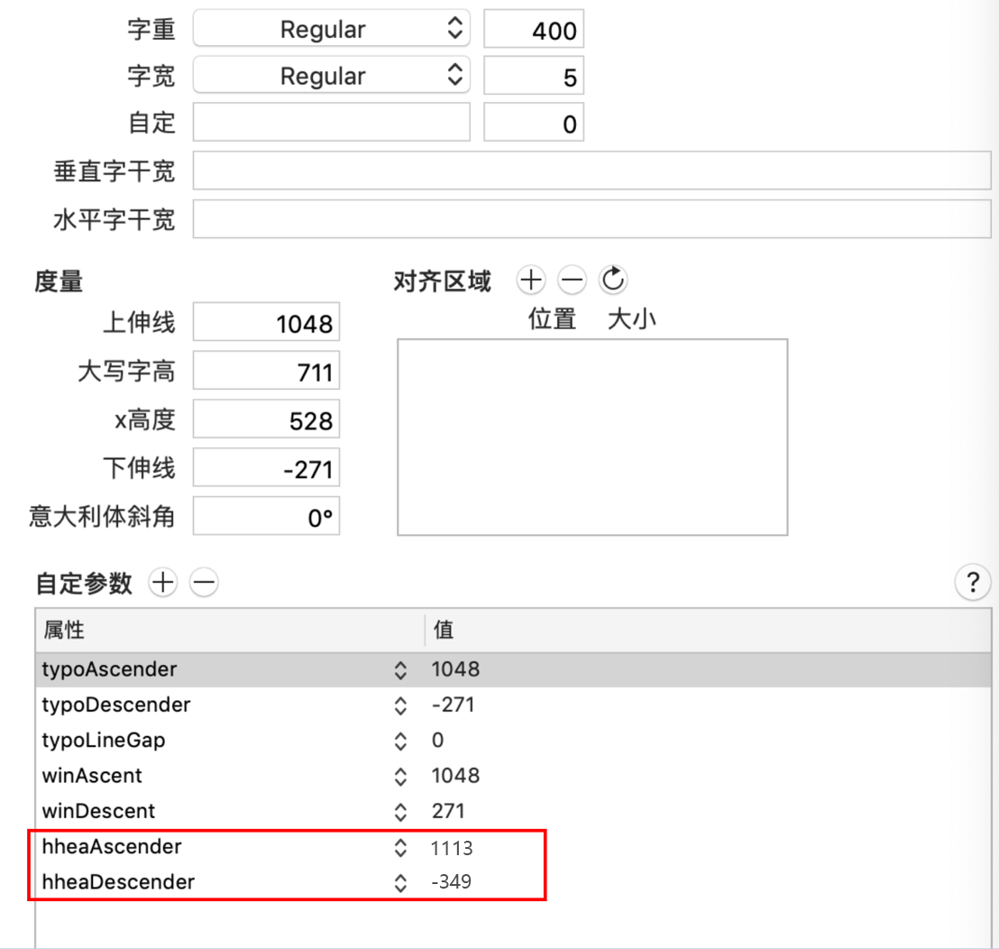

## 4. 字体预览图和XML文件制作规范

静态字体只需制作预览图。

可变字体需制作预览图和一个XML文件。

### 4.1 国内静态字体预览图制作规范

<strong>一. 列表展示图设计规范</strong>

* <strong>设计规格</strong>

1. 规范对象：设计师
2. 体积大小：＜50kb
3. 图片规格：png/jpg
4. 图片分辨率：72
5. 共需要输出7张预览图

3张原有尺寸预览图：

|  |  |  |
| --- | --- | --- |
| 规则 | 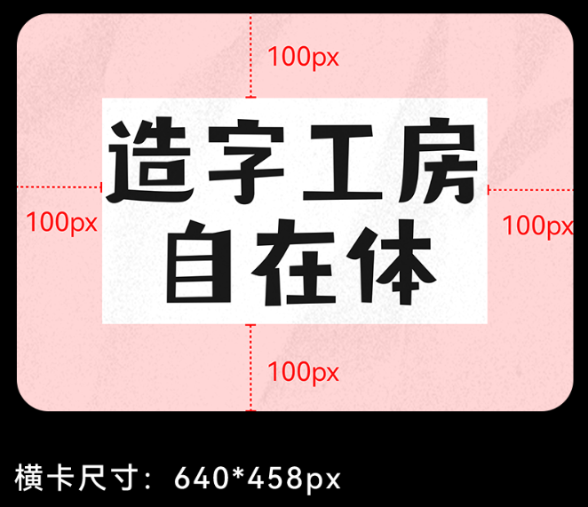  （文字不能超出白色区域） | 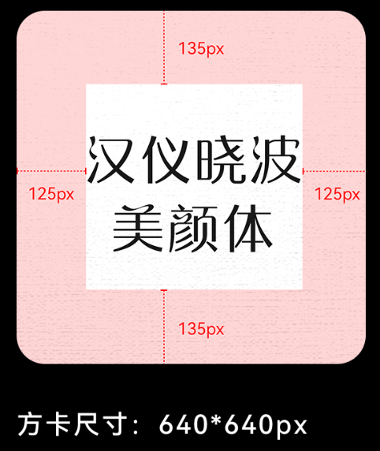  （文字不能超出白色区域） |
| 尺寸 | 640\*458px | 640\*640px |
| 命名规则 | ① pic\_font\_default.jpg  ② pic\_font\_default\_41.png | pic\_font\_square.jpg |
| 图片数量 | 2 | 1 |

4张新增尺寸预览图：

|  |  |  |
| --- | --- | --- |
| 规则 | 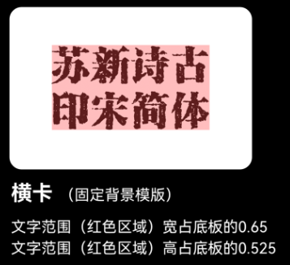  （文字不能超出红色区域） | 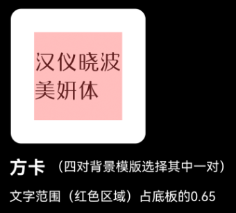  （文字不能超出红色区域） |
| 尺寸 | 660\*440px | 660\*660px |
| 命名规则 | 浅色模式：cover\_font\_3\_2.jpg  深色模式：cover\_font\_3\_2\_dark.jpg | 浅色模式：cover\_font\_1\_1.jpg  深色模式：cover\_font\_1\_1\_dark.jpg |
| 图片数量 | 2 | 2 |

* <strong>设计要求</strong>

文字要求：

1. 新上架字体资源，名称必须为XX体、XX书、XX字、XX文等，不能为与字体无关的抽象的词句，例如“每天都有很想你”，标题名称需≤10个字。
2. 图片上字体名称与上传名称保持一致。
3. 图上字体均以该字体本身样式呈现。
4. 文字介绍使用相对应的字体，保证图片显示的是该款字体的效果。
5. 文字大小合适，在背景上显示清晰。
6. 预览图要求上面的文字需是中文。

背景要求：

背景样式要求直接使用提供的现有的模板，方卡有4个模板可选，横卡固定1个模板。允许多个字体包的方卡全部只用一个模板。所有背景模板不能改动。

点击下载[3张原有尺寸背景模板.zip](https://communityfile-drcn.op.dbankcloud.cn/FileServer/getFile/cmtyPub/011/111/111/0000000000011111111.20250620110642.48916964471766460765211757734659%3A50001231000000%3A2800%3A54E17EA3B2DCDECC981ABD34E5916512B2B5AF9EC7E868927D308A7C5F7EB656.zip?needInitFileName=true)，效果示例：

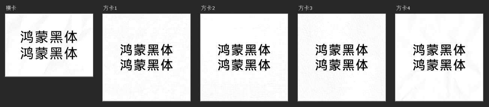

点击下载[4张新增尺寸背景模板.zip](https://communityfile-drcn.op.dbankcloud.cn/FileServer/getFile/cmtyPub/011/111/111/0000000000011111111.20250620110643.32167515433375183477486061917023%3A50001231000000%3A2800%3AE211969776A24AFE72349E1B38BEDA24E7FC2E0B44AC825AF9C238ED9A5A6F4F.zip?needInitFileName=true)，效果示例：

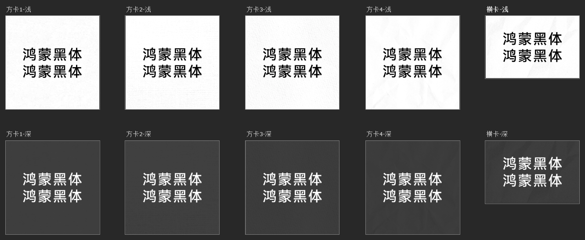

<strong>二. 详情页展示图设计规范</strong>

* <strong>设计规格</strong>

1. 规范对象：设计师
2. 体积大小：＜180kb
3. 图片规格：png/jpg
4. 图片分辨率：72
5. 需输出6张预览图。

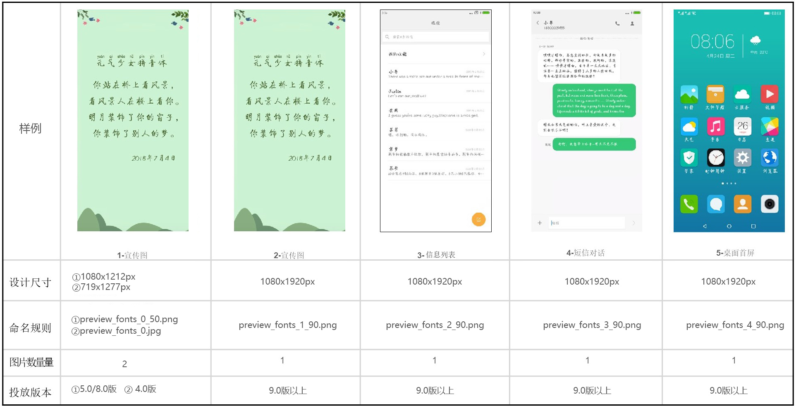

* <strong>设计要求</strong>

1. 共6张预览图（宣传图\*3、短信列表、短信对话、桌面首屏）。
2. 宣传图：字体展示，活动宣传等。
3. 短信列表：列表内容自行编写，包含中文，英文，数字。
4. 短信对话：对话内容自行编写，包含中文、英文、数字。
5. 桌面首屏：桌面应用名称字体的真实效果。
6. 所有文案不可带政治色彩以及敏感内容。

* <strong>应用场景</strong>


### 4.2 海外静态字体预览图制作规范

<strong>一. 列表展示图设计规范</strong>

* <strong>设计规格</strong>

1. 规范对象：设计师
2. 体积大小：＜50kb
3. 图片规格：png/jpg
4. 图片分辨率：72
5. 共需要输出7张预览图。

|  |  |  |
| --- | --- | --- |
| 规则 | 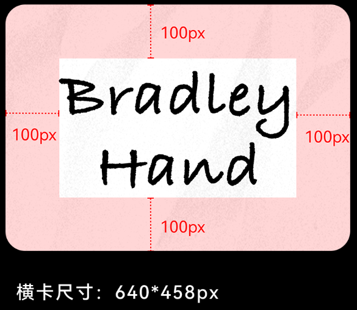  （文字不能超出白色区域） | 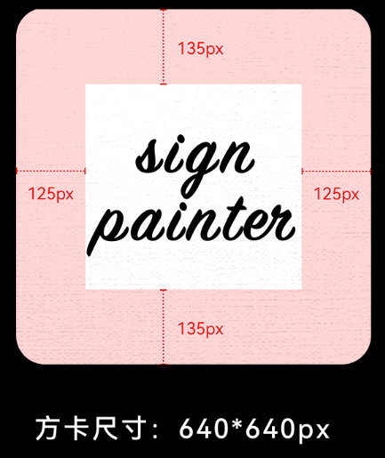  （文字不能超出白色区域） |
| 尺寸 | 640\*458px | 640\*640px |
| 命名规则 | ① pic\_font\_default.jpg  ② pic\_font\_default\_41.png | pic\_font\_square.jpg |
| 图片数量 | 2 | 1 |

4张新增尺寸预览图：

|  |  |  |
| --- | --- | --- |
| 规则 |   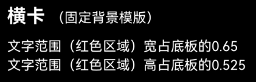  （文字不能超出红色区域） |   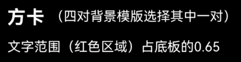  （文字不能超出红色区域） |
| 尺寸 | 660\*440px | 660\*660px |
| 命名规则 | 浅色模式：cover\_font\_3\_2.jpg  深色模式：cover\_font\_3\_2\_dark.jpg | 浅色模式：cover\_font\_1\_1.jpg  深色模式：cover\_font\_1\_1\_dark.jpg |
| 图片数量 | 2 | 2 |

* <strong>设计要求</strong>

文字要求：

1. 英文名称长度不超过20个字符，包含空格。
2. 图片上字体名称与上传名称保持一致。
3. 图上字体均以该字体本身样式呈现。
4. 文字介绍使用相对应的字体，保证图片显示的是该款字体的效果。
5. 文字大小合适，在背景上显示清晰。
6. 预览图文字要求需要使用上传国家的字体作为预览图文案。

背景要求：

背景样式要求直接使用提供的现有的模板，方卡有4个模板可选，横卡固定1个模板。允许多个字体包的方卡全部只用一个模板。所有背景模板不能改动。

点击下载[3张原有尺寸背景模板.zip](https://communityfile-drcn.op.dbankcloud.cn/FileServer/getFile/cmtyPub/011/111/111/0000000000011111111.20250620110643.81008936268220510239447415046690%3A50001231000000%3A2800%3AE3A612A7B3EE037D6979C740D28D9560AF3F7DB7E79208BB1EAC72D3229E77F1.zip?needInitFileName=true)，效果示例：

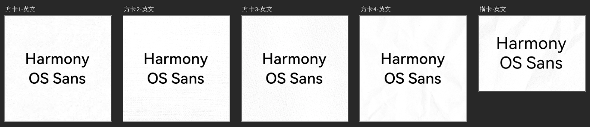

点击下载[4张新增尺寸背景模板.zip](https://communityfile-drcn.op.dbankcloud.cn/FileServer/getFile/cmtyPub/011/111/111/0000000000011111111.20250620110643.76944769939882797116175271097058%3A50001231000000%3A2800%3A9DA20F1EE4A40E60C625416EACB8AC033DCAC50DAC1CCFB2B03CBAC9DB980488.zip?needInitFileName=true)，效果示例：

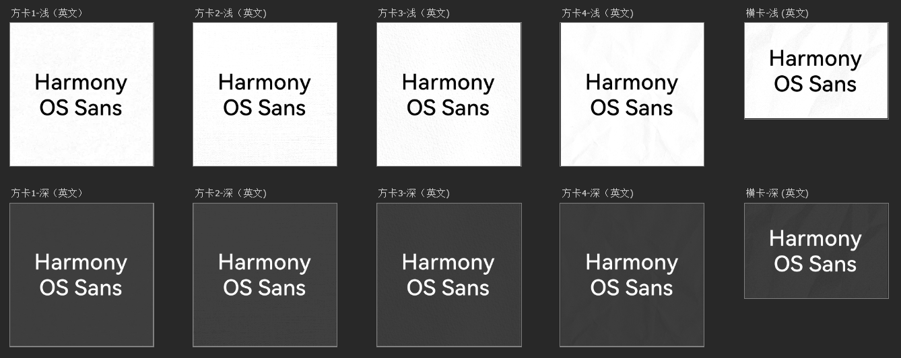

<strong>二. 详情页展示图设计规范</strong>

* <strong>设计规格</strong>

1. 规范对象：设计师
2. 体积大小：＜180kb
3. 图片规格：png
4. 图片分辨率：72
5. 需输出5张预览图。

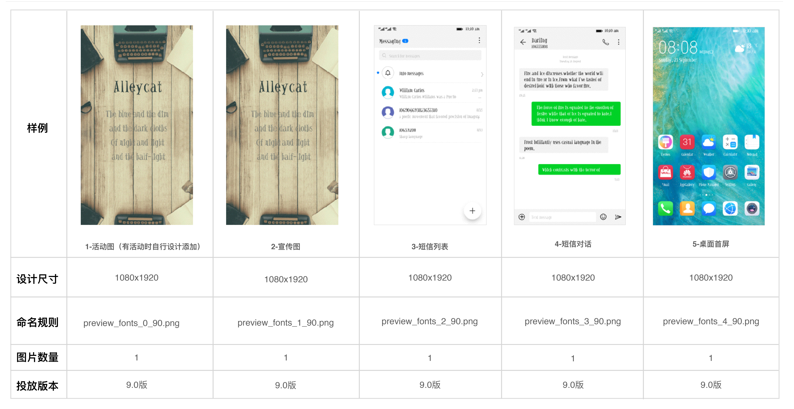

* <strong>设计要求</strong>

1. 共5张预览图（活动图、宣传图、短信列表、短信对话、桌面首屏）。
2. 宣传图：字体展示，活动宣传等。
3. 短信列表：列表内容自行编写，包含中文，英文，数字。
4. 短信对话：对话内容自行编写，包含中文，英文，数字。
5. 桌面首屏：桌面应用名称字体的真实效果。
6. 所有文案不可带政治色彩以及敏感内容。

* <strong>应用场景</strong>

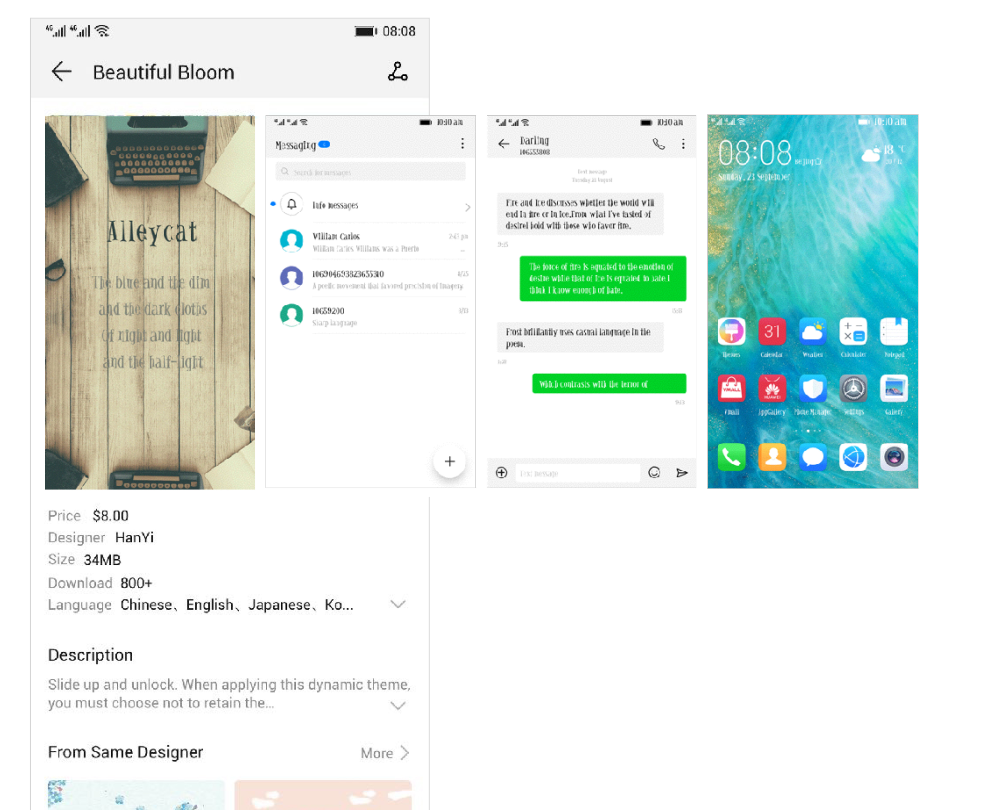

### 4.3 可变字体预览图制作规范+XML文件规范

<strong>一. 预览图规范</strong>

可变字体预览图制作时不可直接出现“可变字体”文字，其他制作规范与 [4.1 国内静态字体预览图制作规范](#section4315300285)一致。

通过华为开发者联盟上传字体时，可在“字体名称”和“字体描述”中出现“可变字体”文字，以标识可变字体。

填写“字体描述”时，必须说明“字体大小、粗细都可调节，粗细调节仅HarmonyOS系统支持”。

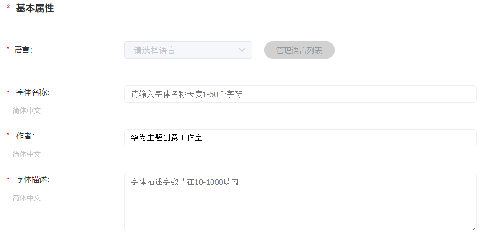

<strong>二.</strong> <strong>XML规范</strong>

除预览图外，可变字体还需增加一个XML文件，其详细规范如下。

* XML命名

XML文件需命名为：online\_variable\_fonts.xml （固定命名不可修改，必须使用小写，不可使用大写）。

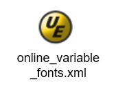

* XML规范

```
<familyset version="23">
    <family name=“Huawei-serif”>
        <font weight="100" style="normal">FZVariable-HeYueTiJ.ttf
         <axis tag="wght" stylevalue="" />
        </font>
        <font weight="300" style="normal">FZVariable-HeYueTiJ.ttf
            <axis tag="wght" stylevalue="" />
        </font>
        <font weight="400" style="normal">FZVariable-HeYueTiJ.ttf
            <axis tag="wght" stylevalue="400" />
        </font>
        <font weight="500" style="normal">FZVariable-HeYueTiJ.ttf
            <axis tag="wght" stylevalue=“" />
        </font>
        <font weight="700" style="normal">FZVariable-HeYueTiJ.ttf
            <axis tag="wght" stylevalue="" />
        </font>
        <font weight="900" style="normal">FZVariable-HeYueTiJ.ttf
            <axis tag="wght" stylevalue="" />
        </font>
    </family>
</familyset>
```

* 参数说明

| 参 数 | 注 释 |
| --- | --- |
| family name | 默认写法，无需修改。 |
| font weight | 字体的默认粗细值，共有100、300、400、500、700和900六组默认值。 |
| style | 字体风格，无需修改。 |
| axis tag | 标记值，无需修改。 |
| stylevalue | 字体实际显示的粗细值，可根据字体的实际效果进行设置。设置时需注意以下两点：   1. 第三组stylevalue的值需与默认粗细值保持一致，固定为400，不可更改。 2. 全部六组stylevalue的值需为递增状态，即后一组的值不可比前一组小。 |

XML规范中提供六组进行参数设置。如没有六组，则最少设置四组，后面的组填写与最大值一样的数值即可。样例：共设置四组，则第⑤和第⑥组，填写与第④组一样的数值。

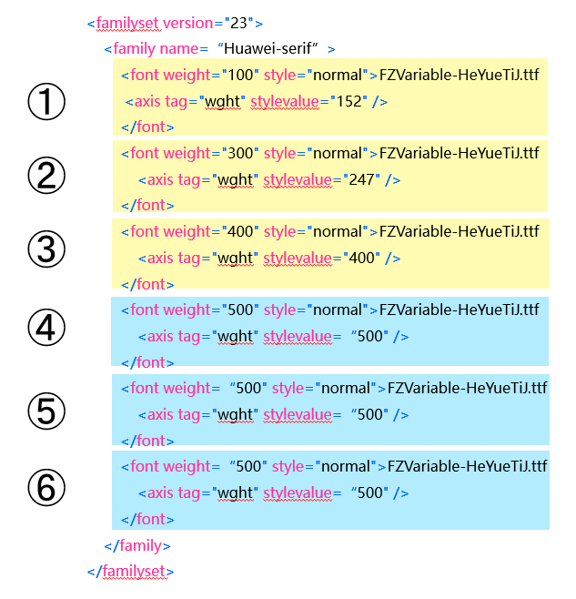

## 5. 字体打包

字体文件以英文命名，检查所有文件命名，确保文件命名无空格后在文件夹内全选文件，右键以zip格式压缩。


预览图命名或格式有问题将不能打包成功。

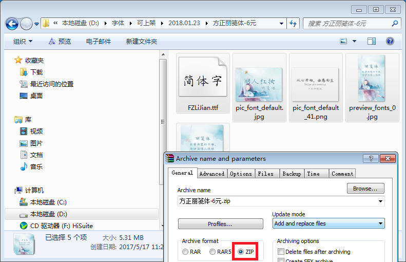

## 6. 字体自检

需根据[字体测试规范](/docs/distribute/content-dist/theme-center/content-release-0000001054679366/content-review-specifications-0000001054679960/content-check-pecifications-0000001057301166/font-test-0000001056570904#section131814812523)进行自检。

## 7. 上传联盟

自检完成后，根据[字体上传指南](/docs/distribute/content-dist/theme-center/content-release-0000001054679366/uploadguide-0000001054359939/font-upload-0000001055188484#section104927450473)，通过华为开发者联盟上传字体。