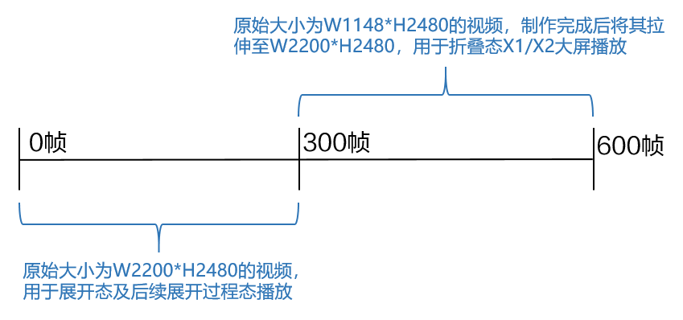
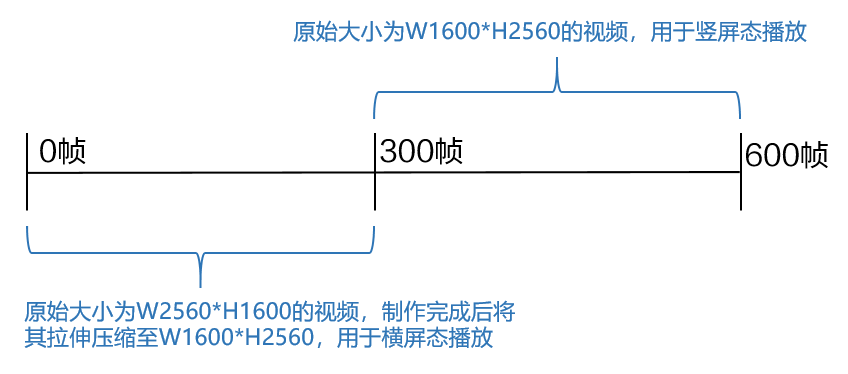

import MergeTable from '@site/src/components/MergeTable';

# 动态壁纸设计指导及规范

## 1. 动态壁纸介绍

动态壁纸又可称为视频壁纸，可设置成手机的锁屏或者桌面背景。

## 2. 制作流程

步骤一：使用设计相关软件进行制图。

步骤二：根据“[动态壁纸测试规范](/docs/distribute/content-dist/theme-center/content-release-0000001054679366/content-review-specifications-0000001054679960/content-check-pecifications-0000001057301166/livewallpaper-test-0000001057818928#section209567011516)”自检自查。

步骤三：根据“[动态壁纸上传指南](/docs/distribute/content-dist/theme-center/content-release-0000001054679366/uploadguide-0000001054359939/livewallpaper-upload-0000001055068451#section12967112911314)”上传到开发者联盟主题中心。

## 3. 动态壁纸制作规范

### 3.1 动态壁纸规范

1. 视频格式：MP4。
2. 视频编码：H.264。
3. 视频时长：视频建议在20秒以内，预览视频建议在15秒以内。
4. 视频帧率：建议为25-30fps。
5. 视频总帧数：

   普通手机无限制；

   折叠屏手机的视频为600帧，详见[3.2 折叠屏手机的视频说明](#section042019417499)；

   平板的视频为600帧，详见[3.3 平板的视频说明](#section10460104118206)。

<MergeTable
  headers={['壁纸类型', '适配', '视频尺寸', '视频大小', '预览视频尺寸', '预览视频大小']}
  rows={
    [{ text: '动态壁纸', rowspan: 4, colspan: 1 }, '手机', 'W1080*H1920', '20MB以内', 'W1080*H1920', '10MB以内'],
    [null, '手机', 'W1080*H2340', '20MB以内', 'W1080*H2340', '10MB以内'],
    [null, '折叠屏手机', 'W2200*H2480', '80MB以内', 'W2200*H2480（展开态使用） W1148*H2480（折叠态使用）', '10MB以内'],
    [null, '平板', 'W1600*H2560', '20MB以内', 'W2560*H1600（横屏态使用） W1600*H2560（竖屏态使用）', '10MB以内']
  }
/>

1. 为保证预览效果，请提供能循环播放的视频，确保首尾衔接部分流畅，不会出现画面跳动或者闪烁。
2. 普通手机带有声音的动态壁纸，只需要一次上传，即可作为视频铃声和动态壁纸同时发布和呈现。

### 3.2 折叠屏手机的视频说明

<strong>1. 视频说明</strong>

折叠屏手机的视频尺寸为：W2200\*H2480，总帧数为600帧，分为两段：

0-300帧，是原始大小为W2200\*H2480的视频，用于展开态及后续展开过程态播放；

300-600帧，是原始大小为W1148\*H2480的视频，制作完成后将其拉伸至W2200\*H2480，用于折叠态X1/X2大屏播放。

* 图示说明

  

* 示例视频

  
* 示例视频0-300帧，用于展开态的播放效果：

  
* 示例视频300-600帧，用于折叠态的播放效果：

  

  

  基于折叠屏手机的视频说明，建议按照以下步骤制作视频：

  1. 0-300帧：以W2200\*H2480制作视频，<strong>且每一帧都为关键帧（即有变化的帧）。</strong>
  2. 300-600帧：先以W1148\*H2480制作原始视频，制作完成后将其拉伸至W2200\*H2480。
  3. 最后将0-600帧合成一段W2200\*H2480的视频。

<strong>2. 预览视频说明</strong>

折叠屏手机需同时上传以下两种尺寸的预览视频：

* W2200\*H2480：展开态播放效果预览。

  
* W1148\*H2480：折叠态播放效果预览。

  

### 3.3 平板的视频说明

<strong>1. 视频说明</strong>

平板的视频尺寸为：W1600\*H2560，总帧数为600帧，分为两段：

0-300帧，是原始大小为W2560\*H1600的视频，制作完成后将其拉伸压缩至W1600\*H2560，用于横屏态播放；

300-600帧，是原始大小为W1600\*H2560的视频，用于竖屏态播放。

* 图示说明

  

* 示例视频

  
* 示例视频0-300帧，用于横屏态的播放效果：

  
* 示例视频300-600帧，用于竖屏态的播放效果：

  

  

  基于平板的视频说明，建议按照以下步骤制作视频：

  1. 0-300帧：以W2560\*H1600制作原始视频，<strong>且每一帧都为关键帧（即有变化的帧）</strong>，制作完成后将其拉伸缩放至W1600\*H2560<strong>，</strong>。
  2. 300-600帧：以W1600\*H2560制作视频，<strong>且每一帧都为关键帧（即有变化的帧）</strong>。
  3. 最后将0-600帧合成一段W1600\*H2560的视频。

<strong>2. 预览视频说明</strong>

平板需同时上传以下两种尺寸的预览视频：

* W2560\*H1600：横屏态播放效果预览。

  
* W1600\*H2560：竖屏态播放效果预览。

  