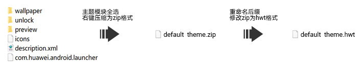
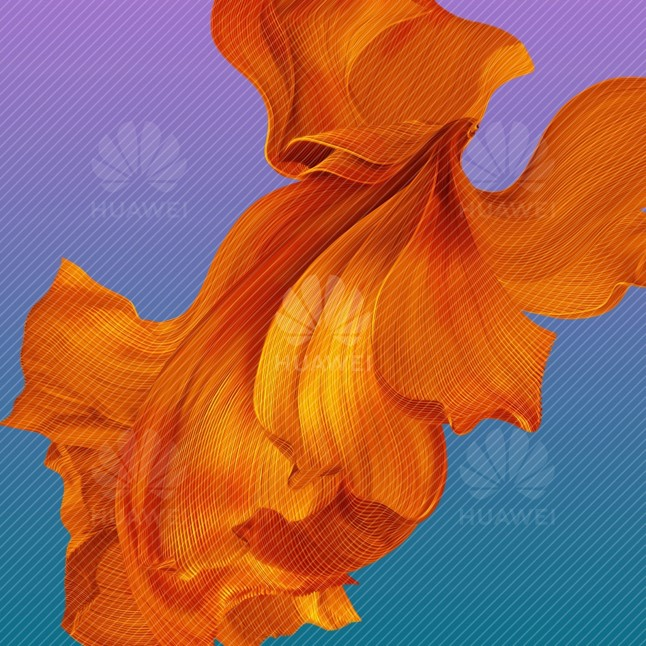
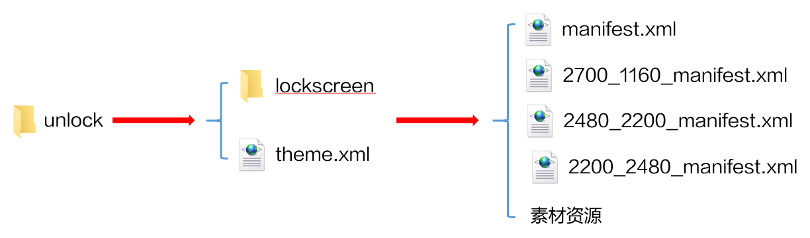
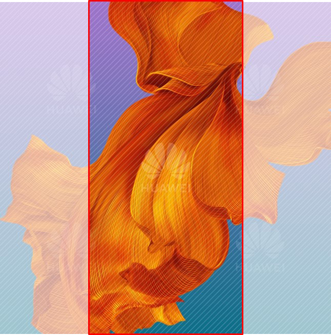
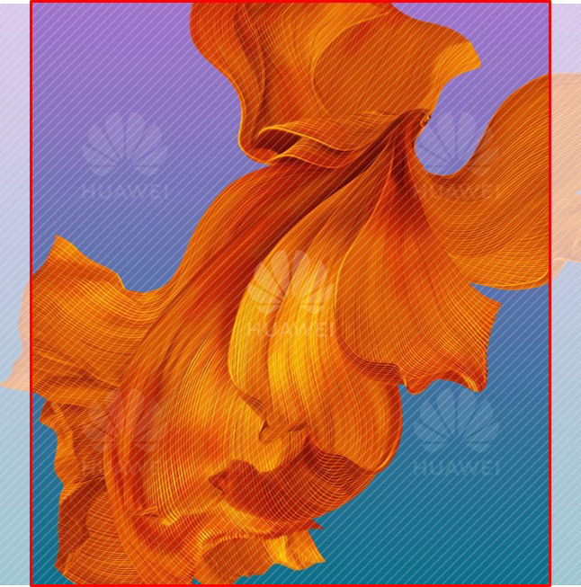
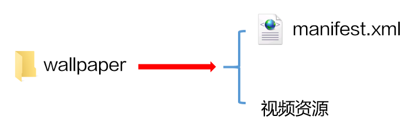
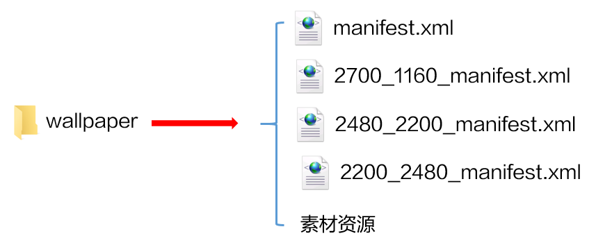
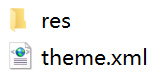
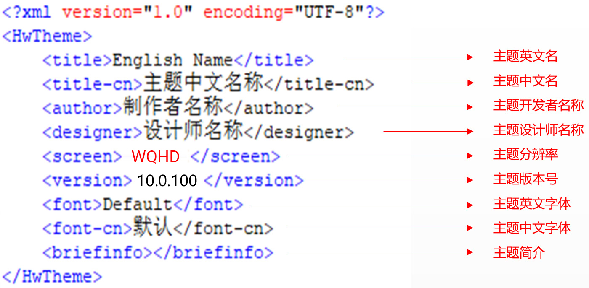

import MergeTable from '@site/src/components/MergeTable';

# 折叠屏主题设计指导及规范

## 1. 快速入门

折叠屏主题支持制作静态和动态小主题，从EMUI 10.1版本开始支持制作。

折叠屏主题目前仅需制作1个EMUI 10.1版本，可同步在EMUI 10.1及以上版本折叠屏手机上展示。（图标需包含EMUI 10.1及以上版本所有必做图标）

主题结构与手机小主题一致，结构包含：

* 锁屏
* 壁纸
* 图标
* 桌面
* 描述文件
* 预览图

如下图所示，通过打包所有折叠屏主题的结构文件，就制作完成了一个折叠屏主题：



## 2. 锁屏（unlock）制作指导及规范

折叠屏主题支持制作的锁屏类型如下：滑动锁屏、动态锁屏二选一。

所有类型的锁屏，unlock文件夹下都必须有theme.xml文件。

由于系统特性，滑动锁屏壁纸实际效果会被放大10%，设计师在制作时请注意规避。

### 2.1 滑动锁屏

滑动锁屏为一张静态壁纸全屏滑动解锁，静态壁纸放置在wallpaper文件夹下。

锁屏壁纸的尺寸为：2480\*2480px，格式为.jpg，文件名为：unlock\_wallpaper\_X.jpg（X为阿拉伯数字按顺序排列，首张壁纸X为0），大小控制在1M以内。

锁屏壁纸样板如下：



滑动锁屏unlock文件夹下只有一个XML文件，显示内容为默认效果，设计师仅能修改壁纸，脚本固定，如下所示：

```
<?xml version="1.0" encoding="utf-8"?>
<HWTheme>
   <item style="slide"/>
</HWTheme>
```

### 2.2 动态锁屏

动态锁屏能够实现风格多变的用户界面。可方便地通过更换皮肤改变界面风格、动画甚至交互方式。

华为折叠屏的动态锁屏在HarmonyOS 2.0及以上的系统版本支持，新荣耀折叠屏的动态锁屏在MagicUI6.0及以上的系统版本支持。即当前12版本的主题包仅支持华为折叠屏动态锁屏，11版本的主题包仅支持新荣耀折叠屏动态锁屏。审核将根据主题包版本对应上架不同机型。

附：华为折叠屏动态锁屏具体支持的机型版本是：X、Xs需要升级到2.0.0.207；X2需要升级到2.0.0.209版本。

| 品牌 | 支持动态锁屏的系统版本 | 对应主题包版本 |
| --- | --- | --- |
| 华为折叠屏 | HarmonyOS 2.0及以上版本 | 12 |
| 新荣耀折叠屏 | MagicUI6.0及以上版本 | 11 |

<strong>结构说明</strong>

动态锁屏unlock文件夹下有一个lockscreen文件夹和一个theme.xml文件；lockscreen文件夹下有4个manifest.xml文件和素材资源。

设计师可在manifest.xml文件中调用素材资源，使用脚本编写各式各样的动态效果，具体脚本写法参见[华为官方主题引擎脚本规范](https://developer.huawei.com/consumer/cn/doc/distribution/content/script_specifications-0000001055068447)。



<strong>4个</strong> <strong>manifest.xml文件说明</strong>

由于折叠屏在折叠态、展开态竖屏、展开态横屏时具有不同的分辨率，为了让动态锁屏在折叠屏上自适应，需建立4个manifest.xml文件：

* 每个manifest.xml文件以不同状态的分辨率命名（h\_w\_manifest.xml，h为高，w为宽）。
* &lt;Lockscreen&gt;标签下的"screenWidth"参数需根据折叠屏不同状态分辨率的宽赋值。
* 每个manifest.xml文件的脚本内容需根据分辨率进行调整，以实现比较好的适配效果。

折叠屏分辨率：


<MergeTable
  headers={['机型', '折叠态', '展开 态']}
  rows={
    ['X1大屏', 'W1148*H2480', { text: 'W2200*H2480', rowspan: 2, colspan: 1 }],
    ['X2大屏', 'W1160*H2700', null]
  }
/>


以X2为例，动态锁屏manifest.xml文件命名与screenWidth参数值如下：

| 适配状态 | manifest.xml文件命名 | screenWidth参数值 |
| --- | --- | --- |
| 默认锁屏 | manifest.xml | screenWidth="1080" |
| 折叠态锁屏 | 2700\_1160\_manifest.xml | screenWidth="1160" |
| 展开态竖屏锁屏 | 2480\_2200\_manifest.xml | screenWidth="2200" |
| 展开态横屏锁屏 | 2200\_2480\_manifest.xml | screenWidth="2480" |

<strong>动态锁屏</strong> <strong>[&lt;Video&gt;标签](/docs/distribute/content-dist/theme-center/development-tutorial-0000001054519376/themes-engine-0000001054452463/themes-engine4-0000002530591413/basic-function-0000001054908461/view-0000001073865717/video-0000001073497817)脚本规范</strong>

折叠屏主题在锁屏脚本中使用[&lt;Video&gt;标签](/docs/distribute/content-dist/theme-center/development-tutorial-0000001054519376/themes-engine-0000001054452463/themes-engine4-0000002530591413/basic-function-0000001054908461/view-0000001073865717/video-0000001073497817)时，有以下3点需特别注意：

1. 4个manifest.xml使用同一个视频资源，视频资源具有特殊的要求，与折叠屏动态壁纸的视频资源要求一致，具体请参考[折叠屏动态壁纸的视频说明](/docs/distribute/content-dist/theme-center/development-tutorial-0000001054519376/livewallpaper-0000001054851128/livewallpaper-specifications-0000001055029722#section042019417499)。
2. 为了保证折叠屏锁屏上亮屏时不闪底图：
   1. 默认锁屏和折叠态锁屏的manifest.xml文件中，&lt;Video&gt;标签的defaultBitmap参数为必填项，建议使用视频第301帧的图片。
   2. 展开态竖屏锁屏和展开态横屏锁屏的manifest.xml文件中，&lt;Video&gt;标签的defaultBigBitmap参数为必填项，建议使用视频首帧的图片。
3. 为保证一个视频资源可以同时在多个分辨率的折叠屏上自适应，可设置scaleType参数的值为“center\_crop”，以实现等比缩放，居中裁剪的效果。

## 3. 桌面（wallpaper）

折叠屏主题支持制作的桌面类型如下：静态桌面、视频桌面、可交互桌面三选一。

### 3.1 静态桌面

静态桌面为一张静态壁纸。

桌面静态壁纸的尺寸为：2480\*2480px，格式为.jpg，文件名为：home\_wallpaper\_X.jpg（X为阿拉伯数字按顺序排列，首张壁纸X为0），大小控制在1M以内。

折叠屏桌面静态壁纸样板如下：


<strong>折叠屏桌面静态壁纸取景规范：</strong>

折叠状态和展开状态分别对应以下高亮区域显示，需保证中心元素在高亮区域。

* 折叠状态显示区域：1144\*2480px



* 展开状态显示区域：2200\*2480px



### 3.2 视频桌面（liveWallpaper）

视频桌面支持在桌面上播放视频，同时支持左右滑动桌面时，切换播放所设置的视频区间，还支持选择是否播放视频声音。

<strong>结构说明</strong>

wallpaper文件夹下有1个manifest.xml文件和1个视频资源。

manifest.xml文件的具体写法参见[视频桌面&lt;LiveWallpaper&gt;](/docs/distribute/content-dist/theme-center/development-tutorial-0000001054519376/themes-engine-0000001054452463/themes-engine4-0000002530591413/application-range1-0000001258343478/livewallpaper-0000001073967005)



<strong>[视频桌面&lt;LiveWallpaper&gt;](/docs/distribute/content-dist/theme-center/development-tutorial-0000001054519376/themes-engine-0000001054452463/themes-engine4-0000002530591413/application-range1-0000001258343478/livewallpaper-0000001073967005)</strong> <strong>脚本规范</strong>

折叠屏主题在桌面脚本中使用[视频桌面&lt;LiveWallpaper&gt;](/docs/distribute/content-dist/theme-center/development-tutorial-0000001054519376/themes-engine-0000001054452463/themes-engine4-0000002530591413/application-range1-0000001258343478/livewallpaper-0000001073967005)时，有以下2点需特别注意：

1. 视频资源具有特殊的要求，与折叠屏动态壁纸的视频资源要求一致，具体请参考[折叠屏动态壁纸的视频说明](/docs/distribute/content-dist/theme-center/development-tutorial-0000001054519376/livewallpaper-0000001054851128/livewallpaper-specifications-0000001055029722#section042019417499)。
2. 如果需要左右滑动桌面时，切换播放所设置的视频区间，则[视频桌面&lt;LiveWallpaper&gt;](/docs/distribute/content-dist/theme-center/development-tutorial-0000001054519376/themes-engine-0000001054452463/themes-engine4-0000002530591413/application-range1-0000001258343478/livewallpaper-0000001073967005)的timeSequences参数，在设置的时候需注意：

   由于折叠屏从展开到折叠的过程中，视频播放是联动的效果：展开状态播放视频的第1-300帧，折叠状态播放视频的第300-600帧，因此在视频桌面中，展开状态视频和折叠状态视频两段分开计算，设计的时间区间要在每段视频的帧数内，即timeSequences的值要在每段视频的帧数内。

   示例：视频资源共600帧，24秒，其中折叠状态时播放视频的第300-600帧，这部分视频长度为12秒，则分段播放的话，timeSequences的最大数就是12，而不是24。

   示例脚本：

   ```
   <VideoWallpaper src="" timeSequences="x,x1……,12" haveVideoVoice="" isMusic="" turn=""/>
   ```

### 3.3 可交互桌面（InteractiveWallpaper）

可交互桌面是指能够实现丰富动效的桌面，基本全面继承现有锁屏的功能和写法，暂不支持的能力后面会陆续验证测试开放。

<strong>结构说明</strong>

wallpaper文件夹下有4个manifest.xml文件和素材资源。

设计师可在manifest.xml文件中调用素材资源，使用脚本编写各式各样的动态效果，支持实现的动效详情和具体脚本写法参见[可交互桌面&lt;InteractiveWallpaper&gt;](/docs/distribute/content-dist/theme-center/development-tutorial-0000001054519376/themes-engine-0000001054452463/themes-engine4-0000002530591413/application-range1-0000001258343478/interactivewallpaper-0000001170976217)。



<strong>4个</strong> <strong>manifest.xml文件说明</strong>

由于折叠屏在折叠态、展开态竖屏、展开态横屏时具有不同的分辨率，为了让可交互桌面在折叠屏上自适应，需建立4个manifest.xml文件，具体规范与[2.2 动态锁屏](#section7572105011451)一致。

## 4. 图标（icons）

折叠屏主题图标规范与手机主题完全一致，请见：[5. 图标（icons）](/docs/distribute/content-dist/theme-center/development-tutorial-0000001054519376/mobile-themes-0000001054531192/themes-specification-0000001160896163#section13726122401413)

## 5. 桌面模块（com.huawei.android.launcher）

折叠屏主题的桌面模块，较手机主题的区别仅去掉了framework-res-hwext文件。

折叠屏主题的桌面-文件夹-添加按钮的展开弹窗为固定背景颜色。当图标为纯色图标时，注意需在浅色及深色模式的弹窗下清晰可见。

### 5.1 桌面模块切图

折叠屏主题桌面模块切图与手机主题完全一致，请见：[7. 桌面（com.huawei.android.launcher）](/docs/distribute/content-dist/theme-center/development-tutorial-0000001054519376/mobile-themes-0000001054531192/themes-specification-0000001160896163#section18981348135618)

### 5.2 桌面模块结构

com.huawei.android.launcher 为桌面模块，内有2个文件，如下图所示：



## 6. 描述文件（description.xml）


description.xml 描述文件是储存主题基本信息的文件。

<strong>折叠屏主题描述文件说明：</strong>



1. 主题英文名，中文名，开发者名称，设计师名称四项待主题上线后均不可修改。
2. 设计师名称与设计师的开发者联盟账号绑定。
3. 主题分辨率，主题英文字体，中文字体均采用默认不可以修改。
4. 折叠屏主题的分辨率为WQHD，版本号与手机主题一致。

## 7. 预览图（preview）

折叠屏主题预览图规范与手机主题完全一致，请见：[17. 预览图（preview）](/docs/distribute/content-dist/theme-center/development-tutorial-0000001054519376/mobile-themes-0000001054531192/themes-specification-0000001160896163#section116488412243)

## 8. 手机转折叠屏主题转换指导

|  |  |  |
| --- | --- | --- |


<MergeTable
  headers={['目录结构', '折叠屏主题规范', '示例图']}
  rows={
    ['wallpaper', { text: '折叠屏主题包结构与手机主题一致。 除icons和preview外其他项均需修改，见下方详细描述。', rowspan: 6, colspan: 1 }, { text: '', rowspan: 6, colspan: 1 }],
    ['unlock', null, null],
    ['preview', null, null],
    ['icons', null, null],
    ['description.xml', null, null],
    ['com.huawei.android.launcher', null, null]
  }
/>


|  |  |  |  |
| --- | --- | --- | --- |


<MergeTable
  headers={['项目', '修改项目', '修改内容', '示例图']}
  rows={
    [{ text: 'wallpaper', rowspan: 2, colspan: 1 }, 'unlock_wallpaper_0.jpg', '2480*2480px', { text: '', rowspan: 2, colspan: 1 }],
    [null, 'home_wallpaper_0.jpg', '2480*2480px', null],
    [{ text: '说明： 折叠屏主题静态壁纸，折叠展开显示对应高亮区域，需保证中心元素在高亮区域。', rowspan: 1, colspan: 4 }, null, null, null],
    ['项目', '修改项目', '修改内容', '示例代码'],
    ['unlock', 'theme.xml', '支持滑动锁屏和动态锁屏', '&lt;?xml version="1.0" encoding="utf-8"?&gt; &lt;HWTheme&gt; &lt;item style="slide"/> &lt;/HWTheme&gt;'],
    ['项目', '修改项目', '修改内容', '示例代码'],
    ['description.xml', 'screen', '&lt;screen&gt;WQHD&lt;/screen&gt;', '&lt;?xml version="1.0" encoding="utf-8"?&gt; &lt;HwTheme&gt; &lt;title&gt;English Name&lt;/title&gt; &lt;title-cn&gt;主题中文名称&lt;/title-cn&gt; &lt;author&gt;制作者名称&lt;/author&gt; &lt;designer&gt;设计师名称&lt;/designer&gt; &lt;screen&gt;WQHD&lt;/screen&gt; &lt;version&gt;10.0.100&lt;/version&gt; &lt;font&gt;Default&lt;/font&gt; &lt;font-cn&gt;默认&lt;/font-cn&gt; &lt;briefinfo&gt;这是模板，请自行修改设计。&lt;/briefinfo&gt; &lt;/HwTheme&gt;'],
    ['项目', '修改项目', '修改内容', 'com.huawei.android.launcher下文件结构'],
    ['com.huawei.android.launcher', 'framework-res-hwext', '去掉framework-res-hwext文件，当图标为纯色图标时需注意在浅色及深色模式的弹窗下清晰可见', ''],
    [{ text: '说明： 折叠屏主题EMUI 11.0版本与EMUI 10.1版本除版本号外，规范一致。EMUI 11.0版本的版本号为11.0.0。 海外与国内规范一致。', rowspan: 1, colspan: 4 }, null, null, null]
  }
/>


## 9. 测试规范

[折叠屏主题测试规范详情请点击查看](https://developer.huawei.com/consumer/cn/doc/content/theme-test-0000001055661259#section3698921142310)