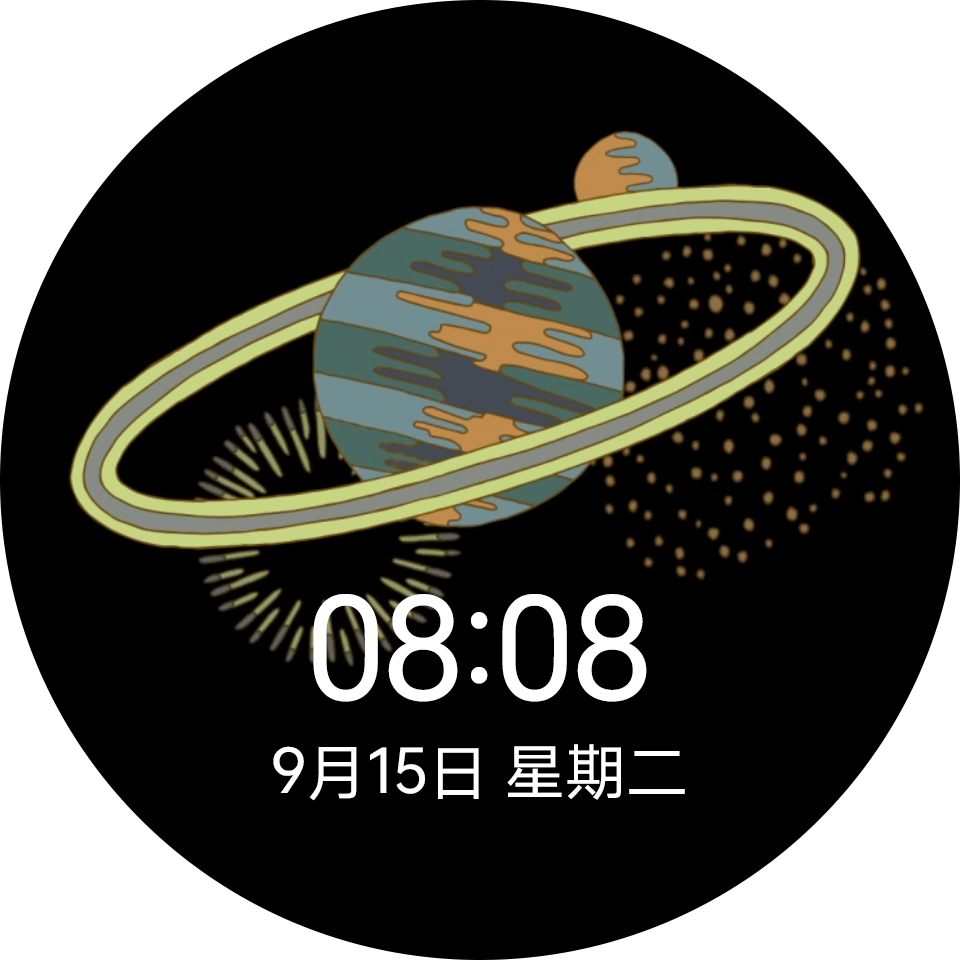
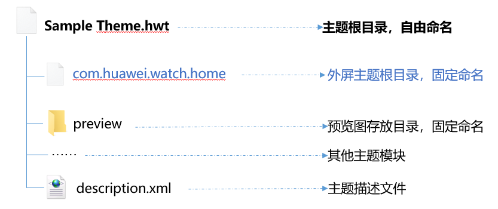
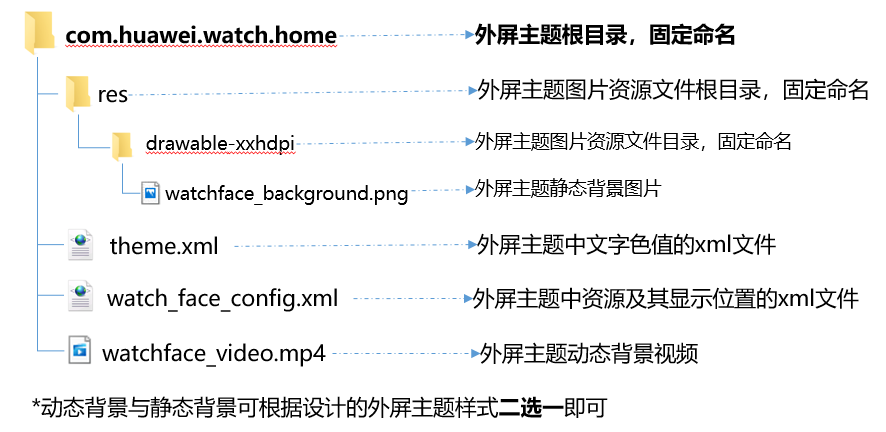
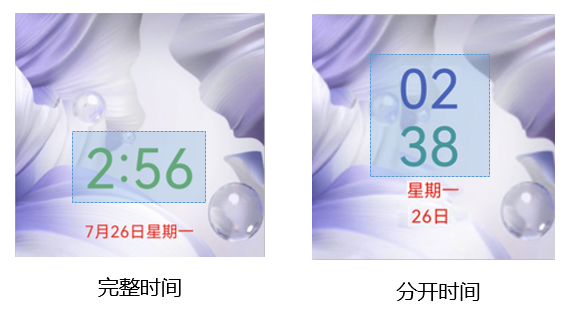
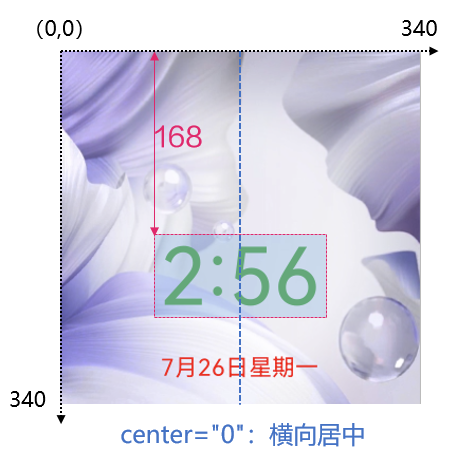
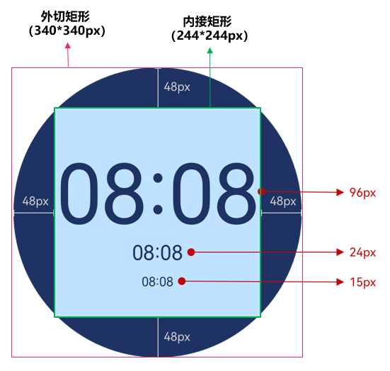
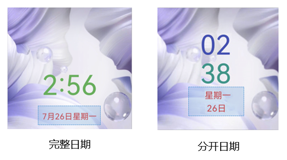
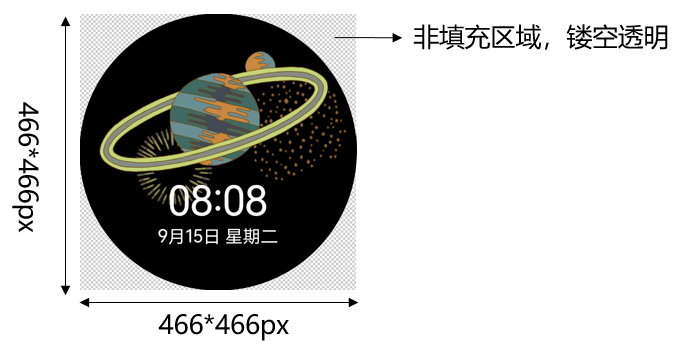
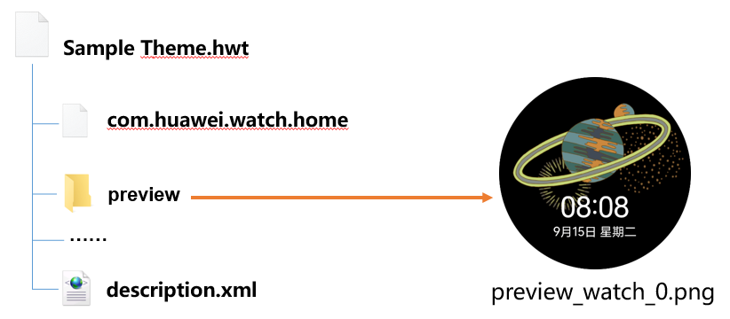

# P50 Pocket外屏主题设计指导及规范

P50 Pocket外屏主题，支持对[背景](#section1155216618526)、[时间](#section6932164912520)、[日期](#section341493291011)进行个性化制作。


外屏主题暂只支持在P50 Pocket上使用。

外屏主题示例：



## 外屏主题包结构

外屏主题包为com.huawei.watch.home，必须添加在手机大主题或小主题包中，不可单独制作。




包含外屏主题的手机大主题或小主题，只需制作版本号为12.0.X的版本。

com.huawei.watch.home主题包包含以下内容（解压后可见）：

* res文件夹：包含一个drawable-xxhdpi文件夹，drawable-xxhdpi文件夹中存放静态背景图片资源。
* watch\_face\_config.xml：外屏主题中资源及其显示位置的xml文件。
* theme.xml：外屏主题汇总文字色值的xml文件。
* watchface\_video.mp4：外屏主题动态背景视频资源。



## watch\_face\_config.xml规范

watch\_face\_config.xml为外屏主题中资源及其显示位置的xml文件。

### 总体结构

```
<?xml version="1.0" encoding="utf-8"?>
<watchface>

    <!--背景-->
    <element label="background">
        <layer
            draw_type="video"
            index="1"
            res_name="watchface_video.mp4"
            res_position="0,0" />
    </element>

    <!--时间-->
    <element label="time">
        <layer
            draw_type="text"
            index="1"
	    center="0"
            text_rect="99,202"
            text_size="48"
            value_type="time"/>
    </element>

    <!--星期 日期-->
    <element label="date">
        <layer
            draw_type="text"
            index="1"
	    center="0"
            text_rect="118,252"
            text_size="22"
            value_type="date" />
    </element>

</watchface>
```

### 背景规范

外屏主题包的背景支持以下两种形式：

* <strong>动态视频背景</strong>
* <strong>静态图片背景</strong>


1、动态视频背景与静态图片背景互斥，制作其中一种即可。

* <strong>动态视频背景</strong>

xml规范：

```
  <element label="background">
        <layer
            draw_type="video"
            index="1"
            res_name="watchface_video.mp4"
            res_position="0,0"/>
    </element>
```

xml释义：

```
    <element label="background">    ------------------背景元素
        <layer
            draw_type="video"   ----------------------动态视频作为背景
            index="1"
            res_name="watchface_video.mp4"   ---------视频名称
            res_position="0,0" /> --------------------视频位置
    </element>
```


视频规格：

1. 格式：mp4
2. 尺寸：466\*466px
3. 命名：watchface\_video.mp4
4. 大小：≤10M
5. 时长：5-10s
6. 编码：H.264
7. 帧率：25-30帧
8. 建议视频首尾能相接循环

* <strong>静态图片背景</strong>

xml规范：

```
    <!--静态图片背景-->
    <element label="background">
        <layer
            draw_type="single_image"
            index="1"
            res_name="watchface_background.png"
            res_position="0,0" />
    </element>
```

xml释义：

```
    <!--静态图片背景-->
    <element label="background">     -----------------------背景元素
        <layer
            draw_type="single_image"  ----------------------静态图片作为背景
            index="1"
            res_name="watchface_background.png"    ---------图片名称
            res_position="0,0" />     ----------------------图片位置
    </element>
```


图片规格：

1. 格式：png
2. 尺寸：466\*466px
3. 命名：watchface\_background.png
4. 大小：≤1M

### 时间规范

时间显示支持以下两种布局：

* <strong>完整时间</strong>：完整显示时间，横排布局。
* <strong>分开时间</strong>：只显示小时和分钟，竖排布局。




完整时间和分开时间互斥，制作其中一种即可。

* <strong>完整时间</strong>

xml规范：

```
    <!--完整时间-->
    <element label="time">
        <layer
            draw_type="text"
            index="1"
            center="0"
            text_rect="120,168"
            text_size="75"
            value_type="time"/>
    </element>
```

xml释义：

```
    <!--完整时间-->
    <element label="time">      ----------时间元素
        <layer
            draw_type="text" -------------文本形式显示时间
            index="1"
            center="0"  ------------------横向居中
            text_rect="120,168" ----------位置坐标（x,y）
            text_size="75"   -------------文本的字体大小
            value_type="time"/>  ---------显示完整时间（例如：2：56）
    </element>
```

参数说明：


以下4项说明在时间（完整时间、分开时间）、日期（完整日期、分开日期）xml规范中通用。

1. center="0"：横向居中，此时text\_rect="x,y"的x值不生效，始终保持横向居中效果；center="1"：此时text\_rect="x,y"的x值生效，根据x值实际效果显示。

   
2. 外屏主题的[预览图](#section3893811592)背景尺寸为466\*466px，xml文件中外切矩形（背景）的尺寸为340\*340px，两者不一致。因此，按照预览图布局制作xml文件时，需进行等比换算：先以466\*466px制作预览图，再等比缩放至340\*340px，按照在340\*340px布局中的尺寸，制作xml文件。
3. xml文件中，内接矩形的尺寸为244\*244px，内接矩形为时间和日期的有效显示区域，超出会被裁剪。因此，在设计时间与日期时，距离顶部/底部/左侧/右侧的最小值为48px。
4. xml文件中，时间和日期的字号区间为15– 96 px，建议时间的字号在 24px 以上。

   

* <strong>分开时间</strong>

xml规范：

```
<!--分开时间-->
    <element label="time">
        <layer
            draw_type="text"
            index="1"
            center="0"
            text_rect="120,168"
            text_size="75"
            value_type="time_hour"/>
        <layer
            draw_type="text"
            index="1"
            center="0"
            text_rect="120,168"
            text_size="75"
            value_type="time_minute"/>
    </element>
```

xml释义：

```
    <!--分开时间-->
    <element label="time>      ----------时间元素
        <layer
            draw_type="text" -------------文本形式显示时间
            index="1"
            center="0"  ------------------横向居中
            text_rect="120,168" ----------位置坐标（x,y）
            text_size="75"   -------------文本的字体大小
            value_type="time_hour"/>  ---------单独显示小时（例如：02）
        <layer
            draw_type="text" -------------文本形式显示时间
            index="1"
            center="0"  ------------------横向居中
            text_rect="120,168" ----------位置坐标（x,y）
            text_size="75"   -------------文本的字体大小
            value_type="time_minute"/>  ---------单独显示分钟（例如：38）
    </element>
```


请查看<strong>完整时间</strong>的参数说明，此处的参数说明与其完全相同。

### 日期规范

日期显示支持以下两种布局：

* <strong>完整日期</strong>：完整显示月份、日期和星期，横排布局。
* <strong>分开日期</strong>：只显示日期和星期，竖排布局。




完整日期和分开日期互斥，制作其中一种即可。

* <strong>完整日期</strong>

xml规范：

```
    <!--星期 完整日期-->
    <element label="date">
        <layer
            draw_type="text"
            index="1"
            center="0"
            text_rect="117,287"
            text_size="22"
            value_type="date"/>
    </element>
```

xml释义：

```
    <!--星期 完整日期-->
    <element label="date">      ----------------------日期的元素
        <layer
            draw_type="text"    ----------------------文本形式显示星期 日期
            index="1"
            center="0"    ----------------------------横向居中
            text_rect="117,287"    -------------------位置坐标（x,y）
            text_size="22"   -------------------------文本的字体大小
            value_type="date"/>    ------------------显示完整的日期（例如：7月26日星期一）
    </element>
```


请查看<strong>完整时间</strong>的参数说明，此处参数说明与其完全相同。

* <strong>分开日期</strong>

xml规范：

```
 <!--星期 分开日期-->
    <element label="date">
        <layer
            draw_type="text"
            index="1"
            center="0"
            text_rect="117,287"
            text_size="22"
            value_type="date"/>
        <layer
            draw_type="text"
            index="1"
            center="0"
            text_rect="117,287"
            text_size="22"
            value_type="date"/>
    </element>
```

xml释义：

```
    <!--星期 分开日期-->
    <element label="date">      ----------------------日期的元素
        <layer
            draw_type="text"    ----------------------文本形式显示星期 日期
            index="1"
            center="0"    ----------------------------横向居中
            text_rect="117,287"    -------------------位置坐标（x,y）
            text_size="22"   -------------------------文本的字体大小
            value_type="date" />    ------------------只显示星期（例如：星期一）
        <layer
            draw_type="text"    ----------------------文本形式显示星期 日期
            index="1"
            center="0"    ----------------------------横向居中
            text_rect="117,287"    -------------------位置坐标（x,y）
            text_size="22"   -------------------------文本的字体大小
            value_type="date" />    ------------------只显示日期（例如：26日）
    </element>
```


请查看<strong>完整时间</strong>的参数说明，此处参数说明与其完全相同。

## theme.xml规范

```
<?xml version="1.0" encoding="UTF-8"?>
<hwthemes>
    <color name="date_text_color">#FFFFFF</color>      -----------------显示横排完整日期的文本字体色值
    <color name="date_day_text_color">#FFFFFF</color>  -----------------只显示日期的文本字体色值
    <color name="date_week_text_color">#FFFFFF</color>   ---------------只显示星期的文本字体色值
    <color name="time_text_color">#FFFFFF</color>       ----------------显示横排完整时间文本的字体色值
    <color name="time_hour_text_color">#FFFFFF</color>   ---------------只显示小时的文本字体色值
    <color name="time_minute_text_color">#FFFFFF</color>   -------------只显示分钟的文本字体色值
</hwthemes>
```

## 预览图

需制作一张预览图，展示外屏主题的预览效果。

<strong>预览图规范：</strong>

* 命名：preview\_watch\_0.png
* 格式：png（非填充区域应为透明镂空效果）
* 尺寸：466px\*466px
* 大小：小于300kb



制作好的预览图，添加至手机大主题或小主题包的preview文件夹中。



## 描述文件

包含外屏主题的主题包，必须在描述文件description.xml中加上以下说明：

【新增外屏主题】外屏主题暂只支持在P50 Pocket上使用。

## P50 Pocket主题适配注意事项

为保证动态主题背景在P50 Pocket上的显示效果，动态引擎写法的主题，动态锁屏及可交互桌面的背景需按照规范适配，以下可能作为背景的标签请特别注意写法：图片&lt;Image&gt;、视频&lt;Video&gt;、流体动效&lt;FluidsView&gt;和视频桌面&lt;LiveWallpaper&gt;。规范详见[背景等比缩放，居中裁剪，以适配同设备类型的不同机型](https://developer.huawei.com/consumer/cn/doc/content/adapter-0000001186735768#section1141831673)。