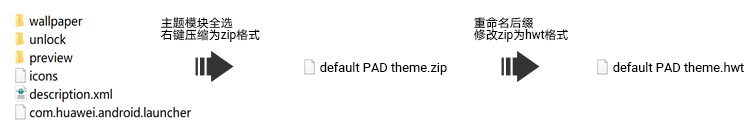
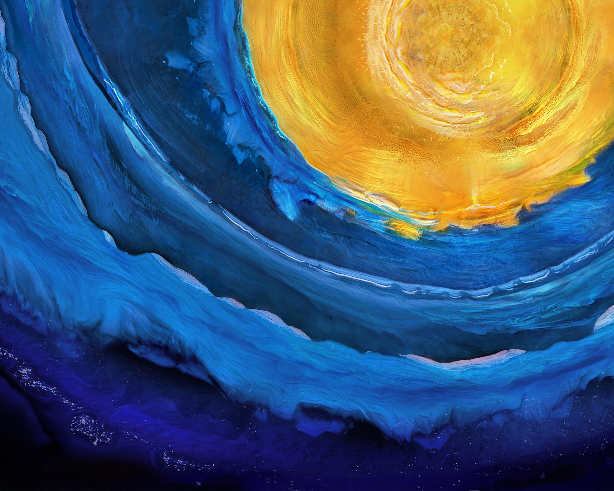
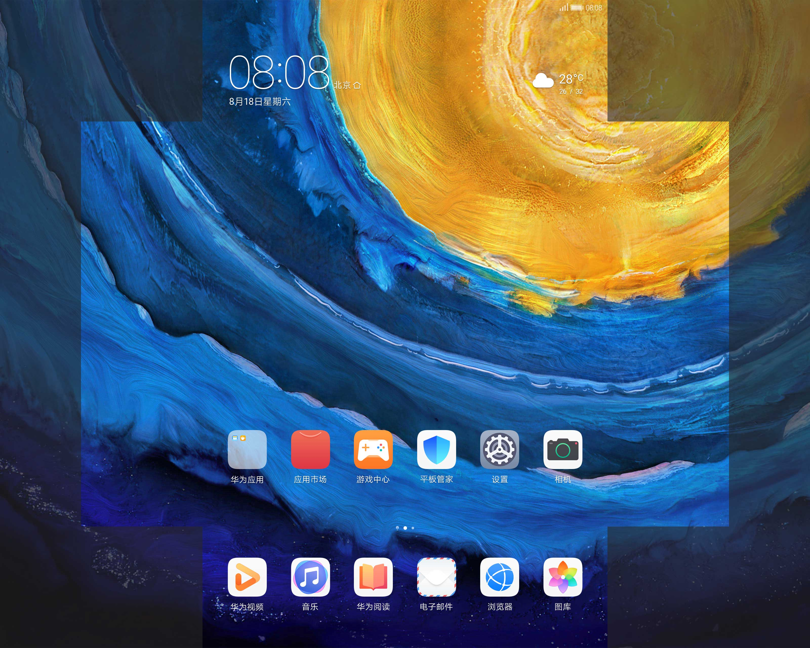
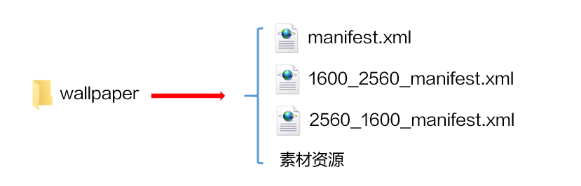
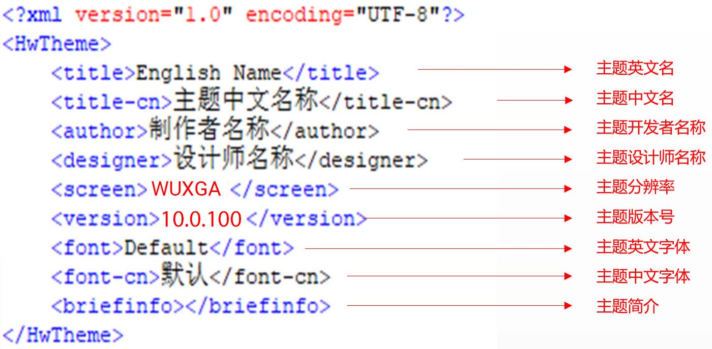
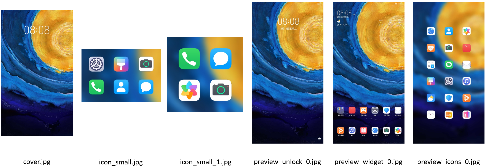
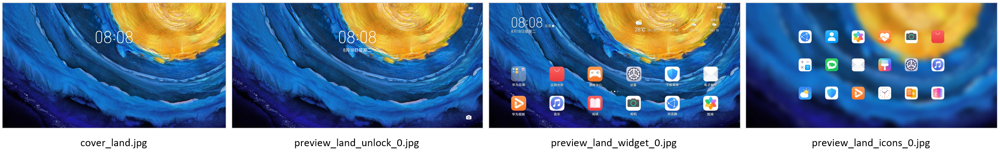

import MergeTable from '@site/src/components/MergeTable';

# 平板主题设计指导及规范

## 1. 快速入门

平板主题支持制作静态和动态小主题，从EMUI 10.1版本开始支持制作。

平板主题目前仅需制作1个EMUI 10.1版本，可同步在EMUI 10.1及以上版本平板上展示。（图标需包含EMUI 10.1及以上版本所有必做图标）

主题结构与手机小主题一致，结构包含：

* 锁屏
* 壁纸
* 图标
* 桌面
* 描述文件
* 预览图

如下图所示，通过打包所有平板主题的结构文件，就制作完成了一个平板主题：



## 2. 锁屏（unlock）制作指导及规范

平板主题支持制作的锁屏类型如下：滑动锁屏、动态锁屏二选一。

所有类型的锁屏，unlock文件夹下都必须有theme.xml文件。

由于系统特性，滑动锁屏壁纸实际效果会被放大10%，设计师在制作时请注意规避。

### 2.1 滑动锁屏

滑动锁屏为一张静态壁纸全屏滑动解锁，静态壁纸放置在wallpaper文件夹下。

锁屏静态壁纸尺寸为：3200\*2560px，格式为.jpg，文件名为：unlock\_wallpaper\_X.jpg（X为阿拉伯数字按顺序排列，首张壁纸X为0）。

锁屏静态壁纸样板如下：



滑动锁屏unlock文件夹下只有一个XML文件，显示内容为默认效果，设计师仅能修改壁纸，代码固定，如下所示：

```
<?xml version="1.0" encoding="utf-8"?>
<HWTheme>
   <item style="slide"/>
</HWTheme>
```

### 2.2 动态锁屏

动态锁屏能够实现风格多变的用户界面。可方便地通过更换皮肤改变界面风格、动画甚至交互方式。

<strong>结构说明</strong>

动态锁屏unlock文件夹下有一个lockscreen文件夹和一个theme.xml文件；lockscreen文件夹下有3个manifest.xml文件和素材资源。

设计师可在manifest.xml文件中调用素材资源，使用脚本编写各式各样的动态效果，具体脚本写法参见[华为官方主题引擎脚本规范](https://developer.huawei.com/consumer/cn/doc/distribution/content/script_specifications-0000001055068447)。


<strong>3个</strong> <strong>manifest.xml文件说明</strong>

由于平板有竖屏态、横屏态两种不同的状态，为了让动态锁屏在平板上自适应，需建立3个manifest.xml文件：

* 每个manifest.xml文件以不同状态的分辨率命名（h\_w\_manifest.xml，h为高，w为宽）。
* &lt;Lockscreen&gt;标签下的"screenWidth"参数需根据折叠屏不同状态分辨率的宽赋值。
* 每个manifest.xml文件的脚本内容需根据分辨率进行调整，以实现比较好的适配效果。

平板分辨率：

| 机型 | 竖屏态 | 横屏态 |
| --- | --- | --- |
| 平板 | W1600\*H2560\* | W2560\*H1600 |

动态锁屏manifest.xml文件命名与screenWidth参数值如下：

| 适配状态 | manifest.xml文件命名 | screenWidth参数值 |
| --- | --- | --- |
| 默认锁屏 | manifest.xml | screenWidth="1080" |
| 竖屏态锁屏 | 2560\_1600\_manifest.xml | screenWidth="1600" |
| 横屏态锁屏 | 1600\_2560\_manifest.xml | screenWidth="2560" |

<strong>动态锁屏</strong> <strong>[&lt;Video&gt;标签](/docs/distribute/content-dist/theme-center/development-tutorial-0000001054519376/themes-engine-0000001054452463/themes-engine4-0000002530591413/basic-function-0000001054908461/view-0000001073865717/video-0000001073497817)脚本规范</strong>

平板主题在脚本中使用[&lt;Video&gt;标签](/docs/distribute/content-dist/theme-center/development-tutorial-0000001054519376/themes-engine-0000001054452463/themes-engine4-0000002530591413/basic-function-0000001054908461/view-0000001073865717/video-0000001073497817)时，有以下3点需特别注意：

1. 3个manifest.xml使用同一个视频资源。视频资源具有特殊的要求，与平板动态壁纸的视频资源要求一致，具体请参考[平板动态壁纸的视频说明](/docs/distribute/content-dist/theme-center/development-tutorial-0000001054519376/livewallpaper-0000001054851128/livewallpaper-specifications-0000001055029722#section10460104118206)。
2. 为了保证平板锁屏上亮屏时不闪底图：
   1. 默认锁屏和竖屏态锁屏的manifest.xml文件中，&lt;Video&gt;标签的defaultBitmap参数为必填项，建议使用视频第301帧的图片。
   2. 横屏态锁屏的manifest.xml文件中，&lt;Video&gt;标签的defaultBigBitmap参数为必填项，建议使用视频首帧的图片。
3. 为保证一个视频资源可以同时在多个分辨率的平板上自适应，可设置scaleType参数的值为“center\_crop”，以实现等比缩放，居中裁剪的效果。

## 3. 桌面（wallpaper）

平板主题支持制作的桌面类型如下：静态桌面、视频桌面、可交互桌面三选一。

### 3.1 静态桌面

静态桌面为一张或多张静态壁纸。

桌面壁纸的尺寸为：3200\*2560px，格式为.jpg，文件名为：home\_wallpaper\_X.jpg（X为阿拉伯数字按顺序排列，首张壁纸X为0）。

桌面壁纸样板如下：


<strong>平板桌面静态壁纸取景规范：</strong>

平板主题静态壁纸，横竖屏对应以下高亮区域显示，需保证中心元素在高亮区域。



### 3.2 视频桌面（liveWallpaper）

视频桌面支持在桌面上播放视频，同时支持左右滑动桌面时，切换播放所设置的视频区间，还支持选择是否播放视频声音。

<strong>结构说明</strong>

wallpaper文件夹下有1个manifest.xml文件和1个视频资源。

manifest.xml文件的具体写法参见[视频桌面&lt;LiveWallpaper&gt;](/docs/distribute/content-dist/theme-center/development-tutorial-0000001054519376/themes-engine-0000001054452463/themes-engine4-0000002530591413/application-range1-0000001258343478/livewallpaper-0000001073967005)。


<strong>[视频桌面&lt;LiveWallpaper&gt;](/docs/distribute/content-dist/theme-center/development-tutorial-0000001054519376/themes-engine-0000001054452463/themes-engine4-0000002530591413/application-range1-0000001258343478/livewallpaper-0000001073967005)</strong> <strong>脚本规范</strong>

平板主题使用[视频桌面&lt;LiveWallpaper&gt;](/docs/distribute/content-dist/theme-center/development-tutorial-0000001054519376/themes-engine-0000001054452463/themes-engine4-0000002530591413/application-range1-0000001258343478/livewallpaper-0000001073967005)时，有以下2点需特别注意：

1. 视频资源具有特殊的要求，与平板动态壁纸的视频资源要求一致，具体请参考[平板动态壁纸的视频说明](/docs/distribute/content-dist/theme-center/development-tutorial-0000001054519376/livewallpaper-0000001054851128/livewallpaper-specifications-0000001055029722#section10460104118206)。
2. 如果需要左右滑动桌面时，切换播放所设置的视频区间，则[视频桌面&lt;LiveWallpaper&gt;](/docs/distribute/content-dist/theme-center/development-tutorial-0000001054519376/themes-engine-0000001054452463/themes-engine4-0000002530591413/application-range1-0000001258343478/livewallpaper-0000001073967005)的timeSequences参数，在设置的时候需注意：

   平板横屏状态是播放视频的第1-300帧，竖屏状态是播放视频的第300-600帧。因此在视频桌面中，横屏状态视频和竖屏状态视频两段分开计算，设计的时间区间要在每段视频的帧数内，即timeSequences的值要在每段视频的帧数内。

   示例：视频资源共600帧，24秒，其中竖屏状态时播放视频的第300-600帧，这部分视频长度为12秒，则分段播放的话，timeSequences的最大数就是12，而不是24。

   示例脚本：

   ```
   <VideoWallpaper src="" timeSequences="x,x1……,12" haveVideoVoice="" isMusic="" turn=""/>
   ```

### 3.3 可交互桌面（InteractiveWallpaper）

可交互桌面是指能够实现丰富动效的桌面，基本全面继承现有锁屏的功能和写法，暂不支持的能力后面会陆续验证测试开放。

<strong>结构说明</strong>

wallpaper文件夹下有3个manifest.xml文件和素材资源。

设计师可在manifest.xml文件中调用素材资源，使用脚本编写各式各样的动态效果，支持实现的动效详情和具体脚本写法参见[可交互桌面&lt;InteractiveWallpaper&gt;](/docs/distribute/content-dist/theme-center/development-tutorial-0000001054519376/themes-engine-0000001054452463/themes-engine4-0000002530591413/application-range1-0000001258343478/interactivewallpaper-0000001170976217)。



<strong>3个</strong> <strong>manifest.xml文件说明</strong>

由于平板有竖屏态、横屏态两种不同的状态，为了让可交互桌面在平板上自适应，需建立3个manifest.xml文件，具体规范与[2.2 动态锁屏](#section1963465181913)一致。

## 4. 图标（icons）

平板主题图标规范与手机主题完全一致，请见：[5. 图标（icons）](/docs/distribute/content-dist/theme-center/development-tutorial-0000001054519376/mobile-themes-0000001054531192/themes-specification-0000001160896163#section13726122401413)

## 5. 桌面模块（com.huawei.android.launcher）

平板主题的桌面模块，较手机主题的区别仅去掉了framework-res-hwext文件。

平板主题的桌面-文件夹-添加按钮的展开弹窗为固定背景颜色。当图标为纯色图标时，注意需在浅色及深色模式的弹窗下清晰可见。

### 5.1 桌面模块切图

平板主题桌面模块切图与手机主题完全一致，请见：[7. 桌面（com.huawei.android.launcher）](/docs/distribute/content-dist/theme-center/development-tutorial-0000001054519376/mobile-themes-0000001054531192/themes-specification-0000001160896163#section18981348135618)

### 5.2 桌面模块结构

com.huawei.android.launcher 为桌面模块，内有2个文件，如下图所示：


## 6. 描述文件（description.xml）


description.xml 描述文件是储存主题基本信息的文件。

主题英文名，中文名，开发者名称，设计师名称四项待主题上线后均不可修改。

设计师名称与设计师的开发者联盟账号绑定。

主题分辨率，主题英文字体，中文字体均采用默认不可以修改。

平板主题的分辨率为WUXGA。

10.1版本主题版本号第一版为10.1.100，后续有更新则更改为10.1.10X（X为阿拉伯数字按顺序更新）。

11.0版本主题版本号第一版为11.1.0，后续有更新则更改为11.1.X（X为阿拉伯数字按顺序更新）。

<strong>平板主题描述文件说明：</strong>



## 7. 预览图（preview）


预览图是主题的一个概览，用户通过预览图判断一个主题的大体风格。

预览图使用PSD模板文件替换素材即可。

因数据库图片文件名称长度有限制，主题包内preview文件夹下的预览图总张数需≤20张。

预览图可使用平板截图的方式制作，截图后需按照预览图样板进行部分修改。

所有预览图中不能出现谷歌系图标，同时不能出现谷歌搜索等GMS相关内容的展示。

### 7.1 平板主题竖屏预览图



平板竖屏预览图规格与手机主题一致。

cover.jpg、icon\_small.jpg、icon\_small\_1.jpg、preview\_icons\_0.jpg预览图不允许出现状态栏，其他预览图状态栏只允许出现电量和时间。

预览图所展示的内容应该与应用的实际效果相同。

设计师寄语或者设计说明选做，预览图命名为 preview\_widget\_X.jpg（“X”可为1、2 … …）。

### 7.2 平板主题横屏预览图



cover\_land.jpg、preview\_land\_icons\_0.jpg预览图不允许出现状态栏，其他预览图状态栏只允许出现电量和时间。

## 8. 手机转平板主题转换指导

|  |  |  |
| --- | --- | --- |


<MergeTable
  headers={['目录结构', '平板主题规范', '示例图']}
  rows={
    ['wallpaper', { text: '平板主题包结构与手机主题一致。 除icons外其他项均需修改，见下方详细描述。', rowspan: 6, colspan: 1 }, { text: '', rowspan: 6, colspan: 1 }],
    ['unlock', null, null],
    ['preview', null, null],
    ['icons', null, null],
    ['description.xml', null, null],
    ['com.huawei.android.launcher', null, null]
  }
/>


|  |  |  |  |
| --- | --- | --- | --- |


<MergeTable
  headers={['项目', '修改项目', '修改内容', '示例图']}
  rows={
    [{ text: 'wallpaper', rowspan: 2, colspan: 1 }, 'unlock_wallpaper_0.jpg', '3200*2560px', { text: '', rowspan: 2, colspan: 1 }],
    [null, 'home_wallpaper_0.jpg', '3200*2560px', null],
    [{ text: '说明： 平板主题静态壁纸，横竖屏显示对应高亮区域，需保证中心元素在高亮区域。', rowspan: 1, colspan: 4 }, null, null, null],
    ['项目', '修改项目', '修改内容', '示例代码'],
    ['unlock', 'theme.xml', '只支持滑动锁屏', '&lt;?xml version="1.0" encoding="utf-8"?&gt; &lt;HWTheme&gt; &lt;item style="slide"/> &lt;/HWTheme&gt;'],
    ['项目', '修改项目', '修改内容', '示例图'],
    [{ text: 'preview', rowspan: 10, colspan: 1 }, 'cover.jpg', '不变', { text: '', rowspan: 10, colspan: 1 }],
    [null, 'cover_land.jpg', '新增，尺寸：1920*1080px', null],
    [null, 'icon_small.jpg', '不变', null],
    [null, 'icon_small_1.jpg', '不变', null],
    [null, 'preview_unlock_0.jpg', '不变', null],
    [null, 'preview_land_unlock_0.jpg', '新增，尺寸：2160*1080px', null],
    [null, 'preview_widget_0.jpg', '不变', null],
    [null, 'preview_land_widget_0.jpg', '新增，尺寸：2160*1080px', null],
    [null, 'preview_icons_0.jpg', '不变', null],
    [null, 'preview_land_icons_0.jpg', '新增，尺寸：2160*1080px', null],
    [{ text: '说明： EMUI 10.1及EMUI 11.0版本预览图一致。另附PSD模板文件，可直接替换素材。', rowspan: 1, colspan: 4 }, null, null, null],
    ['项目', '修改项目', '修改内容', '示例代码'],
    [{ text: 'description.xml', rowspan: 2, colspan: 1 }, 'screen', '&lt;screen&gt;WUXGA&lt;/screen&gt;', { text: '&lt;?xml version="1.0" encoding="utf-8"?&gt; &lt;HwTheme&gt; &lt;title&gt;English Name&lt;/title&gt; &lt;title-cn&gt;主题中文名称&lt;/title-cn&gt; &lt;author&gt;制作者名称&lt;/author&gt; &lt;designer&gt;设计师名称&lt;/designer&gt; &lt;screen&gt;WUXGA&lt;/screen&gt; &lt;version&gt;10.1.100&lt;/version&gt; &lt;font&gt;Default&lt;/font&gt; &lt;font-cn&gt;默认&lt;/font-cn&gt; &lt;briefinfo&gt;这是模板，请自行修改设计。&lt;/briefinfo&gt; &lt;/HwTheme&gt;', rowspan: 2, colspan: 1 }],
    [null, 'version', '&lt;version&gt;10.1.100&lt;/version&gt;', null],
    [{ text: '说明： EMUI 11.0版本号对应平板主题版本号为：11.1.0。', rowspan: 1, colspan: 4 }, null, null, null],
    ['项目', '修改项目', '修改内容', 'com.huawei.android.launcher下文件结构'],
    ['com.huawei.android.launcher', 'framework-res-hwext', '去掉framework-res-hwext文件，当图标为纯色图标时需注意在浅色及深色模式的弹窗下清晰可见', ''],
    [{ text: '说明： 海外与国内规范一致。', rowspan: 1, colspan: 4 }, null, null, null]
  }
/>


## 9. 测试规范

[平板主题测试规范详情请点击查看](https://developer.huawei.com/consumer/cn/doc/content/tablet-theme-test-0000001079369956#section3698921142310)

## 10. 附件下载

[附件-EMUI 10.1主题模板包](https://alliance-communityfile-drcn.dbankcdn.com/FileServer/getFile/cmtyPub/011/111/111/0000000000011111111.20251218173438.32633077135772215991541749516678%3A50001231000000%3A2800%3A162C856BBA4AD82EC5B45BF517F0E883B620A3E774B36B78C8775591479DCE69.zip?needInitFileName=true)

[附件-EMUI 10.1预览图PSD源文件](https://alliance-communityfile-drcn.dbankcdn.com/FileServer/getFile/cmtyPub/011/111/111/0000000000011111111.20251218173438.76789357816060946646037943061450%3A50001231000000%3A2800%3AA084ABD7888D91EA1825FD9B0ED445A6FE58EA3E46424D499122F64C9E80B9B0.zip?needInitFileName=true)