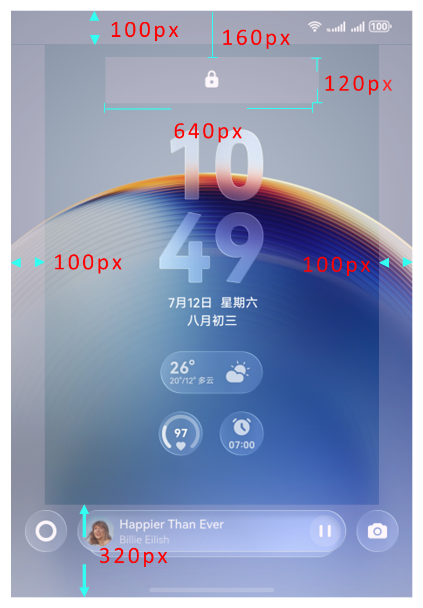
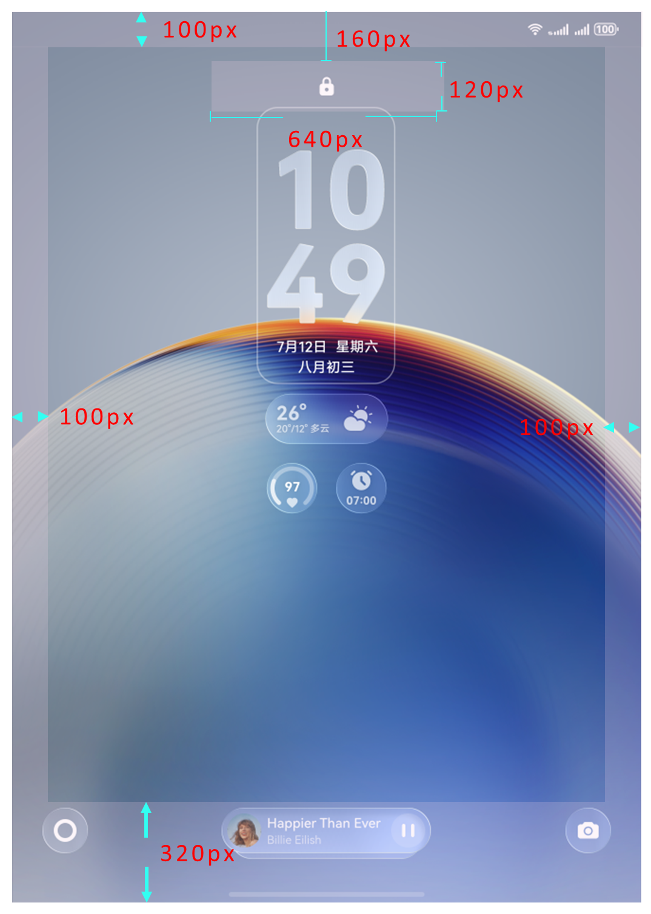
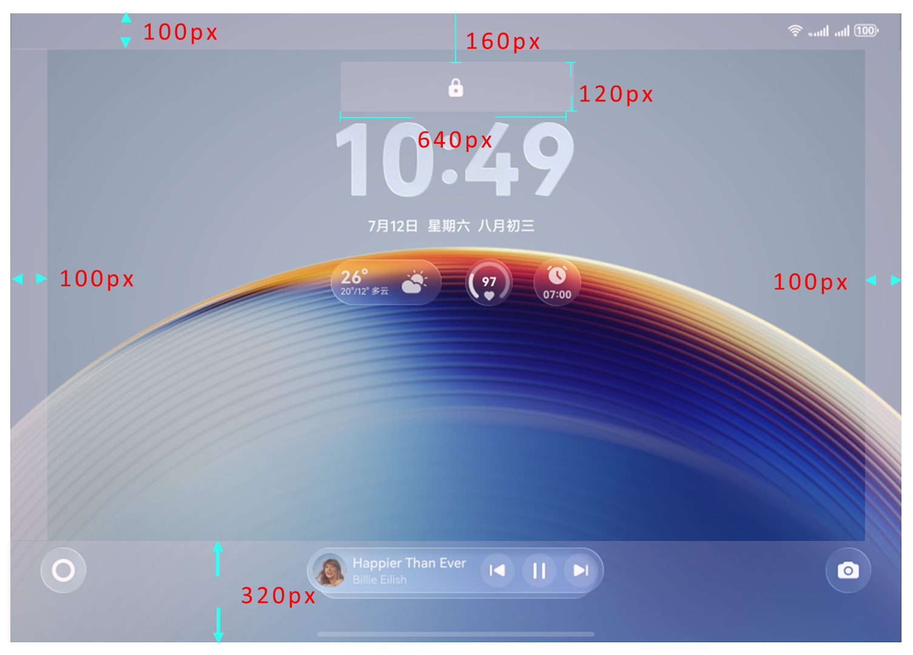

import MergeTable from '@site/src/components/MergeTable';

# Pura X Max主题设计指导及规范

Pura X Max主题就是一套用于改变Pura X Max手机界面视觉效果的元素集合，其中包含熄屏显示、锁屏、桌面、图标、应用（含控制中心、通知中心、播控中心、音量条、文件夹、耳机弹窗、充电动效换肤）、百变卡片。

## 1. 快速指引-必做设计项总计

<MergeTable
  headers={['设计项', '', '是否必做']}
  rows={
    ['熄屏显示', '/', '必做'],
    ['锁屏', '/', '必做'],
    ['桌面', '/', '必做'],
    ['图标', '/', '必做（93个）'],
    [{ text: '应用', rowspan: 7, colspan: 1 }, '控制中心', '必做'],
    [null, '通知中心', '必做'],
    [null, '播控中心', '必做'],
    [null, '音量条', '必做'],
    [null, '文件夹', '必做'],
    [null, '耳机弹窗', '必做'],
    [null, '充电动效换肤', '必做'],
    ['百变卡片', '/', '选做'],
    [{ text: '预览文件', rowspan: 4, colspan: 1 }, '封面图', '必做'],
    [null, '百变卡片封面图', '仅当含百变卡片时，为必做。'],
    [null, '详情图', '必做'],
    [null, '预览视频', '必做']
  }
/>

制作完主题后，各位创作者们可以根据[主题测试审核规范](/docs/distribute/content-dist/theme-center/content-release-0000001054679366/content-review-specifications-0000001054679960/content-check-pecifications-0000001057301166/harmonyos5-theme-test-0000002318301165)进行自检测试。自检无误后可参考[内容上传指南](https://developer.huawei.com/consumer/cn/doc/content/uploadguide-0000001054359939)将主题包上传至主题联盟。

## 2. Pura X Max与平板主题规范差异点

<strong>表2</strong>

<MergeTable
  headers={['设计项', '', '平板', 'Pura X Max']}
  rows={
    ['熄屏显示', '/', { text: '规范一致', rowspan: 1, colspan: 2 }, null],
    ['锁屏', '/', '按平板横屏态、平板竖屏态设计2套锁屏样式', '按折叠态，展开态横屏，展开态竖屏设计3套锁屏样式'],
    [{ text: '桌面', rowspan: 3, colspan: 1 }, '静态桌面', { text: '规范一致', rowspan: 1, colspan: 2 }, null],
    [null, '可交互桌面', '按平板横屏态、平板竖屏态设计2套桌面样式', '按折叠态，展开态横屏，展开态竖屏设计3套桌面样式'],
    [null, '视频桌面', '按平板横屏态(分辨率2560×1600)、平板竖屏态(分辨率1600×2560)提供2个视频文件', '按折叠态(分辨率1280×1870)，展开态横屏(分辨率2600×1840，展开态竖屏(分辨率1840×2600)提供3个视频文件'],
    ['图标', '/', { text: '规范一致', rowspan: 1, colspan: 2 }, null],
    [{ text: '应用', rowspan: 7, colspan: 1 }, '控制中心', { text: '规范一致', rowspan: 1, colspan: 2 }, null],
    [null, '通知中心', { text: '规范一致', rowspan: 1, colspan: 2 }, null],
    [null, '播控中心', { text: '规范一致', rowspan: 1, colspan: 2 }, null],
    [null, '音量条', { text: '规范一致', rowspan: 1, colspan: 2 }, null],
    [null, '文件夹', { text: '规范一致', rowspan: 1, colspan: 2 }, null],
    [null, '耳机弹窗', { text: '规范一致', rowspan: 1, colspan: 2 }, null],
    [null, '充电动效换肤', '按平板横屏态、平板竖屏态设计2套充电动效换肤样式', '按折叠态，展开态横屏，展开态竖屏设计3套充电动效换肤样式'],
    ['百变卡片', '/', { text: '规范一致', rowspan: 1, colspan: 2 }, null],
    [{ text: '预览文件', rowspan: 3, colspan: 1 }, '封面图', '2张 横屏态：1张，分辨率1920 x 1280 竖屏态：1张，分辨率1280 x 1920', '3张 折叠态：1张，分辨率960 x 1472 展开态横屏：1张，分辨率1920 x 1280 展开态竖屏：1张，分辨率1280 x 1920'],
    [null, '详情图', '横屏态不超过20张，分辨率3120 x 2080 竖屏态不超过20张，分辨率2080 x 3120', '折叠态：不超过20张，分辨率1440 x 2208 展开态横屏：不超过20张，分辨率3120 x 2080 展开态竖屏：不超过20张，分辨率2080 x 3120'],
    [null, '预览视频', '2个 横屏态：1个，分辨率3120 x 2080 竖屏态：1个，分辨率2080 x 3120', '3个 折叠态：1个，分辨率1440 x 2208 展开态横屏：1个，分辨率3120 x 2080 展开态竖屏：1个，分辨率2080 x 3120']
  }
/>

<strong>表3</strong>

<MergeTable
  headers={['图片类型', '命名规范（以工具生成为准）', '备注']}
  rows={
    ['宣传图', '详情图-宣传图', { text: '1. 不同图片类型的图片存在多张时，通过文件名后带数字进行区分，表示该类型图片有1到多张，譬如： 详情图-锁屏1 详情图-锁屏2 2. 若含义百变卡片，可以通过宣传图介绍百变卡片。 3. 耳机弹窗仅需上传一张TWS耳机弹窗效果即可。', rowspan: 7, colspan: 1 }],
    ['桌面', '详情图-桌面', null],
    ['锁屏', '详情图-锁屏', null],
    ['图标', '详情图-图标', null],
    ['熄屏显示', '详情图-熄屏显示', null],
    ['耳机弹窗', '详情图-TWS耳机', null],
    ['控制中心', '详情图-控制中心', null]
  }
/>

## 3. 锁屏安全区域

锁屏安全区域是指在锁屏界面上存在部分功能响应优先级高操作区，必须优先保障，确保用户基本操作体验不受影响的区域。

锁屏安全区包括顶部状态栏、锁头及解锁提示、底部的通知胶囊与锁屏小工具、左边栏和右边栏。

安全区域内不可有点击、滑动等操作内容，热区边缘不可与安全区域重叠。

安全区域内可出现动画或提示信息等无操作内容，但不能影响该区域内功能图标的识别性。

时钟、日期等关键信息元素设计时，建议不要进行贴边设计，避免展示时被裁减。

以Pura X Max折叠态设计尺寸1280×1870px为例，安全区域示意如下：

以Pura X Max展开态竖屏设计尺寸2600×1840px为例，安全区域示意如下：

以Pura X Max展开态横屏设计尺寸1840×2600px为例，安全区域示意如下：