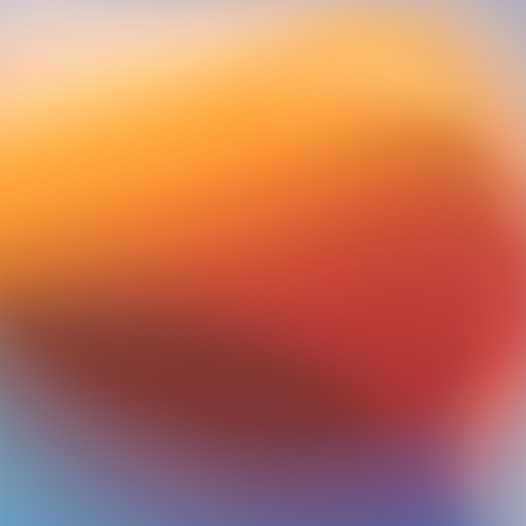
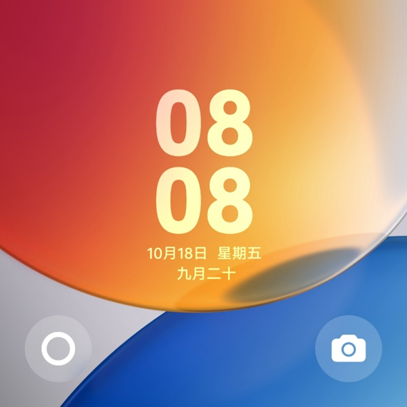
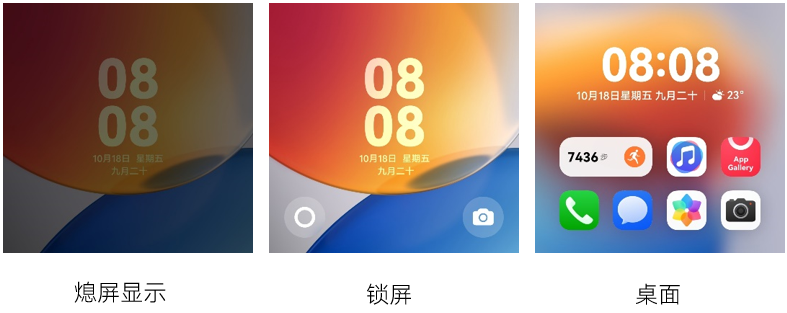

import MergeTable from '@site/src/components/MergeTable';

# Pura X主题设计指导及规范

Pura X主题就是一套用于改变Pura X手机界面视觉效果的元素集合，其中内屏包含熄屏显示、锁屏、桌面、图标、应用（含控制中心、通知中心、播控中心、音量条、文件夹、耳机弹窗、充电动效换肤）、百变卡片，外屏包含熄屏显示、锁屏和桌面。

## 1. 快速指引-必做设计项总计

<strong>表1</strong>

<MergeTable
  headers={['设计项', '', '', '是否必做']}
  rows={
    [{ text: '内屏', rowspan: 16, colspan: 1 }, '熄屏显示', '/', '必做'],
    [null, '锁屏', '/', '必做'],
    [null, '桌面', '/', '必做'],
    [null, '图标', '/', '必做（93个）'],
    [null, { text: '应用', rowspan: 7, colspan: 1 }, '控制中心', '必做'],
    [null, null, '通知中心', '必做'],
    [null, null, '播控中心', '必做'],
    [null, null, '音量条', '必做'],
    [null, null, '文件夹', '必做'],
    [null, null, '耳机弹窗', '必做'],
    [null, null, '充电动效换肤', '必做'],
    [null, '百变卡片', '/', '选做'],
    [null, { text: '预览文件', rowspan: 4, colspan: 1 }, '封面图', '必做'],
    [null, null, '百变卡片封面图', '仅当含百变卡片时，为必做。'],
    [null, null, '详情图', '必做'],
    [null, null, '预览视频', '必做'],
    [{ text: '外屏', rowspan: 6, colspan: 1 }, '熄屏显示', '/', '/'],
    [null, '锁屏', '/', '必做'],
    [null, '桌面', '/', '必做'],
    [null, { text: '预览文件', rowspan: 3, colspan: 1 }, '封面图', '必做'],
    [null, null, '详情图', '必做'],
    [null, null, '预览视频', '选做']
  }
/>

制作完主题后，各位创作者们可以根据[主题测试审核规范](https://developer.huawei.com/consumer/cn/doc/content/harmonyos5-theme-test-0000002318301165)进行自检测试。自检无误后可参考[内容上传指南](https://developer.huawei.com/consumer/cn/doc/content/uploadguide-0000001054359939)将主题包上传至主题联盟。

## 2. Pura X内屏与直板机主题规范差异点

<strong>表2</strong>

<MergeTable
  headers={['设计项', '', '直板机', 'Pura X内屏']}
  rows={
    ['熄屏显示', '/', { text: '规范一致', rowspan: 1, colspan: 2 }, null],
    ['锁屏', '/', { text: '设计1套锁屏样式', rowspan: 1, colspan: 2 }, null],
    [{ text: '桌面', rowspan: 3, colspan: 1 }, '静态桌面', { text: '规范一致', rowspan: 1, colspan: 2 }, null],
    [null, '可交互桌面', { text: '设计1套桌面样式', rowspan: 1, colspan: 2 }, null],
    [null, '视频桌面', '提供1个视频文件，分辨率1080×2340', '提供1个视频文件，分辨率1440 x 2208'],
    ['图标', '/', { text: '规范一致', rowspan: 1, colspan: 2 }, null],
    [{ text: '应用', rowspan: 7, colspan: 1 }, '控制中心', { text: '规范一致', rowspan: 1, colspan: 2 }, null],
    [null, '通知中心', { text: '规范一致', rowspan: 1, colspan: 2 }, null],
    [null, '播控中心', { text: '规范一致', rowspan: 1, colspan: 2 }, null],
    [null, '音量条', { text: '规范一致', rowspan: 1, colspan: 2 }, null],
    [null, '文件夹', { text: '规范一致', rowspan: 1, colspan: 2 }, null],
    [null, '耳机弹窗', { text: '规范一致', rowspan: 1, colspan: 2 }, null],
    [null, '充电动效换肤', { text: '规范一致', rowspan: 1, colspan: 2 }, null],
    ['百变卡片', '/', { text: '规范一致', rowspan: 1, colspan: 2 }, null],
    [{ text: '预览文件', rowspan: 3, colspan: 1 }, '封面图', '1张，分辨率960 x 1920', '1张，分辨率960 x 1472'],
    [null, '详情图', '不超过20张，分辨率1440 x 3120', '不超过20张，分辨率1440 x 2208'],
    [null, '预览视频', '1个，分辨率1440 x 3120', '1个，分辨率1440 x 2208']
  }
/>

<strong>表3</strong>

<MergeTable
  headers={['图片类型', '命名规范（以工具生成为准）', '备注']}
  rows={
    ['宣传图', '详情图-宣传图', { text: '1. 不同图片类型的图片存在多张时，通过文件名后带数字进行区分，表示该类型图片有1到多张，譬如： 详情图-锁屏1 详情图-锁屏2 2. 若含义百变卡片，可以通过宣传图介绍百变卡片。 3. 耳机弹窗仅需上传一张TWS耳机弹窗效果即可。', rowspan: 8, colspan: 1 }],
    ['桌面', '详情图-桌面', null],
    ['锁屏', '详情图-锁屏', null],
    ['图标', '详情图-图标', null],
    ['熄屏显示', '详情图-熄屏显示', null],
    ['耳机弹窗', '详情图-TWS耳机', null],
    ['控制中心', '详情图-控制中心', null],
    ['外屏', '详情图-外屏', null]
  }
/>

## 3. 外屏（sub\_screen）

### 3.1 熄屏显示（aod）

全屏熄屏显示是系统对锁屏壁纸进行压暗后的效果，无需设计师单独设计。

### 3.2 锁屏（lock）

<strong>静态锁屏</strong>

锁屏壁纸尺寸为：1440×1440px，格式为.jpg。

不同机型分辨率存在差异，桌面壁纸按等比缩放，居中裁剪。

锁屏壁纸样板如下：

### 3.3 桌面（home）

<strong>静态桌面</strong>

桌面壁纸尺寸为：1440×1440px，格式为.jpg。

不同机型分辨率存在差异，桌面壁纸按等比缩放，居中裁剪。

桌面壁纸样板如下：

### 3.4 预览文件（preview）

<strong>封面图</strong>

说明：

1. 封面图为必做项。
2. 封面图尺寸为960 x 960 px，格式为jpg。
3. 顶部和底部80px的范围内，不允许出现任何内容，包括状态栏信息等。
4. 封面图所展示的内容应该与锁屏内容保持一致。

<strong>详情图</strong>

说明：

1. 详情图为必做项。
2. 详情图尺寸为1440 x 1440 px，格式为jpg。
3. 详情图所展示的内容应该与手机的实际效果相同。
4. 详情图中熄屏显示、锁屏、桌面为必做，最多支持20张。
5. 上传主题联盟时，详情图需按熄屏显示、锁屏、桌面的顺序依次上传，主题商店将按上传的顺序进行展示。

<strong>预览视频</strong>

预览视频要求如下：

1. 预览视频为选做项。
2. 视频尺寸为：1440 × 1440px。
3. 视频格式为MP4，编解码制式要求为H.264/H.265，视频大小建议在15MB以内，时长建议在15秒以内。

为保证预览效果，请提供能循环播放的视频，确保首尾衔接部分流畅，不会出现画面跳动或者闪烁。