import MergeTable from '@site/src/components/MergeTable';

# 耳机弹窗主题设计指导及规范

支持对音频产品（TWS耳机、颈戴和眼镜）回连弹窗进行个性化设计，可设计元素包括：弹窗背景、产品主体、电量、电量数值和连接提示。

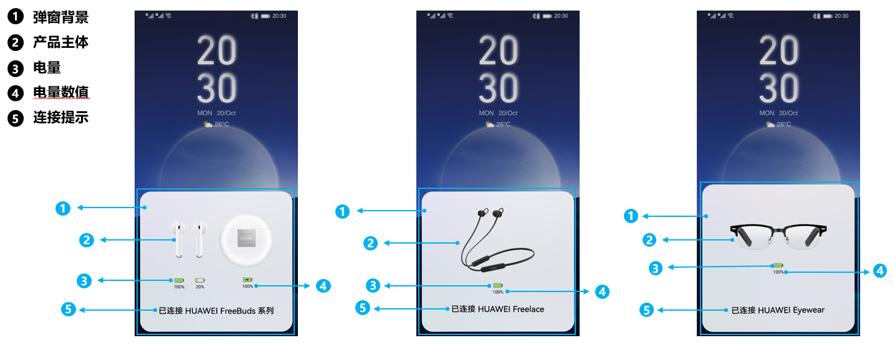


1. 手机系统需升级到HarmonyOS 2.0、主题APP需升级到12.0.10.305版本、音频管家APP需升级到12.0.0.140版本后，才能应用回连弹窗系列主题。
2. <strong>以下机型不支持耳机弹窗主题：</strong>HUAWEI P10、HUAWEI P10 Plus、HUAWEI Mate 9、HUAWEI Mate 9 pro、HUAWEI Mate 9 保时捷、HUAWEI Nova 2s、HUAWEI Nova 3、HUAWEI nova 3i、华为畅享9 plus、HUAWEI Y9 2019、HUAWEI nova 9 SE和HUAWEI nova 10 SE均不支持，后续将开放更多机型，敬请期待。
3. 耳机弹窗不支持如下设备：FreeBuds、FreeBuds 2、FlyPods、FlyPods 2、HUAWEI FreeLace（活力版除外）、FreeBuds 3、FlyPods 3、HUAWEI FreeBuds 3i、HUAWEI FreeBuds Studio、HUAWEI FreeLace Pro、HUAWEI FreeBuds 4i，其余华为蓝牙耳机设备均支持。

<strong>支持换肤的音频产品详情：</strong>


<MergeTable
  headers={['设备类型', '设备类型编号', '设备名称']}
  rows={
    [{ text: 'TWS耳机', rowspan: 7, colspan: 1 }, { text: '01', rowspan: 7, colspan: 1 }, 'HUAWEI FreeBuds 4'],
    [null, null, 'HUAWEI FreeBuds 4E'],
    [null, null, 'HUAWEI FreeBuds 5i'],
    [null, null, 'HUAWEI FreeBuds Pro'],
    [null, null, 'HUAWEI FreeBuds Pro 2'],
    [null, null, 'HUAWEI FreeBuds LipStick'],
    [null, null, 'HUAWEI FreeBuds SE'],
    ['颈戴', '02', 'HUAWEI FreeLace 活力版'],
    ['眼镜', '03', 'HUAWEI Eyewear']
  }
/>


<strong>不支持换肤的音频产品详情：</strong>


<MergeTable
  headers={['设备类型', '设备类型编号', '设备名称']}
  rows={
    [{ text: 'TWS耳机', rowspan: 10, colspan: 1 }, { text: '01', rowspan: 10, colspan: 1 }, 'FreeBuds'],
    [null, null, 'FreeBuds 2'],
    [null, null, 'FlyPods'],
    [null, null, 'FlyPods 2'],
    [null, null, 'FreeBuds 3'],
    [null, null, 'FlyPods 3'],
    [null, null, 'HUAWEI FreeBuds 3i'],
    [null, null, 'HUAWEI FreeBuds Studio'],
    [null, null, 'HUAWEI FreeBuds 4i'],
    [null, null, ''],
    [{ text: '颈戴', rowspan: 2, colspan: 1 }, { text: '02', rowspan: 2, colspan: 1 }, 'HUAWEI FreeLace'],
    [null, null, 'HUAWEI FreeLace Pro']
  }
/>


<strong>可设计元素：</strong>

| 界面元素 | 是否支持修改 | 相关参数 |
| --- | --- | --- |
| 弹窗背景 | 1、支持修改。支持静态图片/自定义视频作为弹窗背景。  2、建议设计师请勿把产品小图标设计在背景中，以免在不同分辨率的手机下导致的产品小图标的变形和错位。 | [弹框背景相关参数](#section319693863511) |
| 产品主体 | 支持不显示。产品主体不显示时，必须在电量条左边显示产品小图标。 | [弹框背景相关参数](#section319693863511)  [nearbyBattery ：电量元素相关参数](#section1544035723819) |
| 电量 | 支持修改电量条的安全色、位置和宽高。  左侧可选择显示或隐藏产品小图标，显示产品小图标时，支持修改其颜色和宽高。 | [nearbyBattery ：电量元素相关参数](#section1544035723819) |
| 电量数值 | 支持修改电量数值的位置。 | [nearbyBattery ：电量元素相关参数](#section1544035723819) |
| 连接提示 | 支持修改连接提示的字号、颜色和位置。连接提示的文字必须x轴居中。 | [nearbyFont：连接提示相关参数](#section1763213619368) |

## 主题包结构

耳机弹窗主题文件夹为audioaccessorymanager（固定命名），必须添加在手机大主题或小主题包中，不可单独制作。


包含耳机弹窗的手机大主题或小主题，只需制作版本号为12.0.X的版本。

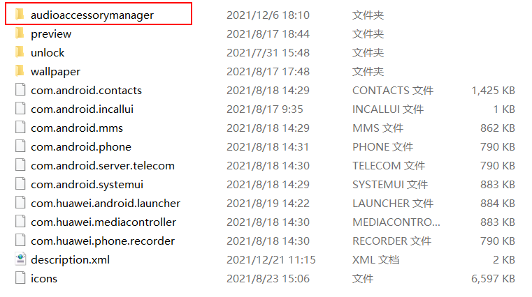

audioaccessorymanager文件夹中包含一个resource文件夹（固定命名）和一个nearby.json文件（固定命名）。

* resource文件夹：包含弹窗主题的图片/视频资源，此文件夹不能压缩。
* nearby.json：回连弹窗主题的json文件。

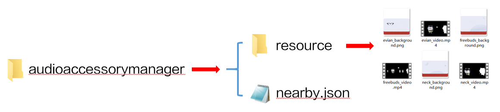

## Json文件

```
{
	"01": {
		"backgroundName": "freebuds_background.png",
		"videoName": "freebuds_video.mp4",
                "isvideotop":true,
		"isTransparent":true,
                "repeat": "0",
		"nearbyFont": {
			"textPrimary": {
			"textColor": "#FFFFFF",
			"textSize": "16",
			"textColorBlur": "#000000",
			"location": "-1,0.93"
			}
		},
		"nearbyBattery": {
			"locationLeftEarOrSingle": "0.175,0.72",
			"locationRightEar": "0.385,0.72",
			"locationBox": "0.76,0.75",
		        "batterySafeColor": "#7DD12A",
                        "batteryTextColor": "#000000",
                        "borderColor": "#000000",
			"displaySmallIcon": false,
			"percentageLocation": "3"
		}
	},
		"02": {
		"backgroundName": "neck_background.png",
		"videoName": "neck_video.mp4",
                "isvideotop":true,
		"isTransparent":true,
                "repeat": "0",
		"nearbyFont": {
			"textPrimary": {
			"textColor": "#FFFFFF",
			"textSize": "16",
			"textColorBlur": "#000000",
			"location": "-1,0.93"
			}
		},
		"nearbyBattery": {
			"locationLeftEarOrSingle": "0.21,0.62",
			"locationRightEar": "",
			"locationBox": "",
			"batterySafeColor": "#7DD12A",
                        "batteryTextColor": "#000000",
                        "borderColor": "#000000",
			"displaySmallIcon": false,
			"percentageLocation": "3"
		}
	},

	"03": {
		"backgroundName": "evian_background.png",
		"videoName": "evian_video.mp4",
                "isvideotop":true,
		"isTransparent":true,
                "repeat": "0",
		"nearbyFont": {
			"textPrimary": {
			"textColor": "#FFFFFF",
			"textSize": "16",
			"textColorBlur": "#FFFFFF",
			"location": "-1,0.93"
			}
		},
		"nearbyBattery": {
			"locationLeftEarOrSingle": "0.21,0.70",
			"locationRightEar": "",
			"locationBox": "",
			"batterySafeColor": "#7DD12A",
                        "batteryTextColor": "#000000",
                        "borderColor": "#000000",
			"displaySmallIcon": false,
			"percentageLocation": "2"
		}
	}

}
```

Json文件说明：

* 01、02、03为设备类型编号：01（TWS耳机） ; 02 （颈戴）；03（眼镜）。
* 01、02、03 三种设备类型都为必做，可以为每种设备类型制作不同的弹窗效果。
* Json文件结构说明：

  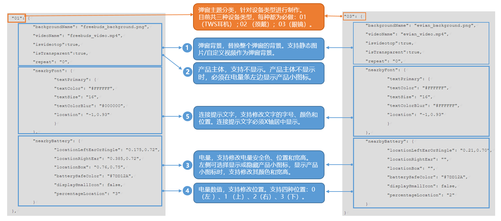

## 参数说明

### 弹窗背景相关参数

| 参 数 | 类 型 | 注 释 |
| --- | --- | --- |
| backgroundName | 字符串 | 弹窗静态图片背景的文件名。  格式：PNG。  尺寸：1344x1408px。可显示区域不小于背景的最大高度的1/4，即352px。  大小：不超过2MB。 |
| videoName | 字符串 | 弹窗自定义视频的文件名。  格式：MP4。  尺寸：1344x1408px。可显示区域不小于背景的最大高度的1/4，即352px。  大小：不超过2MB。  播放时长：5-7s。  说明：  是透明视频时，与backgroundName同时生效。 |
| isTransparent | 字符串 | 是否是透明视频。false或true，默认为false。  false: 不是透明视频， 此时backgroundName不生效。  true：是透明视频，与backgroundName同时生效。 |
| repeat | 数值 | 视频的循环播放次数。循环次数\*视频时长&gt;7s时，按照系统回连弹窗时长7s播放。  说明：  系统回连弹窗时长为7s，循环次数\*视频时长需保证首尾播放完成，超过7s将会强制退出回连弹窗主题。 |
| isvideotop | 字符串 | 视频是否在顶层。false或true。false：不在顶层。true：在顶层。 |


由于当前是针对真无线耳机、颈戴耳机和智能眼镜三种产品类型进行弹窗制作，而非针对某款特定产品进行弹窗制作，因此当弹窗设计上包含产品主体时，产品主体的设计样式需尽量通用，不能直接使用某款产品的原图，也不能联想到真实的某款产品，以避免用户使用时产生误解。

### nearbyBattery ：电量元素相关参数

| 参 数 | 类 型 | 注 释 |
| --- | --- | --- |
| percentageLocation | 数值 | 电量数值摆放位置。支持四种位置：0（左 ）、1 （上）、2（右）、3（下）。  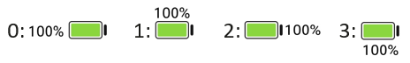  说明：  显示产品小图标后，电量数值在左边不可使用，如使用将显示在下方。 |
| locationLeftEarOrSingle | 数值 | 左耳机电量/设备电量中心点的位置比值"x , y"，x、y的取值范围为0-1。  则左耳机电量/设备电量中心点实际的位置计算方法为：x乘以弹窗背景宽（1344px）, y乘以弹窗背景高（1408px）。例："locationLeftEarOrSingle": "0.21,0.70"，则左耳机电量/设备电量中心点实际的位置为"282.24, 985.6"。  说明：  1. 不填写不显示。 2. 以弹窗背景为参照物，弹窗背景最左上角的点为原点（0,0）。 |
| locationRightEar | 数值 | 右边耳机电量中心点的位置比值"x , y"，x、y的取值范围为0-1。  则右边耳机电量中心点实际的位置计算方法为：x乘以弹窗背景宽（1344px）, y乘以弹窗背景高（1408px）。例："locationRightEar": "0.385,0.72"，则右边耳机电量中心点实际的位置为"517.44, 1013.76"。  说明：  1. 不填写不显示。 2. 以弹窗背景为参照物，弹窗背景最左上角的点为原点（0,0）。 |
| locationBox | 数值 | 盒子电量中心点的位置比值"x , y"，x、y的取值范围为0-1。  则盒子电量中心点实际的位置计算方法为：x乘以弹窗背景宽（1344px）, y乘以弹窗背景高（1408px）。例："locationBox": "0.76,0.75"，则盒子电量中心点实际的位置为"1021.44, 1056"。  说明：  1. 不填写不显示。 2. 以弹窗背景为参照物，弹窗背景最左上角的点为原点（0,0）。 |
| batterySafeColor | 字符串 | 电量条安全电量的颜色，填写颜色的RGB值，不填写显示默认值#7DD12A。  说明：  修改后的电量条安全色不可接近提示色（#FF9B1A）和电量警示色（#FF3320）。 |
| displaySmallIcon | 字符串 | 是否显示产品小图标。false或true，默认为false。false：不显示；true：显示。  产品主体不显示时，必须在电量条左边显示产品小图标。具体见：[产品小图标模板.zip](https://communityfile-drcn.op.dbankcloud.cn/FileServer/getFile/cmtyPub/011/111/111/0000000000011111111.20250620110512.62112330132947354109152411302593%3A50001231000000%3A2800%3AA60DA6C661A02B8EFFC6B5509FEA32E12B081FAC3B43DFE76670C5D8D6DFC041.zip?needInitFileName=true)  以下为显示产品小图标的示例：  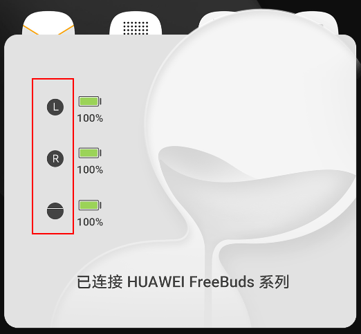 |
| smallIconColor | 字符串 | 产品小图标的颜色，填写颜色的RGB值，不填写显示默认值#000000。 |
| batteryTextColor | 字符串 | 电量百分比颜色，填写颜色的RGB值，不填写显示默认值#000000。 |
| borderColor | 字符串 | 电池边框颜色，填写颜色的RGB值，不填写显示默认值#000000。 |
| smallIconWidth | 数值 | 产品小图标的宽，不填写显示默认值24。 |
| smallIconHeight | 数值 | 产品小图标的高，不填写显示默认值24。  说明：  smallIconWidth与smallIconHeight ，需保持24:24的比例，否则产品小图标会变形。 |
| batteryWidth | 数值 | 电量条的宽。不填写显示默认值26。 |
| batteryHeight | 数值 | 电量条的高，不填写显示默认值12。  说明：  batteryWidth与batteryHeight，需保持26:12的比例，否则电量条会变形。 |


* TWS类型设备，locationLeftEarOrSingle、locationRightEar、 locationBox都需要设置。其他类型设备，只需要设置locationLeftEarOrSingle。
* 电量数值的字体跟随手机系统设置的字体。

### nearbyFont：连接提示相关参数

| 参 数 | 类 型 | 注 释 |
| --- | --- | --- |
| textColor | 字符串 | 字体颜色，填写颜色的RGB值，不填写默认为黑色（#000000）。 |
| textSize | 数值 | 字体大小，单位为sp。 |
| textColorBlur | 字符串 | dark模式下的字体颜色，填写颜色的RGB值，不填写默认为白色（#FFFFFF）。 |
| location | 数值 | 字体位置比值"x , y"，x、y的取值范围为0-1。  则字体实际的位置计算方法为：x乘以弹窗背景宽（1344px）, y乘以弹窗背景高（1408px）。例："location": "0.5,0.93"，则右边耳机电量中心点实际的位置为"672, 1399.44"。  说明：  1. 连接提示的文字必须x轴居中显示。 2. x , y取值为-1时，居中显示。例："-1,0.74"为x轴居中；"-1-1"为x, y轴都居中。 3. 以弹窗背景为参照物，弹窗背景最左上角的点为原点（0,0）。 |


连接提示的字体跟随手机系统设置的字体。

## 预览图

### 预览图说明

需制作三张预览图，分别展示TWS耳机、颈戴、眼镜三种设备的回连弹窗预览效果。

预览图尺寸为 1080×2160px，格式为.jpg，命名为preview\_findnearby\_X（X取值为0/1/2，0为TWS耳机，1为眼镜，2为颈戴）。

制作好的三张预览图，添加至手机大主题或小主题包的preview文件夹中。

预览图样板：

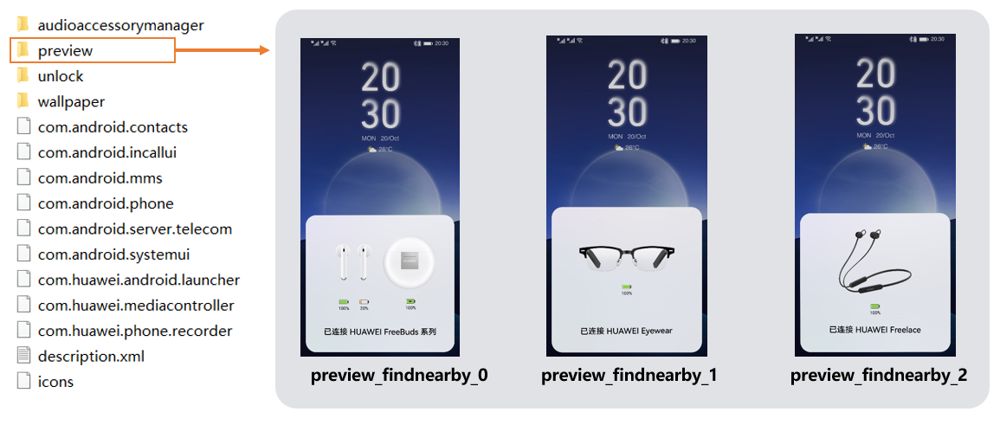

### 预览图制作方法

可以使用手机截图的方式制作，截图后需按照预览图样板进行部分修改。

也可以使用官方提供的PSD模板：[耳机弹窗psd文件.zip](https://communityfile-drcn.op.dbankcloud.cn/FileServer/getFile/cmtyPub/011/111/111/0000000000011111111.20250620110512.81677083693749569041572195412657%3A50001231000000%3A2800%3A9877A88BB6ED458560E2E9FA9F1E2EF3B2FAF8D6FFD08991AF089AE52268D94B.zip?needInitFileName=true)制作预览图。

## MP4透明视频转换指导文档

### 背景说明

为了实现弹窗的动画效果，需用到透明视频，且视频文件不能太大。MOV格式的视频自带透明通道，但是文件太大，需要将其转换为MP4格式的透明视频。但是MP4格式的视频是不带透明通道的，所以需要通过黑白蒙版来实现透明效果。

### 软件及素材

软件：Adobe After Effects（AE） 、Adobe Media Encoder (ME)

素材：带透明通道的视频素材（MOV格式）

### 视频转换流程

1. 把准备好的MOV视频导入到AE中。

   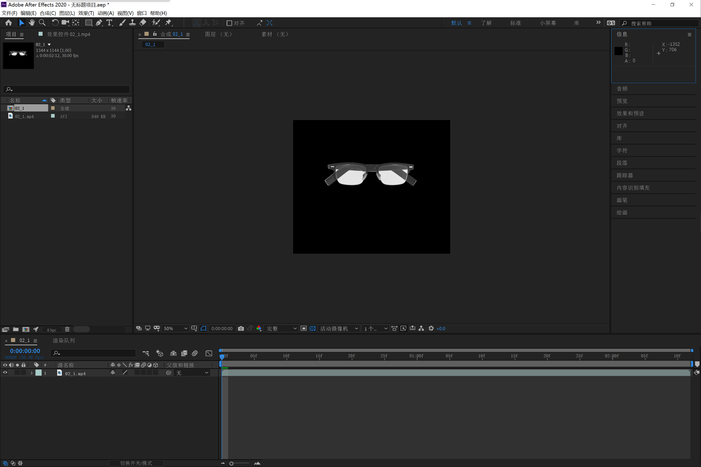
2. Ctrl+Alt+M，弹出ME界面，导出黑白蒙版通道视频。

   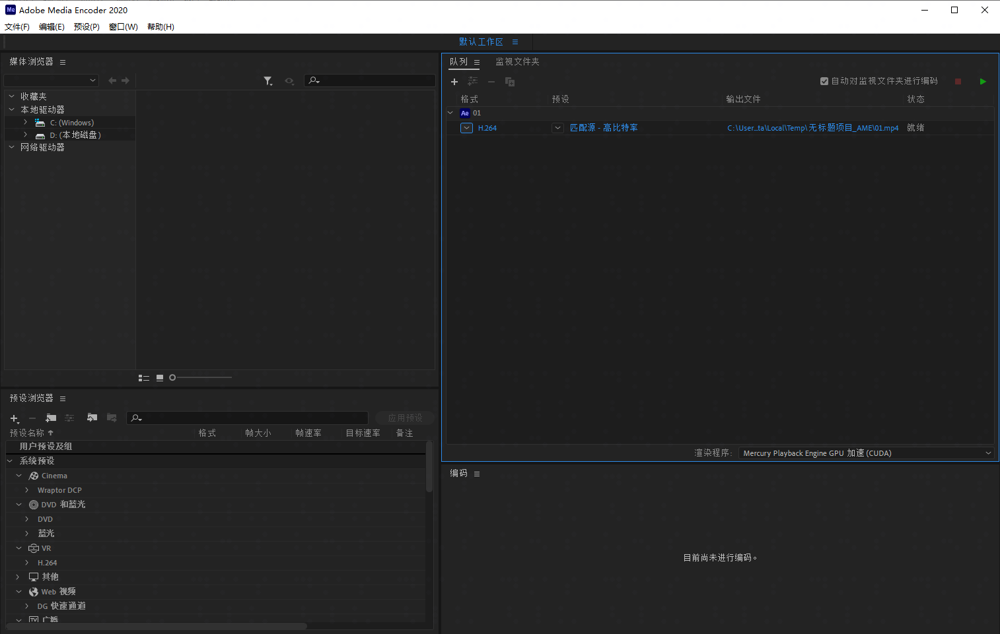
3. 点击“匹配源”，进入导出设置窗口，设置好参数，确定，渲染。

   

   在设置参数的时候一定要勾选“仅渲染Alpha通道”。

   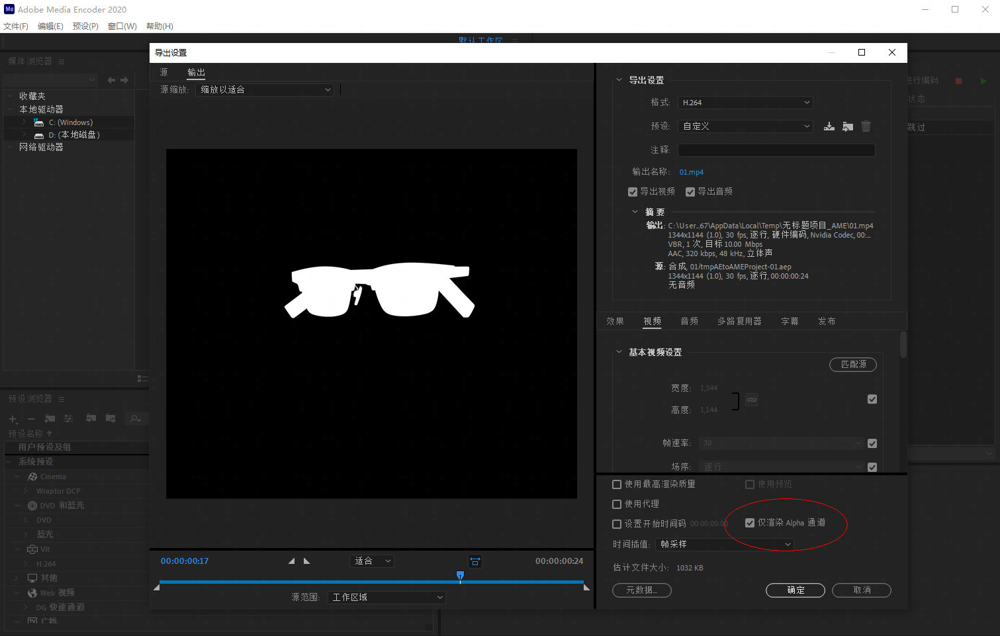
4. 把原视频和导出的蒙版视频合在一起：回到AE，打开合成设置，把视频的宽度尺寸\*2，再把之前导出的黑白蒙版视频拖入AE中，摆放好位置。

   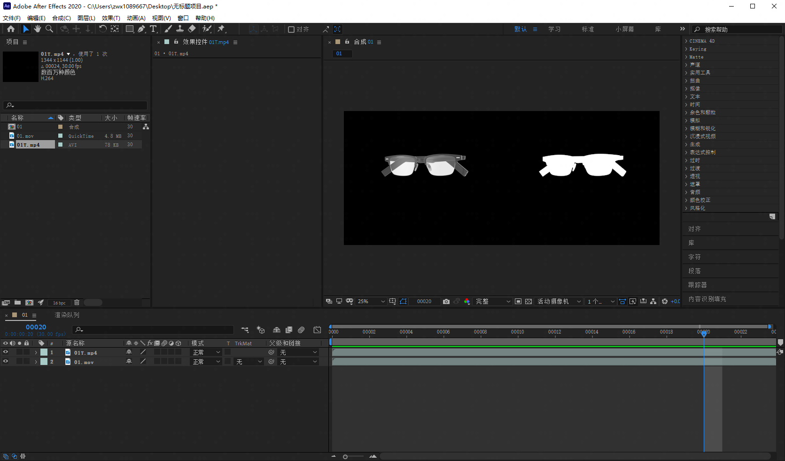
5. 再按Ctrl+Alt+M，弹出ME界面，输出完整视频。

   

   在保证画面质量的情况下，尽可能的把比特率调低一点，以确保输出文件没那么大。

   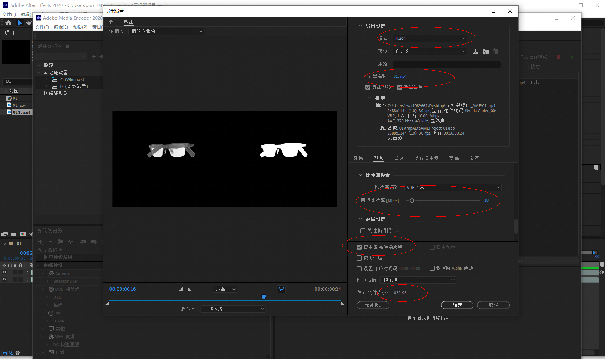