import MergeTable from '@site/src/components/MergeTable';

# EMUI 9.1主题设计指导及规范

小主题：小主题是锁屏、桌面及图标范围进行换肤的主题。

大主题：大主题是锁屏、桌面、图标、联系人、信息、下拉开关、拨号范围进行换肤的主题。

锁屏主题：锁屏主题是仅锁屏范围换肤的主题。

图标主题：图标主题是仅图标范围换肤的主题。

以上所有类型主题均可直接使用主题工具直接制作。

## 1. 快速指引-必做设计项总计

| 类别 | 主题包内名称 | 小主题 | 大主题 | 锁屏主题 | 图标主题 |
| --- | --- | --- | --- | --- | --- |
| 锁屏 | unlock | 1个 | 1个 | 1个 | / |
| 壁纸 | wallpaper | 2张 | 2张 | 1张 | / |
| 图标 | icons | 66个 | 66个 | / | 66个 |
| 桌面 | com.huawei.android.launcher | 1个 | 1个 | / | 1个 |
| 联系人 | com.android.contacts | / | 1个 | / | / |
| 信息 | com.android.mms | / | 1个 | / | / |
| 下拉开关 | com.android.systemui | / | 1个 | / | / |
| 拨号设置 | com.android.phone | / | 1个 | / | / |
| 拨号设置-通话自动录音 | com.android.phone.recorder | / | 1个 | / | / |
| 拨号设置-来电拒接短信 | com.android.server.telecom | / | 1个 | / | / |
| 预览图 | preview | 6-15张 | 11-15张 | 3-15张 | 4-15张 |
| 描述文件 | description.xml | 1个 | 1个 | 1个 | 1个 |

制作完主题后，各位设计师们可以根据测试规范进行自检测试。自检无误后可参考上传引导将主题包上传至联盟。

## 2. 快速入门

### 2.1 小主题

小主题结构包含：

* 锁屏
* 壁纸
* 图标
* 桌面
* 预览图
* 描述文件

如下图所示，通过打包所有小主题的结构文件，就制作完成了一个小主题：

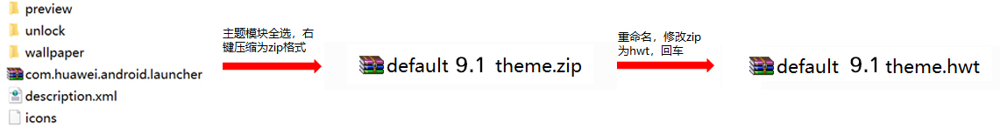

### 2.2 大主题

除小主题包含结构内容，大主题还包含：

* 联系人
* 信息
* 下拉开关
* 拨号设置
* 拨号设置-通话自动录音
* 拨号设置-来电拒接短信
* 畅连通话

如下图所示，通过打包所有大主题的结构文件，就制作完成了一个大主题：

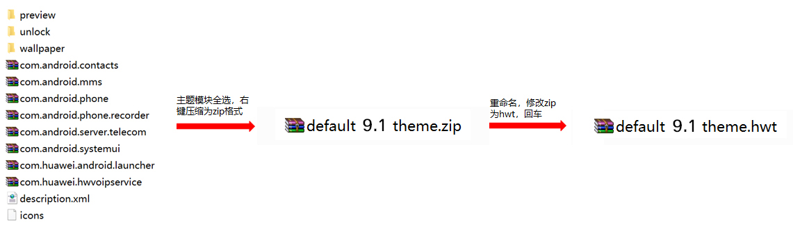

### 2.3 锁屏主题

锁屏主题结构包含：

* 锁屏
* 壁纸中的锁屏壁纸：unlock\_wallpaper\_X
* 预览图
* 描述文件

  如下图所示，通过打包所有锁屏主题的结构文件，就制作完成了一个锁屏主题：

  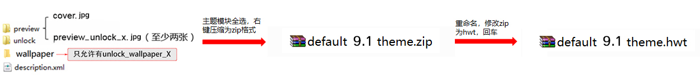

### 2.4 图标主题

图标主题结构包含：

* 图标
* 桌面
* 预览图
* 描述文件

  如下图所示，通过打包所有图标主题的结构文件，就制作完成了一个图标主题：

  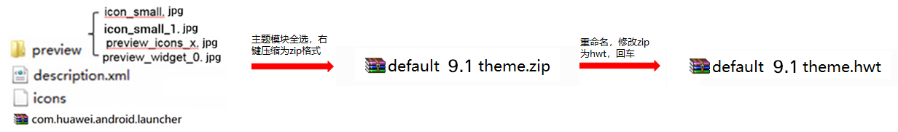

## 3. 锁屏（unlock）制作指导及规范

EMUI9.1的解锁方式如下：滑动锁屏、杂志锁屏、视频解锁、百变锁屏。四选一。

所有类型的锁屏，unlock文件夹下都必须有theme.xml文件。

### 3.1 滑动锁屏

滑动锁屏为一张静态壁纸全屏滑动解锁。需在壁纸wallpaper文件夹下放置锁屏壁纸一张。

锁屏壁纸的尺寸为：1080×2160px，格式为.jpg，文件名为：unlock\_wallpaper\_X.jpg（X为阿拉伯数字按顺序排列，首张壁纸X为0）。

锁屏壁纸样板如下：


滑动锁屏unlock文件夹下只有一个XML文件，显示内容为默认效果，设计师仅能修改壁纸，代码固定，如下所示：

```
<?xmlversion="1.0" encoding="UTF-8"?>
<HWTheme>
    <itemstyle="slide"/>
</HWTheme>
```

滑动锁屏应用效果如下图所示：

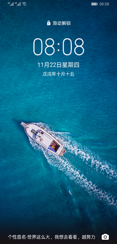

滑动锁屏可通过工具可视化制作：

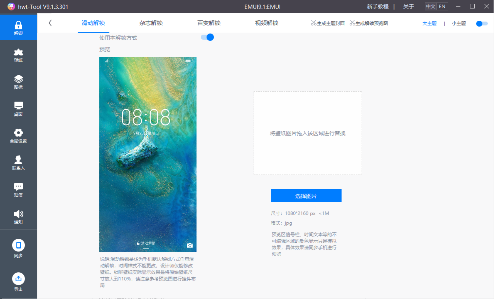

### 3.2杂志锁屏

杂志锁屏在设置中开启开关时，每次亮屏时显示不同的锁屏图片，首次亮屏显示设计师设计的锁屏壁纸。需在壁纸wallpaper文件夹下放置锁屏壁纸一张。

锁屏壁纸的尺寸为：1080×2160px，格式为.jpg，文件名为：unlock\_wallpaper\_X.jpg（X为阿拉伯数字按顺序排列，首张壁纸X为0）。

锁屏壁纸样板如下：


杂志锁屏和滑动解锁相似，unlock文件夹下只有一个XML文件，显示内容为默认效果，设计师仅能修改壁纸，代码固定，如下所示：

```
<?xmlversion="1.0" encoding="UTF-8"?>
<HWTheme>
    <itemstyle="magazine"/>
</HWTheme>
```

杂志锁屏应用效果如下图所示，系统根据手机指纹解锁位置，自动判断时间布局：

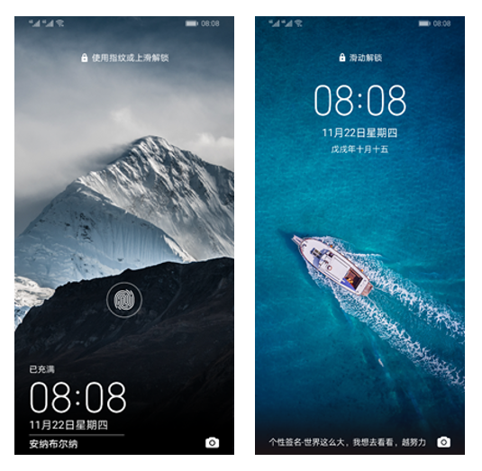

杂志锁屏可通过工具可视化制作：

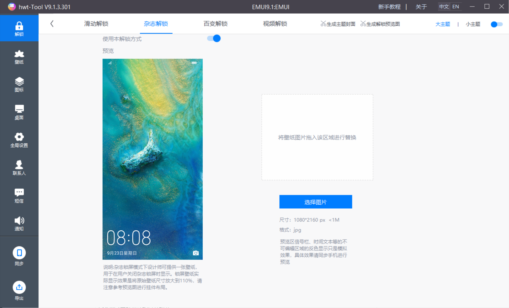

### 3.3 百变锁屏

百变锁屏在一定需求下可用于开发风格多变的用户界面。可方便地通过更换皮肤改变界面风格、动画甚至交互方式。百变锁屏可通过工具可视化制作：

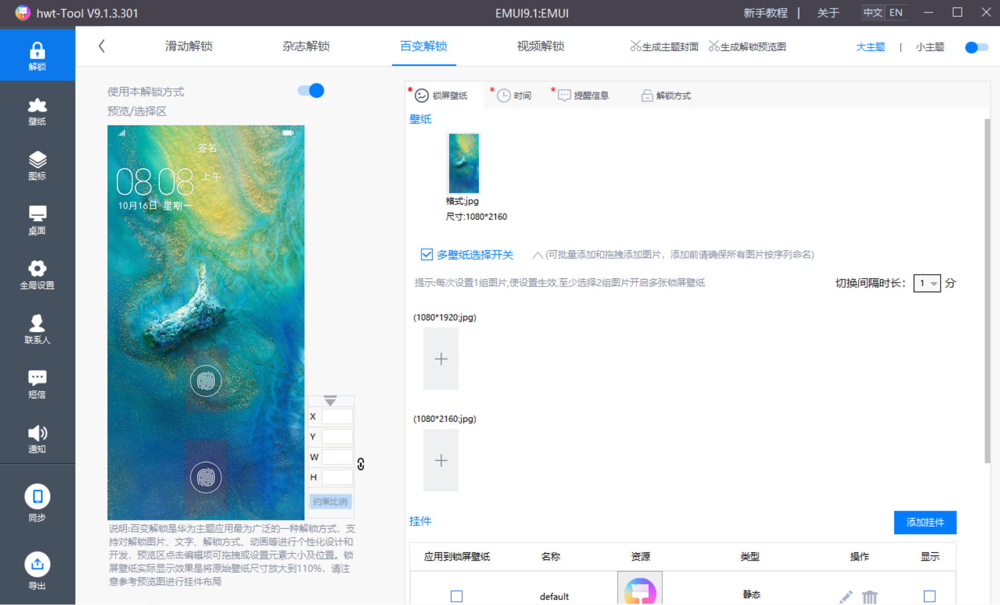

### 3.4 视频锁屏

视频锁屏是在锁屏上面循环播放视频的锁屏，默认全屏滑动解锁。设计师可以制作视频锁屏壁纸，并能修改锁屏时间切图、日期及上下午颜色。视频锁屏可通过工具可视化制作：

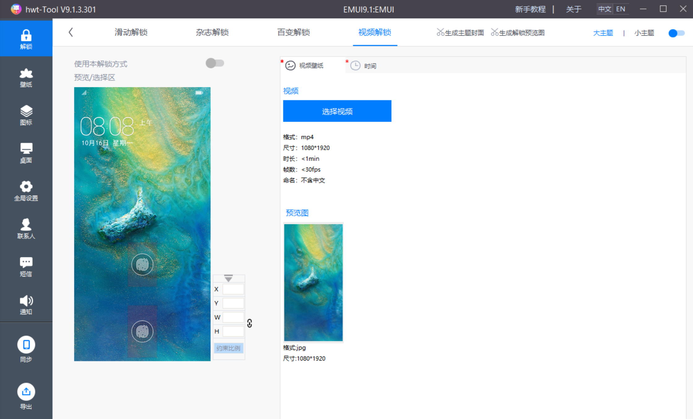

## 4. 壁纸（wallpaper）

壁纸分为桌面壁纸和锁屏壁纸，大小均控制在1M以内；均可按照顺序放置多张壁纸。

由于9.1特性，锁屏壁纸实际效果会被放大10%，设计师在制作时请注意规避。

锁屏壁纸必须放在wallpaper中才会自适应兼容18:9及以上的手机。

### 4.1 桌面壁纸

桌面壁纸的尺寸为：2160×2160px，格式为.jpg，文件名为：home\_wallpaper\_X.jpg（X为阿拉伯数字按顺序排列，首张壁纸X为0）。

桌面壁纸样板如下：

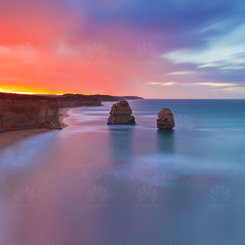

### 4.2 锁屏壁纸

锁屏壁纸的尺寸为：1080×2160px，格式为.jpg，文件名为：unlock\_wallpaper\_X.jpg（X为阿拉伯数字按顺序排列，首张壁纸X为0）。

锁屏壁纸样板如下：

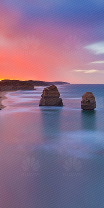

## 5. 图标（icons）

图标包含了系统图标和第三方图标；其中系统图标又分为动态图标和静态图标；所有图标尺寸：192×192px；所有图标格式：png格式。

### 5.1 系统图标-静态图标

* 一共67个静态图标，其中下图绿色选框的图标com.huawei.hwmarket.vr.png（VR）为选做，其余66个为必做。
* 日历，时钟的静态图标不能出现带有误导性的数字。
* 不同应用不能使用相同图标。
* 系统图标必须经过重新绘制。其中，红色框选的图标需保留官方图标中心元素，设计师不可随意更改其形状。

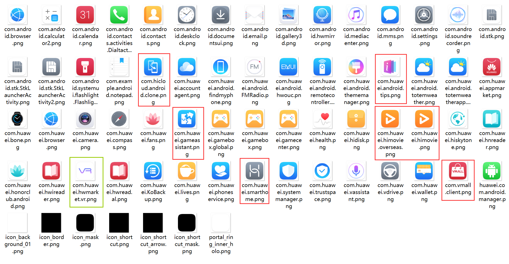

### 5.2 系统图标-动态图标

动态图标在icons下面的dynamic\_icons文件夹下，分别支持以下3个动态图标：

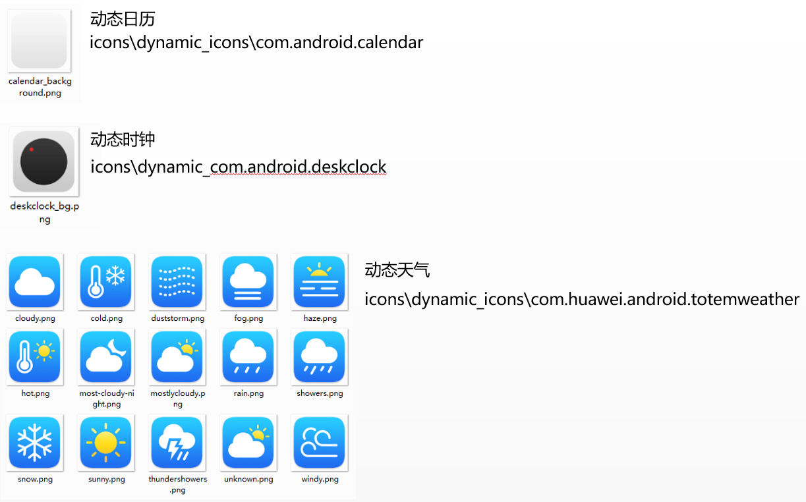


* 以上动态图标均是选做图标。
* 动态日历只用提供背板，具体时间详情由系统自动写入，可通过launcher中的theme.xml文件修改显示的时间数字的颜色。
* 若没有适配动态图标，需将其所属文件夹删除，若三个动态图标都没有适配，则直接删除dynamic\_icons。
* 日历，时钟的静态图标不能出现带有误导性的数字。不同应用不能使用相同图标。

### 5.3 第三方图标-模板适配


我们希望设计师尽可能多的适配第三方图标，但是也会有没有适配的情况，为此，华为主题提供了一套解决方案：通过背板，遮罩，蒙版组合出一套底板使未适配的第三方图标风格趋近于统一。一组第三方图标底板，由icon\_background\_01.png、 icon\_border.png、 icon\_mask.png组成，三个资源缺一不可。

1. icon\_background\_01.png ——图标底板。可以做多张底板图片（如不同材质、颜色），系统会随机调取该底板放到第三方应用的下方。做这个底板的时候，要考虑到其它图标大小，视觉上要保持一致。

   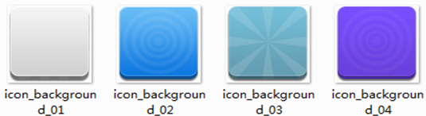
2. icon\_border.png——图标遮罩。统一罩在第三方图标的最上层，可以灵活应用，做出多种效果。比如下图中图标上的做旧划痕或者阴影过渡等效果。如果不需要用这种叠加效果，则在主题包中将这张图做成完全空白透明的。

   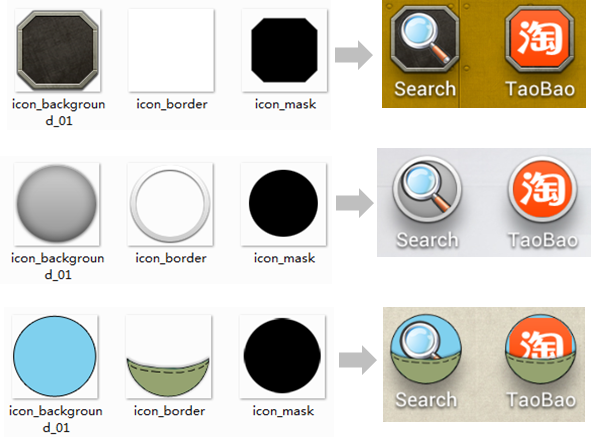
3. icon\_mask.png——图标蒙版。该图片的图像区域必须为纯黑色，第三方图标只显示黑色图像范围的内容。

### 5.4 第三方图标-包名适配


主题图标作为锁屏模块外第二重要大模块，是考究主题质量好坏的重要一环。我们鼓励设计师在EMUI9.1主题上适配更多的第三方图标，官方将对系统图标和第三方图标适配的数量和质量重点标注为主题推荐标准之一。

通过查询图标包名，将相应适配好的图标命名为正确的包名放置在icons图标中，可以更好的适配第三方图标。第三方图标适配上限为2万个。

第三方图标包名可以通过手机安装第三方“包名查看器”应用查看，或在[以下链接](https://sj.qq.com/)查看：

如：文件管理器的包名为：com.dianxin.file.explorer 。

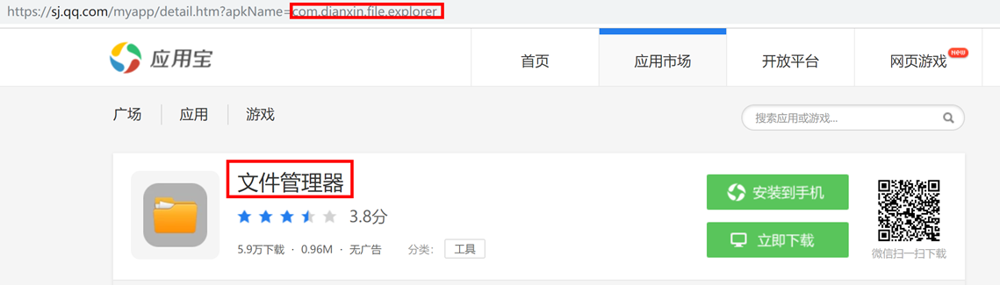

## 6. 公共系统控件（framework-res-hwext）

### 6.1 公共系统控件切图

公共系统控件需要预先制作好的切图文件有24项：


<MergeTable
  headers={['PNG', '备注', 'EMUI9.1资源名称', '尺寸（px）']}
  rows={
    ['', '单手键盘按钮', 'contact_dial_fun_menu.9.png', '无固定尺寸'],
    ['', '单手键盘按钮按下', 'contact_dial_fun_menu_pressed.9.png', '无固定尺寸'],
    ['', '同步', 'ic_sync_anim_holo.png', '96×96'],
    [{ text: '', rowspan: 24, colspan: 1 }, '拨号数字0', 'dial_num_0_blk.png', '建议值：280*200'],
    [null, '拨号数字1', 'dial_num_1_blk.png', '建议值：280*200'],
    [null, '拨号数字2', 'dial_num_2_blk.png', '建议值：280*200'],
    [null, '拨号数字3', 'dial_num_3_blk.png', '建议值：280*200'],
    [null, '拨号数字4', 'dial_num_4_blk.png', '建议值：280*200'],
    [null, '拨号数字5', 'dial_num_5_blk.png', '建议值：280*200'],
    [null, '拨号数字6', 'dial_num_6_blk.png', '建议值：280*200'],
    [null, '拨号数字7', 'dial_num_7_blk.png', '建议值：280*200'],
    [null, '拨号数字8', 'dial_num_8_blk.png', '建议值：280*200'],
    [null, '拨号数字9', 'dial_num_9_blk.png', '建议值：280*200'],
    [null, '拨号数字0按下', 'dial_num_0_blk_press.png', '建议值：280*200'],
    [null, '拨号数字1按下', 'dial_num_1_blk_press.png', '建议值：280*200'],
    [null, '拨号数字2按下', 'dial_num_2_blk_press.png', '建议值：280*200'],
    [null, '拨号数字3按下', 'dial_num_3_blkpress.png', '建议值：280*200'],
    [null, '拨号数字4按下', 'dial_num_4_blk_press.png', '建议值：280*200'],
    [null, '拨号数字5按下', 'dial_num_5_blk_press.png', '建议值：280*200'],
    [null, '拨号数字6按下', 'dial_num_6_blk_press.png', '建议值：280*200'],
    [null, '拨号数字7按下', 'dial_num_7_blk_press.png', '建议值：280*200'],
    [null, '拨号数字8按下', 'dial_num_8_blk_press.png', '建议值：280*200'],
    [null, '拨号数字9按下', 'dial_num_9_blk_press.png', '建议值：280*200'],
    [null, '拨号*', 'xing.png', '建议值：280*200'],
    [null, '拨号*按下', 'xingpress.png', '建议值：280*200'],
    [null, '拨号#', 'jing.png', '建议值：280*200'],
    [null, '拨号#按下', 'jingpress.png', '建议值：280*200'],
    ['', '索引条背景（下）', 'fastscroll_familyname_normal.9.png', '无固定尺寸'],
    ['', '索引条背景（上）', 'fastscroll_label_phonebook_emui_icon.png', '180*210'],
    ['', '索引条背景（英文）', 'fastscroll_label_phonebook_emui_null_icon.png', '180*180'],
    ['', '我的名片背景', 'profile_simple_card_background.9.png', '无固定尺寸'],
    ['', '新建联系人公司弹窗', 'company_pop_background.9.png', '无固定尺寸'],
    ['', '联系人详情背景', 'contact_detail_list_background.9.png', '无固定尺寸'],
    ['', '色值透明，解决第一次点击拨号盘出现蓝色色块的问题', 'dialpad_button_press_state.9.png', '无固定尺寸']
  }
/>


以上切图按照规范制作好后，可直接使用主题工具替换，公共系统控件资源均在【全局设置】右侧图片处替换：

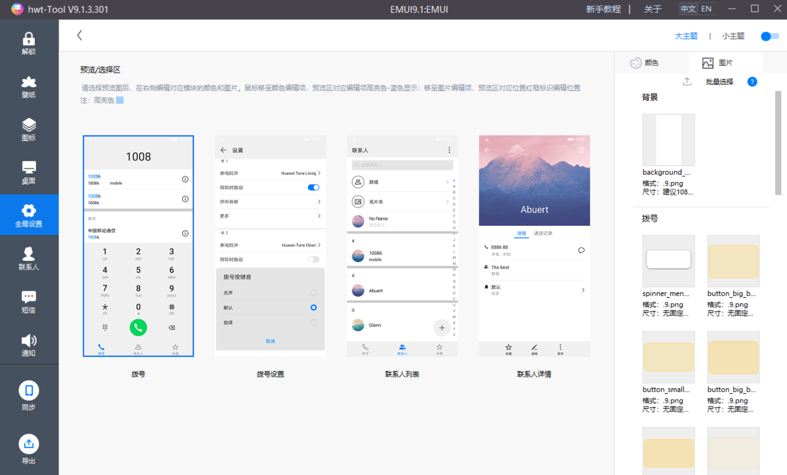

### 6.2 公共系统控件结构及颜色编辑描述

工具修改直接打包如下结构， framework-res-hwext 为公共系统控件，在所有模块中都有用到。内有2个文件，如下图所示：

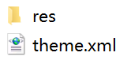


res内有一个drawable-xxhdpi文件夹，内为上述公共系统控件24张切图； theme.xml为公共系统控件的颜色代码。

公共系统控件的颜色在工具中的【全局设置】右侧颜色处编辑：

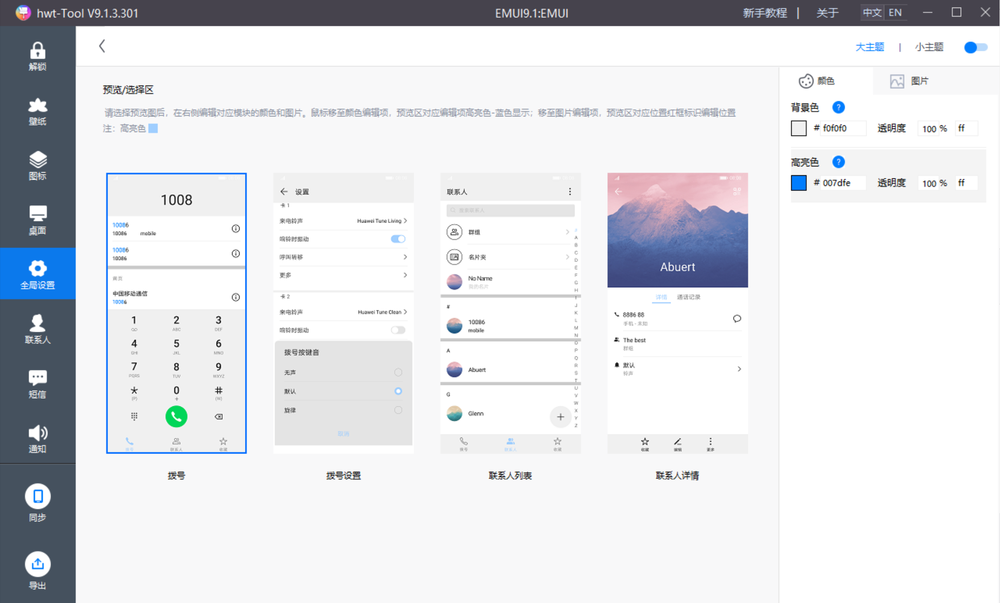

## 7. 桌面（com.huawei.android.launcher）

### 7.1 桌面模块切图

桌面模块需要预先制作好的切图文件有26项：

| PNG | 备注 | EMUI9.1资源名称 | 尺寸（px） |
| --- | --- | --- | --- |
|  | 文件夹内添加按钮 | folder\_add\_icon.png | 168×168 |
|  | 文件夹展开背景 | folder\_open\_shadow.9.png | 无固定尺寸 |
|  | 抽屉风格 | ic\_allapps.png | 192×192 |
|  | 抽屉风格按下 | ic\_allapps\_pressed.png | 192×192 |
| 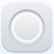 | 一键清理 | ic\_widget\_bg.png | 192×192 |
| 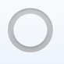 | 一键清理 | ic\_widget\_circle.png | 192×192 |
|  | 一键清理 | ic\_widget\_glowline\_danger.png | 192×192 |
|  | 一键清理 | ic\_widget\_glowline\_risk.png | 192×192 |
|  | 一键清理 | ic\_widget\_glowline\_safe.png | 192×192 |
| 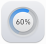 | 一键清理 | ic\_widget\_preview.png | 192×192 |
| 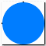 | 桌面图标角标背景 | ic\_mark.9.png | 无固定尺寸 |
| 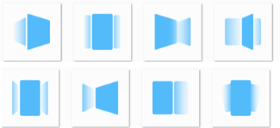 | 切屏效果 | launcher\_edit\_transition\_box\_current.png（方盒） launcher\_edit\_transition\_defult\_current.png（默认） launcher\_edit\_transition\_filpover\_current.png（旋转） launcher\_edit\_transition\_page\_current.png（翻页） launcher\_edit\_transition\_prespective\_current.png（景深） launcher\_edit\_transition\_rotate\_current.png（翻转） launcher\_edit\_transition\_squeeze\_current.png（推压） launcher\_edit\_transition\_windmill\_current.png（风车） | 96×96 |
| 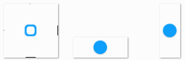 | 插件编辑器 | widget\_resize\_frame\_holo.9.png（插件编辑外框） widget\_resize\_handle\_horizontal.png（插件水平编辑点） widget\_resize\_handle\_vertical.png（插件垂直编辑点） | 无固定尺寸 |
|  | 桌面/多任务 分屏图标 | ic\_sysbar\_docked\_huawei.png | 96×96 |
|  | 桌面/多任务 锁定图标 | hw\_recents\_lock.png | 96×96 |
|  | 移除 | ic\_edit\_delete.9.png | 无固定尺寸 |
|  | 分享 | ic\_edit\_share.9.png | 无固定尺寸 |

以上切图按照规范制作好后，可直接使用主题工具替换，桌面模块资源均在【桌面】右侧图片处替换：

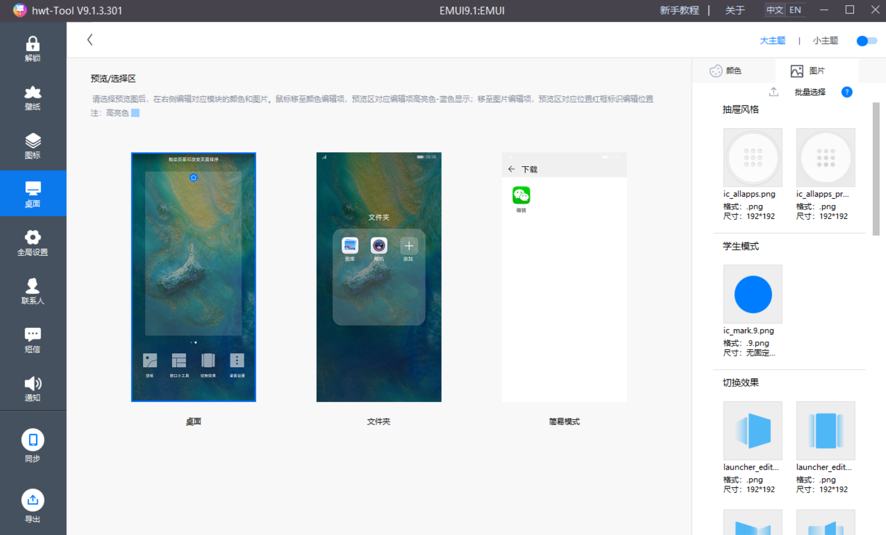

### 7.2 桌面模块结构及颜色编辑描述

com.huawei.android.launcher 为桌面模块，内有3个文件，如下图所示：


framework-res-hwext为界面内的公共模块，设计师可修改桌面模块引用的部分； res内有一个drawable-xxhdpi文件夹，内为上述桌面模块26张切图； theme.xml为桌面模块的部分颜色代码。

桌面模块的颜色在工具中的【桌面】右侧颜色处编辑：

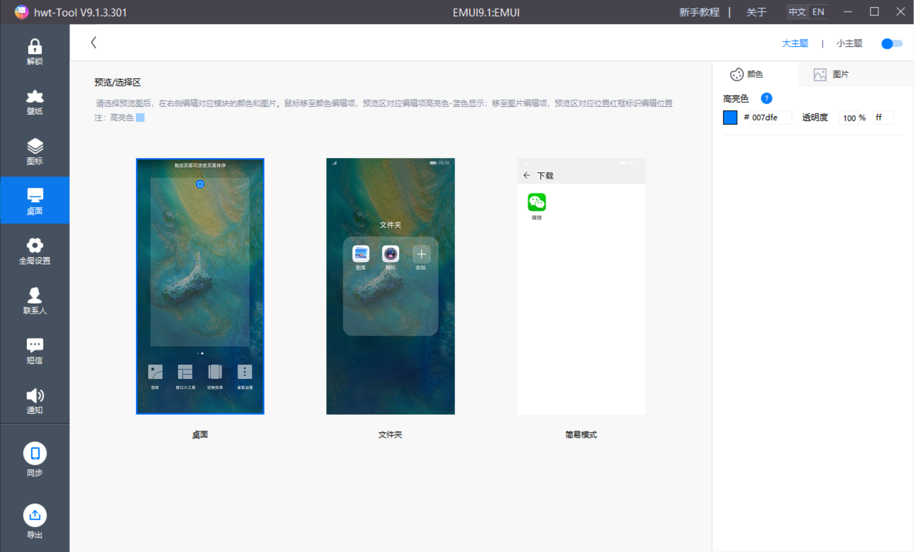

## 8. 联系人（com.android.contacts）

### 8.1 联系人模块切图

联系人模块需要预先制作好的切图文件有34项：

| PNG | 备注 | EMUI9.1资源名称 | 尺寸（px） |
| --- | --- | --- | --- |
| 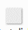 | 单手键盘按钮 | contact\_dial\_fun\_menu.9.png | 无固定尺寸 |
|  | 单手键盘按钮按下 | contact\_dial\_fun\_menu\_pressed.9.png | 无固定尺寸 |
|  | 同步 | ic\_sync\_anim\_holo.png | 96×96 |
| 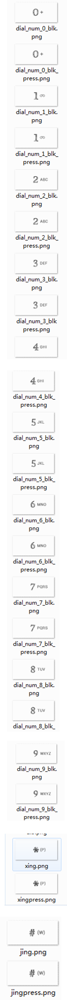 | 拨号数字0 | dial\_num\_0\_blk.png | 建议值：280\*200 |
| 拨号数字1 | dial\_num\_1\_blk.png | 建议值：280\*200 |
| 拨号数字2 | dial\_num\_2\_blk.png | 建议值：280\*200 |
| 拨号数字3 | dial\_num\_3\_blk.png | 建议值：280\*200 |
| 拨号数字4 | dial\_num\_4\_blk.png | 建议值：280\*200 |
| 拨号数字5 | dial\_num\_5\_blk.png | 建议值：280\*200 |
| 拨号数字6 | dial\_num\_6\_blk.png | 建议值：280\*200 |
| 拨号数字7 | dial\_num\_7\_blk.png | 建议值：280\*200 |
| 拨号数字8 | dial\_num\_8\_blk.png | 建议值：280\*200 |
| 拨号数字9 | dial\_num\_9\_blk.png | 建议值：280\*200 |
| 拨号数字0按下 | dial\_num\_0\_blk\_press.png | 建议值：280\*200 |
| 拨号数字1按下 | dial\_num\_1\_blk\_press.png | 建议值：280\*200 |
| 拨号数字2按下 | dial\_num\_2\_blk\_press.png | 建议值：280\*200 |
| 拨号数字3按下 | dial\_num\_3\_blkpress.png | 建议值：280\*200 |
| 拨号数字4按下 | dial\_num\_4\_blk\_press.png | 建议值：280\*200 |
| 拨号数字5按下 | dial\_num\_5\_blk\_press.png | 建议值：280\*200 |
| 拨号数字6按下 | dial\_num\_6\_blk\_press.png | 建议值：280\*200 |
| 拨号数字7按下 | dial\_num\_7\_blk\_press.png | 建议值：280\*200 |
| 拨号数字8按下 | dial\_num\_8\_blk\_press.png | 建议值：280\*200 |
| 拨号数字9按下 | dial\_num\_9\_blk\_press.png | 建议值：280\*200 |
| 拨号\* | xing.png | 建议值：280\*200 |
| 拨号\*按下 | xingpress.png | 建议值：280\*200 |
| 拨号# | jing.png | 建议值：280\*200 |
| 拨号#按下 | jingpress.png | 建议值：280\*200 |
| 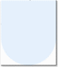 | 索引条背景（下） | fastscroll\_familyname\_normal.9.png | 无固定尺寸 |
| 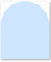 | 索引条背景（上） | fastscroll\_label\_phonebook\_emui\_icon.png | 180\*210 |
| 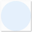 | 索引条背景（英文） | fastscroll\_label\_phonebook\_emui\_null\_icon.png | 180\*180 |
|  | 我的名片背景 | profile\_simple\_card\_background.9.png | 无固定尺寸 |
| 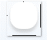 | 新建联系人公司弹窗 | company\_pop\_background.9.png | 无固定尺寸 |
|  | 联系人详情背景 | contact\_detail\_list\_background.9.png | 无固定尺寸 |
|  | 色值透明，解决第一次点击拨号盘出现蓝色色块的问题 | dialpad\_button\_press\_state.9.png | 无固定尺寸 |

以上切图按照规范制作好后，可直接使用主题工具替换，联系人模块资源均在【联系人】右侧图片处替换：

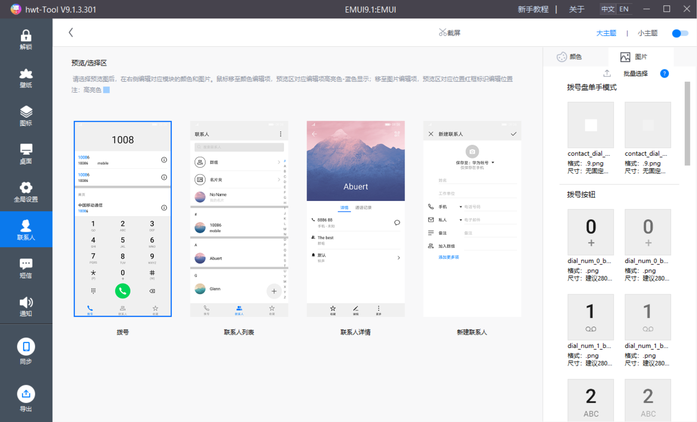

### 8.2 联系人模块结构及颜色编辑描述

com.android.contacts 为联系人模块，内有3个文件，如下图所示：


framework-res-hwext为界面内的公共模块，设计师可修改联系人模块引用的部分； res内有一个drawable-xxhdpi文件夹，内为上述联系人模块34张切图； theme.xml为联系人模块的部分颜色代码。

联系人模块的颜色在工具中的【联系人】右侧颜色处编辑：

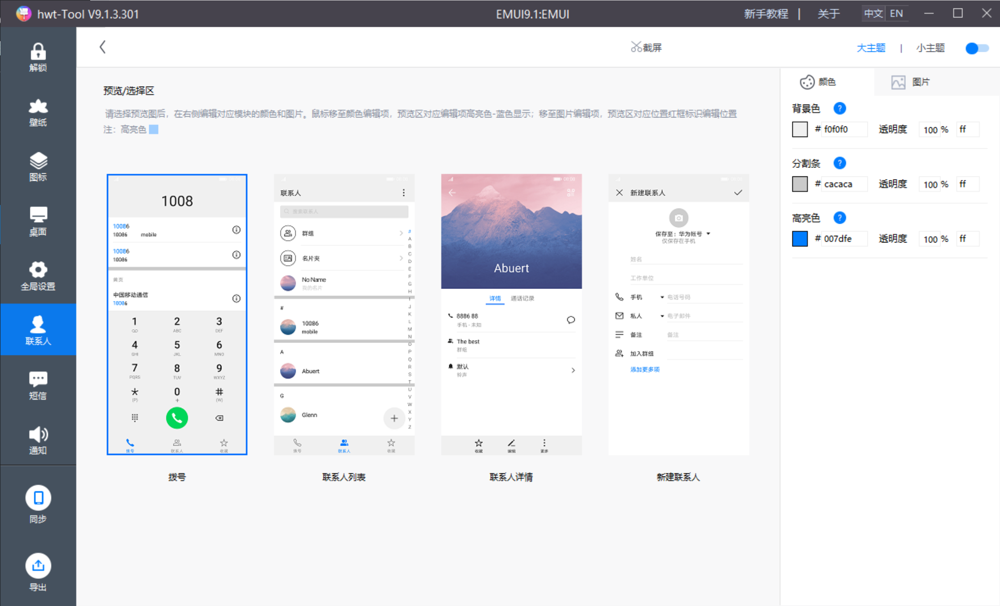

## 9. 信息（com.android.mms）

### 9.1 信息模块切图

信息模块需要预先制作好的切图文件有6项：

| PNG | 备注 | EMUI9.1资源名称 | 尺寸（px） |
| --- | --- | --- | --- |
|  | 短信/主界面华为通知图标 | ic\_message\_noti\_huawei.png | 120x120 |
|  | 短信/智能短信菜单弹框 | duoqu\_menu\_bg.9.png | 无固定尺寸 |
|  | 短信/会话界面/卡片式气泡背景 | v\_bg\_3.9.png | 无固定尺寸 |
|  | 短信/会话界面/机票信息气泡背景 | v\_bg\_4.9.png | 无固定尺寸 |
|  | 附件区录音时的声波图 | rcs\_mic\_st\_widget\_recording\_bar\_glow.png | 688x688 |
|  | 附件区录音时的声波图（小） | mic\_st\_widget\_speeching\_glow.png | 688x688 |

以上切图按照规范制作好后，可直接使用主题工具替换，信息模块资源均在【短信】右侧图片处替换：

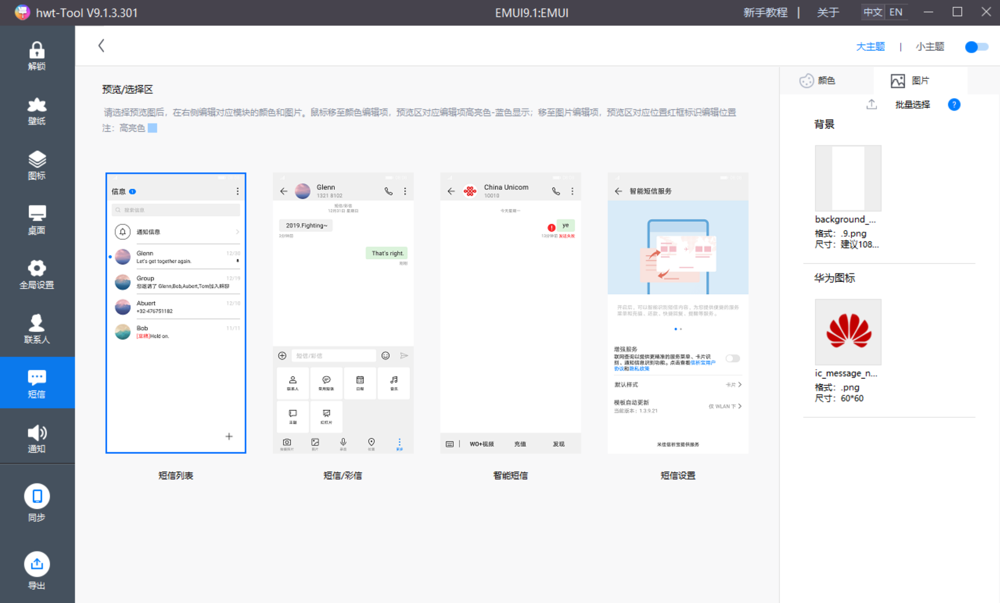

### 9.2 信息模块结构及颜色编辑描述

com.android.mms 为信息模块，内有3个文件，如下图所示：


framework-res-hwext为界面内的公共模块，设计师可修改信息模块引用的部分； res内有一个drawable-xxhdpi文件夹，内为上述信息模块6张切图； theme.xml为信息模块的部分颜色代码。

信息模块的颜色在工具中的【短信】右侧颜色处编辑：

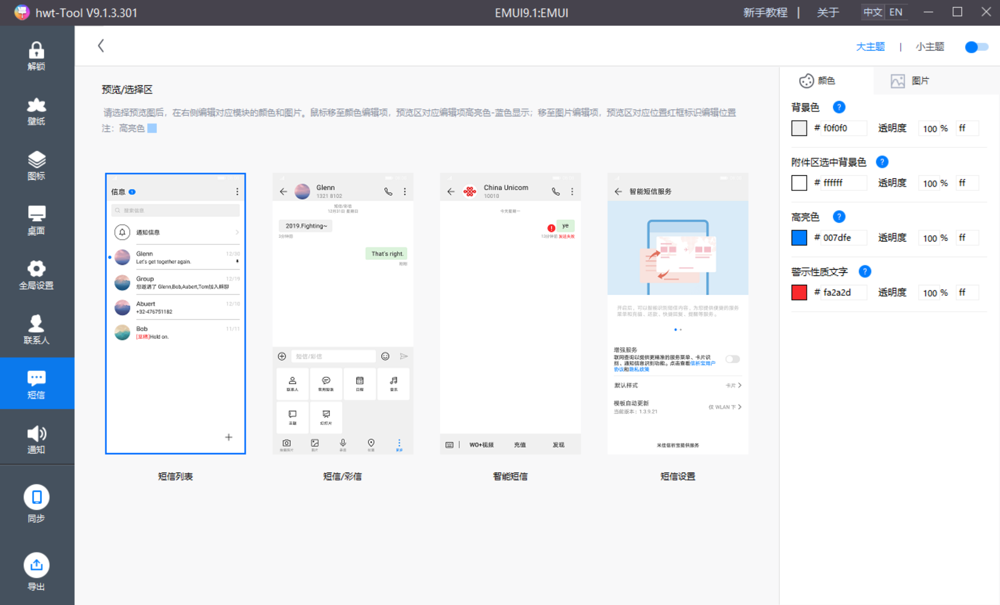

## 10. 下拉开关（com.android.systemui）

### 10.1 下拉开关模块切图

下拉开关模块需要预先制作好的切图文件有5项：

| PNG | 备注 | EMUI9.1资源名称 | 尺寸（px） |
| --- | --- | --- | --- |
|  | 多任务清理按钮 | hw\_recents\_close\_all.png | 160×160 |
|  | 多任务清理按钮按下 | hw\_recents\_close\_all\_press.png | 160×160 |
|  | 音量控制背景 | volume\_popup.9.png | 无固定尺寸 |
|  | 一键锁屏（预览） | ic\_onekey\_widget\_preview.png | 192×192 |
| 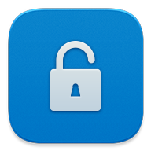 | 一键锁屏（桌面） | ic\_onekey\_widget\_shortcut.png | 192×192 |

以上切图按照规范制作好后，可直接使用主题工具替换，下拉开关模块资源均在【通知】右侧图片处替换：

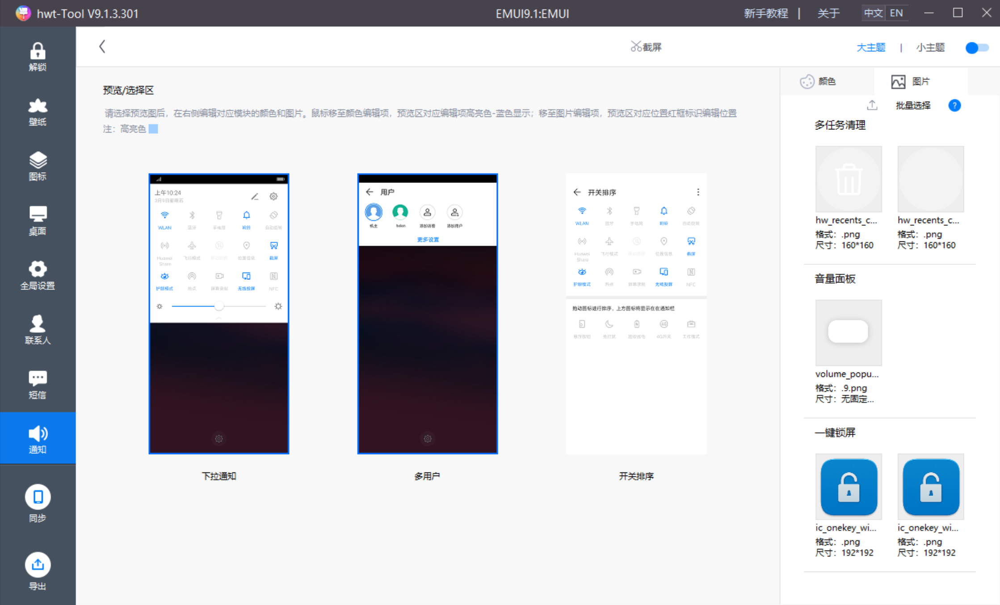

### 10.2 下拉开关模块结构及颜色编辑描述

com.android.systemui 为下拉开关模块，内有3个文件，如下图所示：


framework-res-hwext为界面内的公共模块，设计师可修改下拉开关模块引用的部分； res内有一个drawable-xxhdpi文件夹，内为上述下拉开关模块5张切图； theme.xml为下拉开关模块的部分颜色代码。

下拉开关模块的颜色在工具中的【通知】右侧颜色处编辑：

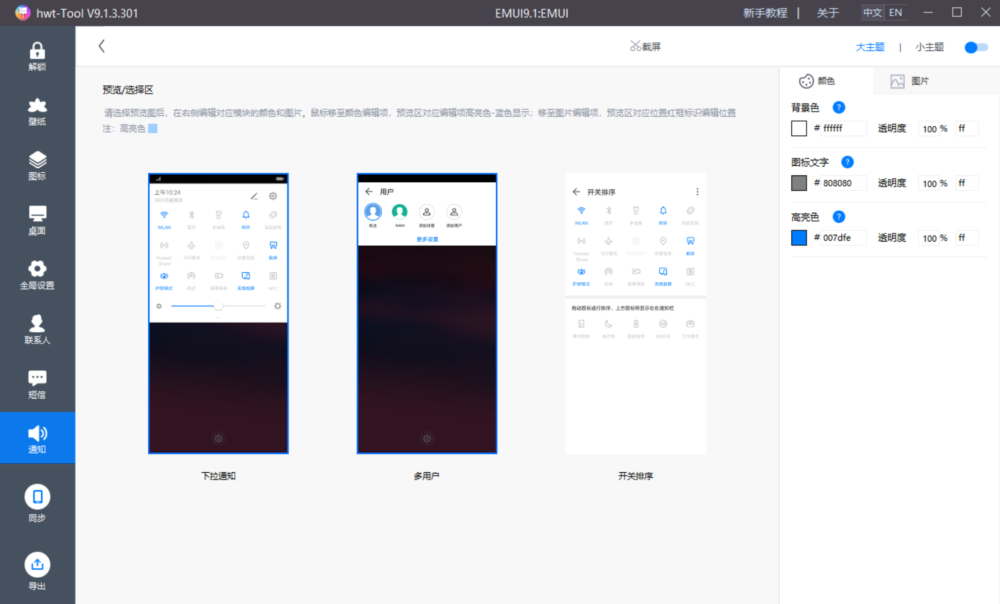

## 11. 拨号设置（com.android.phone）

### 11.1 拨号设置模块切图

拨号设置模块需要预先制作好的切图文件有1项：

| PNG | 备注 | EMUI9.1资源名称 | 尺寸（px） |
| --- | --- | --- | --- |
| 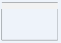 | 分隔条 | preference\_category\_backgound.9.png | 无固定尺寸 |

### 11.2 拨号模块结构及颜色编辑描述

com.android.phone 为拨号设置模块，内有3个文件，如下图所示：


framework-res-hwext为公共系统控件，设计师可修改拨号设置模块引用的部分； res内有一个drawable-xxhdpi文件夹，内为上述拨号设置模块1张切图，在主题工具中归并到了联系人模块； theme.xml为拨号设置模块的部分颜色代码，在主题工具中进行了归并。

## 12. 拨号设置-通话自动录音（com.android.phone.recorder）

com.android.phone.recorder 为拨号设置-通话自动录音模块，内有1个文件：


framework-res-hwext为公共系统控件，设计师可修改拨号设置-通话自动录音模块引用的部分。

## 13. 拨号设置-来电拒接短信（com.android.server.telecom）

com.android.server.telecom 为拨号设置-来电拒接短信模块，内有1个文件：


framework-res-hwext为公共系统控件，设计师可修改拨号设置-来电拒接短信模块引用的部分。

## 14. 描述文件（description.xml）


description.xml 描述文件是储存主题基本信息的文件。

* 主题英文名，中文名，开发者名称，设计师名称四项待主题上线后均不可修改。
* 设计师名称与设计师的开发者联盟账号绑定。
* 主题分辨率，主题英文字体，中文字体均采用默认不可以修改。
* 主题版本号第一版为9.0.100，后续有更新则更改为9.0.10X（X为阿拉伯数字）。

### 14.1 小/大主题描述文件说明：

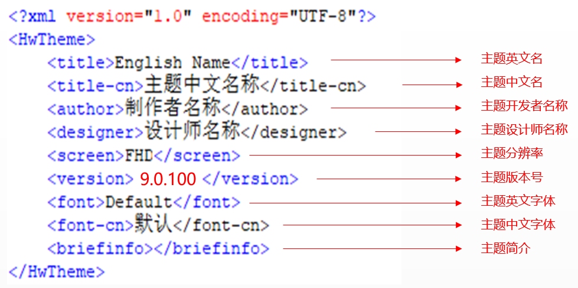

### 14.2 锁屏主题描述文件说明

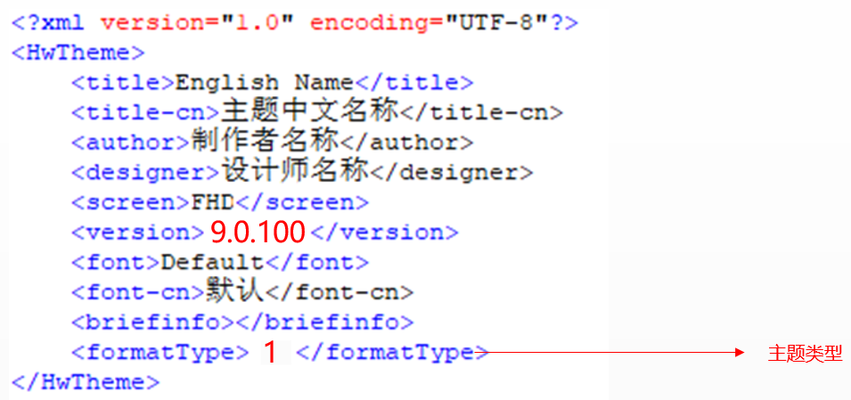


设计师单独上传锁屏包时，必须在锁屏包内description.xml文件中添加主题类型字段，锁屏主题的类型字段为：&lt;formatType&gt;1&lt;/formatType&gt;。

### 14.3 图标主题描述文件说明

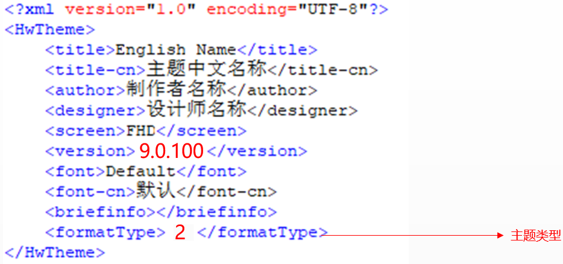


设计师单独上传图标包时，必须在图标包内description.xml文件中添加主题类型字段，图标主题的类型字段为：&lt;formatType&gt;2&lt;/formatType&gt;。

## 15. 预览图（preview）


预览图是主题的一个概览，用户通过预览图判断一个主题的大体风格。所有静态预览图均可使用主题工具直接截图制作。

除cover及图标预览图外预览图的尺寸均为 1080×2160px，cover图的尺寸为1080×1920px，格式为.jpg，图标预览图使用PSD文件替换图标即可。

因数据库图片文件名称长度有限制，主题包内preview文件夹下的预览图总张数需≤15张。

预览图可使用手机截图的方式制作，截图后需按照预览图样板进行部分修改。没有手机的设计师可使用提供的PSD模板制作预览图，详情见PSD文件说明。

所有上传至海外的主题包不能包含短信预览图，即以preview\_mms\_X.jpg命名的图片，但仍然需要保证对短信模块的设计、换肤等。

### 15.1 小主题预览图样板

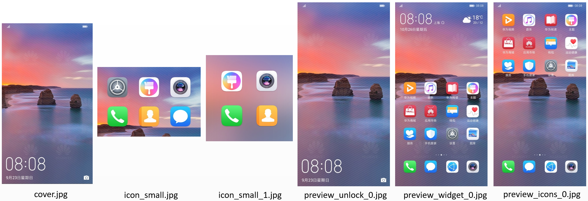


1. cover预览图，顶部和底部80px的范围内，壁纸不允许出现任何内容，包括状态栏信息，按钮等，cover预览图内容应与锁屏内容保持一致。
2. 除cover，icon\_small 、icon\_small\_1以外的其他预览图状态栏只允许出现信号、电量和时间。
3. 预览图所展示的内容应该与手机的实际效果相同。
4. 设计师寄语或者设计说明选做，预览图命名为 preview\_widget\_X.jpg（“X”可为1、2 … …）。

### 15.2 大主题预览图样板

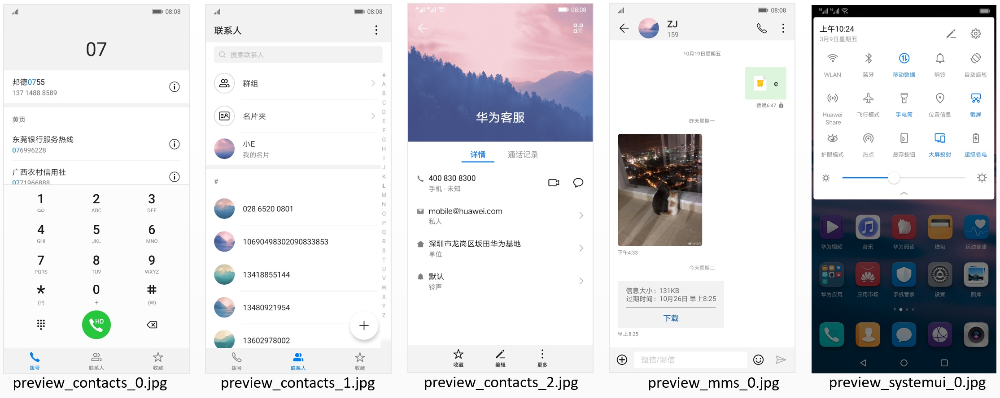


1. 除cover，unlock，icon\_small以外的其他预览图状态栏只允许出现电量和时间。
2. 预览图所展示的内容应该与手机的实际效果相同。
3. 大主题必须包含所示预览图。

### 15.3 视频预览文件

主题支持视频动态预览，该文件无需打包在主题内，上传主题时，直接另外在联盟上上传。

* 视频尺寸为：1080×2340px（高端机型适用）、1080×1920px（低端机型适用）；
* 视频格式为MP4，编解码制式要求为H.264，视频大小建议在10MB以内，时长建议在15秒以内；
* 为保证预览效果，请提供能循环播放的视频，确保首尾衔接部分流畅，不会出现画面跳动或者闪烁；

## 16. 文件说明（PSD）

* cover.psd 封面
* icon\_small.psd 小图标预览图
* icon\_small\_1.psd 小图标预览图
* preview\_contacts\_0.psd 拨号盘预览图
* preview\_contacts\_1.psd 联系人预览图
* preview\_contacts\_2.psd 联系人详情预览图
* preview\_icons\_0.psd 图标预览图
* preview\_systemui\_0.psd 下拉开关预览图
* preview\_systemui\_1.psd 下拉开关预览图
* preview\_systemui\_2.psd 开关设置预览图
* preview\_unlock\_0.psd 锁屏预览图
* preview\_unlock\_1.psd 锁屏预览图
* preview\_widget\_0.psd 桌面挂件预览图

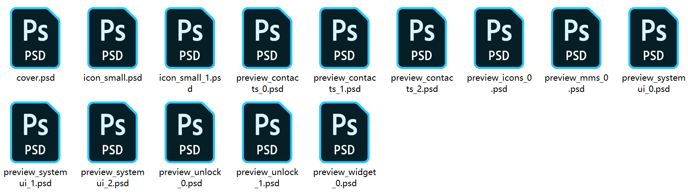

## 17. 打包拆包说明

当需要单独修改某一具体代码或图片资源时，需要手动打包拆包。

9.1大主题中，除了preview，unlock，wallpaper，description.xml 四个文件，其余模块均需要单独打包。 修改后缀名可能提示将导致文件不可用。主题包的文件名不能出现任何的中文字符，否则将导致手机解析异常，一般直接使用主题英文名，请注意。

以com.huawei.android.launcher 桌面模块为例：


以小主题打包为例：

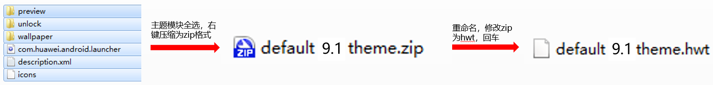

## 18. 主题包制作注意事项

* 除了描述文件以外，主题包内各模块不能出现任何的中文字符。
* 所有的xml文件均要将另存编码修改为UTF-8，如下图：

  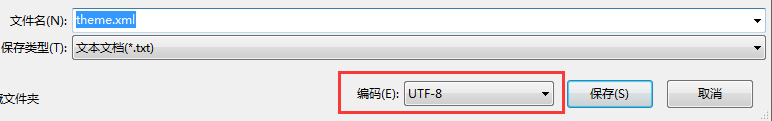
* 点9文件均要进行编译才可以正确读取。
* 为方便新设计师适配主题，9.1在线大、小主题模板中的点9文件均已编译。
* 使用截图方式制作的预览图，百变锁屏预览图的周几全部要通过PS修改为星期几。
* 请结合9.1在线主题模板、 EMUI9.1小主题预览图模版psd 、 9.1 主题模板指导文档学习制作。
* 制作好的主题包，可通过电脑导入对应版本的华为手机或者荣耀手机（9.1的主题导入EMUI9.1手机）查看并测试，导入路径为手机内存/Huawei/Themes，之后便可在主题app-我的-我的主题里找到该主题。
* 如有疑问，可在[官方主题论坛](https://developer.huawei.com/consumer/cn/forum/blockdisplay?fid=0101211211623820128)发帖讨论。

## 19. 测试规范

[主题测试规范详情请点击查看](https://developer.huawei.com/consumer/cn/doc/content/theme-test-0000001055661259)

## 20. 内容上传指南

[内容上传指南详情请点击查看](/docs/distribute/content-dist/theme-center/content-release-0000001054679366/uploadguide-0000001054359939/themes-upload-0000001055029726)

## 21. 附件下载

[附件-大主题模板](https://communityfile-drcn.op.hicloud.com/FileServer/getFile/cmtyManage/011/111/111/0000000000011111111.20200414174643.64346841766959687758285709223939%3A50510911003427%3A2800%3A2DE0A33A7B77DCB07CA1998A8398981E5E2B21CDC695381B99D7634BA96A7330.zip?needInitFileName=true)

[附件-预览图PSD源文件](https://communityfile-drcn.op.hicloud.com/FileServer/getFile/cmtyManage/011/111/111/0000000000011111111.20200414174902.52307435231739414748407226984718%3A50510911003427%3A2800%3A73DC6C4922CE62D067E1BBC50E1B636B2136205E57A50C49F866F4B01315B5AE.zip?needInitFileName=true)

[附件-主题包全局资源列表](https://communityfile-drcn.op.hicloud.com/FileServer/getFile/cmtyManage/011/111/111/0000000000011111111.20200414175140.58850702366782023934245910368509%3A50510911003427%3A2800%3A99A069838A7120CD44FEC757E041DD6014625F28870AEFA6B515A4C6800F6F13.xlsx?needInitFileName=true)