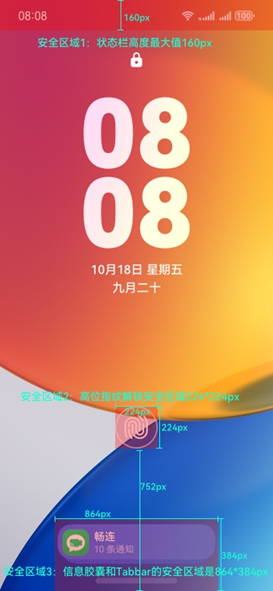
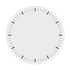
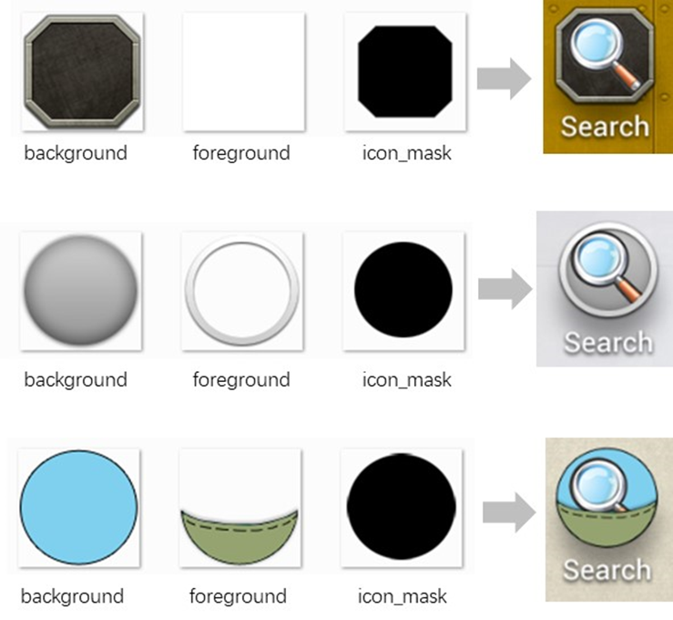
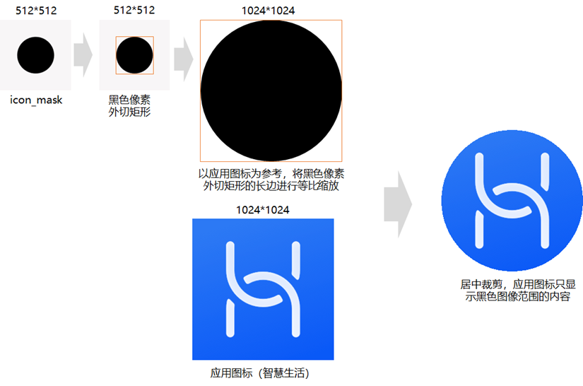
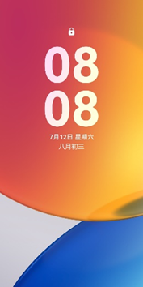
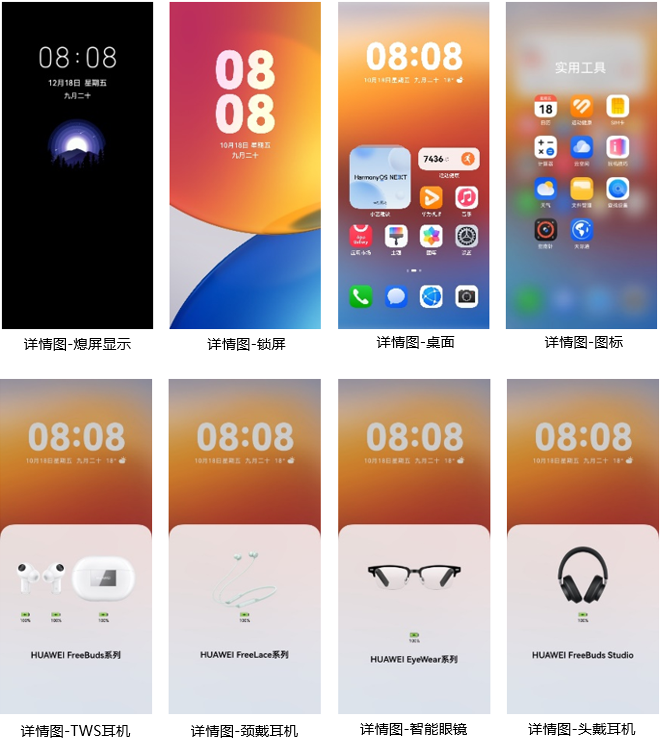
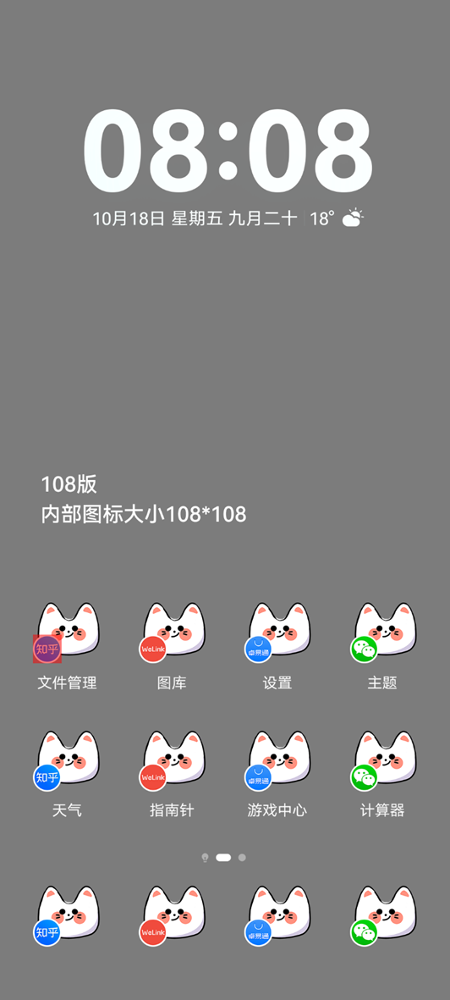

import MergeTable from '@site/src/components/MergeTable';

# HarmonyOS 5.0主题设计指导及规范

主题就是一套用于改变手机界面视觉效果的元素集合，包含熄屏显示、锁屏、桌面、图标、应用（含控制中心、通知中心、播控中心、音量条、文件夹、耳机弹窗）。

## 1. 快速指引-必做设计项总计

<strong>表1</strong>


<MergeTable
  headers={['设计项', '', '是否必做']}
  rows={
    ['熄屏显示', '/', '必做'],
    ['锁屏', '/', '必做'],
    ['桌面', '/', '必做'],
    ['图标', '/', '必做（66个）'],
    [{ text: '应用', rowspan: 6, colspan: 1 }, '控制中心', '必做'],
    [null, '通知中心', '必做'],
    [null, '播控中心', '必做'],
    [null, '音量条', '必做'],
    [null, '文件夹', '必做'],
    [null, '耳机弹窗', '必做'],
    [{ text: '预览文件', rowspan: 3, colspan: 1 }, '封面图', '必做'],
    [null, '详情图', '必做'],
    [null, '预览视频', '必做']
  }
/>


制作完主题后，各位创作者们可以根据[主题测试审核规范](https://developer.huawei.com/consumer/cn/doc/content/harmonyos5-theme-test-0000002318301165)进行自检测试。自检无误后可参考[内容上传指南](https://developer.huawei.com/consumer/cn/doc/content/uploadguide-0000001054359939)将主题包上传至主题联盟。

## 2. 熄屏显示（aod）

具体请参考[熄屏显示制作指导及规范](https://developer.huawei.com/consumer/cn/doc/content/aod-0000001054371157)。

## 3. 锁屏（lock）

### 3.1 动态锁屏

动态锁屏能够实现风格多变的锁屏界面，可方便地通过更换皮肤改变界面风格、动画甚至交互方式。

创作者可基于主题引擎能力编写出各式各样动态效果的锁屏，具体脚本写法参见[HarmonyOS 5.0及以上版本主题引擎规范](https://developer.huawei.com/consumer/cn/doc/content/themes-engine-next-0000002242508358)。


动态锁屏若改变了系统默认解锁方式（任意滑动解锁）：

1、滑动距离建议设置为300。

2、通过主题联盟上传资源时，需要在资源简介的“使用说明”中增加锁屏解锁方式说明，在预览视频中明示用户解锁方式。

<strong>兜底图</strong>

必做项，尺寸为：3120×3120 px，格式为JPG

不同机型分辨率存在差异，兜底图按等比缩放，居中裁剪。

<strong>样例图：</strong>


### 3.2 锁屏安全区域

锁屏安全区域是指在锁屏界面上存在部分功能响应优先级高操作区，必须优先保障，确保用户基本操作体验不受影响的区域。

锁屏安全区包括状态栏、屏幕内指纹和通知胶囊。

安全区域内不可有点击、滑动等操作内容，热区边缘不可与安全区域重叠。

安全区域内可出现动画或提示信息等无操作内容，但不能影响该区域内功能图标的识别性。

以安全区域示意图尺寸1440×3120px为例，示意如下：



* 状态栏

状态栏高度为160px，设计师需要注意避免内容显示区域与状态栏高度重叠。

* 屏幕内指纹

在某些产品中有屏幕内指纹功能，指纹位置不同，时间显示和提示语位置不一样，需注意避免操作区域重叠

距离屏幕底部752px红色区域，大小为224×224px。

* 通知胶囊

在某些产品中，屏幕内指纹与通知胶囊位置不重叠，当收到信息时，会呈现通知胶囊。

屏幕底部的红色区域，大小为864×432px。

## 4. 桌面（home）

桌面类型包括静态桌面、可交互桌面、视频桌面，创作者可选择其中之一进行制作。

### 4.1 静态桌面

桌面壁纸尺寸为：3120×3120px，格式为JPG。

不同机型分辨率存在差异，桌面壁纸按等比缩放，居中裁剪。

<strong>样例图：</strong>


### 4.2 动态桌面

制作动态桌面时，桌面兜底图为必做，尺寸为：3120×3120px，格式为JPG

不同机型分辨率存在差异，兜底图按等比缩放，居中裁剪。

* 可交互桌面

可交互桌面是指创作者可基于主题引擎能力编写出各式各样动态效果的桌面。支持引擎能力范围及具体脚本写法参见HarmonyOS 5.0及以上版本主题引擎规范。

* 视频桌面

视频桌面是指将视频作为背景的桌面，支持选择是否播放视频声音。

视频文件要求如下：

（1）视频尺寸为：1080×2340px。

（2）视频格式为MP4，编解码制式要求为H.264，帧率25~60帧/秒，视频大小建议在20MB以内，时长在20秒以内。

（3）不同机型分辨率有轻微差别，视频按等比缩放，居中裁剪，以适配同设备类型的不同机型，确保不会拉伸变形。

## 5. 图标（icons）

一个好的图标可以准确传达应用相关信息，也可以帮助用户快速定位你的应用。

### 5.1 系统图标

* 静态图标

静态图标资源需要提供分层素材：

（1）前景层(foreground)：支持PNG格式

（2）背景层(background)：支持WEBP/PNG格式

所有图标资源尺寸均为256×256 px

 

<strong>表2</strong>


<MergeTable
  headers={['应用名称', '应用包名', '场景', '文件名', '示例']}
  rows={
    ['日历', 'com.huawei.hmos.clock', '背景', 'ic_calendar_background.png', ''],
    [{ text: '时钟', rowspan: 5, colspan: 1 }, { text: 'com.huawei.hmos.calendar', rowspan: 5, colspan: 1 }, '背景', 'ic_deskclock_background.png', ''],
    [null, null, '表盘刻度', 'ic_deskclock_dial.png', ''],
    [null, null, '时针', 'ic_deskclock_hour.png', ''],
    [null, null, '分针', 'ic_deskclock_minute.png', ''],
    [null, null, '秒针', 'ic_deskclock_second.png', '']
  }
/>


说明：

（1）共36个静态图标，为必做项。

（2）图标可通过背景层透明度设计来实现不同形状的效果，但不允许背景图为全透明图片。

（3）日历的静态图标不能出现带有误导性的数字。

（4）不同应用的图标不能使用同一素材。

（5）系统图标必须经过重新绘制。其中，红色字体的图标需保留官方图标中心元素，设计师不可随意更改其形状。

（6）图标可视区域，即图标的主视觉区域不能小于108×108 px（图例详见10.制作注意事项）

* 实时图标

实时图标在icons下面的dynamic\_icons文件夹下，支持以下2个应用：

<strong>表3</strong>

| 应用名称 | 应用包名 | 场景 | 文件名 | 示例 |
| --- | --- | --- | --- | --- |
| 日历 | com.huawei.hmos.clock | 背景 | ic\_calendar\_background.png |  |
| 时钟 | com.huawei.hmos.calendar | 背景 | ic\_deskclock\_background.png |  |
| 表盘刻度 | ic\_deskclock\_dial.png |  |
| 时针 | ic\_deskclock\_hour.png |  |
| 分针 | ic\_deskclock\_minute.png |  |
| 秒针 | ic\_deskclock\_second.png |  |

说明：

（1）所有图标资源尺寸均为256×256 px

（2）以上实时图标均为选做。

（3）实时日历只用提供背景图，具体时间详情由系统自动写入。

（4）若没有适配实时图标，系统将删除其所属文件夹，若2个实时图标都没有适配，系统将直接删除dynamic\_icons目录。

（5）实时时钟旋转中心为切图的中心，圆心点坐标（128,128）,时针、分针需朝12点方向，秒针需朝6点方向，设计师可以参考模板图标制作。

### 5.2 三方图标

* 样式

为了让所有的图标风格趋近于统一，可以通过资源模板方式对第三方图标进行适配。一套模板由背景（background.png）、前景（foreground.png）和遮罩（icon\_mask.png）组成，缺一不可，资源尺寸均为512×512 px



background.png——背景层。系统会调取该背景资源放到第三方应用图标的下方。制作图标背景资源时，要考虑到其它图标大小，视觉上要保持一致。

foreground.png——前景层。统一罩在第三方应用图标的最上层，可以灵活应用，做出多种效果。比如下图中图标上的做旧划痕或者阴影过渡等效果。如果不需要用这种叠加效果，则在主题包中将这张图做成完全空白透明的。

icon\_mask.png——遮罩层。该图片的图像区域必须为纯黑色像素，第三方应用图标只显示黑色图像范围的内容（以第三方应用图标为参考，对icon\_mask黑色像素外切矩形的长边进行等比缩放，然后做居中裁剪，具体参考下图）其中，icon\_mask的黑色像素外切矩形不能小于216×216px。



* 自定义

图标资源需要提供分层素材：

（1）foreground：支持png格式

（2）background：支持webp/png格式

要求必做的三方应用列表如下：

<strong>表4</strong>

| 应用名称 | 应用包名 |
| --- | --- |
| 微信 | com.tencent.wechat |
| 抖音 | com.ss.hm.ugc.aweme |
| 支付宝 | com.alipay.mobile.client |
| 淘宝 | com.taobao.taobao4hmos |
| 拼多多 | com.xunmeng.pinduoduo.hos |
| 百度 | com.baidu.baiduapp |
| QQ | com.tencent.mqq |
| 高德地图 | com.amap.hmapp |
| 快手 | com.kuaishou.hmapp |
| 京东 | com.jd.hm.mall |
| 美团 | com.sankuai.hmeituan |
| QQ浏览器 | com.tencent.mtthm |
| 今日头条 | com.ss.hm.article.news |
| 小红书 | com.xingin.xhs\_hos |
| 腾讯视频 | com.tencent.videohm |
| 百度地图 | com.baidu.hmmap |
| 酷狗音乐 | com.kugou.hmmusic |
| 微博 | com.sina.weibo.stage |
| 爱奇艺 | com.qiyi.video.hmy |
| 钉钉 | com.dingtalk.hmos |
| 中国农业银行 | com.bankabc.openharmonyapp.release |
| 哔哩哔哩 | yylx.danmaku.bili |
| 番茄免费小说 | com.dragon.read.next |
| 优酷视频 | com.youku.next |
| WPS移动版 | cn.wps.mobileoffice.hap |
| 中国建设银行 | com.ccb.mobilebank.hm |
| 西瓜视频 | com.ss.hm.article.video |
| QQ音乐 | com.tencent.hm.qqmusic |
| 中国工商银行 | com.icbc.harmonyclient |
| 王者荣耀 | com.tencent.tmgp.sgame.hw |

<strong>设计要求：</strong>

（1）所有图标资源尺寸均为256×256 px

（2）共30个三方应用图标，为必做项。

（3）图标可通过背景层透明度设计来实现不同形状的效果，但不允许背景图为全透明图片。

（4）图标可视区域，即图标的主视觉区域不能小于108×108px（图例详见10.制作注意事项）

（5）图标命名需要与图标包名一一对应,第三方图标适配上限为5000个。

图标作为锁屏外第二重要模块，是衡量主题品质的关键因素之一，我们鼓励设计师在主题上适配更多的第三方图标。

## 6. 应用换肤（skins）

支持对应用进行换肤，换肤范围包括控制中心、播控中心、通知中心和音量条。

### 6.1 控制中心

控制中心需要预先制作好的切图文件有4个：

<strong>表5</strong>

| 场景 | 格式 | 尺寸(px) | 示例 |
| --- | --- | --- | --- |
| 删除图标 | svg | 26 \* 26 |  |
| 增加图标 | svg | 26 \* 26 |  |
| 向下箭头图标 | png | 24 \* 24 |  |
| 向上箭头图标 | png | 24 \* 24 |  |


“开关开启颜色”，“开关关闭颜色”不允许设置为纯白色。

## 7. 深色模式

深色模式的好处包括减少眼睛疲劳、节省电量和提供独特的视觉体验。

支持深色模式的范围包括：

* 控制中心
* 通知中心
* 播控中心
* 音量条
* 文件夹&dock
* 耳机弹窗
* 静态桌面
* 动态锁屏
* 可交互桌面

其中，动态锁屏和可交互桌面可通过引用全局变量#darkMode，实现深浅两种模式。

其中#darkMode=1为浅色模式 ，2为深色模式。示例：

```
<XX xx="" … visibility="eq(#darkMode,1)"/>
<XX xx="" … visibility="eq(#darkMode,2)"/>
```

## 8. 预览文件（preview）

预览文件包括封面图、详情图和预览视频。预览文件是主题的一个概览，用户通过预览文件可以判断一个主题的大体风格。

封面图和详情图（除锁屏）均可使用主题工具生成。锁屏效果图可使用截图的方式制作，截图后需参照封面图和详情图样板通过三方工具进行部分修改。

### 8.1 封面图

封面图，用于主题市场主题专区中的预览展示。

样例图：



<strong>设计要求：</strong>

封面图为必做项。

封面图尺寸为960×1920 px，格式为JPG。

顶部和底部80px的范围内，不允许出现任何内容，包括状态栏信息，按钮等。

封面图所展示的内容应该与锁屏内容保持一致。

### 8.2 详情图

详情图，用于主题市场的主题详情页展示。

<strong>样例图：</strong>



<strong>设计要求：</strong>

详情图为必做项。

详情图尺寸为1440×3120 px，格式为JPG。

详情图所展示的内容应该与手机的实际效果相同。

详情图中AOD、锁屏、桌面和图标为必做，最多支持20张。

上传主题联盟时，详情图需按AOD、锁屏、宣传图（可选）、桌面、图标、耳机弹窗（4张）、控制中心（可选）的顺序依次上传，主题商店将按上传的顺序进行展示。

详情图命名规范如下：

<strong>表6</strong>


<MergeTable
  headers={['图片类型', '命名规范（以工具生成为准）', '备注']}
  rows={
    ['熄屏显示', '详情图-熄屏显示', { text: '不同图片类型的图片存在多张时，通过文件名后带数字进行区分，表示该类型图片有1到多张，譬如： 详情图-锁屏1 详情图-锁屏2', rowspan: 10, colspan: 1 }],
    ['锁屏', '详情图-锁屏', null],
    ['宣传图', '详情图-宣传图', null],
    ['桌面', '详情图-桌面', null],
    ['图标', '详情图-图标', null],
    ['耳机弹窗', '详情图-TWS耳机', null],
    ['耳机弹窗', '详情图-颈戴耳机', null],
    ['耳机弹窗', '详情图-智能眼镜', null],
    ['耳机弹窗', '详情图-头戴耳机', null],
    ['控制中心', '详情图-控制中心', null]
  }
/>


### 8.3 预览视频

预览视频，用于主题市场的主题详情页展示。

预览视频设计要求如下：

* 预览视频为必做项。
* 视频尺寸为：1440×3120 px。
* 视频格式为MP4，编解码制式要求为H.264/H.265（优先），视频大小建议在15MB以内，时长建议在15秒以内。
* 为保证预览效果，请提供能循环播放的视频，确保首尾衔接部分流畅，不会出现画面跳动或者闪烁。
* 当主题改变系统默认解锁方式，需要在预览视频中明示用户解锁方式。

## 9. 主题包制作注意事项

1. 除了描述文件以外，主题包内各模块不能出现任何的非英文字符；
2. SVG图片必须包含头信息&lt;?xml version="1.0" encoding="UTF-8"?&gt;
3. 根据全局参数darkmode，创作者可在动态锁屏、可交互桌面实现深色模式换肤效果。
4. 制作好的主题包，可通过主题制作工具将主题包同步到对应ROM版本的设备上进行应用并测试。
5. 制作好的主题，导出的资源包解压后文件总大小必须≤170MB，所有资源文件（含资源包、预览文件）总大小必须≤200MB。
6. 为了减少资源包大小，建议视频文件优先采用H.265编码，图片优先采用webp格式。
7. 为确保主题的安全性和稳定性，联盟仅支持上传通过华为主题官方工具制作且未进行二次修改的资源包。
8. 动态锁屏若改变了系统默认解锁方式（任意滑动解锁）时，需要在资源简介的“使用说明”中增加锁屏解锁方式说明，以及在详情图中提供解锁方式图例。
9. 图标可视区域，即图标的主视觉区域不能小于108×108px

