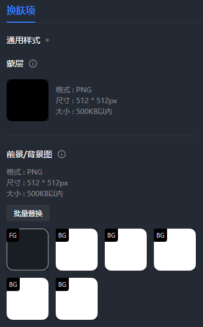
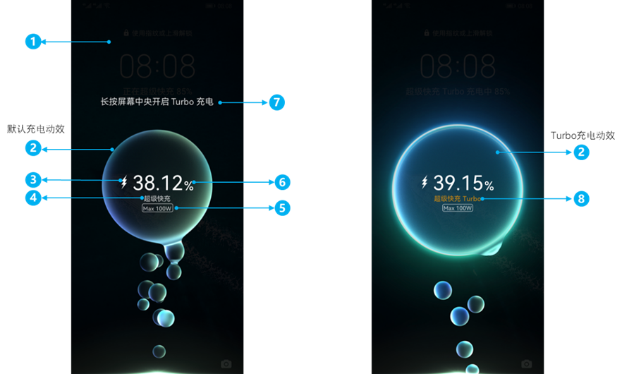

import MergeTable from '@site/src/components/MergeTable';

# HarmonyOS 5.0升级HarmonyOS 6.0指导

## 1. 快速指引-必做设计项总计

<strong>表1</strong>


<MergeTable
  headers={['设计项', '', '是否必做']}
  rows={
    ['熄屏显示', '/', '必做'],
    ['锁屏', '/', '必做'],
    ['桌面', '/', '必做'],
    ['图标', '/', '必做（93个）'],
    [{ text: '应用', rowspan: 7, colspan: 1 }, '控制中心', '必做'],
    [null, '通知中心', '必做'],
    [null, '播控中心', '必做'],
    [null, '音量条', '必做'],
    [null, '文件夹', '必做'],
    [null, '耳机弹窗', '必做'],
    [null, '充电动效换肤', '必做'],
    ['百变卡片', '/', '选做'],
    [{ text: '预览文件', rowspan: 4, colspan: 1 }, '封面图', '必做'],
    [null, '百变卡片封面图', '仅当含百变卡片时，为必做。'],
    [null, '详情图', '必做'],
    [null, '预览视频', '必做']
  }
/>


<strong>新增点：</strong>

1. 充电动效换肤，必做项。

2. 天气实时图标，选做项。

3. 百变卡片，选做项。

<strong>修改点：</strong>

1. 图标按样式适配优化，背景图由1张增加到5张。

2. 必做图标由66个增加到93个。

## 2. 图标（icons）

1. <strong>新增天气实时图标，为选做项</strong>
   * 支持17种天气类型，需要分别提供前景图和背景图，命名规则为天气类型（英文）后加后缀\_bg或\_fg，如多云的前景图命名为cloudy\_fg，背景图命名为cloudy\_bg。
   * 前景图：支持PNG格式，尺寸256\*256 px，大小不超过500KB
   * 背景图：支持WEBP/PNG格式，尺寸256\*256 px，大小不超过500KB


<MergeTable
  headers={['应用名称', '应用包名', '天气类型（中文）', '天气类型（英文）', '示例']}
  rows={
    [{ text: '天气', rowspan: 17, colspan: 1 }, { text: 'com.huawei.hmsapp.totemweather', rowspan: 17, colspan: 1 }, '多云', 'cloudy', { text: '', rowspan: 17, colspan: 1 }],
    [null, null, '低温', 'cold', null],
    [null, null, '沙尘暴', 'duststorm', null],
    [null, null, '雾', 'fog', null],
    [null, null, '霾', 'haze', null],
    [null, null, '暴雨', 'heavy_rain', null],
    [null, null, '高温', 'hot', null],
    [null, null, '小雨', 'light_rain', null],
    [null, null, '中雨', 'moderate_rain', null],
    [null, null, '局部多云 日间', 'mostlycloudy', null],
    [null, null, '局部多云 夜间', 'mostlycloudy_night', null],
    [null, null, '阵雨', 'showers', null],
    [null, null, '雪天', 'snow', null],
    [null, null, '晴天', 'sunny', null],
    [null, null, '晴天 夜间', 'sunny_night', null],
    [null, null, '雷雨', 'thundershowers', null],
    [null, null, '风', 'windy', null]
  }
/>


2. <strong>图标按样式适配优化</strong> <strong>，背景图最多支持5张</strong>

<strong>变化点：</strong>背景图由1张增加到5张，系统会随机选取其中之一进行图标合并。



3. <strong>必做图标由66个增加到93个</strong>

<strong>变化点：</strong>必做系统应用图标由36个增加到39个，必做三方应用图标由30个增加到54个。

* 系统应用

| 应用名称 | 应用包名 |
| --- | --- |
| 智慧生活 | com.huawei.hmos.ailife |
| 浏览器 | com.huawei.hmos.browser |
| 计算器 | com.huawei.hmos.calculator |
| 日历 | com.huawei.hmos.calendar |
| 相机 | com.huawei.hmos.camera |
| 时钟 | com.huawei.hmos.clock |
| 云空间 | com.huawei.hmos.clouddrive |
| 文件管理 | com.huawei.hmos.files |
| 查找设备 | com.huawei.hmos.finddevice |
| 运动健康 | com.huawei.hmos.health |
| 天际通 | com.huawei.hmos.hiskytone |
| 畅连 | com.huawei.hmos.meetime |
| 备忘录 | com.huawei.hmos.notepad |
| 图库 | com.huawei.hmos.photos |
| 设置 | com.huawei.hmos.settings |
| SIM工具 | com.huawei.hmos.simtoolkits |
| 玩机技巧 | com.huawei.hmos.tips |
| 华为商城 | com.huawei.hmos.vmall |
| 华为钱包 | com.huawei.hmos.wallet |
| 应用市场 | com.huawei.hmsapp.appgallery |
| 华为阅读 | com.huawei.hmsapp.books |
| 指南针 | com.huawei.hmsapp.compass |
| 游戏中心 | com.huawei.hmsapp.gamecenter |
| 华为视频 | com.huawei.hmsapp.himovie |
| 音乐 | com.huawei.hmsapp.music |
| 主题 | com.huawei.hmsapp.thememanager |
| 天气 | com.huawei.hmsapp.totemweather |
| 电话 | com.ohos.contacts |
| 信息 | com.ohos.mms |
| 联系人 | com.ohos.contacts.EntryAbility |
| 手机克隆 | com.huawei.hmos.dataclone |
| 电子邮件 | com.huawei.hmos.email |
| 我的华为 | com.huawei.hmos.myhuawei |
| 遥控器 | com.huawei.hmos.remotecontroller |
| 录音机 | com.huawei.hmos.soundrecorder |
| 小游戏 | com.huawei.hmsapp.litegames |
| 小艺 | com.huawei.hmos.vassistant.launcher |
| 卓易通 | com.droi.tong |
| 地图 | com.huawei.hmos.maps.app |

* 三方应用

| 应用名称 | 应用包名 |
| --- | --- |
| 微信 | com.tencent.wechat |
| 抖音 | com.ss.hm.ugc.aweme |
| 支付宝 | com.alipay.mobile.client |
| 淘宝 | com.taobao.taobao4hmos |
| 拼多多 | com.xunmeng.pinduoduo.hos |
| 百度 | com.baidu.baiduapp |
| QQ | com.tencent.mqq |
| 高德地图 | com.amap.hmapp |
| 快手 | com.kuaishou.hmapp |
| 京东 | com.jd.hm.mall |
| 美团 | com.sankuai.hmeituan |
| QQ浏览器 | com.tencent.mtthm |
| 今日头条 | com.ss.hm.article.news |
| 小红书 | com.xingin.xhs\_hos |
| 腾讯视频 | com.tencent.videohm |
| 百度地图 | com.baidu.hmmap |
| 酷狗音乐 | com.kugou.hmmusic |
| 微博 | com.sina.weibo.stage |
| 爱奇艺 | com.qiyi.video.hmy |
| 钉钉 | com.dingtalk.hmos |
| 中国农业银行 | com.bankabc.openharmonyapp.release |
| 哔哩哔哩 | yylx.danmaku.bili |
| 番茄免费小说 | com.dragon.read.next |
| 优酷视频 | com.youku.next |
| WPS移动版 | cn.wps.mobileoffice.hap |
| 中国建设银行 | com.ccb.mobilebank.hm |
| 西瓜视频 | com.ss.hm.article.video |
| QQ音乐 | com.tencent.hm.qqmusic |
| 中国工商银行 | com.icbc.harmonyclient |
| 王者荣耀 | com.tencent.tmgp.sgame.hw |
| 交管12123 | com.tmri.app.harmony12123 |
| 闲鱼 | com.taobao.idlefish4ohos |
| 喜马拉雅 | com.ximalaya.ting.xmharmony |
| 铁路12306 | com.chinarailway.ticketingHM |
| 唯品会 | com.vip.hosapp |
| 携程旅行 | com.ctrip.harmonynext |
| 豆包 | com.larus.nova.hm |
| 阿里巴巴 | com.alibaba.wireless\_hmos |
| 夸克 | com.quark.ohosbrowser |
| 大众点评 | com.sankuai.dianping |
| 红果免费短剧 | com.phoenix.read.next |
| 去哪儿旅行 | com.qunar.hos |
| 百度网盘 | com.baidu.netdisk.hmos |
| 中国银行 | com.boc.bocsoft.mbs.personal |
| 剪映 | com.lemon.hm.lv |
| QQ邮箱 | com.tencent.qqmail.hmos |
| 滴滴出行 | com.sdu.didi.hmos.psnger |
| 腾讯会议 | com.tencent.meeting.app |
| UC浏览器 | com.uc.mobile |
| 得物 | com.dewu.hos |
| 开心消消乐 | com.happyelements.OhosAnimal |
| 和平精英 | com.tencent.tmgp.pubgmhd.hw |
| 金铲铲之战 | com.tencent.jkchess.huawei |
| 地铁跑酷 | com.kiloo.subwaysurf.huaweihm |

## 3. 应用换肤（skins）

新增充电动效换肤，为必做项。

## 3.1 充电动效换肤设计指导

## <strong>功能介绍</strong>

充电动效换肤，是指创作者通过主题引擎脚本的方式实现风格多变的充电动效效果，替换系统默认的充电效果。当在锁屏或桌面界面插入充电器时，系统拉起充电动效，并基于不同的充电类型、电量值显示不同的动画效果。

## <strong>必做元素</strong>



* <strong>背景蒙黑</strong>

背景蒙黑是指充电动效换肤的最底层必须是蒙黑图层，该图层可以是一张铺满屏幕的图片，要求透明度为75%。如果充电动效是全屏且自带蒙黑效果，则不需要单独设置蒙黑图层。

参考写法：

```
<Image scaleType="fill" x="0" y="0" w="#w" h="#h" src="bj.png" />
```

* <strong>充电动效</strong>

支持基于不同的充电类型（变量charge\_mode\_value）、Turbo充电状态（变量turbo\_status）、电量数值（变量charge\_level），制作不同的充电效果，充电动效可以是视频或帧动画。

充电动效换肤至少需包含2个充电动效：默认充电动效和Turbo充电动效。

1) 充电动效时长不超过9s，若超过9s或不足9s，均按9s显示。

2) 设备支持且未开启Turbo充电情况下，长按屏幕开启Turbo充电。正常是9s结束充电动效，若用户在充电动效显示的第8.5秒长按开启turbo充电，则多显示2秒turbo充电动画。

参考写法：

```
<Video name="video1" h="#h" looping="true" play="true" sound="0" src="turbo.mp4" scaleType="center_crop" isTransparent="true" visibility="eq(#turbo_status,2)" w="#w" />
<Video name="video2" h="#h" looping="true" play="true" sound="0" src="charge.mp4" scaleType="center_crop" isTransparent="true" visibility="ne(#turbo_status,2)" w="#w" />
```

* <strong>充电图标</strong>

根据不同充电速率展示不同的充电图标，充电图标有标准的样式模版（见附件：[充电图标.zip](https://alliance-communityfile-drcn.dbankcdn.com/FileServer/getFile/cmtyPub/011/111/111/0000000000011111111.20260422084622.90467170932347947437741130134598%3A20260601221111%3A2800%3A6C79D455D5FBC02471E9704FF31653D7A95594309D4647592BCA0E3AC0A8B29D.zip?needInitFileName=true)），图标的样式不可以修改，可以修改图标的颜色。充电速率通过变量<strong>charge\_mode\_value</strong>获取。

参考写法：

```
<!-- 1-有线普充；2-有线快充；3-有线超级快充；4-无线普充； 5-无线快充；6-无线超级快充 -->
<Var name="icon_type" expression="ifelse(eq(#charge_mode_value,3)*eq(#turbo_status,2),7,eq(#charge_mode_value,6)*eq(#turbo_status,2),8,#charge_mode_value)" />
<Image name="charge_icon1" h="153" src="ic_charge_standard.png" visibility="eq(#icon_type,1)" w="440" x="(#w-440)/2" y="1748" />
<Image name="charge_icon2" h="153" src="ic_charge_quick.png" visibility="eq(#icon_type,2)" w="440" x="(#w-440)/2" y="1748" />
<Image name="charge_icon3" h="153" src="ic_charge_super.png" visibility="eq(#icon_type,3)+eq(#icon_type,7)" w="440" x="(#w-440)/2" y="1748" />
<Image name="charge_icon4" h="153" src="ic_charge_standard_wireless.png" visibility="eq(#icon_type,4)" w="440" x="(#w-440)/2" y="1748" />
<Image name="charge_icon5" h="153" src="ic_charge_quick_wireless.png"  visibility="eq(#icon_type,5)" w="440" x="(#w-440)/2" y="1748" />
<Image name="charge_icon6" h="153" src="ic_charge_super_wireless.png" visibility="eq(#icon_type,6)+eq(#icon_type,8)" w="440" x="(#w-440)/2" y="1748" />
```

* <strong>超级快充文字提示</strong>

根据充电类型显示“超级快充”文本，通过变量<strong>super\_charge</strong>获取。

参考写法：

```
<Text x="#w/2"  y="1000" align="right" color="#ffffff" size="42" format="%s" paras="#super_charge" visibility=" (eq(#charge_mode_value,3)+eq(#charge_mode_value,6))*ne(#turbo_status,2)" />
```

* <strong>Max xxW的Tag</strong>

最大充电功率，显示的值为：Max xxW，通过变量<strong>charge\_max\_power</strong>获取。

参考写法：

```
<Text  x="#w/2" y="2131" align="center" color="#ffffff" size="44" text="#charge_max_power" />
```

* <strong>电量数值</strong>

设备充电时传输的电量值，通过变量<strong>charge\_level</strong>获取，超级快充场景，显示2位小数，其他充电场景，显示整数。

1) 使用Text展示电量数值，参考写法：

```
<Text x="#w/2" y="1000" align="center" color="#99d8fa" size="160" format="%s%%" paras="#charge_level" />
```

2) 使用Image展示电量数值（数字图片大小一致），参考写法：

```
<!-- 第一个标签表示电量数值，其中数字图片命名power_0.png 到 power_9.png；小数点命名为power_dot.png；第二个标签表示的是百分号。-->
<ImageSeries name="dl" x="#w/2" y="1000" align="center" src="power.png" space="1" string="#charge_level" mapList="11,22,33,44,55,66,77,88,99,00,.dot" />
<Image src="power_bfh.png" x="#w/2+#dl.actual_w/2" y="1000" />
```

上面代码第一个标签表示电量数值，其中数字图片命名power\_0.png 到 power\_9.png；小数点命名为power\_dot.png；第二个标签表示的是百分号。

3) 使用Image展示电量数值（整数图片大，小数图片小），参考写法：

```
<!-- 大数字图片命名p_0.png 到 p_9.png；小数点命名为xp_dot.png；小数字图片命名p_0.png 到 p_9.png；xp_b.png表示的是百分号 -->
<!-- 数据处理 -->
<Var type="string" name="dlz" expression="#charge_level" />
<Var name="zs" expression="int(#charge_level)" />
<Var name="xs" type="string" expression="strReplaceAll(#dlz,#zs,'')" />
<!-- 整数部分 -->
<ImageSeries name="dl_zs" x="#w/2-#dl_zs.actual_w/2-#dl_xs.actual_w/2" y="2109" src="p.png" space="1" string="@zs" mapList="11,22,33,44,55,66,77,88,99,00" />
<!-- 小数部分含小数点 -->
<ImageSeries name="dl_xs" x="#w/2+#dl_zs.actual_w/2-#dl_xs.actual_w/2" y="2109" src="xp.png" space="1" string="@xs" mapList="11,22,33,44,55,66,77,88,99,00,.d" />
<!-- 百分号 -->
<Image x="#w/2+#dl_zs.actual_w/2+#dl_xs.actual_w/2" y="2109" src="xp_b.png" />
```

* <strong>Turbo开启引导文字提示</strong>

当Turbo充电状态为1时，显示Turbo充电开启引导提示文字“长按屏幕中央开启Turbo充电”，其他状态不显示。Turbo开启引导文字提示通过变量<strong>turbo\_tips</strong>获取，Turbo充电状态通过变量<strong>turbo\_status</strong>获取。

参考写法：

```
<Text text="#turbo_tips" x="0" width="1080" textalign="center" autoLineFeed="true"  y="1000" color="#a4a4a4" size="48" visibility="eq(#turbo_status,1)" />
```


在英语、阿拉伯语等多语言场景下，该提示文字长度超过一行，需要进行换行处理。如不设置宽度和换行，则会出现文本截断问题，所以需设置该文本属性width（文本宽度-小于1080）、autoLineFeed=true(是否支持自动换行)、textalign=center（文字对齐方式），且该标签下方需预留三个文本高度防止和其他文本重叠。

* <strong>超级快充Turbo文字提示</strong>

根据充电类型显示“超级快充”或“超级快充 Turbo”的文本。超级快充Turbo通过变量<strong>super\_charge\_turbo</strong>获取。

参考写法：

```
<Text x="#w/2" y="1000" align="center" color="#ffa922" size="42" format="%s"  paras="#super_charge_turbo" visibility="eq(#turbo_status,2)" />
```

## <strong>交互规则</strong>

1. 充电动效播放过程中能被用户手势（点击、滑动操作、来电）打断，打断后，动效消失，显示锁屏或桌面。
2. 充电动效播放过程，折叠屏折展后，动效消失，显示锁屏或桌面。
3. 充电动效播放过程，息屏动效消失，再次亮屏显示锁屏。
4. 用户在五次充电中有三次开启了turbo充电，之后的充电就会自动开启进入turbo充电。

## <strong>变量定义</strong>

|  |  |  |
| --- | --- | --- |
| 参数 | 类型 | 说明 |
| charge\_anim | 数值 | 当支持充电动效，并从非充电状态切换到充电状态时:  1，表示播放动效  0，表示动效播放停止 |
| charge\_type | 字符串 | 充电类型，值为有线和无线。 |
| charge\_type\_value | 数值 | 根据充电类型，划分的等级。  1，表示有线充电  2，表示无线充电 |
| charge\_mode | 字符串 | 充电速率，取值为：   * 有线普充 * 有线快充 * 有线超级快充 * 无线普充 * 无线快充 * 无线超级快充 |
| charge\_mode\_value | 数值 | 根据充电速率，划分的等级  1，表示有线普充  2，表示有线快充  3，表示有线超级快充  4，表示无线普充  5，表示无线快充  6，表示无线超级快充  根据规范要求，对应的充电速率显示对应充电图标。 |
| charge\_max\_power | 字符串 | 最大充电功率，显示的值为：Max xxW，值为空时不显示。  针对超级快充场景，需要手机支持才能显示（目前有线超级快充有40W，无线超级快充有27W和40W）。 |
| charge\_power\_value | 数值 | 根据充电功率，划分的等级   * 当功率为27W时，值为1 * 功率为40W时，值为2 * 大于40W时，值为3 根据规范要求，当值为3（即功率大于40W）时，最大功率标签需要有放大的动效。 |
| charge\_level | 数值 | SystemUI传输的电量值，针对超级快充，会显示2位小数。 |
| wireless\_center\_X | 数值 | 无线充电中心x轴，单位px。 |
| wireless\_center\_Y | 数值 | 无线充电中心y轴，单位px。 |
| super\_charge | 字符串 | 超级快充，显示“超级快充”的字样。  值为空时不显示。 |
| super\_charge\_turbo | 字符串 | 超级快充Turbo，显示“超级快充 Turbo”的字样。值为空时不显示。 |
| turbo\_tips | 字符串 | Turbo开启引导文字提示，显示“长按屏幕中央开启turbo”的字样。  值为空时不显示。 |
| turbo\_status | 数值 | Turbo充电状态，  0，表示未开启  1，表示支持开启  2，标识已开启  3：防伪校验中  当该值为1时支持长按屏幕启动turbo充电 |
| turbo\_anim | 数值 | Turbo充电动效控制  0，表示停止动效  1，表示Turbo充电开启播放动效 |

## <strong>脚本设计</strong>

为了提供更好的充电动效换肤体验，需要创作根据不同的设备类型和屏幕模式进行分别设计。充电动效对应的根标签为“ChargingSkin”，不同设备类型、屏幕模式对应不同的screenWidth取值，不允许修改。

|  |  |  |
| --- | --- | --- |


<MergeTable
  headers={['设备类型', '屏幕模式', 'screenWidth 取值']}
  rows={
    ['通用直板机', '/', '1080'],
    [{ text: 'Pura X', rowspan: 2, colspan: 1 }, '内屏', '1440'],
    [null, '外屏', '960'],
    [{ text: '折叠屏', rowspan: 3, colspan: 1 }, '折叠态', '1148'],
    [null, '展开态竖屏', '2200'],
    [null, '展开态横屏', '2480'],
    [{ text: '平板', rowspan: 2, colspan: 1 }, '竖屏', '1600'],
    [null, '横屏', '2560']
  }
/>


通用直板机充电动效脚本示例：

```
<?xml version="1.0" encoding="UTF-8"?>
<!--动效背景为视频，电量数值、百分号为图片-->
<ChargingSkin screenWidth="1080">
    <!-- 设备宽度 -->
    <Var name="w" expression="#screen_width" />
    <!-- 设备高度 -->
    <Var name="h" expression="#screen_height" />
    <Group visibility="eq(#charge_anim,1)">
        <!-- 背景要透明-视频动效素材必须为异形视频 -->
        <!-- Turbo充电动效 -->
        <Video name="video1" h="#h" looping="true" play="true" sound="0" src="turbo.mp4" scaleType="center_crop" isTransparent="true" visibility="eq(#turbo_status,2)" w="#w" />
        <!—默认充电动效  -->
        <Video name="video2" h="#h" looping="true" play="true" sound="0" src="charge.mp4" scaleType="center_crop" isTransparent="true" visibility="ne(#turbo_status,2)" w="#w" />
        <!-- charge_mode_value： 1-有线普充. 2-有线快充. 3-有线超级快充. 4-无线普充. 5-无线快充. 6-无线超级快充 -->
        <!-- 有线充电图标 -->
        <Image name="charge_icon1" h="153" src="ic_charge_standard.png" visibility="eq(#charge_mode_value,1)" w="153" x="#w/2-#dl.actual_w/2-153" y="1896" />
        <Image name="charge_icon2" h="153" src="ic_charge_quick.png"  visibility="eq(#charge_mode_value,2)" w="153" x="#w/2-#dl.actual_w/2-153" y="1896" />
        <Image name="charge_icon3" h="153" src="ic_charge_super.png" visibility="eq(#charge_mode_value,3)" w="153" x="#w/2-#dl.actual_w/2-153" y="1896" />
        <!-- 无线充电图标  -->
        <Image name="charge_icon4" h="153" src="ic_charge_standard_wireless.png" visibility="eq(#icon_type,4)" w="153" x="#w/2-#dl.actual_w/2-153" y="1896" />
        <Image name="charge_icon5" h="153" src="ic_charge_quick_wireless.png" visibility="eq(#icon_type,5)" w="153" x="#w/2-#dl.actual_w/2-153" y="1896" />
        <Image name="charge_icon6" h="153" src="ic_charge_super_wireless.png" visibility="eq(#icon_type,6)" w="153" x="#w/2-#dl.actual_w/2-153" y="1896" />
        <!-- 电量数值-图片 -->
        <ImageSeries name="dl" x="#w/2-#dl.actual_w/2" y="1896" src="power.png" space="1" string="#charge_level" mapList="11,22,33,44,55,66,77,88,99,00,.dot" />
        <!-- 电量数值百分百 -->
        <Image src="power_bfh.png" x="#w/2+#dl.actual_w/2" y="1896" />
        <!-- 超级快充文字提示 -->
        <Text name="superCharge" text="#super_charge" x="#w/2-#superCharge.text_width/2" y="1748" color="#a4a4a4" size="48" visibility="ne(#turbo_status,2)"/>
        <!-- 超级快充Turbo文字提示 -->
        <Text name="superTCharge" text="#super_charge_turbo" x="#w/2-#superTCharge.text_width/2" y="1748" color="#a4a4a4" size="48" visibility="eq(#turbo_status,2)"/>
        <!-- 最大充电功率 -->
        <Text name="max_power" bold="true" color="#ffffff" size="44" text="#charge_max_power" visibility="gt(#charge_power_value,0)" x="#w/2-#max_power.text_width/2" y="2131" />
        <!—Turbo开启引导文字提示 -->
        <Text name="superQuick" width="#w-80" autoLineFeed="true" text="#turbo_tips" textalign="center" x="40" y="2222" color="#a4a4a4" size="48" visibility="eq(#turbo_status,1)" />
</Group>
</ChargingSkin>
```


1. 区别于HarmonyOS 4.0及以下版本，充电动效除了在锁屏界面展示外，也会在桌面展示。
2. 充电动效如使用视频资源，需要视频资源无音轨。如需播放声音，需要提供单独的音频文件。

## 4. 百变卡片（fa）

<strong>支持制作卡片套装（具体可参考[百变卡片规范](https://developer.huawei.com/consumer/cn/doc/content/themes-fa-0000002371591588)），为选做项</strong>。


若主题中制作了百变卡片，则制作相应的封面图和详情图，具体要求如下：

<strong>百变卡片封面图：</strong>640 \*640 px，制作要求同[卡片套装1:1封面图](/docs/distribute/content-dist/theme-center/development-tutorial-0000001054519376/themes-fa-0000002371591588/themes-fa-spec-0000002504274917/themes-fa-spec-preview-0000002396291182/themes-fa-spec-preview-overview-0000002396307140/themes-fa-spec-preview-overview3-0000002429946789)。

<strong>详情图：</strong>尺寸和大小随设备类型的详情图，具体展示内容由创作者自行决定，要求与实际卡片保持一致，上传主题联盟时，图片类型为宣传图。