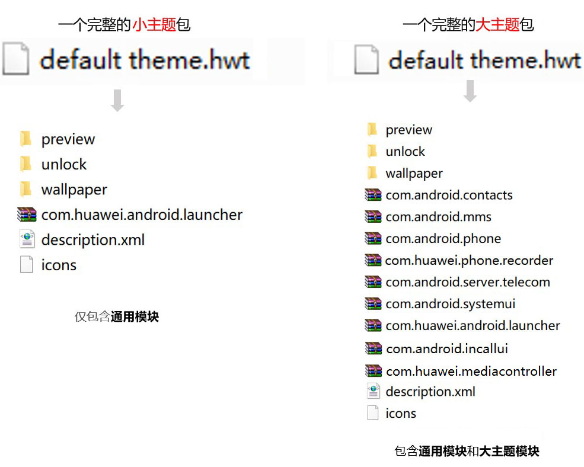
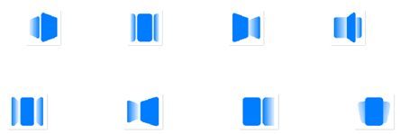
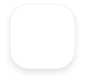
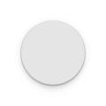
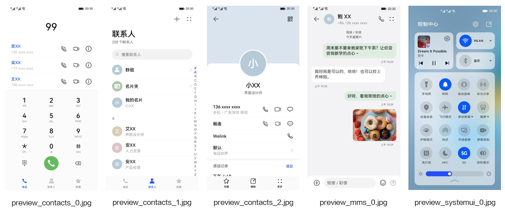
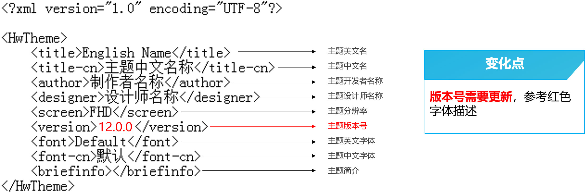

# EMUI 11.0升级HarmonyOS 2.0指导

## 1. 主题包内文件说明

小主题包结构没有变化，大主题新增了com.huawei.mediacontroller的结构。

## 2. 图标(icons)

### 2.1 新增必做7个静态图标

* com.huawei.educenter（教育中心）

  
* com.huawei.ar.measure（AR测量）

  
* com.huawei.welinknow（welinknow）

  
* portal\_ring\_inner\_holo\_dark.png（小文件夹深色背板）

  
* portal\_ring\_inner\_holo\_large.9.png（大文件夹浅色背板）

  
* portal\_ring\_inner\_holo\_large\_dark.9.png（大文件夹深色背板）

  
* icon\_stack\_largefolder\_background.png（大文件夹堆叠图标背板）

  

### 2.2 必做删除以下静态图标：

com.huawei.android.hwouc.png

huawei.com.android.manager.png

com.huawei.hnreader.png

com.huawei.honorclub.android.png

com.huawei.phoneservice.png

## 3. 公共系统控件（framework-res-hwext）

公共系统控件新增以下切图：

| PNG | 备注 | HarmonyOS 2.0资源名称 | 尺寸（px） | 工具位置 |
| --- | --- | --- | --- | --- |
|  | 文字编辑栏背景图  与bg\_edittext\_item.9.png样式保持一致 | spinner\_menu\_background.9.png | 无固定尺寸 | 电话-新建联系人-菜单弹窗 |

删除以下切图：

| PNG | 备注 | EMUI 11.0资源名称 | 尺寸（px） | 工具位置 |
| --- | --- | --- | --- | --- |
|  | 按钮正常状态 | button\_big\_bg\_stroked.9.png  button\_small\_bg\_stroked.9.png | 无固定尺寸 | 通知-开关排序-按钮背景图片 |
|  | 按钮按压状态 | button\_small\_bg\_stroked\_pressed.9.png  button\_big\_bg\_stroked\_pressed.9.png | 无固定尺寸 | 通知-开关排序-按钮背景图片 |
|  | 按钮不可用状态 | button\_small\_bg\_stroked\_disable.9.png  button\_big\_bg\_stroked\_disable.9.png | 无固定尺寸 | 通知-开关排序-按钮背景图片 |
|  | spinner弹框 选中色块（顶部）  圆角要与spinner\_menu.9.png圆角大小一致 | list\_selector\_background\_focused\_top\_emui.9.png | 无固定尺寸 | 电话-新建联系人-菜单弹窗 |
|  | spinner弹框 选中色块（中间） | list\_selector\_background\_focused\_middle\_emui.9.png | 无固定尺寸 | 电话-新建联系人-菜单弹窗 |
|  | 搜索框正常状态 | search\_bg\_normal.9.png | 无固定尺寸 | 电话-联系人-搜索框背景图片 |
|  | 搜索框激活状态 | search\_bg\_actived.9.png | 无固定尺寸 | 电话-联系人-搜索框背景图片 |
|  | 文本框 | textfield\_default\_bubble\_emui.9.png 框型状态  textfield\_default\_linear\_emui.9.png 默认线型状态  textfield\_default\_linear\_actived\_emui.9.png 激活线型状态  textfield\_bg\_error.9.png 错误状态 | 无固定尺寸 | 电话-新建联系人-文本框状态 |
|  | 进度条高亮形状 | progress\_primary\_emui.9.png | 无固定尺寸 | 通知-下拉通知-进度条 |
|  | 进度条形状 | progress\_bg\_emui.9.png | 无固定尺寸 | 通知-下拉通知-进度条 |

## 4. 桌面（com.huawei.android.launcher）

桌面删除以下切图：

| PNG | 备注 | EMUI 11.0资源名称 | 尺寸（px） | 工具位置 |
| --- | --- | --- | --- | --- |
|  | 文件夹展开背景 | folder\_open\_shadow.9.png | 无固定尺寸 | 桌面-文件夹-文件夹背景 |
|  | 切屏效果 | launcher\_edit\_transition\_box\_current.png（方盒） launcher\_edit\_transition\_defult\_current.png（默认） launcher\_edit\_transition\_filpover\_current.png（旋转） launcher\_edit\_transition\_page\_current.png（翻页） launcher\_edit\_transition\_prespective\_current.png（景深） launcher\_edit\_transition\_rotate\_current.png（翻转） launcher\_edit\_transition\_squeeze\_current.png（推压） launcher\_edit\_transition\_windmill\_current.png（风车） | 96×96 | 桌面-切屏效果-切换效果 |
|  | 插件编辑器 | widget\_resize\_frame\_holo.9.png（插件编辑外框） widget\_resize\_handle\_horizontal.png（插件水平编辑点） widget\_resize\_handle\_vertical.png（插件垂直编辑点） | 无固定尺寸 | 桌面-桌面属性-插件编辑器 |

## 5. 联系人（com.android.contacts）

联系人删除以下切图：

| PNG | 备注 | EMUI 11.0资源名称 | 尺寸（px） | 工具位置 |
| --- | --- | --- | --- | --- |
|  | 联系人详情背景 | contact\_detail\_list\_background.9.png | 无固定尺寸 | 电话-联系人详情-联系人详情背景 |

## 6. 信息（com.android.mms）

信息新增以下切图：

| PNG | 备注 | HarmonyOS 2.0资源名称 | 尺寸（px） | 工具位置 |
| --- | --- | --- | --- | --- |
|  | 智能短信卡片气泡长按时背景 如有方向，注意镜像 | a2p\_card\_pop\_bg\_long\_press.9.png | 172x102 可以不固定，保证全区域可显示 | 短信-智能短信-圆角类卡片气泡 |

删除以下切图：

| PNG | 备注 | EMUI 11.0资源名称 | 尺寸（px） | 工具位置 |
| --- | --- | --- | --- | --- |
|  | 短信/智能短信菜单弹框 | duoqu\_menu\_bg.9.png | 无固定尺寸 | 短信-智能短信-弹框背景图 |

## 7. 控制中心（com.android.systemui）

控制中心模块新增以下切图：

| PNG | 备注 | HarmonyOS 2.0资源名称 | 尺寸（px） | 工具位置 |
| --- | --- | --- | --- | --- |
|  | 手电筒（预览） | ic\_flashlight\_preview.png | 192×192 | 通知-窗口小工具图标 |
|  | 手电筒（桌面） | ic\_flashlight\_shortcut.png | 192×192 | 通知-窗口小工具图标 |
|  | 滑块不可用状态 | hwseekbar\_slider\_thumb\_disable\_emui.png | 120x120 | 通知-下拉通知-滑块图片 |
|  | 滑块正常状态 | hwseekbar\_slider\_thumb\_normal\_emui.png | 120x120 | 通知-下拉通知-滑块图片 |
|  | 滑块按压状态 | hwseekbar\_slider\_thumb\_pressed\_emui.png | 120x120 | 通知-下拉通知-滑块图片 |

删除以下切图：

| PNG | 备注 | EMUI 11.0资源名称 | 尺寸（px） | 工具位置 |
| --- | --- | --- | --- | --- |
|  | 电池电量外框 | ic\_statusbar\_battery.png | 100×60 | 通知-状态栏图标-电池图标 |
|  | 电池电量背板  （电量百分比显示方式选择“不显示”“电池图标外”的情况才显示） | ic\_statusbar\_battery\_figure.png | 100×60 | 通知-状态栏图标-电池图标 |

## 8. 音频播控中心（com.huawei.mediacontroller）

新增音频播控中心模块：com.huawei.mediacontroller。包内所有内容与com.android.systemui一致。

## 9. 预览图（preview）

预览图样式更新，如下图所示：

小主题预览图样板

大主题预览图样板

预览图限制：

EMUI 10.0及以上版本的主题，国内及海外版本预览图中不能出现以下21个图标，同时不能出现谷歌搜索等相关内容的展示。主题无需适配相关内容。

以下名称的预览图需特别注意，例如红框所示内容均不可出现：

## 10. 描述文件（description.xml）

1. 主题英文名，中文名，开发者名称，设计师名称四项待主题上线后均不可修改。
2. 设计师名称与设计师的开发者联盟账户绑定。
3. 主题分辨率，主题英文字体，中文字体均采用默认不可以修改。
4. 主题版本号第一版为12.0.0，后续有更新则更改为12.0.X（X为阿拉伯数字按顺序排列）。

## 11. EMUI 11.0主题资源附件下载

[附件-大主题模板](https://alliance-communityfile-drcn.dbankcdn.com/FileServer/getFile/cmtyPub/011/111/111/0000000000011111111.20251218173432.04238292088164660723520204619682%3A50001231000000%3A2800%3AD2734A17B9B7CC51FD0A957FD2F4CE7F9B5E4EB5C79812347423083C3B09DEEE.zip?needInitFileName=true)

[附件-预览图PSD源文件](https://communityfile-drcn.op.hicloud.com/FileServer/getFile/cmtyManage/011/111/111/0000000000011111111.20201217123305.88154875625088090267365201412154%3A50511223031632%3A2800%3AF2E449B2F4EB9E0AC5AE1EBE985E36E73FFDDC654785F8CE96A8C465ED1D6915.zip?needInitFileName=true)

[附件-主题包全局资源列表](https://communityfile-drcn.op.hicloud.com/FileServer/getFile/cmtyManage/011/111/111/0000000000011111111.20200910204957.34558711145382915571393061242023%3A50511223031632%3A2800%3AA6333151F6C4C00782D6C629CCA3A27702FD9C55A4AE5BB7086A41C1E08270BC.xlsx?needInitFileName=true)