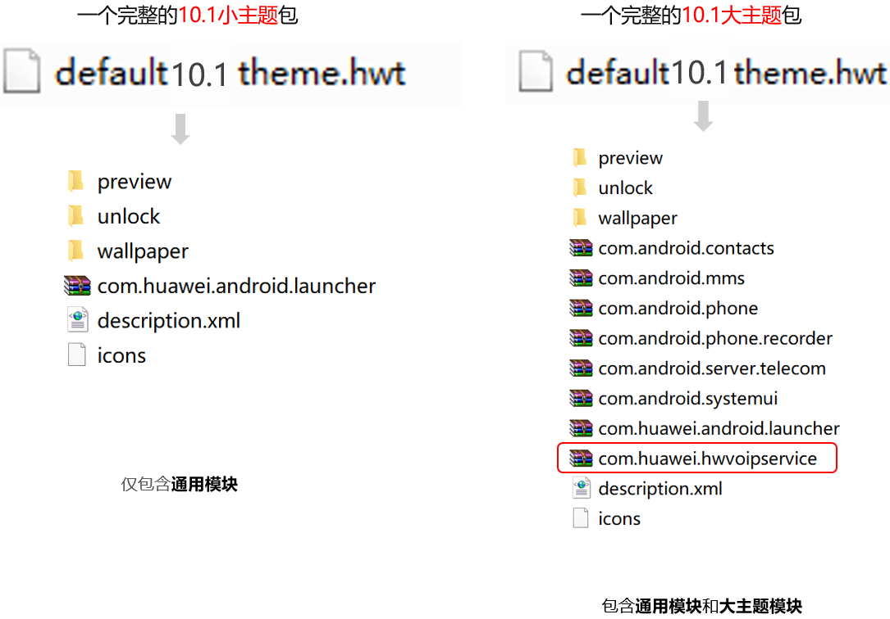
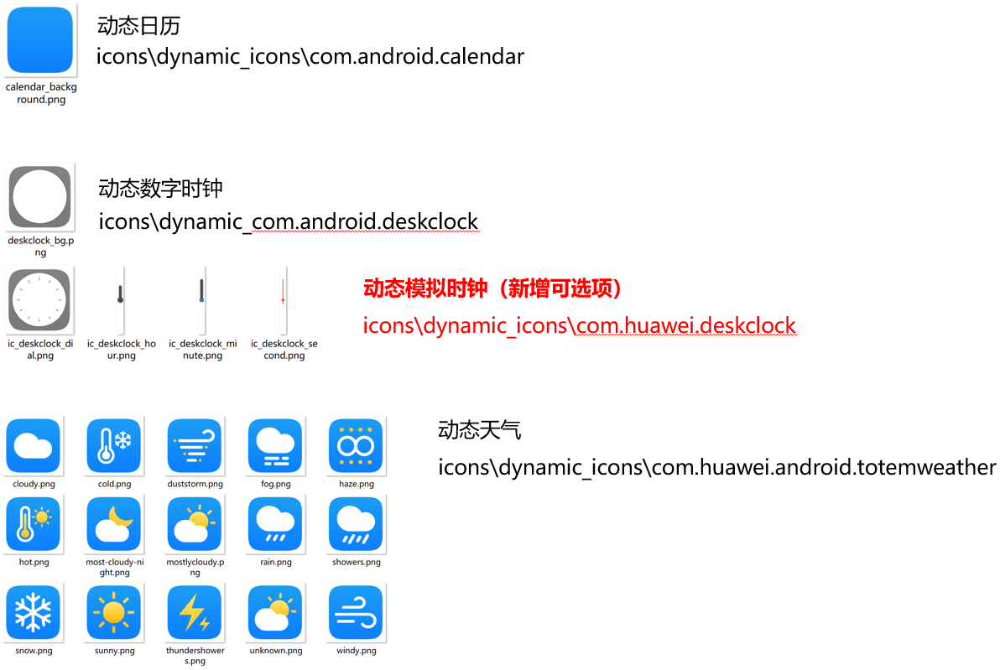
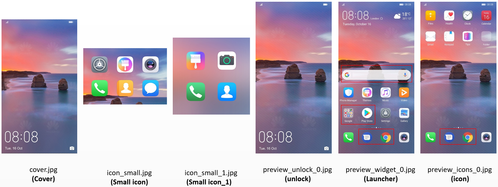
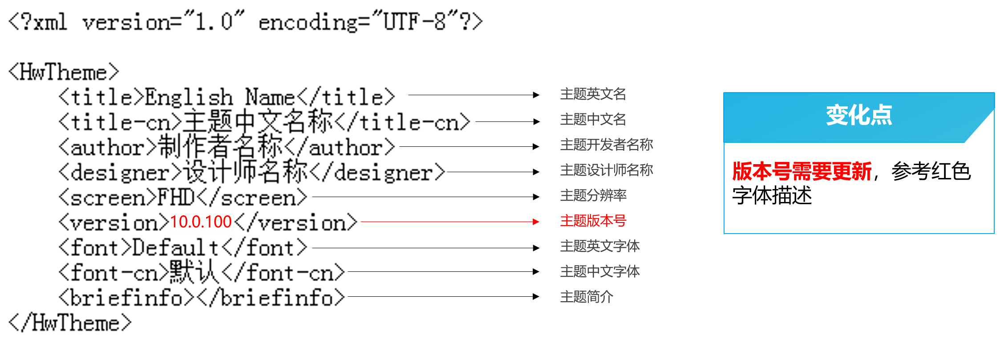

# EMUI 9.1升级EMUI 10.1指导

快速指引：EMUI 9.1升级10.1版本号需要变更，且预览图cover.jpg的尺寸从1080×2160px（18：9）更改为1080×1920px（16：9）。共新增12个必做图标，在下述图标模块中已标出，其他均无变化。

## 1. 主题包内文件说明

小主题包结构没有变化，大主题新增了红框所示voipservice的结构。

## 2. 图标(icons)

### 2.1 新增必做12个静态图标

10.0新增4个包名：

* com.huawei.calendar（日历）
* com.huawei.contacts（联系人）
* com.huawei.email（电子邮件）
* com.huawei.notepad（备忘录）

10.1新增6个包名：

* com.huawei.photos（图库）
* com.huawei.calculator（计算器）
* com.huawei.soundrecorder（录音机）
* com.huawei.deskclock（时钟）
* com.huawei.music（音乐）
* com.huawei.mirror（镜子）

10.1新增2个图标：

* com.huawei.meetime (畅连)

要求必须保留官方图标中心元素

* com.huawei.mycenter（会员中心）

### 2.2 选做动态图标

新增选做动态模拟时钟底板图标1个+指针3个。动态图标为icons下的dynamic\_icons文件夹，均为选做图标，升级时可直接继承9.1原始的动态图标。

## 3. 公共系统控件（framework-res-hwext）

公共系统控件新增的切图文件有2项：

| PNG | 备注 | EMUI 10.1资源名称 | 尺寸（px） | 工具位置 |
| --- | --- | --- | --- | --- |
|  | 进度条高亮形状 | progress\_primary\_emui.9.png | 无固定尺寸 | 通知-下拉通知-进度条 |
|  | 进度条形状 | progress\_bg\_emui.9.png | 无固定尺寸 | 通知-下拉通知-进度条 |

## 4. 桌面（com.huawei.android.launcher）

桌面模块变化的切图文件有8项：

| PNG | 备注 | EMUI 10.1资源名称 | 尺寸（px） | 工具位置 |
| --- | --- | --- | --- | --- |
|  | 切屏效果 | launcher\_edit\_transition\_box\_current.png（方盒） launcher\_edit\_transition\_defult\_current.png（默认） launcher\_edit\_transition\_filpover\_current.png（旋转） launcher\_edit\_transition\_page\_current.png（翻页） launcher\_edit\_transition\_prespective\_current.png（景深） launcher\_edit\_transition\_rotate\_current.png（翻转） launcher\_edit\_transition\_squeeze\_current.png（推压） launcher\_edit\_transition\_windmill\_current.png（风车） | 96×96 | 桌面-切屏效果-切换效果 |

## 5. 联系人（com.android.contacts）

联系人模块新增的切图文件有4项：

| PNG | 备注 | EMUI 10.1资源名称 | 尺寸（px） | 工具位置 |
| --- | --- | --- | --- | --- |
|  | 双卡拨号按钮 | 图标背景资源：daier\_call\_btn\_normal.png  图标背景按压资源：daier\_call\_btn\_press.png | 建议值：324×120 | 电话-拨号盘双卡-双卡拨号按钮 |
|  | 拨号盘背景（只能用纯色） | dialpad\_background\_drawable.9.png | 无固定尺寸 | 电话-拨号盘-拨号盘背景 |
|  | 拨号背景（不透明度必须为100%） | header\_background4.9.png | 无固定尺寸 | 电话-拨号盘-拨号背景 |

## 6. 信息（com.android.mms）

信息模块新增的切图文件有13项：

| PNG | 备注 | EMUI 10.1资源名称 | 尺寸（px） | 工具位置 |
| --- | --- | --- | --- | --- |
|  | 待发区气泡背景 如有方向，注意镜像 | message\_attachment\_preview\_bg.9.png | 172x102 可以不固定，保证全区域可显示 | 短信-智能短信-圆角类卡片气泡 |
|  | 发送的地理位置气泡背景，圆角30px 如有方向，注意镜像 | message\_location\_pop\_send\_bg.9.png | 172x102 可以不固定，保证全区域可显示 | 短信-会话-发送类气泡 |
|  | 收藏的发送的短信气泡背景 如有方向，注意镜像 | message\_pop\_favorite\_bg.9.png | 172x102 可以不固定，保证全区域可显示 | 短信-会话-接收类气泡 |
|  | 接收信息气泡、收藏的接收气泡背景 如有方向，注意镜像 | message\_pop\_incoming\_bg.9.png | 172x102 可以不固定，保证全区域可显示 | 短信-会话-接收类气泡 |
|  | 收藏的发送的rcs气泡背景 如有方向，注意镜像 | message\_pop\_rcs\_favorite\_bg.9.png | 172x102 可以不固定，保证全区域可显示 | 短信-会话-接收类气泡 |
|  | 四圆角蒙版气泡背景，需要有透明度，否则看不清短信文字，圆角30px 如有方向，注意镜像 | message\_pop\_rcs\_image\_bg\_long\_press.9.png | 172x102 可以不固定，保证全区域可显示 | 短信-智能短信-圆角类卡片气泡 |
|  | 接收气泡蒙版气泡背景，需要有透明度，否则看不清短信文字 如有方向，注意镜像 | message\_pop\_rcs\_receive\_bg\_long\_press.9.png | 172x102 可以不固定，保证全区域可显示 | 短信-会话-接收类气泡 |
|  | rcs发送气泡气泡背景 如有方向，注意镜像 | message\_pop\_rcs\_send\_bg.9.png | 172x102 可以不固定，保证全区域可显示 | 短信-会话-发送类气泡 |
|  | 发送气泡蒙版气泡背景，需要有透明度，否则看不清短信文字 如有方向，注意镜像 | message\_pop\_rcs\_send\_bg\_long\_press.9.png | 172x102 可以不固定，保证全区域可显示 | 短信-会话-发送类气泡 |
|  | 短信发送出去之后气泡背景 如有方向，注意镜像 | message\_pop\_send\_bg.9.png | 172x102 可以不固定，保证全区域可显示 | 短信-会话-发送类气泡 |
|  | 彩信幻灯片带图片接收气泡背景，圆角30px 如有方向，注意镜像 | message\_slide\_pop\_incoming\_bg.9.png | 172x102 可以不固定，保证全区域可显示 | 短信-智能短信-圆角类卡片气泡 |
|  | 彩信幻灯片带图片发送气泡背景 如有方向，注意镜像 | message\_slide\_pop\_send\_bg.9.png | 172x102 可以不固定，保证全区域可显示 | 短信-智能短信-圆角类卡片气泡 |
|  | 加密短信气泡背景 如有方向，注意镜像 | encrypted\_message\_pop\_send\_bg.9.png | 172x102 可以不固定，保证全区域可显示 | 短信-会话-发送类气泡 |

## 7. 下拉开关（com.android.systemui）

下拉开关模块新增的切图文件有1项：

| PNG | 备注 | EMUI 10.1资源名称 | 尺寸（px） | 工具位置 |
| --- | --- | --- | --- | --- |
|  | 音量控制滑块 | ic\_seekbar\_thumb.png | 96×96 | 通知-音量调节-音量条滑块图片 |

## 8. 预览图（preview）

预览图限制：

EMUI 10.0及以上版本的主题，国内及海外版本预览图中不能出现以下21个图标，同时不能出现谷歌搜索等相关内容的展示。主题无需适配相关内容。

以下名称的预览图需特别注意，例如红框所示内容均不可出现：

## 9. 描述文件（description.xml）

主题英文名，中文名，开发者名称，设计师名称四项待主题上线后均不可修改；

设计师名称与设计师的开发者联盟账户绑定；

主题分辨率，主题英文字体，中文字体均采用默认不可以修改；

主题版本号第一版为10.0.100，后续有更新则更改为10.0.10X（X为阿拉伯数字按顺序排列）。

## 10. EMUI 9.1主题资源附件下载

[附件-大主题模板](https://communityfile-drcn.op.hicloud.com/FileServer/getFile/cmtyManage/011/111/111/0000000000011111111.20200414174643.64346841766959687758285709223939%3A50510911003427%3A2800%3A2DE0A33A7B77DCB07CA1998A8398981E5E2B21CDC695381B99D7634BA96A7330.zip?needInitFileName=true)

[附件-预览图PSD源文件](https://communityfile-drcn.op.hicloud.com/FileServer/getFile/cmtyManage/011/111/111/0000000000011111111.20200414174902.52307435231739414748407226984718%3A50510911003427%3A2800%3A73DC6C4922CE62D067E1BBC50E1B636B2136205E57A50C49F866F4B01315B5AE.zip?needInitFileName=true)

[附件-主题包全局资源列表](https://communityfile-drcn.op.hicloud.com/FileServer/getFile/cmtyManage/011/111/111/0000000000011111111.20200414175140.58850702366782023934245910368509%3A50510911003427%3A2800%3A99A069838A7120CD44FEC757E041DD6014625F28870AEFA6B515A4C6800F6F13.xlsx?needInitFileName=true)