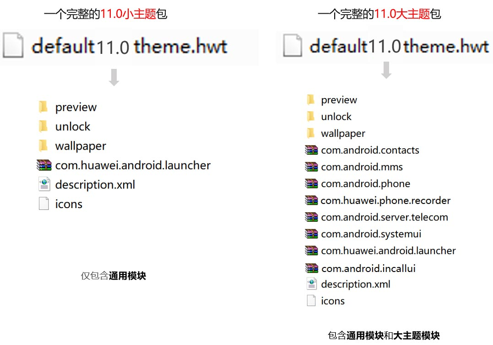
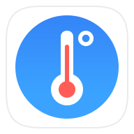
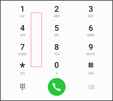
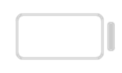
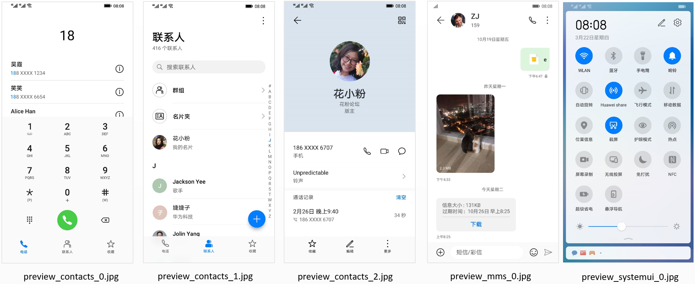
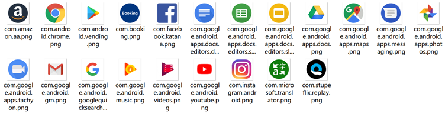
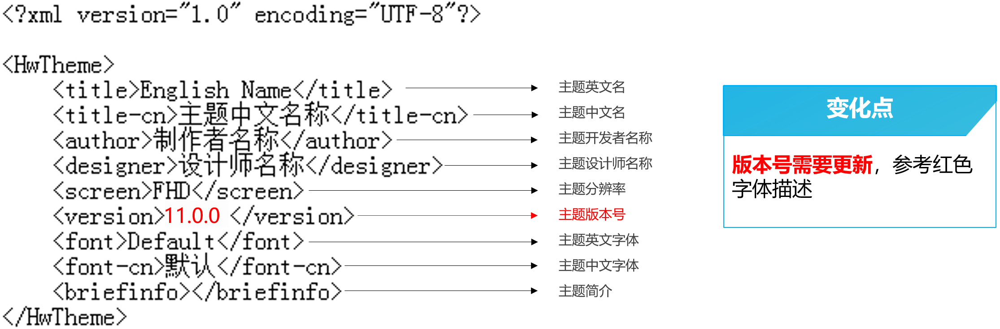

import MergeTable from '@site/src/components/MergeTable';

# EMUI 10.1升级EMUI 11.0指导

快速指引：EMUI 10.1升级EMUI 11.0变化点。

|  |  |  |  |  |
| --- | --- | --- | --- | --- |

<MergeTable
  headers={['模块', '变化点', 'EMUI 10.1', 'EMUI 11.0', '备注']}
  rows={
    ['描述文件（description.xml）', { text: '主题版本号更改为11.0.0，后续有更新则更改为11.0.X（X为阿拉伯数字按顺序排列）', rowspan: 1, colspan: 3 }, null, null, '/'],
    ['预览图（preview）', { text: '联系人预览图去掉了畅连通话的图标', rowspan: 1, colspan: 3 }, null, null, '/'],
    ['锁屏（unlock）', { text: '无变化', rowspan: 1, colspan: 3 }, null, null, '/'],
    ['壁纸（wallpaper）', { text: '无变化', rowspan: 1, colspan: 3 }, null, null, '/'],
    [{ text: '图标（icons）', rowspan: 5, colspan: 1 }, '文件管理', 'com.huawei.hidisk', 'com.huawei.filemanager', '/'],
    [null, '玩机技巧', 'com.huawei.android.tips', 'com.huawei.android.tips com.huawei.tipsove', '/'],
    [null, '阅读', 'com.huawei.hwireader com.huawei.hwread.al', 'com.huawei.hwireader com.huawei.hwread.al com.huawei.hwread.dz', ''],
    [null, '温度计', '无', 'com.huawei.thermometer', '/'],
    [null, '手写笔应用专区', '无', 'com.huawei.stylus.mpenzone', '/'],
    [{ text: '桌面（com.huawei.android.launcher）', rowspan: 2, colspan: 1 }, '抽屉模式索引条高亮图标', '无', '&lt;color name="drawer_select_letter"&gt;#007DFF&lt;/color&gt;', '/'],
    [null, '右箭头', '引用 framework-res-hwext： &lt;color name="emui_icon_tertiary"&gt;#191919&lt;/color&gt;', '引用 framework-res-hwext： &lt;color name="emui_primary"&gt;#191919&lt;/color&gt;', '/'],
    ['公共系统控件（framework-res-hwext）', '弹窗背景颜色', '&lt;color name="emui_dialog_bg"&gt;#ffffff&lt;/color&gt;', '模糊id：&lt;color name="emui_dialog_bg_blur"&gt;#B8FAFAFA&lt;/color&gt; 不支持模糊id：&lt;color name="emui_dialog_bg"&gt;#FFFFFF&lt;/color&gt;', '主题包两个id均需配置 模糊id透明度限制50%-80% 不支持模糊id透明度限制100%'],
    [{ text: '联系人 （ com.android.contacts）', rowspan: 3, colspan: 1 }, { text: '联系人FAB悬浮按钮', rowspan: 3, colspan: 1 }, '背景颜色： &lt;color name="hwfab_bg"&gt;#007DFF&lt;/color&gt; 背景按压颜色： &lt;color name="hwfab_pressed"&gt;#0070E5&lt;/color&gt;', '背景颜色： &lt;color name="emui_fab_bg_normal"&gt;#007DFF&lt;/color&gt; 背景按压颜色： &lt;color name="emui_fab_bg_pressed"&gt;#0070E5&lt;/color&gt;', '/'],
    [null, null, '背景投影色： &lt;color name="hwfab_shadow_start"&gt;#4D00B0FF&lt;/color&gt; &lt;color name="hwfab_shadow_end"&gt;#4DFF00D0&lt;/color&gt;', '背景投影色： &lt;color name="emui_fab_shadow_start"&gt;#4D00B0FF&lt;/color&gt; &lt;color name="emui_fab_shadow_end"&gt;#4DFF00D0&lt;/color&gt;', '/'],
    [null, null, '图标颜色： &lt;color name="hwfab_icon_start"&gt;#00B0FF&lt;/color&gt; &lt;color name="hwfab_icon_end"&gt;#FF00D0&lt;/color&gt;', '图标颜色： &lt;color name="emui_fab_icon_start"&gt;#00B0FF&lt;/color&gt; &lt;color name="emui_fab_icon_end"&gt;#FF00D0&lt;/color&gt;', '/'],
    ['信息（ com.android.mms）', { text: '无变化', rowspan: 1, colspan: 4 }, null, null, null],
    [{ text: '下拉开关（com.android.systemui）', rowspan: 5, colspan: 1 }, '下拉开关背景颜色', '引用 framework-res-hwext &lt;color name="emui_color_bg"&gt;#FFFFFFFF&lt;/color&gt;', '模糊id：&lt;color name="qs_customize_background_color1"&gt;#B8FAFAFA&lt;/color&gt; 不支持模糊id：引用 framework-res-hwext &lt;color name="emui_color_bg"&gt;#FFFAFAFA&lt;/color&gt;', '主题包两个id均需配置 模糊id透明度限制50%-80%'],
    [null, '音量条及图标高亮颜色', '&lt;color name="volume_image_color"&gt;#FF007DFF&lt;/color&gt;', '引用 framework-res-hwext： &lt;color name="emui_accent"&gt;#007DFF&lt;/color&gt;', '/'],
    [null, '音量背景条颜色', '引用 framework-res-hwext： &lt;color name="emui_primary"&gt;#000000&lt;/color&gt;叠加10%不透明', '&lt;color name="volume_progress_back_color"&gt;#19000000&lt;/color&gt;', '/'],
    [null, '音量面板背景', 'volume_popup.9.png', '模糊id：&lt;color name="volume_background_color"&gt;#B8FAFAFA&lt;/color&gt; 不支持模糊id：&lt;color name="volume_background_lower_color"&gt;#F2FAFAFA&lt;/color&gt;', '主题包两个id均需配置 模糊id透明度限制50%-80% 不支持模糊id透明度限制90%及以上'],
    [null, { text: '新增状态栏电池图标：ic_statusbar_battery.png（电池电量外框）、ic_statusbar_battery_figure.png（电池电量背板）', rowspan: 1, colspan: 3 }, null, null, '选做，电池电量背板图片透明度建议在30%以内，背板图在设置中电量百分比显示方式选择“电池图标内”的情况才显示，设计时需考虑不同颜色背景下的显示效果，保证电量进度清晰可见'],
    ['拨号设置（com.android.phone）', { text: '无变化', rowspan: 1, colspan: 3 }, null, null, '/'],
    ['拨号设置-通话自动录音（com.huawei.phone.recorder）', { text: '对于com.android.phone.recorder模块，内容继承，整体包名规范变更为com.huawei.phone.recorder', rowspan: 1, colspan: 3 }, null, null, '/'],
    ['拨号设置-来电拒接短信（com.android.server.telecom）', { text: '无变化', rowspan: 1, colspan: 3 }, null, null, '/'],
    ['通话（com.android.incallui）', { text: '新增通话模块，仅以下内容可更改： 挂断按钮背景颜色：&lt;color name="decline_normal_color"&gt;#FA2A2D&lt;/color&gt; 接听按钮背景颜色：&lt;color name="answer_normal_color"&gt;#41BA41&lt;/color&gt; 取消按钮背景颜色：引用 framework-res-hwext： &lt;color name="emui_color_fg_inverse"&gt;#FFFFFF&lt;/color&gt; 叠加30%透明度 取消按钮按压颜色：&lt;color name="btn_redial_color_press"&gt;#33ffffff&lt;/color&gt; 接听/挂断/取消按钮图标颜色：引用 framework-res-hwext：&lt;color name="emui_color_fg_inverse"&gt;#FFFFFF&lt;/color&gt;', rowspan: 1, colspan: 3 }, null, null, '接听/挂断/取消按钮图标颜色建议设置为默认#FFFFFF']
  }
/>

## 1. 主题包内文件说明

小主题包结构没有变化，大主题删去了com.huawei.hwvoipservice并新增了com.android.incallui的结构。

## 2. 图标(icons)

### 2.1 新增必做2个静态图标

* com.huawei.thermometer（温度计）

  
* com.huawei.stylus.mpenzone（手写笔应用专区）

  

### 2.2 包名变更3个图标

* 由com.huawei.hidisk更改为com.huawei.filemanager（文件管理）
* 新增包名com.huawei.tipsove（玩机技巧）
* 新增包名com.huawei.hwread.dz（阅读）

## 3. 联系人（com.android.contacts）

联系人模块变更的切图文件有3项：

| PNG | 备注 | EMUI 11.0资源名称 | 尺寸（px） | 工具位置 |
| --- | --- | --- | --- | --- |
|  | 双卡拨号按钮 | 图片资源已去掉，更改为和单按钮一样的资源 | / | / |
|  | 拨号盘背景（可自定义图片或纯色背景） | dialpad\_background\_drawable.9.png | 建议值：  1080x1184 | 电话-拨号盘-拨号盘背景 |

## 4. 下拉开关（com.android.systemui）

下拉开关模块新增的切图文件有2项：

| PNG | 备注 | EMUI 11.0资源名称 | 尺寸（px） | 工具位置 |
| --- | --- | --- | --- | --- |
|  | 电池电量外框 | ic\_statusbar\_battery.png | 96×96 | 通知-状态栏图标-电池图标 |
|  | 电池电量背板  （电量百分比显示方式选择“不显示”“电池图标外”的情况才显示） | ic\_statusbar\_battery\_figure.png | 100×60 | 通知-状态栏图标-电池图标 |

## 5. 拨号设置-通话自动录音（com.huawei.phone.recorder）

拨号设置-通话自动录音模块（com.android.phone.recorder），内容不变，整体包名规范变更为com.huawei.phone.recorder。

## 6. 通话（com.android.incallui）

新增通话模块，可设置接听及挂断按钮颜色。

## 7. 预览图（preview）

EMUI 11.0上大主题删去了畅连模块，大主题联系人模块的预览图需去掉畅连通话的图标。

预览图限制：

EMUI 10.0及以上版本的主题，国内及海外版本预览图中不能出现以下21个图标，同时不能出现谷歌搜索等相关内容的展示。主题无需适配相关内容。

以下名称的预览图需特别注意，例如红框所示内容均不可出现：

## 8. 描述文件（description.xml）

主题英文名，中文名，开发者名称，设计师名称四项待主题上线后均不可修改；

设计师名称与设计师的开发者联盟账户绑定；

主题分辨率，主题英文字体，中文字体均采用默认不可以修改；

主题版本号第一版为11.0.0，后续有更新则更改为11.0.X（X为阿拉伯数字按顺序排列）。

## 9. EMUI 10.1主题资源附件下载

[附件-大主题模板](https://communityfile-drcn.op.hicloud.com/FileServer/getFile/cmtyManage/011/111/111/0000000000011111111.20200828125448.77033222848405384931317130190173%3A50510927011440%3A2800%3ACABFF790DE19C55D8876A57174248348C6C8CA6F7E552F399410D121556612F7.zip?needInitFileName=true)

[附件-预览图PSD源文件](https://communityfile-drcn.op.hicloud.com/FileServer/getFile/cmtyManage/011/111/111/0000000000011111111.20200828125331.36954178034537871498101151760458%3A50510927011440%3A2800%3A29E65BA63B0A10B992AE949AF42AB52F1372ACD6A4AE3982A460A25FD1725F8F.zip?needInitFileName=true)

[附件-主题包全局资源列表](https://communityfile-drcn.op.hicloud.com/FileServer/getFile/cmtyManage/011/111/111/0000000000011111111.20200421120450.94682880393542238508181006626198%3A50510927011440%3A2800%3A2486064B84AC5C9D9FE69AF036CD4B6C83D3701FB3AA98C94A27472087C745C6.xlsx?needInitFileName=true)