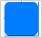
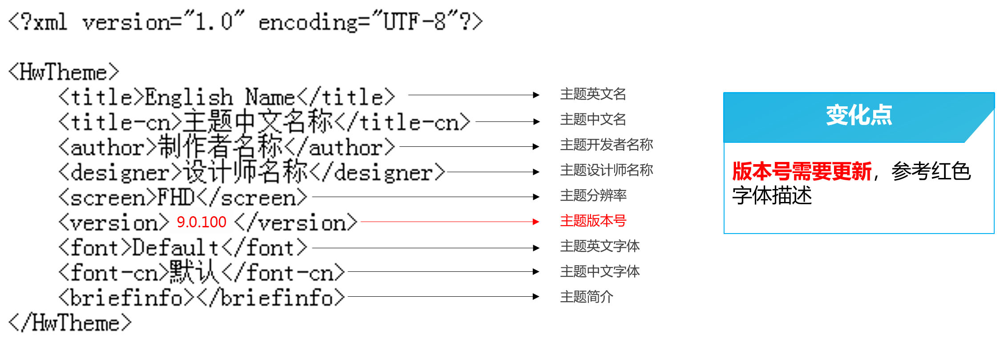

# EMUI 8.0升级EMUI 9.1指导

## 1. 壁纸(wallpaper)

桌面壁纸尺寸由2160×1920px更改为2160×2160px，锁屏壁纸尺寸由1080×1920px更改为1080×2160px。

## 2. 图标(icons)

### 2.1 新增图标

com.huawei.browser（华为浏览器）

com.huawei.honorclub.android（荣耀俱乐部）

com.huawei.android.totemweatherApp（静态天气）

com.huawei.hwread.al.png（华为阅读）

### 2.2 删除3个图标

com.huawei.parentcontrol.parent.png（家长助手）

com.huawei.parentcontrol.png（学生模式）

com.huawei.scanner.png（扫一扫）

## 3. 公共系统控件（framework-res-hwext）

公共系统控件新增的切图文件有18项：

| PNG | 备注 | EMUI 9.1资源名称 | 尺寸（px） |
| --- | --- | --- | --- |
|  | 索引pop背景形状（必须为黑色） | alphaindexerlistview\_bg\_label.9.png | 170x170 |
|  | 文字编辑栏背景图 | bg\_edittext\_item.9.png | 无固定尺寸 |
|  | 按钮正常状态 | button\_big\_bg\_stroked.9.png  button\_small\_bg\_stroked.9.png | 无固定尺寸 |
|  | 按钮按压状态 | button\_small\_bg\_stroked\_pressed.9.png  button\_big\_bg\_stroked\_pressed.9.png | 无固定尺寸 |
|  | 按钮不可用状态 | button\_small\_bg\_stroked\_disable.9.png  button\_big\_bg\_stroked\_disable.9.png | 无固定尺寸 |
|  | spinner弹框 选中色块（顶部）  圆角要与spinner\_menu.9.png圆角大小一致 | list\_selector\_background\_focused\_top\_emui.9.png | 无固定尺寸 |
|  | spinner弹框 选中色块（中间） | list\_selector\_background\_focused\_middle\_emui.9.png | 无固定尺寸 |
|  | 搜索框正常状态 | search\_bg\_normal.9.png | 无固定尺寸 |
|  | 搜索框激活状态 | search\_bg\_actived.9.png | 无固定尺寸 |
|  | 文本框 | textfield\_default\_linear\_emui.9.png 默认线型状态  textfield\_default\_linear\_actived\_emui.9.png激活线型状态  textfield\_bg\_error.9.png 错误状态 | 无固定尺寸 |
|  | 滑块不可用状态 | scrubber\_control\_disabled\_emui.png | 220x120 |
|  | 滑块正常状态 | scrubber\_control\_normal\_emui.png | 220x120 |
|  | 滑块按压状态 | scrubber\_control\_pressed\_emui.png | 220x120 |

## 4. 桌面（com.huawei.android.launcher）

桌面模块新增的切图文件有4项：

| PNG | 备注 | EMUI 9.1资源名称 | 尺寸（px） |
| --- | --- | --- | --- |
|  | 桌面-多任务-分屏图标 | ic\_sysbar\_docked\_huawei.png | 96×96 |
|  | 桌面-多任务-锁定图标 | hw\_recents\_lock.png | 96×96 |
|  | 移除 | ic\_edit\_delete.9.png | 无固定尺寸 |
|  | 分享 | ic\_edit\_share.9.png | 无固定尺寸 |

## 5. 信息（com.android.mms）

信息模块新增的切图文件有3项：

| PNG | 备注 | EMUI 9.1资源名称 | 尺寸（px） |
| --- | --- | --- | --- |
|  | 短信主界面-华为通知图标 | ic\_message\_noti\_huawei.png | 120x120 |
|  | 录音时的声波图 | rcs\_mic\_st\_widget\_recording\_bar\_glow.png | 688x688 |
|  | 录音时的声波图（小） | mic\_st\_widget\_speeching\_glow.png | 688x688 |

## 6. 拨号设置（com.android.phone）

拨号设置模块新增的切图文件有1项：

| PNG | 备注 | EMUI 9.1资源名称 | 尺寸（px） |
| --- | --- | --- | --- |
|  | 分隔条 | preference\_category\_backgound.9.png | 无固定尺寸 |

## 7. 预览图（preview）

预览图尺寸变更：除封面尺寸为1080×1920px外，其余预览图的尺寸更改为1080×2160px，预览图可使用手机截图的方式制作，截图后需按照预览图样板进行部分修改。

## 8. 描述文件（description.xml）

主题英文名，中文名，开发者名称，设计师名称四项待主题上线后均不可修改；

设计师名称与设计师的开发者联盟账户绑定；

主题分辨率，主题英文字体，中文字体均采用默认不可以修改；

主题版本号第一版为9.0.100，后续有更新则更改为9.0.10X（X为阿拉伯数字）。

## 9. EMUI 8.0主题资源附件下载

[附件-大主题模板](https://communityfile-drcn.op.hicloud.com/FileServer/getFile/cmtyManage/011/111/111/0000000000011111111.20200421144402.49212822671064483955320769008642%3A50510911003427%3A2800%3A777530C2C9925BF357CF978622355F1CEFBB66C1430C55999C3B3FFAA9B83530.zip?needInitFileName=true)

[附件-百变锁屏指导教程](https://communityfile-drcn.op.hicloud.com/FileServer/getFile/cmtyManage/011/111/111/0000000000011111111.20200421144817.01706199442690169628790123969424%3A50510911003427%3A2800%3ACF18B656E9C76167F1A7E2F11561A94030D879AEE010CFB3C63EEA24359E5478.zip?needInitFileName=true)

[附件-主题包全局资源列表](https://communityfile-drcn.op.hicloud.com/FileServer/getFile/cmtyManage/011/111/111/0000000000011111111.20200421144517.42435414264480106039075560453581%3A50510911003427%3A2800%3A987CCC60B1AF3D65E403062B4B4BEA0F07A16FDB3F7C2B88C1BF7F1078D0DEAB.xlsx?needInitFileName=true)