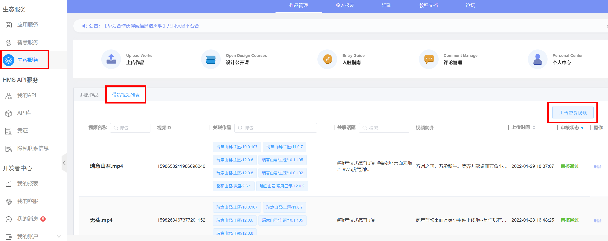
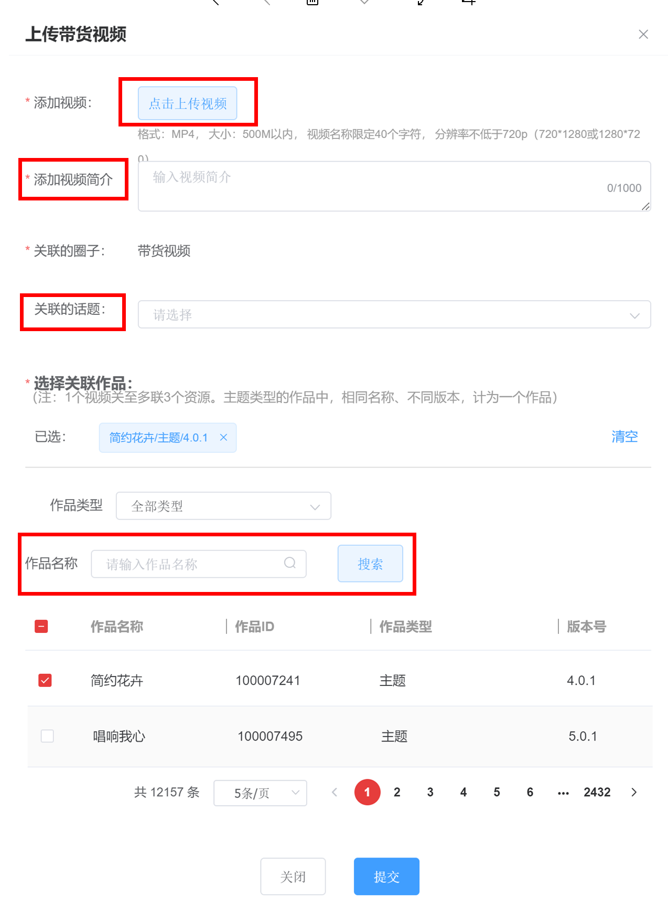
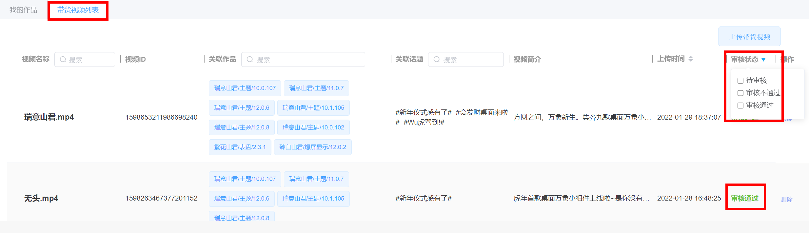
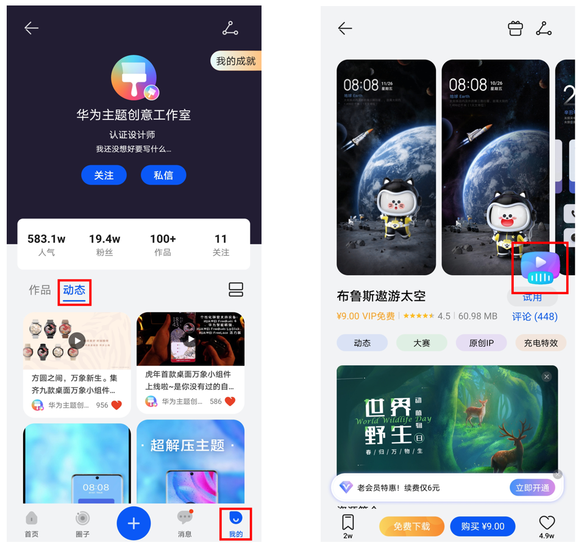

# 带货短视频发布规范及指导

华为主题社区支持在联盟上传带货短视频，用户在APP内通过刷短视频种草资源，点击视频页面的资源卡片实现一键购买。

## 短视频上传

第一次上传短视频，请按以下操作：

1. 点击左侧导航栏“ 内容服务” &gt;点击“带货视频列表”&gt;点击“上传带货视频” 。

   
2. “点击上传视频”&gt; 编辑“视频简介” – 选择“关联的话题” – 搜索“作品名称“，勾选对应上架资源，点击“提交”。

   
3. 点击“带货视频列表”可查询作品状态，显示“审核通过”即视为上传成功。

   

## 上传规范

* 视频格式：MP4。
* 视频分辨率：分辨率不低于720p（720\*1280或1280\*720）。
* 视频大小：500MB以内。
* 视频时长：建议在20秒以内。

## 内容检视

* 不可重复发布同质化内容，同一资源下，内容重合率达50%的视频将做隐藏处理。
* 不可发布画面简陋，未进行任何创意编辑的内容，如屏幕录制，图片拼凑，预览视频等。
* 不可发布与资源无关，画面中无资源露出或露出时长过短的无意义内容。
* 不可发布画面模糊、光线过暗、抖动严重等影响用户视觉体验的内容。
* 不可发布无配乐、音质差、音量过大、配乐与画面严重割裂等影响用户听觉体验的内容。

## 端内展示

“审核通过”的短视频可以在以下页面查看：

1. “主题APP”&gt;底部导航栏“社区”&gt;底部导航栏“我的”&gt;中部导航栏“动态”。
2. “主题APP”&gt; 对应资源详情页&gt; 短视频浮窗。

   