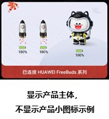
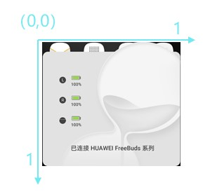

# 产品小图标

<strong>表1</strong>

| 参数 | 类型 | 注释 |
| --- | --- | --- |
| smallIcon | 对象 | 当为空对象时不显示产品小图标。  说明：产品主体不显示时，必须在电量条左边显示产品小图标。   |
| smallIcon.sysColor | 字符串 | 系统产品小图标的颜色，填写颜色的RBG值，不填写显示默认值#000000。 |
| smallIcon.location | 数值 | 图标中心点坐标占比，以弹窗背景为参照物，弹窗背景左上角的点为原点（0,0），右下角的点为（1,1）  计算方法：坐标点的X轴像素位置值/1440，坐标点的Y轴像素位置值/1792（小数保留8位截取）  取值范围：0-1  示例：若坐标点的像素位置值为（1020,1392），则用1020除于1440，用1392除于1792，得到数再截取8位小数，最后得到（0.70833333,0.77678571）   |
| smallIcon.size | 数值 | 图标宽高占比  计算方法：图标宽度像素值/1440，图标高度像素值/1792（小数保留8位截取）  默认值：0.06666666,0.05357142  示例：若图标宽度像素值为96，图标宽度像素值为96，则用96除于1440，用96除于1792，再截取8位小数，最后得到0.06666666,0.05357142  注意：  系统图标需要保持96:96，不然会变形 |
| smallIcon.resource | 字符串 | 自定义小图标的文件名。未指定则使用系统小图标。  图片格式：PNG |