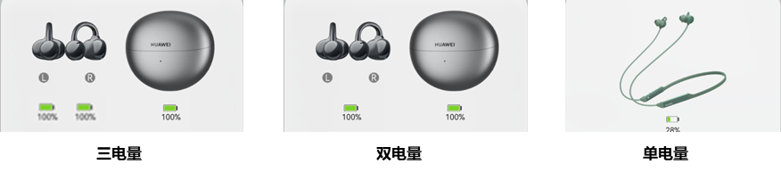

# 电量类型

<strong>表1</strong>

| 参数 | 类型 | 注释 |
| --- | --- | --- |
| leftOrSingleBattery | 对象 | 左边耳机电量对象/单电量设备电量对象  注：不填写不显示。 |
| rightBattery | 对象 | 右边耳机电量对象  注：不填写不显示。 |
| boxBattery | 对象 | 盒子电量对象  注：不填写不显示。 |
| unifyEarBattery | 对象 | Tws归一化显示的耳机电量对象  注：不填写不显示。 |
| unifyBoxBattery | 对象 | Tws归一化显示的盒子电量对象  注：不填写不显示。 |

TWS耳机支持左、右耳机分开的三电量显示和归一化的双电量显示，所以leftOrSingleBattery、rightBattery、boxBattery、unifyEarBattery、unifyBoxBattery都需要设置。其他类型设备只有一个电量，只需要设置leftOrSingleBattery。

某些老型号耳机不支持电量归一，按3个电量来显示。