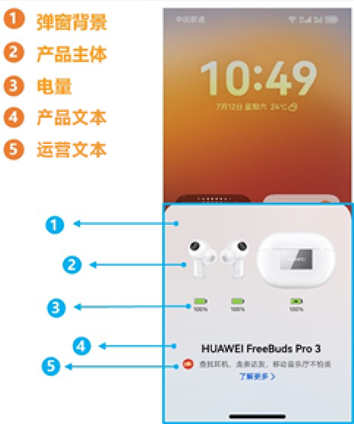

# 介绍

支持对音频产品（TWS耳机、颈戴、眼镜和头戴）回连弹窗进行个性化设计，可换肤范围包括：弹窗背景、产品主体/产品小图标、电量、产品文本和运营文本，如下图蓝色线框范围所示。

运营文本的由运营人员配置，创作者不可以修改。

耳机弹窗的设计尺寸为1440×1792 px。

耳机弹窗在真实设备上显示时，系统提供对应的圆角裁剪，四个角均为128 px，弹窗内容尽可能保证在安全范围内，避免圆角裁剪时受到影响。

