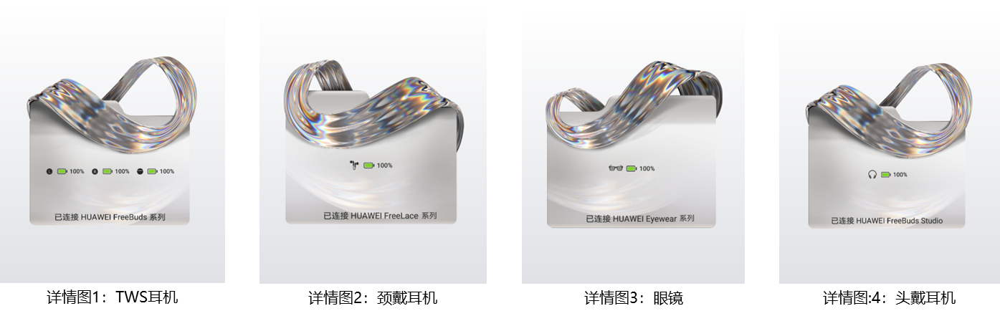

# 详情图

详情图，用于主题市场的耳机弹窗详情页展示。

<strong>样例图：</strong>

<strong>设计要求：</strong>

详情图尺寸为1440×1800 px，格式为JPG。

详情图需制作4张，分别为TWS耳机、颈戴耳机、眼镜、头戴耳机，不可展示运营文本。

详情图使用统一的背景样式，渐变色值：#FFFFFF——#E0E2E6，渐变角度：上下垂直180度。

详情图上耳机弹窗可展示的最大宽度为整个图片宽度的80%，即1152px，耳机弹窗可展示最大高度为整个图片高度的60%，即1080px，耳机弹窗效果图相对整个图片上下左右居中。