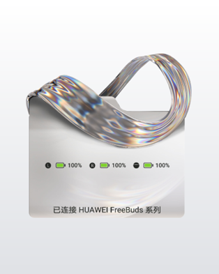
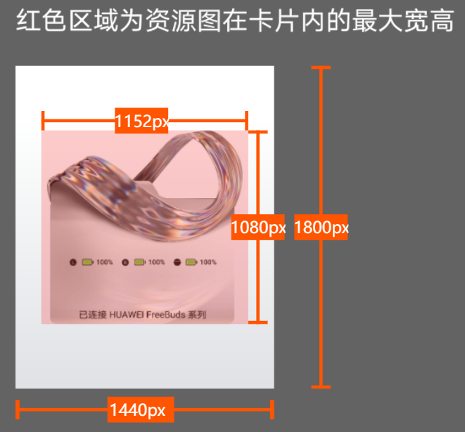

# 封面图

封面图，用于主题市场耳机弹窗专区中的预览展示。

<strong>样例图：</strong>

<strong>设计要求：</strong>

封面图尺寸为1440×1800 px，格式为JPG。

封面图使用TWS耳机的弹窗效果图，不能展示运营文本。

封面图使用统一的背景样式，渐变色值：#FFFFFF——#E0E2E6，渐变角度：上下垂直180度。

封面图上耳机弹窗可展示的最大宽度为整个图片宽度的80%，即1152px，耳机弹窗可展示最大高度为整个图片高度的60%，即1080px，耳机弹窗效果图相对整个图片上下左右居中。

