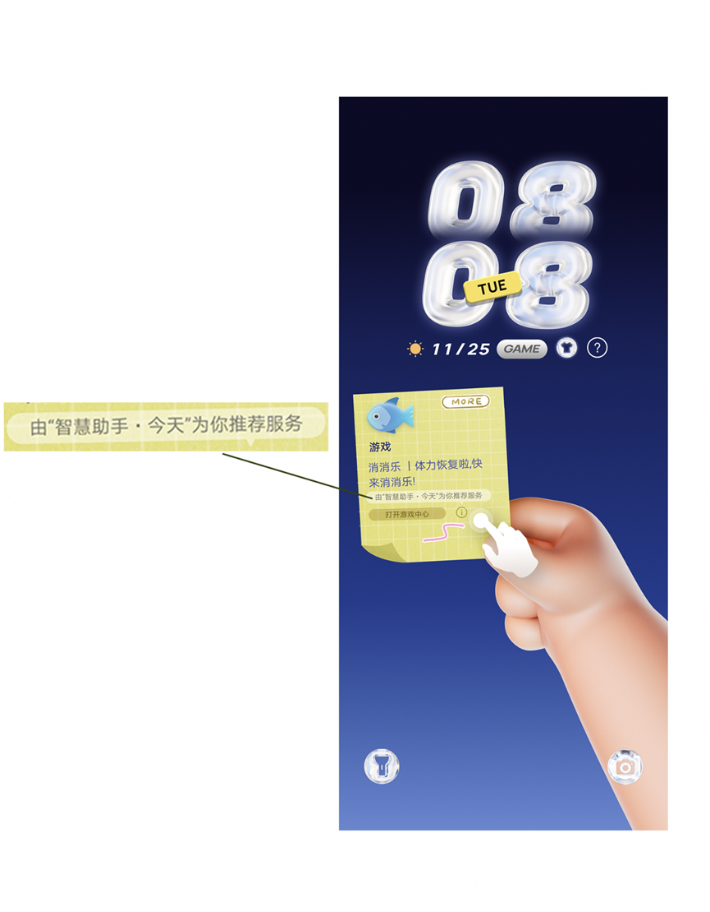

# 数据开放：场景感知数据开放&lt;Scenarios&gt;

## 功能概述

场景感知功能为用户推荐个性化服务，基于位置提供服务时“智慧助手·今天（负一屏）”需要获取位置权限和位置信息，部分场景可能支持跳转至其他服务或应用。

场景感知功能由“智慧助手·今天”提供，用户可以前往“智慧助手·今天(负一屏）”&gt;“头像”&gt;“上方四个点”&gt;“设置”&gt;“个性化推荐”处开启/关闭该功能。

使用场景感知数据开放能力时，首先，需要订阅相应的服务分类，然后，系统会将服务分发推荐的场景感知数据赋值给到全局变量：场景文案#Scenarios.ID.text、是否支持跳转#Scenarios.ID.jumpable、应用或元服务名称#Scenarios.ID.appName、优先级最高的服务分类#Scenarios.topId。


您的主题中若使用了场景感知数据开放能力，则需要单独制作至少一张详情图（以锁屏图或宣传图上传均可）对相关的功能进行展示和说明。

## 支持范围

<strong>起始规范版本：</strong>HarmonyOS 6.1

<strong>是否平台特性：</strong>否

<strong>表1</strong> <strong>支持根标签</strong>

|  | 锁屏（Lockscreen） | 桌面（Wallpaper） | 一镜到底（LongTake） | 百变卡片（Widget） | 充电动效（ChargingSkin） |
| --- | --- | --- | --- | --- | --- |
| 是否支持 | √ | x | √ | x | x |

<strong>表2</strong> <strong>支持设备类型</strong>

|  | 直板机 | 折叠屏 | 平板 |
| --- | --- | --- | --- |
| 是否支持 | √ | √ | √ |

## XML规范

```
<Scenarios categories="10000013, 40000999, 10000020, 10000023, 10000025" />
```

## 参数说明

|  |  |  |  |
| --- | --- | --- | --- |
| 参数 | 类型 | 选项 | 注释 |
| categories | string | 必填 | 需使用的服务分类（完整的服务分类列表详见[全局变量](/docs/distribute/content-dist/theme-center/development-tutorial-0000001054519376/themes-engine-0000001054452463/themes-engine-next-0000002242508358/themes-engine-next-base-0000002279818413/themes-engine-next-base-globalvar-0000002471235030)场景数据），多个服务分类以英文逗号分隔，如“影视与直播”、“游戏”、“生活服务”、“美食”和“出行导航”，则填写"10000013, 40000999, 10000020, 10000023, 10000025"。默认为空，表示不使用任何服务分类。 |


1. 需要使用的场景分类ID，必须在categories参数中进行声明，否则，通过全局变量#Scenarios.ID.text，#Scenarios.ID.jumpable，#Scenarios.ID.appName无法取到值。其中， “影视与直播”、“游戏”、“生活服务”、“美食”和“出行导航”为必做服务分类，必须在categories参数中进行声明。

2. 使用场景感知数据开放能力的主题，其锁屏界面需明示用户“<strong>由“智慧助手·今天”为你推荐服务</strong>”具体展现形式不限。



3. 同一个服务分类的#Scenarios.ID.jumpable存在既返回1-支持，也返回0-不支持，创作者必须实现支持跳转和不支持跳转2种场景，其中，跳转功能需配合[场景感知跳转命令ScenarioIntentCommand](/docs/distribute/content-dist/theme-center/development-tutorial-0000001054519376/themes-engine-0000001054452463/themes-engine-next-0000002242508358/themes-engine-next-base-0000002279818413/scenario_intentcommand-0000002550844196)使用，且锁屏界面需明示用户要打开的应用或者元服务，提示文案由“<strong>打开</strong>”和<strong>全局变量</strong> <strong>#</strong> <strong>Scenarios.ID.appName</strong>拼接而成，如：

# Scenarios.40000999.appName的值为“<strong>游戏中心</strong>”，则界面提示文案为“<strong>打开游戏中心</strong>”。


4. 需注意，场景文案#Scenarios.ID.text，应用或元服务名称#Scenarios.ID.appName返回的文本长度不固定，创作者在设计时需预留好相应的空间，若使用Text组件展示，文本长度超长时，可以设置isSupportEllipsis属性为true，无法展示的内容则用省略号替代，Text用法参照[文本&lt;Text&gt;](/docs/distribute/content-dist/theme-center/development-tutorial-0000001054519376/themes-engine-0000001054452463/themes-engine-next-0000002242508358/themes-engine-next-base-0000002279818413/themes-engine-next-base-text-0000002471394976)。

## 应用示例

<strong>示例1：</strong>无推荐服务时，默认展示小胖手；有推荐服务时，展示小卡片，点击more展示更多推荐服务。

```
<?xml version="1.0" encoding="utf-8" ?>
<Lockscreen displayDesktop="true" frameRate="30" screenWidth="1080" version="1" xsdVersion="1">
    <Var name="w" expression="#screen_width"/>
    <Var name="h" expression="#screen_height"/>
    <Var name="ratio" expression="max(#w/1080,#h/2400)"/>
    <Var name="pianyi_x" expression="#w/2-1080*#ratio/2"/>
    <Var name="pianyi_y" expression="#h/2-2400*#ratio/2"/>
    <Var name="showtips" expression="0"/>
    <Var name="showlist" expression="0"/>

    <Scenarios categories="10000013,10000020,10000023,10000025,40000999"/>
    <!--    将5个分类场景是否有值写入数组变量中，方便后续调用-->
    <Var name="hasValue" type="number[]" index="0" expression="#Scenarios.10000013.state" size="5"/>
    <Var name="hasValue" type="number[]" index="1" expression="#Scenarios.10000020.state"/>
    <Var name="hasValue" type="number[]" index="2" expression="#Scenarios.10000023.state"/>
    <Var name="hasValue" type="number[]" index="3" expression="#Scenarios.10000025.state"/>
    <Var name="hasValue" type="number[]" index="4" expression="#Scenarios.40000999.state"/>
    <!--    判断5个场景，每个场景是否有数据返回-->
    <Var name="Scenarios.10000013.state" expression="strIndexOf(strIsEmpty(#Scenarios.10000013.text),'true')"
         type="string"/>
    <Var name="Scenarios.10000020.state" expression="strIndexOf(strIsEmpty(#Scenarios.10000020.text),'true')"
         type="string"/>
    <Var name="Scenarios.10000023.state" expression="strIndexOf(strIsEmpty(#Scenarios.10000023.text),'true')"
         type="string"/>
    <Var name="Scenarios.10000025.state" expression="strIndexOf(strIsEmpty(#Scenarios.10000025.text),'true')"
         type="string"/>
    <Var name="Scenarios.40000999.state" expression="strIndexOf(strIsEmpty(#Scenarios.40000999.text),'true')"
         type="string"/>

    <!--    计算总共有多少个场景分类数据返回-->
    <Var name="dataCount"
         expression="eq(#Scenarios.10000013.state,-1)+eq(#Scenarios.10000020.state,-1)+eq(#Scenarios.10000023.state,-1)+eq(#Scenarios.10000025.state,-1)+eq(#Scenarios.40000999.state,-1)"/>
    <!--    场景列表页的条目y坐标，上一个场景不存在数据时，下一个场景顺序上移-->
    <Var name="y1" expression="220*eq(#Scenarios.10000013.state,-1)"/>
    <Var name="y2" expression="220*(eq(#Scenarios.10000013.state,-1)+eq(#Scenarios.40000999.state,-1))"/>
    <Var name="y3"
         expression="220*(eq(#Scenarios.10000013.state,-1)+eq(#Scenarios.40000999.state,-1)+eq(#Scenarios.10000020.state,-1))"/>
    <Var name="y4"
         expression="220*(eq(#Scenarios.10000013.state,-1)+eq(#Scenarios.40000999.state,-1)+eq(#Scenarios.10000020.state,-1)+eq(#Scenarios.10000023.state,-1))"/>
    <!--    当前展示的场景分类id-->
    <Var name="index" expression="0"/>
    <!--    将topId赋值给变量topId，将其变为number类型变量用于后续计算-->
    <Var name="topId" expression="#Scenarios.topId"/>
    <!--    当前展示的场景分类id在变量数组hasValue中的下标-->
    <Var name="categoryIndex" expression="0" persist="true"/>
    <!--    轮播计时，用于轮播判断。每5秒切换到下一个有数据的场景分类-->
    <Var name="timeCount" expression="0"/>
    <!--    灭屏前最后一次展示的场景分类id-->
    <Var name="lastCategory" expression="0" persist="true"/>
    <!--    lastCategory场景分类连续亮屏展示的次数，连续亮屏2次后第三次切换到下一条有数据的场景分类-->
    <Var name="showCount" expression="1"/>
    <!--    监听每秒变化，topId不为空时，启动轮播计时-->
    <Var name="timeChange" expression="#second" threshold="1">
        <Trigger>
            <VariableCommand name="timeCount" expression="#timeCount+1" condition="gt(#topId,0)"/>
        </Trigger>
    </Var>
    <!--    每7秒，改变一次场景分类数组变量的下标-->
    <Var name="categoryChange" expression="int(#timeCount/7)" threshold="1">
        <Trigger>
            <VariableCommand name="categoryIndex" expression="(#categoryIndex+1)%5"
                             condition="gt(#topId,0)*ne(#timeCount,0)"/>
        </Trigger>
    </Var>
    <!--    用于记录是否所有场景都没数据-->
    <Var name="tempIndex" expression="eq(#hasValue[0],0)*eq(#categoryIndex,0)+
         eq(#hasValue[1],0)*eq(#categoryIndex,1)+
         eq(#hasValue[2],0)*eq(#categoryIndex,2)+
         eq(#hasValue[3],0)*eq(#categoryIndex,3)+
         eq(#hasValue[4],0)*eq(#categoryIndex,4)"/>
    <!--    每当数组下标改变，判断当前场景分类是否有数据返回，没有数据返回则下标+1，触发下一次判断，直到找到有数据返回的场景分类-->
    <Var name="indexChange" expression="#categoryIndex" threshold="1">
        <Trigger>
            <VariableCommand name="index" expression="10000013"
                             condition="eq(#hasValue[0],-1)*eq(#categoryIndex,0)*gt(#topId,0)"/>
            <VariableCommand name="index" expression="10000020"
                             condition="eq(#hasValue[1],-1)*eq(#categoryIndex,1)*gt(#topId,0)"/>
            <VariableCommand name="index" expression="10000023"
                             condition="eq(#hasValue[2],-1)*eq(#categoryIndex,2)*gt(#topId,0)"/>
            <VariableCommand name="index" expression="10000025"
                             condition="eq(#hasValue[3],-1)*eq(#categoryIndex,3)*gt(#topId,0)"/>
            <VariableCommand name="index" expression="40000999"
                             condition="eq(#hasValue[4],-1)*eq(#categoryIndex,4)*gt(#topId,0)"/>
            <VariableCommand name="index" expression="0" condition="eq(#categoryIndex,-1)"/>

            <!--            仅当有数据时,categoryIndex+1-->
            <VariableCommand name="categoryIndex" expression="(#categoryIndex+1)%5"
                             condition="gt(#topId,0)*ne(#tempIndex,0)*gt(#dataCount,0)"/>
        </Trigger>
    </Var>
    <!--    展示的场景变化时，记录播放的场景分类id和播放次数，用于下次亮屏轮播判断-->
    <Var name="indexChange2" expression="#index" threshold="1">
        <Trigger>
            <VariableCommand name="showCount" expression="1"
                             condition="ne(#lastCategory,#index)*ge(#index,0)"/>
        </Trigger>
    </Var>
    <Var name="showCountChange" expression="#showCount" threshold="1">
        <Trigger>
            <VariableCommand name="categoryIndex" expression="(#categoryIndex+1)%5"
                             condition="gt(#topId,0)*gt(#showCount,2)"/>
        </Trigger>
    </Var>

    <ExternalCommands>
        <Trigger action="resume">
            <!--            当lastCategory的连续展示次数大于等于3，则切换到下一条场景分类-->
            <VariableCommand name="showCount" expression="#showCount+1" condition="eq(#lastCategory,#index)*gt(#index,0)"/>
            <VariableCommand name="showCount" expression="1" condition="ne(#lastCategory,#index)"/>
            <VariableCommand name="lastCategory" expression="#index"
                             condition="ne(#lastCategory,#index)*ge(#index,0)"/>
            <Command target="indexChange.animation" value="play"/>
            <Command target="indexChange2.animation" value="play"/>
            <VariableCommand name="timeCount" expression="0"/>
            <VariableCommand name="showtips" expression="0"/>

            <VariableCommand name="showlist" expression="0"/>
            <VideoCommand name="video" src="video/cloth_0.mp4" play="true" condition="eq(#topId,0)"/>
            <VideoCommand name="video" src="video_0.mp4" play="true" condition="ne(#topId,0)"/>
        </Trigger>
        <Trigger action="pause">
            <Command target="timeChange.animation" value="stop"/>
            <VariableCommand name="timeCount" expression="0"/>
        </Trigger>
    </ExternalCommands>

    <!--    监听topId是否为0，当topId不为0，代表当前有场景数据返回，此时启动轮播计时-->
    <Var name="s" expression="#topId" threshold="1">
        <Trigger>
            <Command target="timeChange.animation" value="play" condition="gt(#topId,0)"/>
            <Command target="timeChange.animation" value="stop" condition="eq(#topId,0)"/>
            <!--            表示无数据-->
            <VariableCommand name="index" expression="0" condition="eq(#topId,0)"/>
            <VariableCommand name="index" expression="10000013" condition="eq(#topId,10000013)*eq(#lastCategory,0)"/>
            <VariableCommand name="index" expression="10000020" condition="eq(#topId,10000020)*eq(#lastCategory,0)"/>
            <VariableCommand name="index" expression="10000023" condition="eq(#topId,10000023)*eq(#lastCategory,0)"/>
            <VariableCommand name="index" expression="10000025" condition="eq(#topId,10000025)*eq(#lastCategory,0)"/>
            <VariableCommand name="index" expression="40000999" condition="eq(#topId,40000999)*eq(#lastCategory,0)"/>

            <VariableCommand name="categoryIndex" expression="-1" condition="eq(#topId,0)"/>
            <VariableCommand name="categoryIndex" expression="0" condition="eq(#topId,10000013)*eq(#lastCategory,0)"/>
            <VariableCommand name="categoryIndex" expression="1" condition="eq(#topId,10000020)*eq(#lastCategory,0)"/>
            <VariableCommand name="categoryIndex" expression="2" condition="eq(#topId,10000023)*eq(#lastCategory,0)"/>
            <VariableCommand name="categoryIndex" expression="3" condition="eq(#topId,10000025)*eq(#lastCategory,0)"/>
            <VariableCommand name="categoryIndex" expression="4" condition="eq(#topId,40000999)*eq(#lastCategory,0)"/>

            <VideoCommand name="video" src="video_0.mp4" play="true" condition="gt(#topId,0)"/>
            <VideoCommand name="video" src="video/cloth_0.mp4" play="true" condition="eq(#topId,0)"/>
        </Trigger>
    </Var>
    <Image src="video/first.jpg" w="1080*#ratio" h="2400*#ratio" x="#pianyi_x" y="#pianyi_y"/>
    <Video name="video" looping="false" play="false" w="1080*#ratio" h="2400*#ratio" x="#pianyi_x"
           y="#pianyi_y"/>
    <!--场景感知数据-->
    <Group name="cjgzAnim" x="#pianyi_x" y="#pianyi_y" visibility="ne(#index,0)">
        <Image x="333*#ratio" y="971*#ratio" w="166*#ratio" h="55*#ratio" src="cjgz/more.png"
               visibility="gt(#dataCount,1)"/>
        <Button h="95*#ratio" w="206*#ratio" x="313*#ratio" y="951*#ratio" visibility="gt(#dataCount,1)">
            <Triggers>
                <Trigger action="click">
                    <VariableCommand name="showlist" expression="1"/>
                </Trigger>
            </Triggers>
        </Button>
        <!--点击提示按钮，提示用户“由“智慧助手·今天”为你推荐服务”-->
        <Image x="74*#ratio" y="1276*#ratio" w="434*#ratio" h="62*#ratio" src="cjgz/tips.png"
               visibility="#showtips"/>
        <Image x="372*#ratio" y="1330*#ratio" w="62*#ratio" h="62*#ratio" src="cjgz/button_tips.png"/>
        <Button h="102*#ratio" w="102*#ratio" x="352*#ratio" y="1310*#ratio">
            <Triggers>
                <Trigger action="click">
                    <VariableCommand name="showtips" expression="1-#showtips"/>
                </Trigger>
            </Triggers>
        </Button>
        <Image x="74*#ratio" y="1334*#ratio" w="290*#ratio" h="62*#ratio" src="cjgz/button_app.png"/>
        <Image x="272*#ratio" y="1392*#ratio" w="143*#ratio" h="68*#ratio" src="cjgz/tuya.png"/>
        <Group visibility="eq(#index,40000999)">
            <Image x="44*#ratio" y="965*#ratio" w="290*#ratio" h="226*#ratio" srcExp="cjgz/screen_40000999.png"/>
            <Text x="95*#ratio" y="1180*#ratio" size="35" color="#4d56a3" width="400" isSupportEllipsis="true"
                  text="#Scenarios.40000999.text" rotation="-1.5"/>
            <!--可跳转时，展示提示文案“打开xxxx”-->
            <Text x="121*#ratio" y="1356*#ratio" size="22" color="#6a601c" width="210" isSupportEllipsis="true"
                  text="'打开'+#Scenarios.40000999.appName" rotation="-1.5" visibility="#Scenarios.40000999.jumpable"/>
            <Button h="62" w="290" x="74" y="1334" visibility="eq(#showlist,0)">
                <Triggers>
                    <Trigger action="click">
                        <ScenarioIntentCommand category="40000999" condition="#Scenarios.40000999.jumpable"/>
                    </Trigger>
                </Triggers>
            </Button>
            <!--不可跳转时，需要设计不可跳转的场景，此处示例：展示提示文案并点击切换到下一个场景-->
            <Group visibility="ne(#Scenarios.40000999.jumpable,1)">
                <Text x="95*#ratio" y="1180*#ratio" size="35" color="#4d56a3" width="400" isSupportEllipsis="true"
                      text="#Scenarios.40000999.text" rotation="-1.5"/>
                <Text x="121*#ratio" y="1356*#ratio" size="22" color="#6a601c" width="210" isSupportEllipsis="true"
                      text="切换下一个场景" rotation="-1.5"/>
                <Button h="62" w="290" x="74" y="1334" visibility="eq(#showlist,0)">
                    <Triggers>
                        <Trigger action="click">
                            <VariableCommand name="timeCount" expression="0"/>
                            <VariableCommand name="categoryIndex" expression="(#categoryIndex+1)%5"/>
                        </Trigger>
                    </Triggers>
                </Button>
            </Group>
        </Group>
        <Group visibility="eq(#index,10000013)">
            <Image x="44*#ratio" y="965*#ratio" w="290*#ratio" h="226*#ratio" srcExp="cjgz/screen_10000013.png"/>
            <Text x="95*#ratio" y="1180*#ratio" size="35" color="#4d56a3" width="400" isSupportEllipsis="true"
                  text="#Scenarios.10000013.text" rotation="-1.5"/>
            <Text x="121*#ratio" y="1356*#ratio" size="22" color="#6a601c" width="210" isSupportEllipsis="true"
                  text="'打开'+#Scenarios.10000013.appName" rotation="-1.5" visibility="#Scenarios.10000013.jumpable"/>
            <Button h="62" w="290" x="74" y="1334" visibility="eq(#showlist,0)">
                <Triggers>
                    <Trigger action="click">
                        <ScenarioIntentCommand category="10000013" condition="#Scenarios.10000013.jumpable"/>
                    </Trigger>
                </Triggers>
            </Button>
            <!--不可跳转时，需要设计不可跳转的场景，此处示例：展示提示文案并点击切换到下一个场景-->
            <Group visibility="ne(#Scenarios.10000013.jumpable,1)">
                <Text x="95*#ratio" y="1180*#ratio" size="35" color="#4d56a3" width="400" isSupportEllipsis="true"
                      text="#Scenarios.10000013.text" rotation="-1.5"/>
                <Text x="121*#ratio" y="1356*#ratio" size="22" color="#6a601c" width="210" isSupportEllipsis="true"
                      text="切换下一个场景" rotation="-1.5"/>
                <Button h="62" w="290" x="74" y="1334" visibility="eq(#showlist,0)">
                    <Triggers>
                        <Trigger action="click">
                            <VariableCommand name="timeCount" expression="0"/>
                            <VariableCommand name="categoryIndex" expression="(#categoryIndex+1)%5"/>
                        </Trigger>
                    </Triggers>
                </Button>
            </Group>
        </Group>
        <Group visibility="eq(#index,10000020)">
            <Image x="44*#ratio" y="965*#ratio" w="290*#ratio" h="226*#ratio" srcExp="cjgz/screen_10000020.png"/>
            <Text x="95*#ratio" y="1180*#ratio" size="35" color="#4d56a3" width="400" isSupportEllipsis="true"
                  text="#Scenarios.10000020.text" rotation="-1.5"/>
            <Text x="121*#ratio" y="1356*#ratio" size="22" color="#6a601c" width="210" isSupportEllipsis="true"
                  text="'打开'+#Scenarios.10000020.appName" rotation="-1.5" visibility="#Scenarios.10000020.jumpable"/>
            <Button h="62" w="290" x="74" y="1334" visibility="eq(#showlist,0)">
                <Triggers>
                    <Trigger action="click">
                        <ScenarioIntentCommand category="10000020" condition="#Scenarios.10000020.jumpable"/>
                    </Trigger>
                </Triggers>
            </Button>
            <!--不可跳转时，需要设计不可跳转的场景，此处示例：展示提示文案并点击切换到下一个场景-->
            <Group visibility="ne(#Scenarios.10000020.jumpable,1)">
                <Text x="95*#ratio" y="1180*#ratio" size="35" color="#4d56a3" width="400" isSupportEllipsis="true"
                      text="#Scenarios.10000020.text" rotation="-1.5"/>
                <Text x="121*#ratio" y="1356*#ratio" size="22" color="#6a601c" width="210" isSupportEllipsis="true"
                      text="切换下一个场景" rotation="-1.5"/>
                <Button h="62" w="290" x="74" y="1334" visibility="eq(#showlist,0)">
                    <Triggers>
                        <Trigger action="click">
                            <VariableCommand name="timeCount" expression="0"/>
                            <VariableCommand name="categoryIndex" expression="(#categoryIndex+1)%5"/>
                        </Trigger>
                    </Triggers>
                </Button>
            </Group>
        </Group>
        <Group visibility="eq(#index,10000023)">
            <Image x="44*#ratio" y="965*#ratio" w="290*#ratio" h="226*#ratio" srcExp="cjgz/screen_10000023.png"/>
            <Text x="95*#ratio" y="1180*#ratio" size="35" color="#4d56a3" width="400" isSupportEllipsis="true"
                  text="#Scenarios.10000023.text" rotation="-1.5"/>
            <Text x="121*#ratio" y="1356*#ratio" size="22" color="#6a601c" width="210" isSupportEllipsis="true"
                  text="'打开'+#Scenarios.10000023.appName" rotation="-1.5" visibility="#Scenarios.10000023.jumpable"/>
            <Button h="62" w="290" x="74" y="1334" visibility="eq(#showlist,0)">
                <Triggers>
                    <Trigger action="click">
                        <ScenarioIntentCommand category="10000023" condition="#Scenarios.10000023.jumpable"/>
                    </Trigger>
                </Triggers>
            </Button>
            <!--不可跳转时，需要设计不可跳转的场景，此处示例：展示提示文案并点击切换到下一个场景-->
            <Group visibility="ne(#Scenarios.10000023.jumpable,1)">
                <Text x="95*#ratio" y="1180*#ratio" size="35" color="#4d56a3" width="400" isSupportEllipsis="true"
                      text="#Scenarios.10000023.text" rotation="-1.5"/>
                <Text x="121*#ratio" y="1356*#ratio" size="22" color="#6a601c" width="210" isSupportEllipsis="true"
                      text="切换下一个场景" rotation="-1.5"/>
                <Button h="62" w="290" x="74" y="1334" visibility="eq(#showlist,0)">
                    <Triggers>
                        <Trigger action="click">
                            <VariableCommand name="timeCount" expression="0"/>
                            <VariableCommand name="categoryIndex" expression="(#categoryIndex+1)%5"/>
                        </Trigger>
                    </Triggers>
                </Button>
            </Group>
        </Group>
        <Group visibility="eq(#index,10000025)">
            <Image x="44*#ratio" y="965*#ratio" w="290*#ratio" h="226*#ratio" srcExp="cjgz/screen_10000025.png"/>
            <Text x="95*#ratio" y="1180*#ratio" size="35" color="#4d56a3" width="400" isSupportEllipsis="true"
                  text="#Scenarios.10000025.text" rotation="-1.5"/>
            <Text x="121*#ratio" y="1356*#ratio" size="22" color="#6a601c" width="210" isSupportEllipsis="true"
                  text="'打开'+#Scenarios.10000025.appName" rotation="-1.5" visibility="#Scenarios.10000025.jumpable"/>
            <Button h="62" w="290" x="74" y="1334" visibility="eq(#showlist,0)">
                <Triggers>
                    <Trigger action="click">
                        <ScenarioIntentCommand category="10000025" condition="#Scenarios.10000025.jumpable"/>
                    </Trigger>
                </Triggers>
            </Button>
            <!--不可跳转时，需要设计不可跳转的场景，此处示例：展示提示文案并点击切换到下一个场景-->
            <Group visibility="ne(#Scenarios.10000025.jumpable,1)">
                <Text x="95*#ratio" y="1180*#ratio" size="35" color="#4d56a3" width="400" isSupportEllipsis="true"
                      text="#Scenarios.10000025.text" rotation="-1.5"/>
                <Text x="121*#ratio" y="1356*#ratio" size="22" color="#6a601c" width="210" isSupportEllipsis="true"
                      text="切换下一个场景" rotation="-1.5"/>
                <Button h="62" w="290" x="74" y="1334" visibility="eq(#showlist,0)">
                    <Triggers>
                        <Trigger action="click">
                            <VariableCommand name="timeCount" expression="0"/>
                            <VariableCommand name="categoryIndex" expression="(#categoryIndex+1)%5"/>
                        </Trigger>
                    </Triggers>
                </Button>
            </Group>
        </Group>
        <AlphaAnimation repeat="1">
            <Alpha a="0" time="0"/>
            <Alpha a="0" time="700"/>
            <Alpha a="255" time="1100"/>
        </AlphaAnimation>
    </Group>
    <!--场景感知数据列表-->
    <Group visibility="#showlist">
        <Image x="0" y="400" src="cjgz/list.png"/>
        <Button h="140" w="140" x="820" y="554">
            <Triggers>
                <Trigger action="click">
                    <VariableCommand name="showlist" expression="0"/>
                </Trigger>
            </Triggers>
        </Button>
        <Group y="0" visibility="eq(#Scenarios.10000013.state,-1)">
            <Image x="130" y="742" src="cjgz/ID_10000013.png"/>
            <Image x="330" y="720" src="cjgz/sort_10000013.png"/>
            <Text x="370" y="796" size="35" color="#4d56a3" width="570" isSupportEllipsis="true"
                  text="#Scenarios.10000013.text"/>
            <Image x="350" y="843" src="cjgz/list_button.png"/>
            <Image x="130" y="920" src="cjgz/line.png"/>
            <Text x="397" y="866" size="30" color="#6a601c" width="290" isSupportEllipsis="true"
                  text="'打开'+#Scenarios.10000013.appName"/>
            <Button h="140" w="590" x="354" y="782">
                <Triggers>
                    <Trigger action="click">
                        <ScenarioIntentCommand category="10000013" condition="#Scenarios.10000013.jumpable"/>
                    </Trigger>
                </Triggers>
            </Button>
        </Group>
        <Group y="#y1" visibility="eq(#Scenarios.40000999.state,-1)">
            <Image x="130" y="742" src="cjgz/ID_40000999.png"/>
            <Image x="330" y="720" src="cjgz/sort_40000999.png"/>
            <Text x="370" y="796" size="35" color="#4d56a3" width="570" isSupportEllipsis="true"
                  text="#Scenarios.40000999.text"/>
            <Image x="350" y="843" src="cjgz/list_button.png"/>
            <Image x="130" y="920" src="cjgz/line.png"/>
            <Text x="397" y="866" size="30" color="#6a601c" width="290" isSupportEllipsis="true"
                  text="'打开'+#Scenarios.40000999.appName"/>
            <Button h="140" w="590" x="354" y="782">
                <Triggers>
                    <Trigger action="click">
                        <ScenarioIntentCommand category="40000999" condition="#Scenarios.40000999.jumpable"/>
                    </Trigger>
                </Triggers>
            </Button>
        </Group>
        <Group y="#y2" visibility="eq(#Scenarios.10000020.state,-1)">
            <Image x="130" y="742" src="cjgz/ID_10000020.png"/>
            <Image x="330" y="720" src="cjgz/sort_10000020.png"/>
            <Text x="370" y="796" size="35" color="#4d56a3" width="570" isSupportEllipsis="true"
                  text="#Scenarios.10000020.text"/>
            <Image x="350" y="843" src="cjgz/list_button.png"/>
            <Image x="130" y="920" src="cjgz/line.png"/>
            <Text x="397" y="866" size="30" color="#6a601c" width="290" isSupportEllipsis="true"
                  text="'打开'+#Scenarios.10000020.appName"/>
            <Button h="140" w="590" x="354" y="782">
                <Triggers>
                    <Trigger action="click">
                        <ScenarioIntentCommand category="10000020" condition="#Scenarios.10000020.jumpable"/>
                    </Trigger>
                </Triggers>
            </Button>
        </Group>
        <Group y="#y3" visibility="eq(#Scenarios.10000023.state,-1)">
            <Image x="130" y="742" src="cjgz/ID_10000023.png"/>
            <Image x="330" y="720" src="cjgz/sort_10000023.png"/>
            <Text x="370" y="796" size="35" color="#4d56a3" width="570" isSupportEllipsis="true"
                  text="#Scenarios.10000023.text"/>
            <Image x="350" y="843" src="cjgz/list_button.png"/>
            <Image x="130" y="920" src="cjgz/line.png"/>
            <Text x="397" y="866" size="30" color="#6a601c" width="290" isSupportEllipsis="true"
                  text="'打开'+#Scenarios.10000023.appName"/>
            <Button h="140" w="590" x="354" y="782">
                <Triggers>
                    <Trigger action="click">
                        <ScenarioIntentCommand category="10000023" condition="#Scenarios.10000023.jumpable"/>
                    </Trigger>
                </Triggers>
            </Button>
        </Group>
        <Group y="#y4" visibility="eq(#Scenarios.10000025.state,-1)">
            <Image x="130" y="742" src="cjgz/ID_10000025.png"/>
            <Image x="330" y="720" src="cjgz/sort_10000025.png"/>
            <Text x="370" y="796" size="35" color="#4d56a3" width="570" isSupportEllipsis="true"
                  text="#Scenarios.10000025.text"/>
            <Image x="350" y="843" src="cjgz/list_button.png"/>
            <Image x="130" y="920" src="cjgz/line.png"/>
            <Text x="397" y="866" size="30" color="#6a601c" width="290" isSupportEllipsis="true"
                  text="'打开'+#Scenarios.10000025.appName"/>
            <Button h="140" w="590" x="354" y="782">
                <Triggers>
                    <Trigger action="click">
                        <ScenarioIntentCommand category="10000025" condition="#Scenarios.10000025.jumpable"/>
                    </Trigger>
                </Triggers>
            </Button>
        </Group>
    </Group>
</Lockscreen>
```