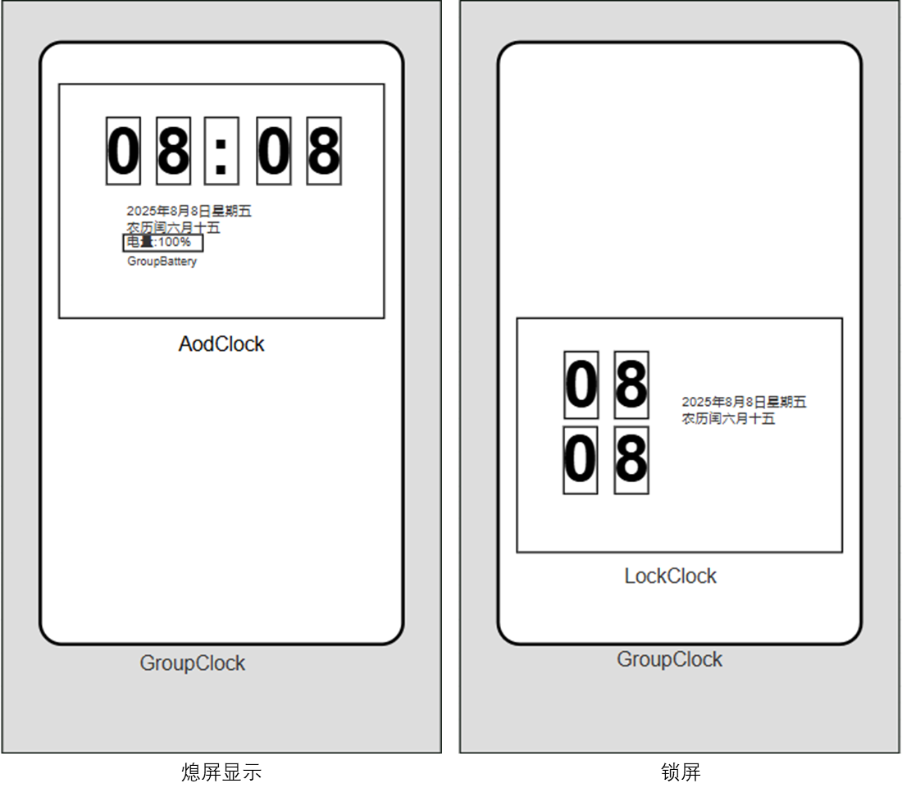
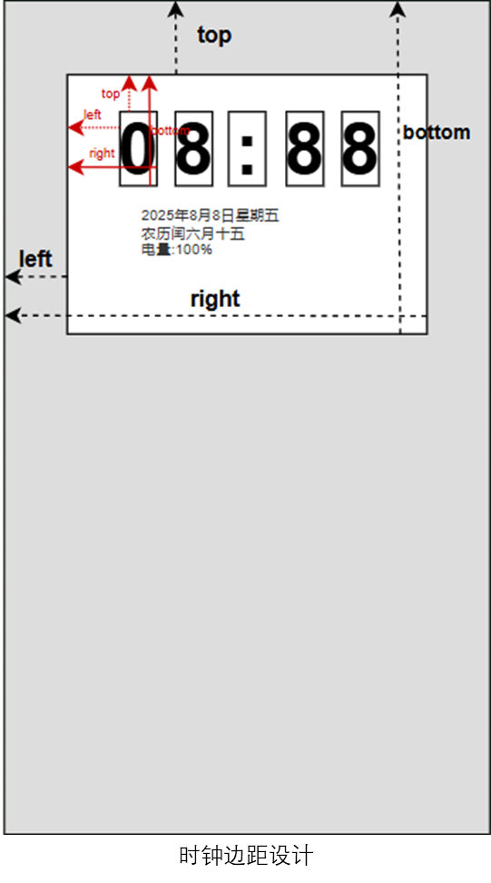
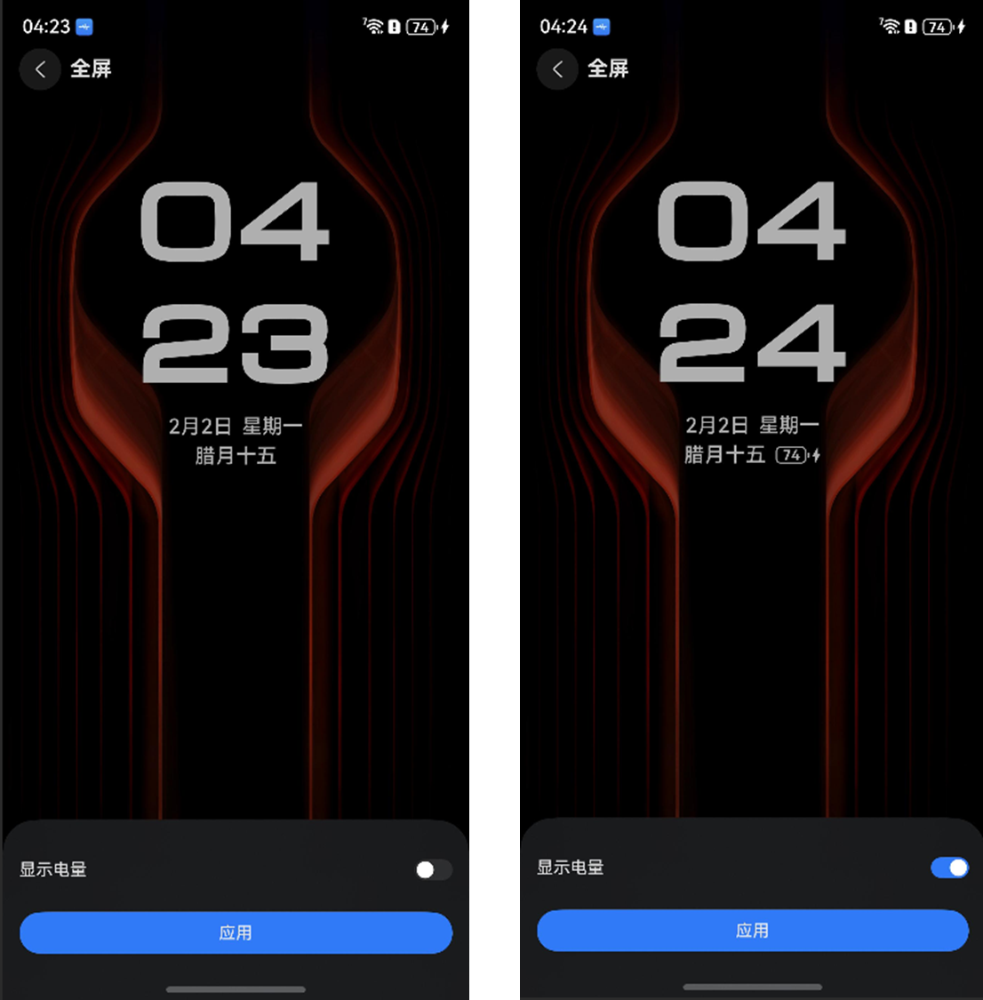
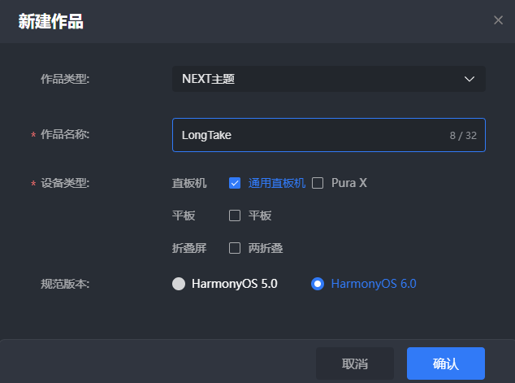
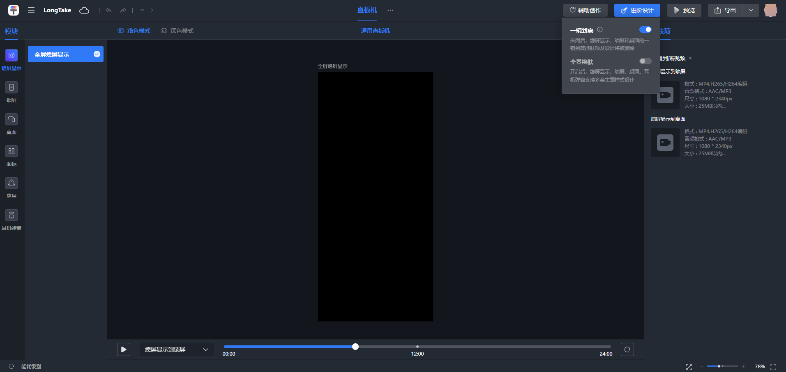
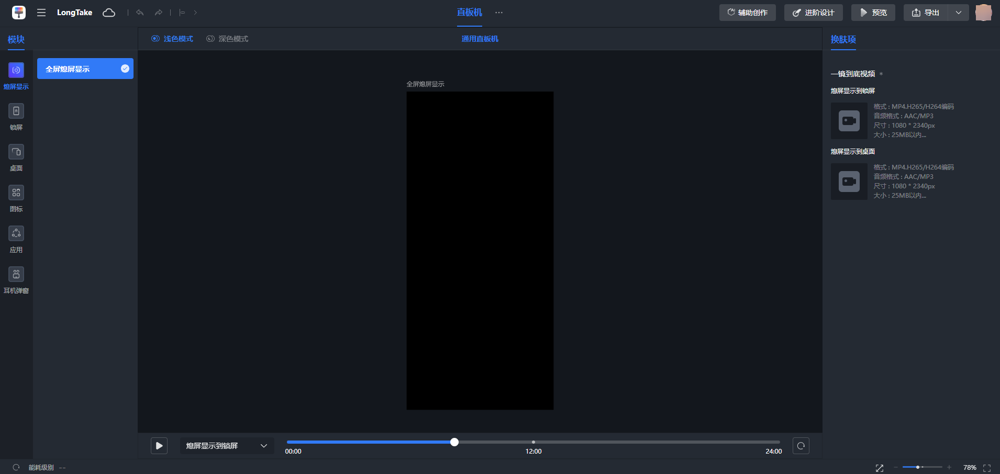
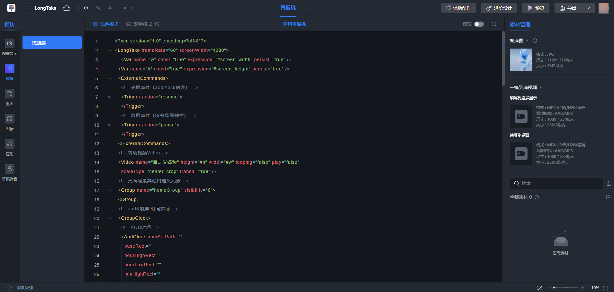
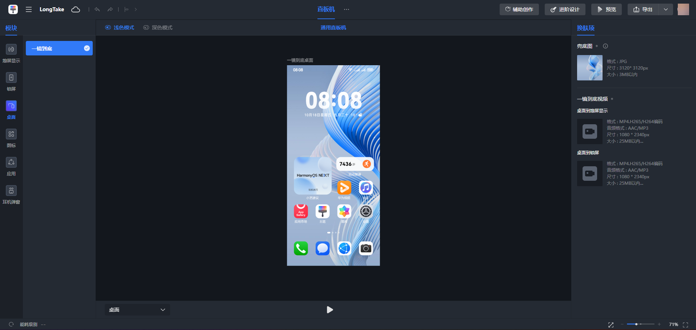

import MergeTable from '@site/src/components/MergeTable';

# 一镜到底

## 功能概述

一镜到底是指通过指定锁屏→熄屏显示、锁屏→桌面、熄屏显示→桌面、熄屏显示→锁屏、桌面→锁屏和桌面→熄屏显示共6段转场视频，体验如电影般的一镜到底效果。


与HarmonyOS4.0区别：

1. 由5段转场变化为6段转场，转场素材由图片变化为视频，体验更加丝滑。

2. 支持全屏熄屏显示（除平板外）。

## 支持范围

<strong>起始规范版本：</strong>HarmonyOS 5.0

<strong>是否平台特性：</strong>否

<strong>表1</strong> <strong>支持根标签</strong>

|  | 锁屏（Lockscreen） | 桌面（Wallpaper） | 一镜到底（LongTake） | 百变卡片（Widget） | 充电动效（ChargingSkin） |
| --- | --- | --- | --- | --- | --- |
| 是否支持 | √ | √ | √ | √ | √ |

<strong>表2</strong> <strong>支持设备类型</strong>

|  | 直板机 | 折叠屏 | 平板 |
| --- | --- | --- | --- |
| 是否支持 | √ | √ | √ |

## XML规范

<strong>以直板机为例，全屏AOD一镜到底初始脚本</strong>

```
<?xml version="1.0" encoding="utf-8"?>
<LongTake frameRate="60" screenWidth="1080">
    <Var name="w" const="true" expression="#screen_width" persist="true" />
    <Var name="h" const="true" expression="#screen_height" persist="true" />
    <ExternalCommands>
        <!-- 亮屏事件（aod2lock触发） -->
        <Trigger action="resume">
        </Trigger>
        <!-- 熄屏事件（所有场景触发） -->
        <Trigger action="pause">
        </Trigger>
    </ExternalCommands>
    <!-- 转场视频Video -->
    <Video name="自定义名称" height="#h" width="#w" looping="false" play="false"
        scaleType="center_crop" transit="true" />
    <!-- 桌面场景其他自定义元素 -->
    <Group name="homeGroup" visibility="0">
    </Group>
    <!-- aod&锁屏 时间转场 -->
    <GroupClock>
        <!-- AOD时间 -->
        <AodClock numSrcPath=""
            baseRect=""
            hourHighRect=""
            hourLowRect=""
            minHighRect=""
            minLowRect="">
            <!-- AOD场景可以定义日期、星期和农历 -->
            <Group>
            </Group>
            <!-- AOD必须显示电量信息，将显示内容放在GroupBattery内 -->
            <GroupBattery>
            </GroupBattery>
        </AodClock>
        <!-- 锁屏时间 -->
        <LockClock numSrcPath=""
            baseRect=""
            hourHighRect=""
            hourLowRect=""
            minHighRect=""
            minLowRect="">
            <!-- 锁屏场景其他自定义元素 -->
            <Group>
                <!-- 锁屏自定义解锁 -->
                <Button h="#h" w="#w" x="0" y="0">
                    <Triggers>
                        <Trigger action="up">
                            <ExternCommand command="unlock"
                                condition="gt(abs(#touch_begin_y-#touch_y),250)" />
                        </Trigger>
                    </Triggers>
                </Button>
            </Group>
        </LockClock>
    </GroupClock>
    <!-- OneShotAodLock、OneShotLockHome、OneShotAodHome 、OneShotLockAod、OneShotHomeAod、OneShotHomeLock为固定命名！不可修改-->
    <!-- aod2lock、lock2home、aod2home、lock2aod、home2aod、home2lock为固定命名！不可修改-->
    <StoryBoard name="OneShotAodLock">
        <Setter targetName="可自定义" targetProperty="play" value="aod2lock.mp4" />
        <Setter targetName="" targetProperty="visibility" value="1" />
    </StoryBoard>
    <StoryBoard name="OneShotLockHome">
        <Setter targetName="可自定义" targetProperty="play" value="lock2home.mp4" />
        <Setter targetName="" targetProperty="visibility" value="0" />
    </StoryBoard>
    <StoryBoard name="OneShotAodHome">
        <Setter targetName="可自定义" targetProperty="play" value="aod2home.mp4" />
        <Setter targetName="" targetProperty="visibility" value="0" />
    </StoryBoard>
    <StoryBoard name="OneShotLockAod">
        <Setter targetName="可自定义" targetProperty="play" value="lock2aod.mp4" />
        <Setter targetName="" targetProperty="visibility" value="0" />
    </StoryBoard>
    <StoryBoard name="OneShotHomeAod">
        <Setter targetName="可自定义" targetProperty="play" value="home2aod.mp4" />
        <Setter targetName="" targetProperty="visibility" value="0" />
    </StoryBoard>
    <StoryBoard name="OneShotHomeLock">
        <Setter targetName="可自定义" targetProperty="play" value="home2lock.mp4" />
        <Setter targetName="" targetProperty="visibility" value="1" />
    </StoryBoard>
    <!-- OneShotAod、OneShotLock、OneShotHome为固定命名!   不可修改-->
    <!-- aod_wallpaper、lock_wallpaper、home_wallpaper为固定命名!  不可修改-->
    <StoryBoard name="OneShotAod">
        <Setter targetName="可自定义" targetProperty="change" value="aod_wallpaper.jpg" />
        <Setter targetName="" targetProperty="visibility" value="0" />
    </StoryBoard>
    <StoryBoard name="OneShotLock">
        <Setter targetName="可自定义" targetProperty="change" value="lock_wallpaper.jpg" />
        <Setter targetName="" targetProperty="visibility" value="1" />
    </StoryBoard>
    <StoryBoard name="OneShotHome">
        <Setter targetName="可自定义" targetProperty="change" value="home_wallpaper.jpg" />
        <Setter targetName="" targetProperty="visibility" value="0" />
    </StoryBoard>
  <!-- EventTrigger标签内容为固定模板！不可修改-->
    <EventTrigger name="">
        <Action name="Aod2Lock" storyBoard="OneShotAodLock" />
        <Action name="Lock2Home" storyBoard="OneShotLockHome" />
        <Action name="Aod2Home" storyBoard="OneShotAodHome" />
        <Action name="Lock2Aod" storyBoard="OneShotLockAod" />
        <Action name="Home2Aod" storyBoard="OneShotHomeAod" />
        <Action name="Home2Lock" storyBoard="OneShotHomeLock" />
        <Action name="Aod" storyBoard="OneShotAod" />
        <Action name="Lock" storyBoard="OneShotLock" />
        <Action name="Home" storyBoard="OneShotHome" />
    </EventTrigger>
</LongTake>
```


1. AOD时钟图不能全屏，图片尺寸不能太大，太大会影响AOD功耗。

2. AOD时钟图要在屏幕上半部分区域，否则会被通知覆盖，影响锁屏体验。

3. AOD时钟图，时钟数字之间不能重叠。

4. AOD时钟图，时钟数字图片大小要一致。

5. AOD仅允许设计时钟、日期、星期、农历和电量，不可设计其他元素。

6. AOD时钟图，一定要有电量信息显示，使用GroupBattery实现。

7. 6段转场视频，首尾要衔接一致。

8. 工具提供了一镜到底初始脚本，请按脚本注释要求进行修改。

## 参数说明

<strong>LongTake</strong> <strong>参数说明</strong>

LongTake是一镜到底动效的根标签。

|  |  |  |  |
| --- | --- | --- | --- |
| 参数 | 类型 | 选项 | 注释 |
| frameRate | 数值 | 选填 | 全局帧率设置，单位为(帧/秒)，控制动画等动效刷新速率，默认值为60。LongTake节点本身属性仅需要设置帧率，若需要实现一镜到底效果，需将StoryBoard节点和EventTrigger节点挂载至LongTake节点下。 |
| screenWidth | 数值 | 选填 | 设备默认宽度像素设置，不设置默认720 |

<strong>GroupClock参数说明</strong>

GroupClock定义一镜到底的时间样式和位置，包含AodClock和LockClock，分别定义全屏熄屏显示的时间样式和位置、锁屏的时间样式和位置。

|  |  |  |  |
| --- | --- | --- | --- |
| 参数 | 类型 | 选项 | 注释 |
| foldStatusType | number | 否 | 设备类型为PuraX时，该值必须设置为1才可显示时钟，其他设备类型不需要设置。 |



<strong>AodClock参数说明</strong>

AodClock为GroupClock子标签，可自由定义全屏熄屏显示的时间样式和位置，仅用于全屏AOD一镜到底场景。

|  |  |  |  |
| --- | --- | --- | --- |
| 参数 | 类型 | 选项 | 注释 |
| baseRect | ClockRect | 必填 | 时钟占位图尺寸 |
| dotRect | ClockRect | 选填 | 冒号占位图尺寸 |
| hourHighRect | ClockRect | 必填 | 小时高位数字尺寸 |
| hourLowRect | ClockRect | 必填 | 小时低位数字尺寸 |
| minHighRect | ClockRect | 必填 | 分钟高位数字尺寸 |
| minLowRect | ClockRect | 必填 | 分钟低位数字尺寸 |
| numSrcPath | string | 必填 | 数字[0-9]资源地址 ，代码中实际取：xxx/time\_[0-9].png |

<strong>ClockRect参数说明</strong>

ClockRect为AodClock子标签，定义时钟边距。

|  |  |  |  |
| --- | --- | --- | --- |
| 参数 | 类型 | 选项 | 注释 |
| left | ClockRect | 是 | 左边距 |
| right | ClockRect | 是 | 图片右边缘与图片左边缘的距离 |
| top | ClockRect | 是 | 上边距 |
| bottom | ClockRect | 是 | 图片下边缘与图片上边缘的距离 |

ClockRect具体用法，参考如下图示：



<strong>GroupBattery参数说明</strong>

GroupBattery为AodClock子标签，定义熄屏显示上的电量，仅用于全屏AOD一镜到底场景。

1. GroupBattery与Group用法一致。

2. 内容仅显示电量信息，通过全局变量battery\_level获取具体电量数值。

3. 在“设置”-“桌面和个性化”-“熄屏显示”-“全屏”中可以设置该组件显示/隐藏。



<strong>LockClock参数说明</strong>

LockClock为GroupClock子标签，可自由定义锁屏的时间样式和位置，仅用于全屏AOD一镜到底场景。

|  |  |  |  |
| --- | --- | --- | --- |
| 参数 | 类型 | 选项 | 注释 |
| baseRect | ClockRect | 必填 | 时钟占位图尺寸 |
| dotRect | ClockRect | 选填 | 冒号占位图尺寸 |
| hourHighRect | ClockRect | 必填 | 小时高位数字尺寸 |
| hourLowRect | ClockRect | 必填 | 小时低位数字尺寸 |
| minHighRect | ClockRect | 必填 | 分钟高位数字尺寸 |
| minLowRect | ClockRect | 必填 | 分钟低位数字尺寸 |
| numSrcPath | string | 必填 | 数字[0-9]资源地址 ，代码中实际取：xxx/time\_[0-9].png |

<strong>ClockRect参数说明</strong>

ClockRect为LockClock子标签，定义时钟边距。

|  |  |  |  |
| --- | --- | --- | --- |
| 参数 | 类型 | 选项 | 注释 |
| left | ClockRect | 是 | 左边距 |
| right | ClockRect | 是 | 图片右边缘与图片左边缘的距离 |
| top | ClockRect | 是 | 上边距 |
| bottom | ClockRect | 是 | 图片下边缘与图片上边缘的距离 |

## 素材准备

<strong>全屏AOD一镜到底转场视频要求</strong>

|  |  |  |  |
| --- | --- | --- | --- |


<MergeTable
  headers={['设备类型', '屏幕模式', '视频分辨率（宽*高）', '视频要求']}
  rows={
    ['直板机', '/', '1080*2340', { text: '转场视频时长要求： 锁屏-AOD≤900ms 锁屏-桌面≤1200ms AOD-桌面≤1200ms AOD-锁屏≤900ms 桌面-锁屏≤1200ms 桌面-AOD≤900ms 视频格式：MP4； 编码格式： H265/H264； 音频格式： AAC/MP3； 帧率：直板机帧率25FPS，平板、折叠屏帧率25FPS或30FPS； 视频文件大小≤25M。', rowspan: 7, colspan: 1 }],
    ['Pura X', '内屏', '1440*2208', null],
    [{ text: '折叠屏', rowspan: 3, colspan: 1 }, '折叠态', '1148*2480', null],
    [null, '展开态竖屏', '2200*2480', null],
    [null, '展开态横屏', '2480*2200', null],
    [{ text: '平板', rowspan: 2, colspan: 1 }, '竖屏', '1600*2560', null],
    [null, '横屏', '2560*1600', null]
  }
/>


## 制作步骤

1. 登录Theme Studio Pro工具，进入作品列表页，点击“新建作品”，作品类型选择“NEXT主题”，输入作品名称，选择设备类型（注：平板不支持全屏熄屏显示），选择规范版本“HarmonyOS 6.0”

   
2. 进入编辑页，点击顶部菜单“进阶设计”，开启一镜到底。

   

   

   平板不支持全屏熄屏显示，无法制作全屏熄屏显示一镜到底主题。
3. 选择模块“【熄屏显示】-【全屏熄屏显示】”，右侧换肤项分别上传“熄屏显示到锁屏”，“熄屏显示到桌面”一镜到底视频文件。

   
4. 选择模块“【锁屏】-【一镜到底】”，右侧换肤项上传兜底图，以及“锁屏到熄屏显示”，“锁屏到桌面”一镜到底视频文件。

   
5. 上传素材文件，编写一镜到底脚本（具体参考XML规范章节）。
6. 选择模块“【桌面】-【一镜到底】”，右侧换肤项上传兜底图，以及“桌面到熄屏显示”，“桌面到锁屏”一镜到底视频文件。

   
7. 制作图标、应用、耳机弹窗等模块。
8. 导出资源包，一镜到底主题制作完成。