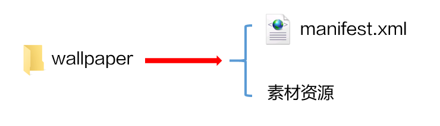
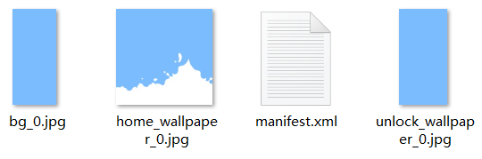

# 可交互桌面&lt;CommonWallpaper&gt;

## 功能概述

可交互桌面基本全面继承现有锁屏的功能和写法，暂不支持的能力后面会陆续验证测试开放，桌面脚本使用前请注意是否支持。

目前支持的动效如下：

| 标签 | 释义 |
| --- | --- |
| &lt;Text&gt; | 文本 |
| &lt;Image&gt; | 图片 |
| &lt;Time&gt; | 时间 |
| &lt;DateTime&gt; | 日期 |
| &lt;CountDownTime&gt; | 倒计时 |
| &lt;ImageNumber&gt; | 数字图片 |
| &lt;SourceImage&gt; | 帧解锁视图 |
| &lt;Mask&gt; | 遮罩 |
| &lt;GroupImage&gt; | 图片混合 |
| &lt;Geometrical figure&gt; | 几何图形 |
| &lt;PathUtil&gt; | 路径解析 |
| &lt;Group&gt; | 视图组 |
| &lt;VirtualScreen&gt; | 虚拟屏幕 |
| &lt;Var&gt; | 自定义变量 |
| &lt;GlobalVariable&gt; | 全局变量 |
| &lt;Array&gt; | 控件数组 |
| &lt;Expression&gt; | 数字表达式 |
| &lt;StringExpression&gt; | 字符串表达式 |
| &lt;VarSpeedFun&gt; | 变速函数 |
| &lt;SensorBinder&gt; | 传感器 |
| &lt;BatteryCharging&gt; | 充电状态 |
| &lt;shake&gt; | 摇一摇 |
| &lt;frameRate&gt; | 恒定帧率 |
| &lt;VariableFramerate&gt; | 可变帧率 |
| &lt;AlphaAnimation&gt; | 透明度动画 |
| &lt;PositionAnimation&gt; | 位移动画 |
| &lt;RotationAnimation&gt; | 旋转动画 |
| &lt;SizeAnimation&gt; | 缩放动画 |
| &lt;SourcesAnimation&gt; | 帧动画 |
| &lt;VariableAnimation&gt; | 变量动画 |
| &lt;TimeAnimation&gt; | 时间动画 |
| &lt;Command&gt; | 基础命令 |
| &lt;SoundCommand&gt; | 声音命令 |
| &lt;visibility&gt; | 可见性命令 |
| &lt;VariableCommand&gt; | 变量命令 |
| &lt;GroupCommands | 命令组 |
| &lt;CycleCommand&gt; | 周期命令 |
| &lt;vibrate&gt; | 震动设置 |
| &lt;MultiScreens&gt; | 多屏幕展示 |
| &lt;LiveWallpaper&gt; | 视频桌面 |
| &lt;CommonWallpaper&gt; | 全景桌面 |
| &lt;WaterWallpaper&gt; | 水波纹 |
| &lt;PathRun&gt; | 路径动画 |
| &lt;Graph&gt; | 图形渲染 |
| &lt;MeshImage&gt; | 网格化 |
| &lt;VR&gt; | 全景动效 |
| &lt;Button&gt; | 按钮（pressed事件不起作用） |


在可交互桌面中，以下功能请谨慎使用，避免被桌面图标遮挡或与桌面交互冲突。

* 文字类：时间&lt;Time&gt;、文本&lt;Text&gt;、日期&lt;DateTime&gt;、数字图片&lt;ImageNumber&gt;、倒计时&lt;CountDownTime&gt;。
* 交互类：帧解锁视图&lt;SourceImage&gt;、多屏幕展示&lt;MultiScreens&gt;、水波纹&lt;WaterWallpaper&gt;、网格化&lt;MeshImage&gt;、按钮&lt;Button&gt;。

## 使用说明

1. 可交互桌面不支持使用视频&lt;Video&gt;控件，如需在桌面上使用视频资源，请使用[视频桌面&lt;LiveWallpaper&gt;](/docs/distribute/content-dist/theme-center/development-tutorial-0000001054519376/themes-engine-0000001054452463/themes-engine4-0000002530591413/application-range1-0000001258343478/livewallpaper-0000001073967005)。
2. 配置主题包时，必须要在description.xml中添加以下新增项：HWThemeEngine，示例如下：

   ```
   <?xml version="1.0" encoding="UTF-8"?>
     <HwTheme>
           <title>video_0402</title>
           <title-cn>无声1</title-cn>
           <author>author_name</author>
           <designer>designer_name</designer>
           <screen>FHD</screen>
           <version>10.0.0</version>
           <font>Default</font>
           <font-cn>默认</font-cn>
           //新增项
           <wallpaper>HWThemeEngine</wallpaper>
           <briefinfo>请在这里输入对主题的描述</briefinfo>
     </HwTheme>
   ```

## 结构说明

wallpaper文件夹下有1个manifest.xml文件和素材资源。



设计师可在manifest.xml文件中调用素材资源，使用脚本编写各式各样的动态效果。

wallpaper文件夹资源示例：



## manifest.xml

manifest.xml是视频桌面的描述文件，通过&lt;CommonWallpaper&gt;标签将描述内容包括在里面。

### XML规范

```
<CommonWallpaper version="" frameRate="" displayDesktop="" screenWidth="">
</CommonWallpaper>
```

### &lt;CommonWallpaper&gt;参数说明

通过主标签&lt;CommonWallpaper&gt;，能够设置帧率、震动开关、默认屏幕宽度等参数。

| 参 数 | 类 型 | 选 项 | 注 释 |
| --- | --- | --- | --- |
| frameRate | 数值 | 选填 | 锁屏帧率设置，单位为(帧/秒)，控制动画等动效刷新速率，默认值为60fps。 |
| screenWidth | 数值 | 选填 | 描述文件的虚拟的屏幕宽度，根据该宽度和手机屏幕的宽高比能够计算出相应的虚拟的屏幕的高度。描述文件中的数值基于该虚拟的屏幕的宽高，例如分辨率为1560\*720的手机在设置screenWidth为1080的描述文件中，其#screen\_width为1080,#screen\_height为1920，能够保持在同一个屏幕宽高比例的手机中组件的相对位置保持不变。设定屏幕宽度标准。如果指定为720,锁屏中所有元素的位置都按720p的布局编写，1080p、480p等分辨率的手机会自动进行缩放。 |


可交互桌面支持60帧，设置frameRate="60"即可。

```
<CommonWallpaper version="1" frameRate="60" displayDesktop="true" screenWidth="1080">
```

## 应用示例

<strong>示例</strong> <strong>一</strong>：在桌面上使用流体动效。

* wallpaper/manifest.xml 脚本

```
<CommonWallpaper id="201805221979" screenWidth="1080" displayDesktop="true" frameRate="30" version="1">
        <Var const="true" persist="true" expression="#screen_width" name="w"/>
        <Var const="true" persist="true" expression="#screen_height" name="h"/>
        <Var expression="1" name="gravityRatio"/>
        <Var expression="0.1" name="viscosity"/>
        <FluidsView bgSrc="bg_0.jpg" waterAlpha="1" color="argb(255, 255, 255, 255)" viscosity="#viscosity" gravityRatio="#gravityRatio">
               <CircleShape yPosition="1.5" xPosition="0.7" radius="2"/>
        </FluidsView>
</CommonWallpaper>
```

<strong>示例二</strong>：锁屏和桌面均支持点击屏幕切换壁纸。

* unlock/lockscreen/manifest.xml 脚本

```
<Lockscreen displayDesktop="true" frameRate="60" id="201905098326" screenWidth="1080" version="1" vibrate="false">
	<Var expression="1" name="cartoon" />
	<Button x="500" y="1800" w="#screen_width" h="#screen_height">
		<Trigger action="down">
			<VariableCommand name="cartoon" expression="#cartoon+1" condition="lt(#cartoon,6)"/>
			<VariableCommand name="cartoon" expression="1" condition="eq(#cartoon,6)"/>
		</Trigger>
	</Button>
	<Image x="0" y="0" w="#screen_width" h="#screen_height" src="tu/unlock_wallpaper.jpg" srcid="#cartoon" />
	<Text x="500" y="1800" size="60" color="#ffff0000" format="cartoon的值是：%d" paras="#cartoon"/>
</Lockscreen>
```

* wallpaper/manifest.xml 脚本

```
<CommonWallpaper version="1" frameRate="30" displayDesktop="true" screenWidth="1080">
	<Var expression="1" name="cartoon" />
	<Button x="500" y="1800" w="#screen_width" h="#screen_height">
		<Trigger action="down">
			<VariableCommand name="cartoon" expression="#cartoon+1" condition="lt(#cartoon,6)"/>
			<VariableCommand name="cartoon" expression="1" condition="eq(#cartoon,6)"/>
		</Trigger>
	</Button>
	<Image x="0" y="0" w="#screen_width" h="#screen_height" src="tu/unlock_wallpaper.jpg" srcid="#cartoon" />
	<Text x="500" y="1800" size="60" color="#ffff0000" format="cartoon的值是：%d" paras="#cartoon"/>
</CommonWallpaper>
```