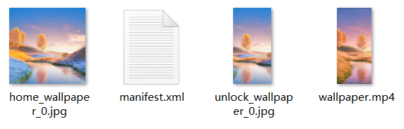

# 视频桌面&lt;LiveWallpaper&gt;

## 功能概述

支持动态视频桌面。同时支持左右滑动桌面时，切换播放所设置的视频区间，还支持设置是否播放视频声音。

## 使用说明

1. 视频桌面&lt;LiveWallpaper&gt;为独立模块，仅支持动态视频桌面。不支持与[可交互桌面&lt;CommonWallpaper&gt;](https://developer.huawei.com/consumer/cn/doc/content/interactivewallpaper-0000001170976217)中的动效共同使用。
2. 锁屏类型需要是使用华为官方主题引擎的动态锁屏。
3. 需在对应的版本中，视频桌面才生效：主题APP11.0.7.300以上版本、华为官方主题引擎4.5以上版本。
4. 配置主题包时，必须要在description.xml中添加以下新增项：HWThemeEngine，示例如下：

   ```
   <?xml version="1.0" encoding="UTF-8"?>
     <HwTheme>
           <title>video_0402</title>
           <title-cn>无声1</title-cn>
           <author>author_name</author>
           <designer>designer_name</designer>
           <screen>FHD</screen>
           <version>10.0.0</version>
           <font>Default</font>
           <font-cn>默认</font-cn>
           //新增项
           <wallpaper>HWThemeEngine</wallpaper>
           <briefinfo>请在这里输入对主题的描述</briefinfo>
     </HwTheme>
   ```

## 应用场景

* 在桌面上播放动态视频。
* 在桌面上滑动，感受四季变化。

## 结构说明

wallpaper文件夹下有1个manifest.xml文件和1个xx.mp4视频资源。


设计师可在manifest.xml文件中调用视频资源，在桌面上实现视频动效。

<strong>视频资源规范：</strong>

* 格式：MP4
* 大小：建议在20MB以内
* 尺寸：建议1080\*1920
* 编解码：H.264
* 时长：20秒以内
* 帧率：建议&lt;25帧/秒
* 码率：建议&lt;3000kbps
* 视觉：为保证预览效果，请提供能循环播放的视频，确保首尾衔接部分流畅，不会出现画面跳动或者闪烁。

<strong>wallpaper文件夹资源示例：</strong>



## manifest.xml

manifest.xml是视频桌面的描述文件，通过&lt;LiveWallpaper&gt;标签将描述内容包括在里面。

### XML规范

```
<LiveWallpaper version="" frameRate="" screenWidth="">
	<VideoWallpaper src="" timeSequences="" haveVideoVoice="" isMusic="" turn=""/>
</LiveWallpaper>
```

### &lt;VideoWallpaper&gt;参数说明

通过子标签&lt;VideoWallpaper&gt;，能够设置具体的视频资源、适配方式等参数。

| 参 数 | 类 型 | 选 项 | 注 释 |
| --- | --- | --- | --- |
| src | 数值 | 必填 | 视频的文件路径。 |
| timeSequences | 数值 | 选填 | 视频播放时间序列，支持小数点，默认0s秒开始。若第一个值大于0s，则从指定时间开始。若存在多个时间区，用英文逗号","分隔开来。如果视频总时长大于最后一个值，则该值到视频末尾为最后一段视频。左右滑动可以来回切换设置的时间区间，在某一时间区间内视频循环播放。 |
| haveVideoVoice | 数值 | 选填 | 是否有声音，默认false。 |
| isMusic | 字符串 | 选填 | 是否支持主动获取三方音乐app的播放与暂停，true/false，默认值为false。如果选择true，注意在wallpaper目录下，unlock\_wallpaper\_0.jpg需要是透明图片。 |
| turn | 数值 | 选填 | 主动获取三方音乐app时，会提供一段视频素材（注意：视频素材需要是无音轨的视频）。假设视频共15秒，前9秒（不含第9秒）是播放音乐暂停时的视频，9-15秒是播放音乐播放时的视频，那么9秒即为turn的值，单位是秒。 |
| loop | 字符串 | 选填 | 是否支持循环播放，默认为true，设置为false时播放完一段视频时会暂停。  说明：  视频分段时生效，不分段时不生效。 |
| canBeInterrupt | 字符串 | 选填 | 是否支持视频播放过程中滑动切换视频，默认为true，即视频播放过程中左右滑动会切换视频。 |
| toNext | 字符串 | 选填 | 视频分为多段情况下，从左往右滑动屏幕时，是否播放下一段视频。默认为false播放的是上一段，设置为true则播放下一段。 |
| scaleType | 字符串 | 选填 | 支持fill、center\_crop，默认为center\_crop模式。   * fill 表示填充满屏幕的宽高，若视频比例与屏幕不匹配会导致视频拉伸。 * center\_crop 表示视频等比缩放并居中充满整个屏幕的宽高，多余部分裁剪。 |


1. timeSequences写的秒数，不是帧数。那timeSequences的值如何代表时间序列的？

   例如，timeSequences="0,5,8"表示默认循环播放0到5秒，如果手指滑动换屏，则播放5到8秒。通过这个方式可以实现：用户滑动手指的时候，桌面视频效果相应发生变化。例如，将视频分为春、夏、秋、冬4段，滑动界面实现四季的变化。
2. 注意当loop="true"时，视频会循环播放，此时如果设置canBeInterrupt="false"（不支持视频播放过程中滑动切换视频），则会导致一直循环播放当前视频片段。

## 应用示例

<strong>示例一：</strong>将时长7秒视频分为3段，滑动界面实现四季的变化。

[](https://alliance-communityfile-drcn.dbankcdn.com/FileServer/getFile/publicContent/011/111/111/0000000000011111111.20251218173445.05346533043424176850754141947632:20260601221609:2800:69B2530FCCBE63BBC2A4DAFF2ED2D6EE03433BE9CA0E29EC8A3736D5737E73C4.mp4)

wallpaper/manifest.xml 脚本：

```
<LiveWallpaper id="201809057087" screenWidth="1080" frameRate="30" version="1">
     <VideoWallpaper toNext="true" canBeInterrupt="false" loop="false" haveVideoVoice="true" timeSequences="0,2,5,7" src="wallpaper.mp4"/>
</LiveWallpaper>
```