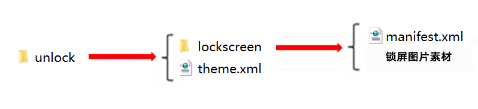
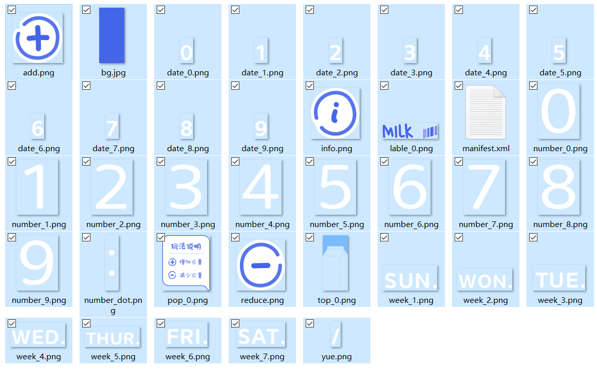

# 锁屏&lt;Lockscreen&gt;

## 功能概述

动态引擎通过解析unlock/lockscreen文件下的manifest.xml文件，生成一个丰富多彩、符合设计者预期的画面应用在锁屏中，使锁屏变得生动有趣。

## 结构说明

动态锁屏unlock文件夹下有一个lockscreen文件夹和一个theme.xml文件。

设计师可以在lockscreen文件夹下，建立一个manifest.xml文件，调用制作的图片素材，使用脚本编写各式各样的动态效果。



lockscreen文件夹中的资源示例：



## manifest.xml

manifest.xml是动态锁屏的描述文件，通过&lt;Lockscreen&gt;标签将描述内容包括在里面。

其中主标签&lt;Lockscreen&gt;中能够设置帧率、震动开关、默认屏幕宽度等参数。

### XML规范

```
<Lockscreen frameRate="" vibrate="" screenWidth="" pressure="">
</Lockscreen>
```

### &lt;Lockscreen&gt;参数说明

| 参 数 | 类 型 | 选 项 | 注 释 |
| --- | --- | --- | --- |
| pressure | 字符串 | 选填 | 是否响应屏幕压力（需要设备支持），true为支持，false为不支持，默认为false。 |
| frameRate | 数值 | 选填 | 锁屏帧率设置，单位为(帧/秒)，控制动画等动效刷新速率，默认值为60fps。 |
| vibrate | 字符串 | 选填 | 控制项目中是否开启震动，具体震动场景见震动设置章节；滑动，解锁控件等是否默认震动。true为震动，false为不震动，默认为true。 |
| screenWidth | 数值 | 选填 | 描述文件的虚拟的屏幕宽度，根据该宽度和手机屏幕的宽高比能够计算出相应的虚拟的屏幕的高度。描述文件中的数值基于该虚拟的屏幕的宽高，例如分辨率为1560\*720的手机在设置screenWidth为1080的描述文件中，其#screen\_width为1080,#screen\_height为1920，能够保持在同一个屏幕宽高比例的手机中组件的相对位置保持不变。设定屏幕宽度标准。如果指定为720，锁屏中所有元素的位置都按720p的布局编写。1080p、480p等分辨率的手机会自动进行缩放。 |

## 应用示例

<strong>示例：</strong>展示时间日期充电状态并且包括解锁模块的锁屏示例。

```
<Lockscreen version="1" frameRate="30" vibrate="false" screenWidth="1080" id="201906225469">
  <Var name="notification" expression="1"/>
  <Image src="bj.jpg"/>
  <Time x="540" y="155" align="center" alignV="center" src="time.png"/>
  <Group x="170" y="10">
    <Image x="200" y="230" srcid="#year/1000" src="date.png"/>
    <Image x="200+20" y="230" srcid="#year/100%10" src="date.png"/>
    <Image x="200+40" y="230" srcid="#year%100/10" src="date.png"/>
    <Image x="200+60" y="230" srcid="#year%10" src="date.png"/>
    <Image x="200+80" y="230" src="date_dot.png"/>
    <Image x="200+100" y="230" src="date.png" srcid="(#month+1)/10"/>
    <Image x="200+120" y="230" src="date.png" srcid="(#month+1)%10"/>
    <Image x="200+140" y="230" src="date_dot.png"/>
    <Image x="200+160" y="230" src="date.png" srcid="#date/10"/>
    <Image x="200+180" y="230" src="date.png" srcid="#date%10"/>
    <Image x="200+220" y="230" src="week.png" srcid="#day_of_week"/>
  </Group>
  <Unlocker name="unlocker" bounceInitSpeed="2000" bounceAcceleration="3000">
    <StartPoint x="0" y="0" w="1080" h="#screen_height"></StartPoint>
    <EndPoint x="0" y="-350" w="1080" h="200">
      <Path x="0" y="0" w="1080" h="#screen_height">
        <Position x="0" y="0"/>
        <Position x="0" y="-180"/>
      </Path>
    </EndPoint>
  </Unlocker>
  <!-- 电量不足提醒 -->
  <Text x="#screen_width/2" y="(#screen_height)-10" category="BatteryLow" alignV="bottom" color="#000000" size="48" text="电量不足！" alpha="180" align="center"/>
  <!-- 充电中提醒 -->
  <Text x="#screen_width/2" y="(#screen_height)-10" category="Charging" alignV="bottom" color="#000000" align="center" size="42" format="充电中 %d%%" alpha="180" paras="#battery_level"/>
  <!-- 电量充满提醒 -->
  <Text x="#screen_width/2" y="(#screen_height)-10" category="BatteryFull" alignV="bottom" color="#000000" size="42" text="充电完成!" alpha="180" align="center"/>
</Lockscreen>
```