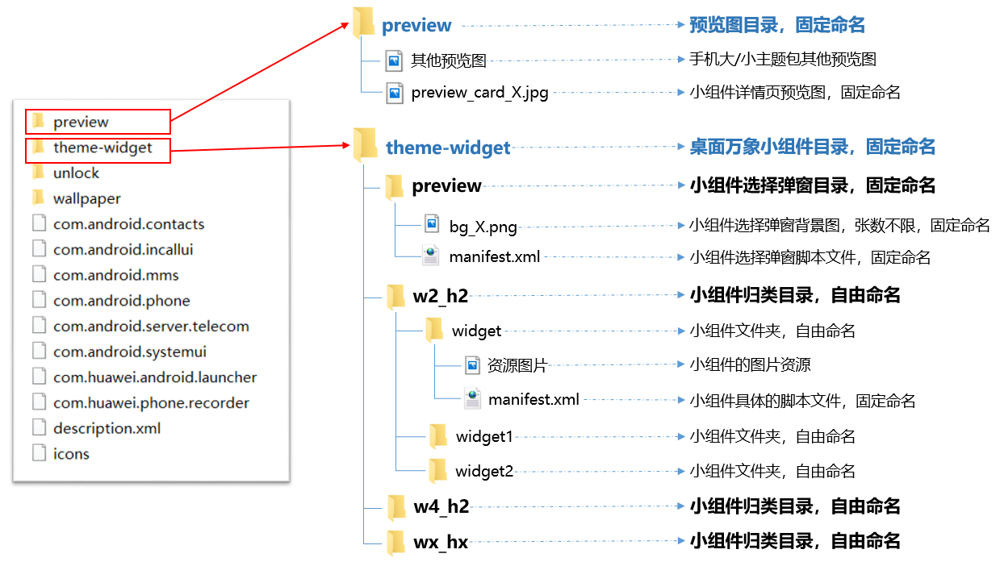
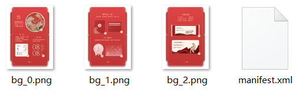
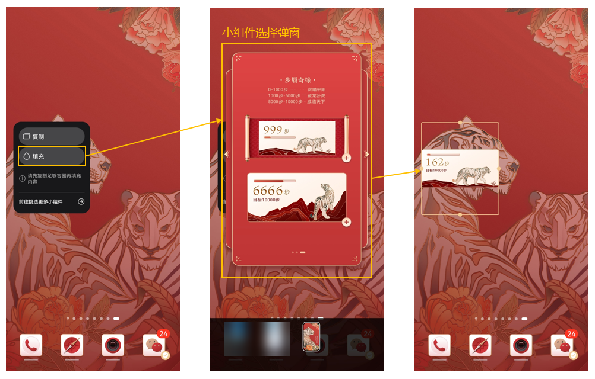
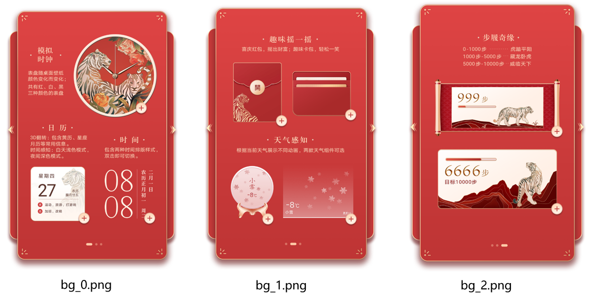
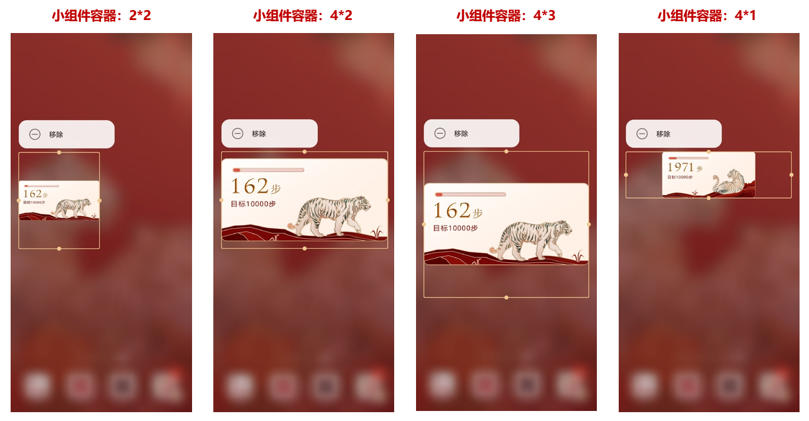
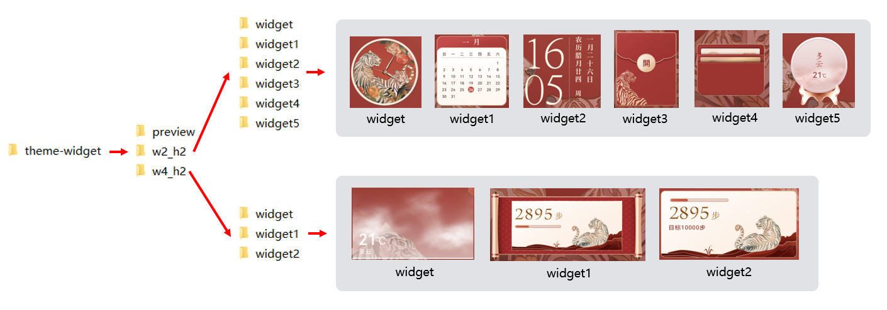
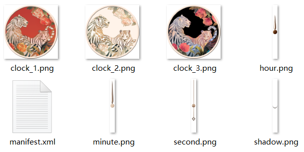
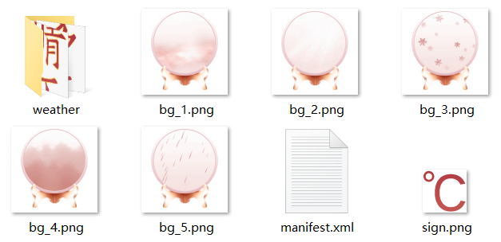
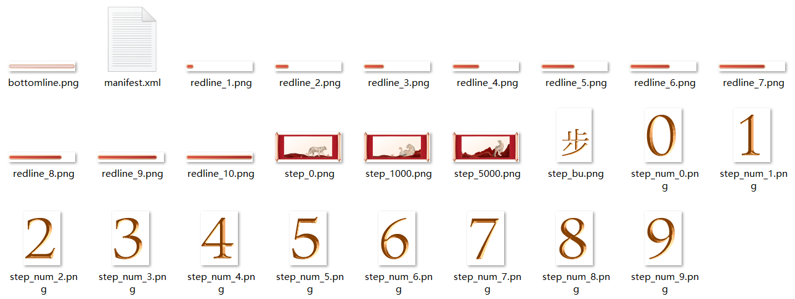
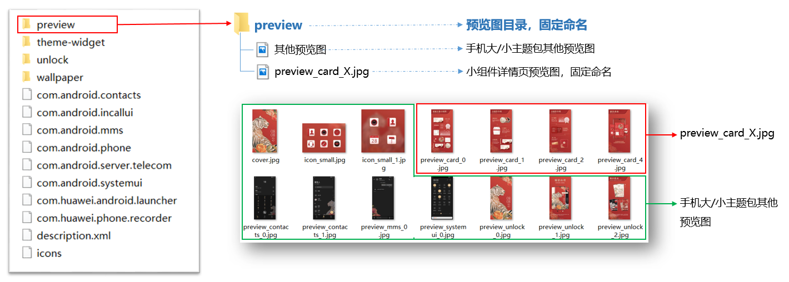

import MergeTable from '@site/src/components/MergeTable';

# 桌面万象小组件（随主题包一起上架）

## 功能概述

支持桌面万象小组件随手机主题包一起上架。应用时可根据自己的想法将桌面万象小组件自由组合，打造个性化桌面。

桌面万象小组件示例：时钟、天气、音乐、日历、步数、倒计时等小组件。

[](https://alliance-communityfile-drcn.dbankcdn.com/FileServer/getFile/publicContent/011/111/111/0000000000011111111.20251218173449.63762305169090321210458195385836:20260601221615:2800:836AEBE104A4CF8FCD93E1F2F08D1E7216548B8B0DBCE04F4EC4B203411844A6.mp4)

## 使用说明

* <strong>支持设备：</strong>桌面万象小组件支持应用于直板手机、平板和折叠屏。
* <strong>版本要求：</strong>主题APP需升级到12.0.12.300及以上版本，才能使用主题包内的桌面万象小组件功能。

* <strong>支持的引擎能力：</strong>详见[桌面万象小组件支持的引擎能力](#section4184191812517)。
* <strong>不支持的引擎能力：</strong>[视频](https://developer.huawei.com/consumer/cn/doc/content/video-0000001073497817)、[帧解锁视图](https://developer.huawei.com/consumer/cn/doc/content/sourceimage-0000001073857910)、[滑块](https://developer.huawei.com/consumer/cn/doc/content/slider-0000001073875027)、[解锁](https://developer.huawei.com/consumer/cn/doc/content/unlocker-0000001073866952)、[命令组](https://developer.huawei.com/consumer/cn/doc/content/groupcommand-0000001073778623)、[周期命令](https://developer.huawei.com/consumer/cn/doc/content/cyclecommand-0000001074166630)、[充电状态](https://developer.huawei.com/consumer/cn/doc/content/batterycharging-0000001074325216)、[多屏幕展示](https://developer.huawei.com/consumer/cn/doc/content/multiscreens-0000001073884837)、[流体动效](https://developer.huawei.com/consumer/cn/doc/content/fluidsview-0000001194289627)、[新充电动效](https://developer.huawei.com/consumer/cn/doc/content/emui11-0000001074184130)、[笔刷](https://developer.huawei.com/consumer/cn/doc/content/paint-0000001074333817)、[下落动效](https://developer.huawei.com/consumer/cn/doc/content/dropphysicalview-0000001074173881)、[VR全景](https://developer.huawei.com/consumer/cn/doc/content/vr-0000001096534881)、[延时解锁](https://developer.huawei.com/consumer/cn/doc/content/delayunlock-0000001074662022)、[水波纹](https://developer.huawei.com/consumer/cn/doc/content/waterwallpaper-0000001073984221)和[立体图层](https://developer.huawei.com/consumer/cn/doc/content/multilayer-0000001074173883)。
* <strong>小组件总个数限制：</strong>

  | 脚本数量 | 桌面万象小组件总个数 |
  | --- | --- |
  | 使用复杂脚本（如超过20个[自定义变量](https://developer.huawei.com/consumer/cn/doc/content/variant-0000001074315406)，脚本超过500行）。 | 不可超过6个。 |
  | 如果脚本比较简单（如只有静态图+APP跳转链接），对功耗影响可控。 | 暂无限制。 |

## 主题包结构

桌面万象小组件随手机主题包一起上架时，结构如下图所示：

* 新增theme-widget文件夹（桌面万象小组件目录）。
* 新增preview\_card\_X.jpg（桌面万象小组件预览图），加入手机主题包已有的preview文件夹中。



## theme-widget/preview

theme-widget文件夹下的preview文件夹为小组件选择弹窗目录，包含多张bg\_X.png和一个manifest.xml文件。



应用场景：在桌面上添加小组件容器后，点击“填充”将出现小组件选择弹窗，用户在此弹窗中选择并添加某个具体的小组件。



### bg\_X.png

bg\_X.png为小组件选择弹窗背景图。

<strong>样例参考：</strong>



<strong>规格要求：</strong>

* 命名：固定命名为bg\_X.png。
* 张数：一张或多张，有多张时X=0,1,2…
* 背景尺寸：984\*1656px。

* 格式：png。


1. bg\_X.png尺寸固定为984\*1656px，已上架的包含桌面万象小组件的主题资源由主题引擎完成等比缩放兼容适配。
2. 小组件选择弹窗背景图上需描述清楚各个组件的功能和交互方式，描述需与实际应用后的效果相符。

### manifest.xml文件

此manifest.xml文件是小组件选择弹窗的脚本文件，规定了弹窗的大小和每个小组件的添加方式。

<strong>xml规范</strong>

```
<?xml version="1.0" encoding="UTF-8"?>
<Widget version="1" screenWidth="984" screenHeight="1656" frameRate="30" displayDesktop="true">

    <Image y="" x="" w="" src="" h=""/>
    <Button y="" x="" w="" h="">
       <Trigger action="">
           <ExternCommand condition="" command=""/>
       </Trigger>
    </Button>

</Widget>
```


1. 桌面万象小组件的主标签&lt;Widget&gt;在主题APP 12.0.16及以上版本中支持。
2. bg\_X.png尺寸固定为984\*1656px，此对应的manifest.xml的大小也应为984\*1656px，即screenHeight="1656" ，screenWidth="984" 。
3. command的值是添加小组件的路径。每个command的值，需与实际小组件的名称和路径一一对应。例如：command="w2\_h2/widget"，添加的是w2\_h2文件夹中的小组件widget；command="w4\_h2/widget2"，添加的是w4\_h2文件中的小组件widget2。文件夹命名详见[theme-widget/wx\_hx文件夹](#section311713318252)说明。
4. 添加每个小组件时，需使用action="click"（触发动作明显），不要使用action="down"（触发动作不明显），避免滑动屏幕时误操作。

<strong>xml示例</strong>

```
<?xml version="1.0" encoding="UTF-8"?>
<Widget version="1" screenWidth="984" screenHeight="1656" frameRate="30" displayDesktop="true">
    <Var persist="true" expression="#screen_width" const="true" name="w"/>
    <Var persist="true" expression="#screen_height" const="true" name="h"/>
    <Var expression="0" name="group"/>

    <!-- 第1组 -->
    <Group visibility="eq(#group,0)">
    <Image y="0" x="0" w="#screen_width" src="bg1.png" h="#screen_height"/>
    <!-- 模拟时钟 -->
    <Button y="150" x="359" w="471.5" h="490.1">
       <Trigger action="click">
           <ExternCommand condition="1" command="w2_h2/widget"/>
       </Trigger>
    </Button>
    <!-- 3D翻转 -->
    <Button y="870" x="119" w="336.7" h="372">
        <Trigger action="click">
            <ExternCommand condition="1" command="w2_h2/widget1"/>
        </Trigger>
    </Button>
    <!-- 时间UI -->
    <Button y="870" x="512" w="312.9" h="372">
        <Trigger action="click">
           <ExternCommand condition="1" command="w2_h2/widget2"/>
        </Trigger>
    </Button>
    </Group>

    <!-- 第2组 -->
    <Group visibility="eq(#group,1)">
    <Image y="0" x="0" w="#screen_width" src="bg2.png" h="#screen_height"/>
    <!-- 卡片 -->
    <Button y="363" x="469" w="362.7" h="301.3">
        <Trigger action="click">
           <ExternCommand condition="1" command="w2_h2/widget3"/>
        </Trigger>
    </Button>
    <!-- 红包 -->
    <Button y="317" x="141" w="315.3" h="375.7">
      <Trigger action="click">
         <ExternCommand condition="1" command="w2_h2/widget4"/>
      </Trigger>
    </Button>
    <!-- 天气2 -->
    <Button y="898" x="131" w="264.1" h="326.4">
       <Trigger action="click">
          <ExternCommand condition="1" command="w2_h2/widget5"/>
       </Trigger>
    </Button>
    <!-- 天气1 -->
    <Button y="900" x="414" w="415.7" h="324.6">
        <Trigger action="click">
            <ExternCommand condition="1" command="w4_h2/widget"/>
        </Trigger>
    </Button>
    </Group>

    <!-- 第3组 -->
    <Group visibility="eq(#group,2)">
    <Image y="0" x="0" w="#screen_width" src="bg3.png" h="#screen_height"/>
    <!-- 步数1 -->
    <Button y="419" x="123" w="706.8" h="336.7">
        <Trigger action="click">
            <ExternCommand condition="1" command="w4_h2/widget1"/>
        </Trigger>
    </Button>
    <!-- 步数2 -->
    <Button y="782" x="124" w="705.9" h="389.7">
        <Trigger action="click">
            <ExternCommand condition="1" command="w4_h2/widget2"/>
        </Trigger>
    </Button>
    </Group>

    <Button y="590" x="0" w="100" h="212">
        <Trigger action="click">
            <VariableCommand expression="ifelse(gt(#group,0), #group-1, #group)" name="group"/>
        </Trigger>
    </Button>

    <Button y="590" x="839" w="100" h="212">
        <Trigger action="click">
            <VariableCommand expression="ifelse(lt(#group,2), #group+1, #group)" name="group"/>
        </Trigger>
    </Button>

    <Button y="0" x="0" w="#w" h="#h">
        <Trigger action="up">
            <VariableCommand expression="ifelse(lt(#group,2), #group+1, #group)" name="group" condition="gt(#touch_begin_x-#touch_x,150)"/>
            <VariableCommand expression="ifelse(gt(#group,0), #group-1, #group)" name="group" condition="lt(#touch_begin_x-#touch_x,-150)"/>
        </Trigger>
    </Button>

</Widget>
```

## theme-widget/wx\_hx文件夹

在桌面上添加小组件容器后，点击“填充”将出现小组件选择弹窗，用户在此弹窗中选择并添加某个具体的小组件。


添加的小组件容器默认尺寸为2\*2，可以根据当前填充的小组件内容，将其调整至合适尺寸。

<strong>制作桌面万象小组件主题包时，</strong> <strong>建议将在相同尺寸的小组件容器中填充效果较好的小组件，归类放在同一个文件夹中，这个归类文件夹建议命名为：wx\_hx（wx为小组件容器的宽，hx为小组件容器的高，x为尺寸值，取值范围1-6）。归类文件夹可以根据需要，添加多个</strong>。

例如：当前填充的小组件为步数小组件，在默认的2\*2小组件容器中填充效果不太好。手动将小组件容器尺寸调整为4\*2时，步数小组件的填充效果较好。则可以将步数小组件归类放在w4\_h2文件夹中。



<strong>wx\_hx文件夹更多示例：</strong>

* 模拟时钟、日历、时间、红包、卡片、天气这6个小组件在2\*2的小组件容器中展示效果较好，归类放在w2\_h2文件夹中。
* 投影天气、步数1和步数2这3个小组件在4\*2的小组件容器中展示效果较好，归类放在w4\_h2文件夹中。



<strong>wx\_hx文件夹说明：</strong>

归类文件夹名称和小组件文件夹名称确定后，需要与[manifest.xml](#section774124162612)文件中command的值一一对应，command的值是添加小组件的路径。

示例：command="w2\_h2/widget"，添加的是w2\_h2文件夹中的widget，即模拟时钟组件；command="w4\_h2/widget2"，添加的是w4\_h2文件中的widget2，即步数2组件。

```
    <!-- 模拟时钟 -->
    <Button y="150" x="359" w="471.5" h="490.1">
       <Trigger action="click">
           <ExternCommand condition="1" command="w2_h2/widget"/>
       </Trigger>
    </Button>

    <!-- 步数2 -->
    <Button y="782" x="124" w="705.9" h="389.7">
        <Trigger action="click">
            <ExternCommand condition="1" command="w4_h2/widget2"/>
        </Trigger>
    </Button>
```

## theme-widget/wx\_hx/widget

widget是小组件文件夹，包含当前小组件使用的资源图片和manifest.xml文件。



### 资源图片

* 图片格式：png。
* 命名：自由命名，可包含英文、数字。

### manifest.xml文件

<strong>xml规范</strong>

```
<?xml version="1.0" encoding="UTF-8"?>
<Widget screenHeight="" screenWidth="" displayDesktop="true" frameRate="30" version="1">
</Widget>
```

<strong>xml注意事项</strong>

1. manifest.xml中必须设置screenHeight、screenWidth来规定小组件的初始宽高。调整小组件容器大小时，小组件内容按照初始宽高比例等比例缩放。
2. 除了随主题包一起上架外，桌面万象小组件还支持单独上架，单独上架时需制作[8类功能小组件](https://developer.huawei.com/consumer/cn/doc/content/widget-separate-0000001337881265#section917119230119)，且8类功能小组件需制作2\*2和4\*2两种尺寸。便于后续高效适配单独上架的场景，在随手机主题包一起上架的资源包中，功能小组件也建议以2\*2和4\*2两种尺寸进行制作，详情请查看[8类功能小组件尺寸要求](https://developer.huawei.com/consumer/cn/doc/content/widget-separate-0000001337881265#section106036367476)。
3. manifest.xml中使用步数、时钟、天气、日历时，必须设置对应的应用跳转链接，且触发跳转需使用action="click"（触发动作明显），不要使用action="down"（触发动作不明显），避免滑动屏幕时误操作。

   步数：action="android.intent.action.MAIN" package="com.huawei.health" class="com.huawei.health.MainActivity"

   时钟：action="android.intent.action.MAIN" package="com.android.deskclock" class="com.android.deskclock.AlarmsMainActivity"

   天气：action="android.intent.action.MAIN" package="com.huawei.android.totemweather" class="com.huawei.android.totemweather.WeatherHome"

   日历：action="android.intent.action.MAIN" package="com.android.calendar" class="com.android.calendar.AllInOneActivity"

   ```
       <!-- 示例：跳转至天气应用，跳转方式为click -->
       <Button y="0" x="0" w="940" h="940">
          <Trigger action="click">
             <IntentCommand action="android.intent.action.MAIN" package="com.huawei.android.totemweather" condition="1" class="com.huawei.android.totemweather.WeatherHome"/>
          </Trigger>
       </Button>
   ```
4. 小组件中使用天气数据时，必须设置天气刷新命令（脚本示例如下），详见[小组件示例：天气](#section75951024193310)。

   ```
      <ExternalCommands>
           <Trigger action="resume">
               <RefreshWeatherCommand/>
           </Trigger>
           <Trigger action="pause"/>
       </ExternalCommands>
   ```

### 小组件示例：模拟时钟

* <strong>切图资源</strong>


* <strong>关键脚本</strong>

```
<?xml version="1.0" encoding="UTF-8"?>
<Widget screenHeight="940" screenWidth="940" displayDesktop="true" frameRate="30" version="1">
    <Group visibility="true" y="0" x="0">
        <Image visibility="eq(#bg_id,0)" y="0" x="0" src="clock_1.png"/>
        <Image visibility="eq(#bg_id,1)" y="0" x="0" src="clock_2.png"/>
        <Image visibility="eq(#bg_id,2)" y="0" x="0" src="clock_3.png"/>
        <Image y="90" x="435" src="minute.png" rotation="360*(#minute/60)" pivotY="380" pivotX="35"/>
        <Image y="90" x="435" src="hour.png" rotation="360*(#hour12/12)+30*(#minute/60)" pivotY="380" pivotX="35"/>
        <Image y="90" x="435" src="second.png" rotation="360*(#second/60)" pivotY="380" pivotX="35"/>
     </Group>

     <Button y="0" x="0" h="940" w="940">
        <Trigger action="click">
           <IntentCommand action="android.intent.action.MAIN" class="com.android.deskclock.AlarmsMainActivity" package="com.android.deskclock"/>
        </Trigger>
     </Button>
</Widget>
```

### 小组件示例：天气

* <strong>切图资源</strong>



* <strong>关键脚本</strong>

```
<?xml version="1.0" encoding="UTF-8"?>
<Widget screenHeight="940" screenWidth="940" displayDesktop="true" frameRate="30" version="1">
    <Var persist="true" expression="#screen_width" const="true" name="w"/>
    <Var persist="true" expression="#screen_height" const="true" name="h"/>

    <ExternalCommands>
        <Trigger action="resume">
            <RefreshWeatherCommand/>
        </Trigger>
        <Trigger action="pause"/>
    </ExternalCommands>

    <Weather>
        <Var expression="0" name="Weather.today.weatherid" type="int"/>
        <!-- 今天天气 -->
        <Var expression="0" name="Weather.today.weatherDes" type="string"/>
        <!-- 今天天气 -->
        <Var expression="0" name="Weather.today.currentTem" type="int"/>
        <!-- 当前气温 -->
        <Var expression="0" name="Weather.today.maxtemp" type="string"/>
        <!-- 最高气温 -->
        <Var expression="0" name="Weather.today.mintemp" type="string"/>
        <!-- 最低气温 -->
        <Var expression="0" name="Weather.today.winddirDes" type="string"/>
        <!-- 风向 -->
        <!--Var name="Weather.today.dressingLevel" expression="0" type="string"/-->
        <!-- 穿衣 -->
        <Var expression="0" name="Weather.today.humidity" type="string"/>
        <!-- 湿度 -->
        <Var expression="0" name="Weather.today.aqivaluetext" type="string"/>
        <!-- 空气 -->
        <!--Var name="Weather.today.sportsLevel" expression="0" type="string"/-->
        <!-- 运动 -->
        <Var expression="0" name="Weather.today.coldLevel" type="string"/>
        <!-- 感冒 -->
        <Var expression="0" name="Weather.today.carWashLevel" type="string"/>
        <!-- 洗车 -->
        <Var expression="0" name="Weather.today.sunRise" type="string"/>
        <!-- 日出 -->
        <Var expression="0" name="Weather.today.sunSet" type="string"/>
        <!-- 日落 -->
    </Weather>

    <Image visibility="eq(#Weather.today.weatherid,4)+eq(#Weather.today.weatherid,6)+eq(#Weather.today.weatherid,7) +eq(#Weather.today.weatherid,13)+eq(#Weather.today.weatherid,16)+eq(#Weather.today.weatherid,20)+ eq(#Weather.today.weatherid,23)+eq(#Weather.today.weatherid,35)+eq(#Weather.today.weatherid,36)+ eq(#Weather.today.weatherid,38)+eq(#Weather.today.weatherid,39)+eq(#Weather.today.weatherid,40)+ eq(#Weather.today.weatherid,41)+eq(#Weather.today.weatherid,42)+eq(#Weather.today.weatherid,43)+eq(#Weather.today.weatherid,44)" src="bg_1.png" y="0" x="0"/>

    <Image visibility="eq(#Weather.today.weatherid,1)+eq(#Weather.today.weatherid,2)+ eq(#Weather.today.weatherid,3)+eq(#Weather.today.weatherid,5)+eq(#Weather.today.weatherid,14)+eq(#Weather.today.weatherid,17) +eq(#Weather.today.weatherid,21)+eq(#Weather.today.weatherid,30)+eq(#Weather.today.weatherid,33)+eq(#Weather.today.weatherid,34)+eq(#Weather.today.weatherid,37)" src="bg_2.png" y="0" x="0"/>

     <Image visibility="eq(#Weather.today.weatherid,19)+eq(#Weather.today.weatherid,22) +eq(#Weather.today.weatherid,24)+eq(#Weather.today.weatherid,25)" src="bg_3.png" y="0" x="0"/>

     <Image visibility="eq(#Weather.today.weatherid,8)+eq(#Weather.today.weatherid,31)+ eq(#Weather.today.weatherid,32)+eq(#Weather.today.weatherid,11)" src="bg_4.png" y="0" x="0"/>

     <Image visibility="eq(#Weather.today.weatherid,12)+eq(#Weather.today.weatherid,15)+ eq(#Weather.today.weatherid,18)+eq(#Weather.today.weatherid,26)+eq(#Weather.today.weatherid,29)" src="bg_5.png" y="0" x="0"/>

     <Group visibility="true" y="0" x="0"
         <!--晴天-->
         <Image visibility="eq(#Weather.today.weatherid,1)+eq(#Weather.today.weatherid,2)+ eq(#Weather.today.weatherid,3)+eq(#Weather.today.weatherid,5)+eq(#Weather.today.weatherid,14)+eq(#Weather.today.weatherid,17) +eq(#Weather.today.weatherid,21)+eq(#Weather.today.weatherid,30)+eq(#Weather.today.weatherid,33)+eq(#Weather.today.weatherid,34)+eq(#Weather.today.weatherid,37)" src="weather/weather_2.png" y="200" x="#w/2" align="center"/>
         <!--多云-->
         <Image visibility="eq(#Weather.today.weatherid,4)+eq(#Weather.today.weatherid,6)+eq(#Weather.today.weatherid,7) +eq(#Weather.today.weatherid,13)+eq(#Weather.today.weatherid,16)+eq(#Weather.today.weatherid,20)+ eq(#Weather.today.weatherid,23)+eq(#Weather.today.weatherid,35)+eq(#Weather.today.weatherid,36)+ eq(#Weather.today.weatherid,38)+eq(#Weather.today.weatherid,39)+eq(#Weather.today.weatherid,40)+ eq(#Weather.today.weatherid,41)+eq(#Weather.today.weatherid,42)+eq(#Weather.today.weatherid,43)+eq(#Weather.today.weatherid,44)" src="weather/weather_1.png" y="200" x="#w/2" align="center"/>
       <!--雨天-->
       <Image visibility="eq(#Weather.today.weatherid,12)+eq(#Weather.today.weatherid,15)+ eq(#Weather.today.weatherid,18)+eq(#Weather.today.weatherid,26)+eq(#Weather.today.weatherid,29)" src="weather/weather_5.png" y="200" x="#w/2" align="center"/>
       <!--阴天-->
       <Image visibility="eq(#Weather.today.weatherid,8)+eq(#Weather.today.weatherid,31)+ eq(#Weather.today.weatherid,32)+eq(#Weather.today.weatherid,11)" src="weather/weather_4.png" y="200" x="#w/2" align="center"/>
       <!--雪天-->
       <Image visibility="eq(#Weather.today.weatherid,19)+eq(#Weather.today.weatherid,22) +eq(#Weather.today.weatherid,24)+eq(#Weather.today.weatherid,25)" src="weather/weather_3.png" y="200" x="#w/2" align="center"/>
       <Text name="tem" y="424" x="388" size="100" paras="#Weather.today.currentTem" format="%d" color="#B53F45" alignV="top"/>
       <Image src="sign.png" y="477" x="388+#tem.text_width"/>
   </Group>

   <Button y="0" x="0" w="940" h="940">
       <Trigger action="up">
          <IntentCommand action="android.intent.action.MAIN" package="com.huawei.android.totemweather" condition="1" class="com.huawei.android.totemweather.WeatherHome"/>
       </Trigger>
    </Button>

</Widget>
```

### 小组件示例：步数

* <strong>切图资源</strong>



* <strong>关键脚本</strong>

```
<?xml version="1.0" encoding="UTF-8"?>
<Widget screenHeight="470" screenWidth="940" displayDesktop="true" frameRate="30" version="1">
     <Var globalPersist="true" expression="#steps_value" name="step"/>
     <Image visibility="lt(#step, 1000)" y="0" x="0" src="step_0.png"/>
     <Image visibility="ge(#step, 1000)*lt(#step, 5000)" y="0" x="0" src="step_1000.png"/>
     <Image visibility="ge(#step, 5000)" y="0" x="0" src="step_5000.png"/>

     <!--步数显示-->
     <Image visibility="ge(#step,0)*lt(#step,10)" y="100" x="150" src="step_num.png" srcid="digit(#step, 1)"/>
     <Image visibility="ge(#step,0)*lt(#step,10)" y="100" x="210" src="step_bu.png"/>
     <Image visibility="ge(#step,10)*lt(#step,100)" y="100" x="150" src="step_num.png" srcid="digit(#step, 2)"/>
     <Image visibility="ge(#step,10)*lt(#step,100)" y="100" x="210" src="step_num.png" srcid="digit(#step, 1)"/>
     <Image visibility="ge(#step,10)*lt(#step,100)" y="100" x="270" src="step_bu.png"/>
     <Image visibility="ge(#step,100)*lt(#step,1000)" y="100" x="150" src="step_num.png" srcid="digit(#step, 3)"/>
     <Image visibility="ge(#step,100)*lt(#step,1000)" y="100" x="210" src="step_num.png" srcid="digit(#step, 2)"/>
     <Image visibility="ge(#step,100)*lt(#step,1000)" y="100" x="270" src="step_num.png" srcid="digit(#step, 1)"/>
     <Image visibility="ge(#step,100)*lt(#step,1000)" y="100" x="330" src="step_bu.png"/>
     <Image visibility="ge(#step,1000)*lt(#step,10000)" y="100" x="150" src="step_num.png" srcid="digit(#step, 4)"/>
     <Image visibility="ge(#step,1000)*lt(#step,10000)" y="100" x="210" src="step_num.png" srcid="digit(#step, 3)"/>
     <Image visibility="ge(#step,1000)*lt(#step,10000)" y="100" x="270" src="step_num.png" srcid="digit(#step, 2)"/>
     <Image visibility="ge(#step,1000)*lt(#step,10000)" y="100" x="330" src="step_num.png" srcid="digit(#step, 1)"/>
     <Image visibility="ge(#step,1000)*lt(#step,10000)" y="100" x="390" src="step_bu.png"/>
     <Image visibility="ge(#step,10000)" y="100" x="150" src="step_num.png" srcid="digit(#step, 5)"/>
     <Image visibility="ge(#step,10000)" y="100" x="210" src="step_num.png" srcid="digit(#step, 4)"/>
     <Image visibility="ge(#step,10000)" y="100" x="270" src="step_num.png" srcid="digit(#step, 3)"/>
     <Image visibility="ge(#step,10000)" y="100" x="330" src="step_num.png" srcid="digit(#step, 2)"/>
     <Image visibility="ge(#step,10000)" y="100" x="390" src="step_num.png" srcid="digit(#step, 1)"/>
     <Image visibility="ge(#step,10000)" y="100" x="450" src="step_bu.png"/>

     <!--进度条显示-->
     <Image y="200" x="150" src="bottomline.png"/>
     <Image visibility="gt(#step, 0)*le(#step, 1000)" y="200" x="150" src="redline_1.png"/>
     <Image visibility="gt(#step, 1000)*le(#step, 2000)" y="200" x="150" src="redline_2.png"/>
     <Image visibility="gt(#step, 2000)*le(#step, 3000)" y="200" x="150" src="redline_3.png"/>
     <Image visibility="gt(#step, 3000)*le(#step, 4000)" y="200" x="150" src="redline_4.png"/>
     <Image visibility="gt(#step, 4000)*le(#step, 5000)" y="200" x="150" src="redline_5.png"/>
     <Image visibility="gt(#step, 5000)*le(#step, 6000)" y="200" x="150" src="redline_6.png"/>
     <Image visibility="gt(#step, 6000)*le(#step, 7000)" y="200" x="150" src="redline_7.png"/>
     <Image visibility="gt(#step, 7000)*le(#step, 8000)" y="200" x="150" src="redline_8.png"/>
     <Image visibility="gt(#step, 8000)*lt(#step, 10000)" y="200" x="150" src="redline_9.png"/>
     <Image visibility="ge(#step, 10000)" y="200" x="150" src="redline_10.png"/>

     <!--步数跳转-->
     <Button y="0" x="0" h="470" w="940">
         <Trigger action="click">
             <IntentCommand action="android.intent.action.MAIN" class="com.huawei.health.MainActivity" package="com.huawei.health"/>
         </Trigger>
     </Button>

</Widget>
```

## preview文件夹

preview文件下，包含桌面万象小组件详情页预览图（preview\_card\_X.jpg）和手机大/小主题包其他模块预览图。



### preview\_card\_X.jpg

preview\_card\_X.jpg为桌面万象小组件详情页预览图，将展示在资源详情页。


<strong>规格要求：</strong>

* 命名：固定命名为preview\_card\_X.jpg。

* 张数：≥4张，X=0,1,2,3…
* 尺寸：1080×2160px。
* 格式：.jpg。
* 是否必做：必做。

<strong>内容要求：</strong>

* 只能包含桌面万象小组件内容，不能出现手机壁纸/图标/锁屏等无关内容。
* preview\_card\_X.jpg中，大标题必须统一使用完整名称“桌面万象小组件”；详细内容介绍可以使用完整名称“桌面万象小组件”或简称“万象小组件”；具体的万象小组件可命名为“时钟小组件”、“步数小组件”等。完整名称"桌面万象小组件"和简称"万象小组件"都为固定写法，不可更改。

* 每张preview\_card\_X.jpg，都有其特定的内容要求：

  | 张数 | 内容要求 |
  | --- | --- |
  | preview\_card\_0.jpg（第1张） | 桌面万象小组件整体介绍，展示所有小组件的样式。 |
  | preview\_card\_X. jpg（X=1,2... 即第2张至倒数第2张） | 桌面万象小组件详情介绍，展示单个或多个小组件，介绍每个小组件的名称、简介或玩法。 |
  | preview\_card\_X. jpg（最后1张） | 桌面万象小组件使用说明，展示添加桌面万象小组件的步骤和方法：①在主题APP的资源详情页点击“应用”→②点击“添加”小组件→③在桌面上点击“复制”小组件→④点击“填充”选择小组件→⑤滑动/点击等方式切换小组件选择页面→⑥点击添加小组件。具体可参考下图preview\_card\_3.jpg示例。  说明：  请严格按以上的步骤和方法进行桌面万象小组件使用说明。 |

  

## description.xml

桌面万象小组件主题的简介描述中：大标题必须统一使用完整名称“桌面万象小组件”；详细内容介绍可以使用完整名称“桌面万象小组件”或简称“万象小组件”；具体的万象小组件可命名为“时钟小组件”、“步数小组件”等。完整名称"桌面万象小组件"和简称"万象小组件"都为固定写法，不可更改。

## 支持的引擎能力


<MergeTable
  headers={['分类', '引擎能力', '桌面万象小组件']}
  rows={
    [{ text: '基础功能&gt;视图', rowspan: 15, colspan: 1 }, '文本&lt;Text&gt;', '√'],
    [null, '图片&lt;Image&gt;', '√'],
    [null, '动态图片&lt;APNG&gt;', '√'],
    [null, '动态图片&lt;Gif&gt;', '√'],
    [null, '视频&lt;Video&gt;', 'x'],
    [null, '时间&lt;Time&gt;', '√'],
    [null, '日期&lt;DateTime&gt;', '√'],
    [null, '倒计时&lt;CountDownTime&gt;', '√'],
    [null, '数字图片&lt;ImageNumber&gt;', '√'],
    [null, '串联图片&lt;ImageSeries&gt;', '√'],
    [null, '帧解锁视图&lt;SourceImage&gt;', 'x'],
    [null, '遮罩&lt;Mask&gt;', '√'],
    [null, '图片混合&lt;GroupImage&gt;', '√'],
    [null, '几何图形&lt;Geometrical figure&gt;', '√'],
    [null, '路径解析&lt;PathUtil&gt;', '√'],
    [{ text: '基础功能&gt;组', rowspan: 2, colspan: 1 }, '视图组&lt;Group&gt;', '√'],
    [null, '虚拟屏幕&lt;VirtualScreen&gt;', '√'],
    [{ text: '基础功能&gt;控件', rowspan: 3, colspan: 1 }, '按钮&lt;Button&gt;', '√'],
    [null, '滑块&lt;Slider&gt;', 'x'],
    [null, '解锁&lt;Unlocker&gt;', 'x'],
    [{ text: '基础功能&gt;变量', rowspan: 4, colspan: 1 }, '自定义变量&lt;Var&gt;', '√'],
    [null, '全局变量&lt;GlobalVariable&gt;', '√'],
    [null, '变量数组&lt;VarArray&gt;', '√'],
    [null, '控件数组&lt;Array&gt;', '√'],
    [{ text: '基础功能&gt;表达式', rowspan: 2, colspan: 1 }, '数字表达式&lt;Expression&gt;', '√'],
    [null, '字符串表达式&lt;StringExpression&gt;', '√'],
    [{ text: '基础功能&gt;命令', rowspan: 12, colspan: 1 }, '基础命令&lt;Command&gt;', '√'],
    [null, '声音命令&lt;SoundCommand&gt;', '√'],
    [null, '可见性命令&lt;visibility&gt;', '√'],
    [null, 'Intent命令&lt;IntentCommand&gt;', '√'],
    [null, '变量命令&lt;VariableCommand&gt;', '√'],
    [null, '通用命令&lt;ExternCommand&gt;', '√'],
    [null, '命令组&lt;GroupCommands&gt;', 'x'],
    [null, '周期命令&lt;CycleCommand&gt;', 'x'],
    [null, '天气数据刷新命令&lt;RefreshWeatherCommand&gt;', '√'],
    [null, '线性马达振动命令&lt;VibrateCommand&gt;', '√'],
    [null, '流体增减命令&lt;ParticleCommand&gt;', 'x'],
    [null, '刚体变速受力命令&lt;CollBodyCommand&gt;', '√'],
    ['基础功能&gt;多语言', '图片多语言&lt;PicMultiLanguage&gt;', '√'],
    ['基础功能&gt;数学曲线', '变速函数&lt;VarSpeedFun&gt;', '√'],
    [{ text: '基础功能&gt;数据开放', rowspan: 7, colspan: 1 }, '蓝牙耳机数据开放&lt;BluetoothBattery&gt;', '√'],
    [null, '天气数据开放&lt;Weather&gt;', '√'],
    [null, '日历数据开放&lt;Calendar&gt;', '√'],
    [null, '音乐数据开放&lt;MediaControl&gt;', '√'],
    [null, '运动健康数据开放&lt;Healthy&gt;', '√'],
    [null, '系统数据开放', '√'],
    [null, '步数&lt;StepCount&gt;', '√'],
    [{ text: '基础功能&gt;适配功能', rowspan: 8, colspan: 1 }, '传感器&lt;SensorBinder&gt;', '√'],
    [null, '摇一摇&lt;shake&gt;', '√'],
    [null, '充电状态&lt;BatteryCharging&gt;', 'x'],
    [null, '震动设置&lt;vibrate&gt;', '√'],
    [null, '恒定帧率&lt;frameRate&gt;', '√'],
    [null, '可变帧率&lt;VariableFramerate&gt;', '√'],
    [null, '多屏幕展示&lt;MultiScreens&gt;', 'x'],
    [null, '麦克风音量感知&lt;Microphone&gt;', '√'],
    ['基础功能&gt;用户自定义文案', '用户自定义文案', '√'],
    [{ text: '2D基础动效', rowspan: 7, colspan: 1 }, '透明度动画&lt;AlphaAnimation&gt;', '√'],
    [null, '位移动画&lt;PositionAnimation&gt;', '√'],
    [null, '旋转动画&lt;RotationAnimation&gt;', '√'],
    [null, '缩放动画&lt;SizeAnimation&gt;', '√'],
    [null, '帧动画&lt;SourcesAnimation&gt;', '√'],
    [null, '变量动画&lt;VariableAnimation&gt;', '√'],
    [null, '时间动画&lt;TimeAnimation&gt;', '√'],
    [{ text: '2D高级动效', rowspan: 11, colspan: 1 }, '2D物理碰撞&lt;CollisionWorld&gt;', '√'],
    [null, '流体动效&lt;FluidsView&gt;', 'x'],
    [null, '新充电动效&lt;EMUI11.0&gt;', 'x'],
    [null, '网格化-位移&lt;MeshImage-Translation&gt;', '√'],
    [null, '网格化-水波纹&lt;MeshImage-SinMotion&gt;', '√'],
    [null, '笔刷&lt;Paint&gt;', 'x'],
    [null, '下落动效&lt;DropPhysicalView&gt;', 'x'],
    [null, '全景动效&lt;VR&gt;', 'x'],
    [null, '延时解锁&lt;DelayUnlock&gt;', 'x'],
    [null, '水波纹&lt;WaterWallpaper&gt;', 'x'],
    [null, '跟手粒子&lt;ParticleView&gt;', 'x'],
    [{ text: '3D高级动效', rowspan: 2, colspan: 1 }, '3D旋转视图&lt;StereoView&gt;', '√'],
    [null, '立体图层&lt;MultiLayer&gt;', 'x']
  }
/>

| [立体图层&lt;MultiLayer&gt;](https://developer.huawei.com/consumer/cn/doc/content/multilayer-0000001074173883) | x |