import MergeTable from '@site/src/components/MergeTable';

# 桌面万象小组件（单独上架）

## 功能概述

桌面万象小组件支持单独上架销售。应用时可根据自己的想法将桌面万象小组件自由组合，打造个性化桌面。

桌面万象小组件示例：时钟、天气、音乐、日历、步数、倒计时等小组件。

## 主题包结构

桌面万象小组件单独上架的资源包，结构如下：

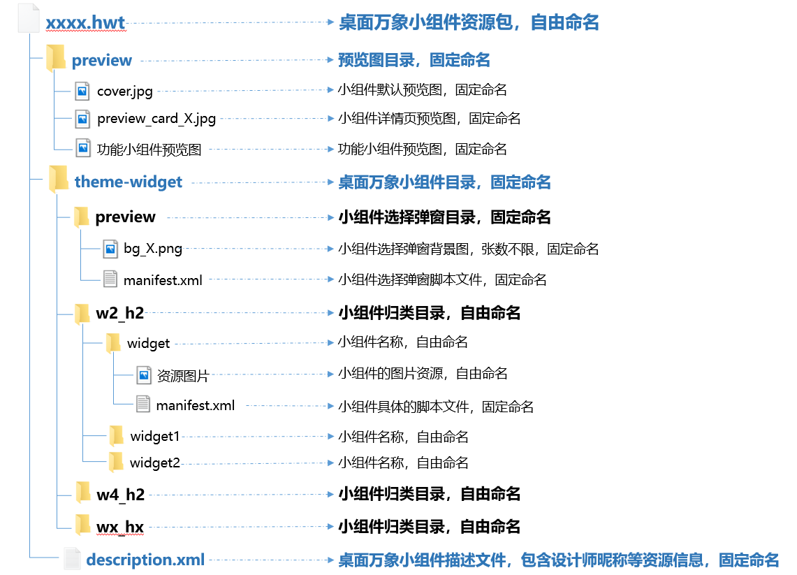

## theme-widget

结构说明：theme-widget是桌面万象小组件目录文件夹。在单独上架和随手机主题包一起上架的资源包中，theme-widget的结构是一样的，详情请看[桌面万象小组件（随主题包一起上架）](/docs/distribute/content-dist/theme-center/development-tutorial-0000001054519376/themes-engine-0000001054452463/themes-engine4-0000002530591413/application-range1-0000001258343478/widget-0000001245999755)中的[theme-widget](/docs/distribute/content-dist/theme-center/development-tutorial-0000001054519376/themes-engine-0000001054452463/themes-engine4-0000002530591413/application-range1-0000001258343478/widget-0000001245999755#section12808174819345)。

内容要求：与随手机主题包一起上架不同的是，单独上架的桌面万象小组件资源包对小组件的内容有特定要求——需要制作8类功能小组件（时钟、天气、日历必做，其他根据[价格档位](#section171041027173018)要求选做）。

### 8类功能小组件介绍

| 组件名称 | 组件描述 | 必备要素 | 组件样例 | 相关文档 |
| --- | --- | --- | --- | --- |
| 1. 时钟小组件 | 包含当前时间功能的小组件，例如模拟时钟，数字时钟等。 | * 当前时间。 * 时钟APP跳转链接。 |  | [时间全局变量](/docs/distribute/content-dist/theme-center/development-tutorial-0000001054519376/themes-engine-0000001054452463/themes-engine4-0000002530591413/basic-function-0000001054908461/variant-0000001074067773/globavariant-0000001074475028#section174361648182115)、  [小组件示例：模拟时钟](/docs/distribute/content-dist/theme-center/development-tutorial-0000001054519376/themes-engine-0000001054452463/themes-engine4-0000002530591413/application-range1-0000001258343478/widget-0000001245999755#section56072022921) |
| 2. 天气小组件 | 包含天气数据功能的小组件，例如天气数据展示，组件样式随天气变化等效果。 | * 当前温度。 * 气象描述（多云，下雨等） * 华为天气APP跳转链接。 | 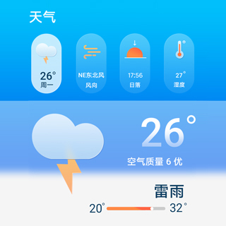 | [天气数据开放&lt;Weather&gt;](/docs/distribute/content-dist/theme-center/development-tutorial-0000001054519376/themes-engine-0000001054452463/themes-engine4-0000002530591413/basic-function-0000001054908461/data-open1-0000001694307045/weather-0000001079515110)  [小组件示例：天气](/docs/distribute/content-dist/theme-center/development-tutorial-0000001054519376/themes-engine-0000001054452463/themes-engine4-0000002530591413/application-range1-0000001258343478/widget-0000001245999755#section75951024193310) |
| 3. 日历小组件 | 可以让用户看到当前日期和星期（可以在日历小组件上添加时间及时钟APP跳转链接）。 | * 至少包含当前一周内的日期情况。 * 华为日历APP跳转链接。 | 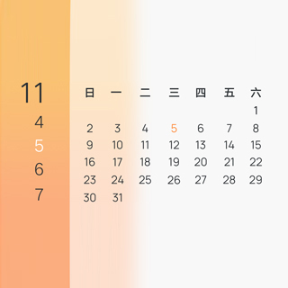 | [日历数据开放&lt;Calendar&gt;](/docs/distribute/content-dist/theme-center/development-tutorial-0000001054519376/themes-engine-0000001054452463/themes-engine4-0000002530591413/basic-function-0000001054908461/data-open1-0000001694307045/calendar-0000001126131857) |
| 4. 华为音乐小组件 | 使用音乐播放/暂停以及歌词等功能的小组件，只配置华为音乐跳转链接，只播放华为音乐内歌曲。 | * 歌词。 * 歌曲名。 * 收藏功能。 * 暂停/播放/上下首等播控功能。 * 华为音乐APP跳转链接。 | 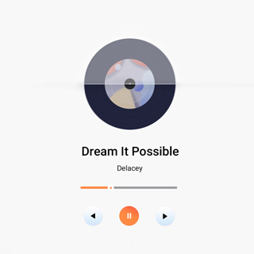 | [音乐数据开放&lt;MediaControl&gt;](/docs/distribute/content-dist/theme-center/development-tutorial-0000001054519376/themes-engine-0000001054452463/themes-engine4-0000002530591413/basic-function-0000001054908461/data-open1-0000001694307045/mediacontrol-0000001275775133) |
| 5. 趣味小组件 | 无明确限制，可以是每日一图/名言佳句/每日喝水提醒/今天是周五吗等各类趣味小组件。 | 有趣。 | / | / |
| 6. 系统数据小组件 | 包含引擎开放的系统数据的小组件，其中系统数据包括CPU占用率，当前电量等。 | 包含系统数据。 | 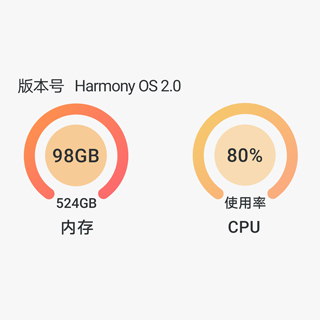 | [系统数据开放](/docs/distribute/content-dist/theme-center/development-tutorial-0000001054519376/themes-engine-0000001054452463/themes-engine4-0000002530591413/basic-function-0000001054908461/data-open1-0000001694307045/system-data-0000001339911605) |
| 7. 倒计时小组件 | 包含倒计时功能的小组件，可以让用户设置关键日期倒计时。 | 包含倒计时功能。 | 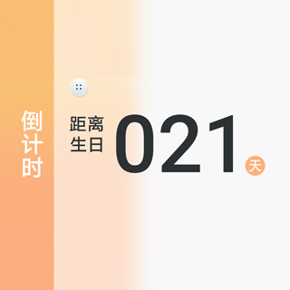 | [倒计时&lt;CountDownTime&gt;](/docs/distribute/content-dist/theme-center/development-tutorial-0000001054519376/themes-engine-0000001054452463/themes-engine4-0000002530591413/basic-function-0000001054908461/view-0000001073865717/countdowntime-0000001074148056) |
| 8. 步数小组件 | 包含用户当前步数数据的小组件，例如做步数换景或者简单的步数显示等。 | * 今日步数。 * 华为运动健康APP跳转链接。 | 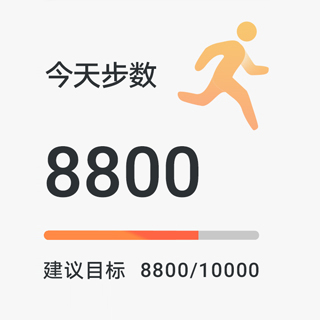 | [运动健康数据开放&lt;Healthy&gt;](/docs/distribute/content-dist/theme-center/development-tutorial-0000001054519376/themes-engine-0000001054452463/themes-engine4-0000002530591413/basic-function-0000001054908461/data-open1-0000001694307045/healthy-0000001278806637) |

### 8类功能小组件尺寸要求

8类功能小组件预览图将在相关专区进行展示，专区有2\*2和4\*2两种展示尺寸，因此[功能小组件预览图](#section2243152418522)需制作2\*2和4\*2两种尺寸。

为保证8类功能小组件应用后的实际效果与[功能小组件预览图](#section2243152418522)效果一致，故**8类功能小组件都必须制作2\*2和4\*2两种尺寸。**

制作时请注意：

1. 制作2\*2尺寸的功能小组件时，考虑到2\*2可以等比调整至1\*1、2\*2、4\*4等尺寸，设计师在设计时应按最大的4\*4设计，这样缩小时不会出现边缘锯齿模糊等问题。

   ```
   <!--2*2尺寸的功能小组件宽高示例-->
   <Widget screenHeight="960" screenWidth="960" displayDesktop="true" frameRate="30" version="1">
   ......
   </Widget>

   <!--4*2尺寸的功能小组件宽高示例-->
   <Widget screenHeight="480" screenWidth="960" displayDesktop="true" frameRate="30" version="1">
   ......
   </Widget>
   ```
2. 4\*2和2\*2两种尺寸的功能小组件可使用相同的元素，再调整部分样式即可。
3. 4\*2和2\*2两种尺寸的功能小组件实际应用以后，需与[功能小组件预览图](#section2243152418522)展示出来的效果相符。

## preview文件夹

preview文件夹中的图片是主题APP桌面万象小组件相关页面用到的预览图，包含：

* cover.jpg（一张）
* preview\_card\_X.jpg（多张）
* 功能小组件预览图（多张）

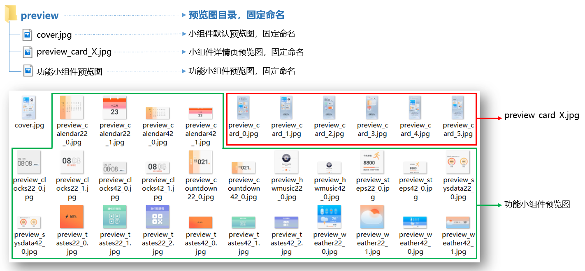

### cover.jpg

cover.jpg为小组件预览图，将展示在桌面万象小组件瀑布流页。


<strong>规格要求：</strong>

* 命名：固定命名为cover.jpg。
* 张数：1张。
* 尺寸：1080×1920px。
* 格式：.jpg。
* 是否必做：必做。

<strong>内容要求：</strong>

* 只能包含小组件内容，不能出现手机壁纸/图标/锁屏等无关内容。

<strong>样式要求：</strong>

* 不能有圆角、边框，设计内容需要铺满规范尺寸。

  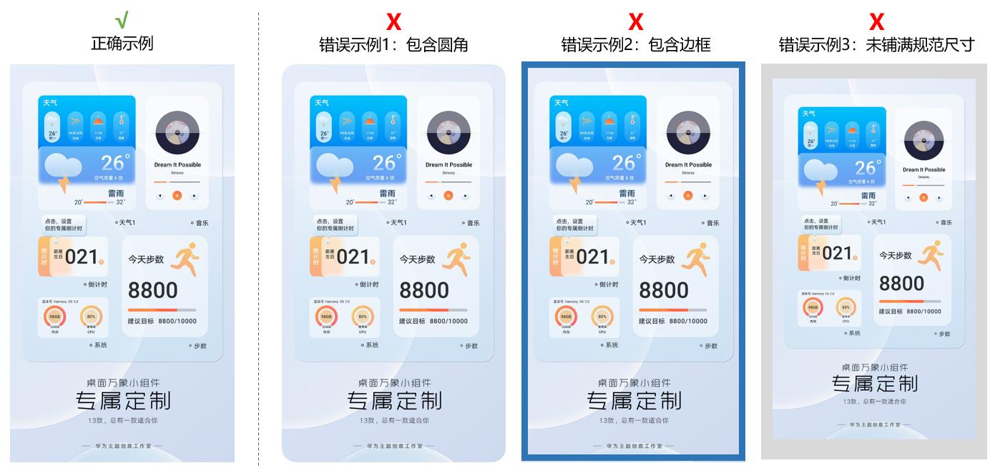

<strong>样例参考：</strong>

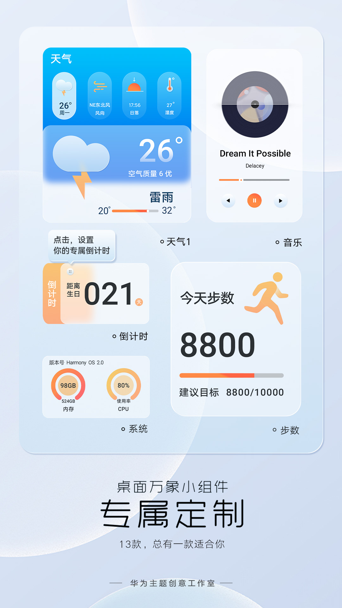

### preview\_card\_X.jpg

preview\_card\_X.jpg为桌面万象小组件详情页预览图，将展示在资源详情页：

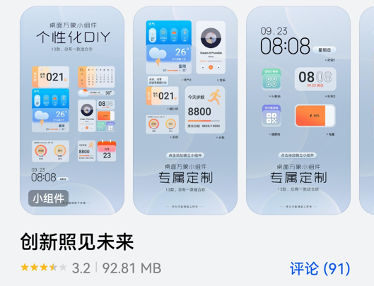

<strong>规格要求：</strong>

* 命名：固定命名为preview\_card\_X.jpg。

* 张数：≥4张，X=0,1,2,3…
* 尺寸：1080×2160px。
* 格式：.jpg。
* 是否必做：必做。

<strong>内容要求：</strong>

* 只能包含桌面万象小组件内容，不能出现手机壁纸/图标/锁屏等无关内容。
* preview\_card\_X.jpg中，大标题必须统一使用完整名称“桌面万象小组件”；详细内容介绍可以使用完整名称“桌面万象小组件”或简称“万象小组件”；具体的万象小组件可命名为“时钟小组件”、“步数小组件”等。完整名称"桌面万象小组件"和简称"万象小组件"都为固定写法，不可更改。

* 每张preview\_card\_X.jpg，都有其特定的内容要求：

  | 张数 | 内容要求 |
  | --- | --- |
  | preview\_card\_0.jpg（第1张） | 桌面万象小组件整体介绍，展示所有小组件的样式。 |
  | preview\_card\_X. jpg（X=1,2... 即第2张至倒数第2张） | 桌面万象小组件详情介绍，展示单个或多个小组件，介绍每个小组件的名称、简介或玩法。  说明：  1. 介绍时请涵盖尽量多的小组件，让用户充分了解小组件的情况。 2. 小组件详情介绍图展示顺序为：先展示8类功能小组件介绍图，再展示非功能小组件介绍图（其他小组件/全屏小组件/快捷方式跳转小组件等）。 3. 如果快捷方式跳转小组件制作了多个，建议在一张介绍图中进行展示。 |
  | preview\_card\_X. jpg（最后1张） | 桌面万象小组件使用说明，展示添加桌面万象小组件的步骤和方法：①在主题APP的资源详情页点击“应用”→②点击“添加”小组件→③在桌面上点击“复制”小组件→④点击“填充”选择小组件→⑤滑动/点击等方式切换小组件选择页面→⑥点击添加小组件。具体可参考下图preview\_card\_3.jpg示例。  说明：  请严格按以上的步骤和方法进行桌面万象小组件使用说明。 |

  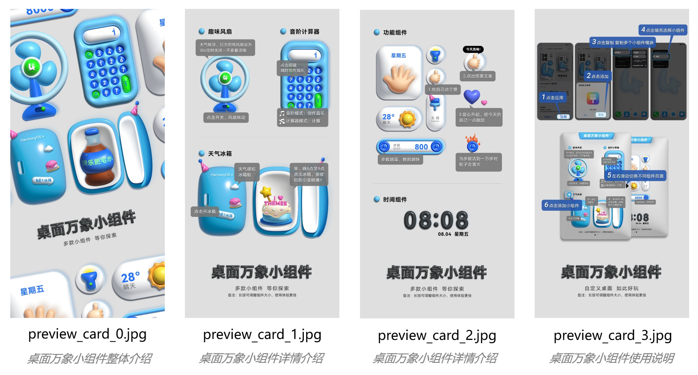

### 功能小组件预览图

功能小组件预览图，将展示在8类功能小组件专区。

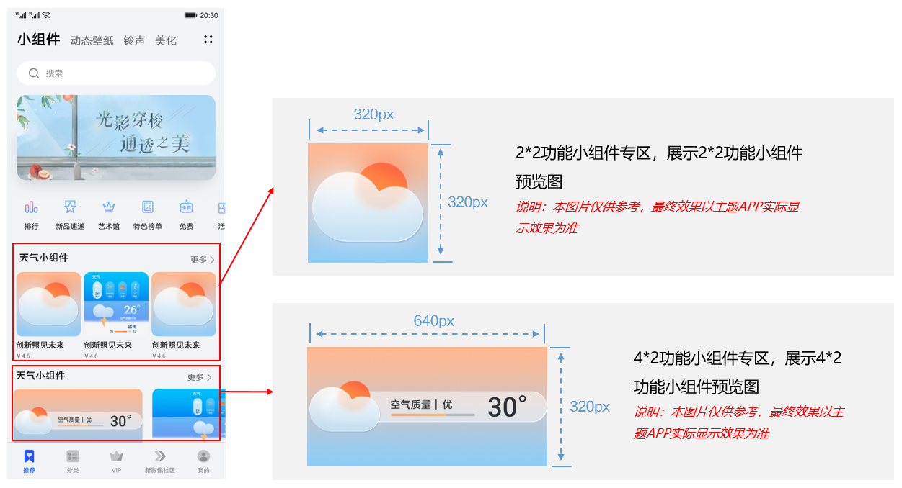

<strong>规格要求：</strong>

* 命名：8类功能小组件预览图固定命名，详见下文。

* 张数：多张，根据功能小组件个数制作。
* 尺寸：8类功能小组件需制作2\*2和4\*2两种尺寸，故功能小组件预览图也需制作2\*2（320x320px）和4\*2（640x320px）两种尺寸。
* 格式：.jpg。
* 是否必做：必做。

  

  1. 8类功能小组件分别为：时钟小组件、天气小组件、华为音乐小组件、日历小组件、趣味小组件、系统数据小组件、倒计时小组件、步数小组件，详见[8类功能小组件介绍](#section917119230119)。
  2. 只有8类功能小组件需制作此预览图。全屏小组件、快捷方式小组件、其他小组件暂无专区进行展示，无需制作此预览图。

<strong>内容要求：</strong>

* 只能展示单个功能小组件的内容。

<strong>样式要求：</strong>

* 不能有圆角、边框，设计内容需要铺满规范尺寸。

  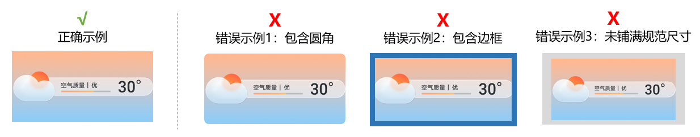

<strong>样例参考：</strong>

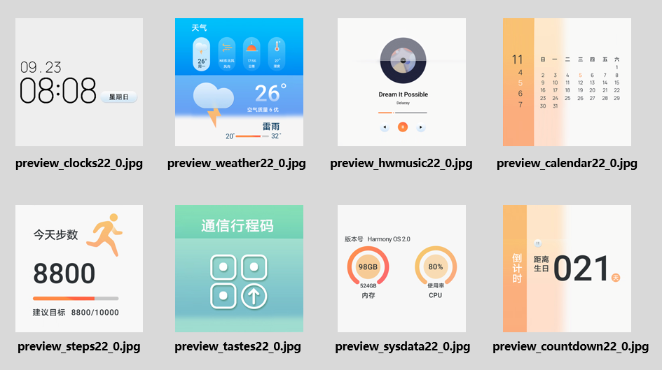

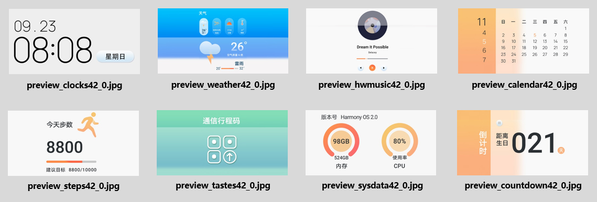

<strong>8类功能小组件预览图命名</strong> <strong>：</strong>

| 8类功能小组件 | **2\*2 预览图命名 | 4\*2 预览图命名** |
| --- | --- | --- |
| 时钟小组件 | preview\_clocks22\_0.jpg | preview\_clocks42\_0.jpg |
| 天气小组件 | preview\_weather22\_0.jpg | preview\_weather42\_0.jpg |
| 日历小组件 | preview\_calendar22\_0.jpg | preview\_calendar42\_0.jpg |
| 华为音乐小组件 | preview\_hwmusic22\_0.jpg | preview\_hwmusic42\_0.jpg |
| 趣味小组件 | preview\_tastes22\_0.jpg | preview\_tastes42\_0.jpg |
| 系统数据小组件 | preview\_sysdata22\_0.jpg | preview\_sysdata42\_0.jpg |
| 倒计时小组件 | preview\_countdown22\_0.jpg | preview\_countdown42\_0.jpg |
| 步数小组件 | preview\_steps22\_0.jpg | preview\_steps42\_0.jpg |


1. 只有以上8类功能小组件需制作此预览图，且<strong>预览图固定命名，</strong> <strong>不可设置为其他命名</strong>。
2. 如果某类功能小组件制作了多个，对应的预览图命名修改最后一位序号即可。例如，制作了2个时钟小组件，则其对应的**2\*2<strong> 和</strong>4\*2**预览图可命名为：
   * preview\_clocks22\_0.jpg preview\_clocks42\_0.jpg
   * preview\_clocks22\_1.jpg preview\_clocks42\_1.jpg

   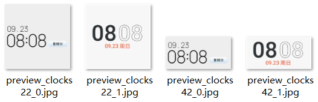

## description.xml

description.xml为桌面万象小组件描述文件，包含设计师昵称等信息，相关描述只能包含和桌面万象小组件相关的信息。

&lt;version&gt;参数为桌面万象小组件的资源包版本号，第一版为10.0.0，后续有更新则更改为10.0.X（X为阿拉伯数字）。

桌面万象小组件主题的简介描述中：大标题必须统一使用完整名称“桌面万象小组件”；详细内容介绍可以使用完整名称“桌面万象小组件”或简称“万象小组件”；具体的万象小组件可命名为“时钟小组件”、“步数小组件”等。完整名称"桌面万象小组件"和简称"万象小组件"都为固定写法，不可更改。

```
   <?xml version="1.0" encoding="UTF-8"?>
   <HwTheme>
        <title>infinity space</title>
        <title-cn>无垠之界</title-cn>
        <author>华为主题创意工作室</author>
        <designer>华为主题创意工作室</designer>
        <version>10.0.0</version>
        <font>Default</font>
        <font-cn>默认</font-cn>
        <briefinfo>华为主题创意工作室倾力打造无垠之界主题。
           主题APP需升级到12.0.12.300及以上版本，才能使用桌面万象小组件功能。
           【天气信息】1.天气数据来源于华为天气APP，使用前请确保华为天气APP已使用，并有当前定位城市的天气信息。
                     2.当前天气信息的更新频率为应用时立即更新一次，应用后1小时左右更新一次。
                     3.将主题APP版本更新至12.0.12.300之后，下载天气类主题无需授权位置信息。
           备注：步数功能只在10.1.0.160及以上版本有效（不同机型支持的版本会有差异），其余版本该变量值为0。
        </briefinfo>
    </HwTheme>
```

## 价格档位


<MergeTable
  headers={['资源类型', '价格档位', '功能小组件数量', '其他小组件数量（非快捷方式）', '全屏小组件数量', '风格及其他要求']}
  rows={
    [{ text: '桌面万象小组件', rowspan: 3, colspan: 1 }, '等级2 Tier2 3.00(CNY)', '必须包含以下3个功能小组件： 时钟小组件 天气小组件 日历小组件', '不低于2个', '无要求', '设计风格和谐统一。'],
    [null, '等级4 Tier4 6.00(CNY)', '必须包含以下5个功能小组件： 时钟小组件 天气小组件 日历小组件 华为音乐小组件 趣味小组件', '不低于4个', '不低于2个', '设计风格和谐统一，画面精美细腻。'],
    [null, '等级6 Tier6 9.00(CNY)', '必须包含以下8个功能小组件： 时钟小组件 天气小组件 日历小组件 华为音乐小组件 趣味小组件 系统数据小组件 倒计时小组件 步数小组件', '不低于6个', '不低于4个', '设计风格和谐统一，画面精美细腻，小组件设计具备创意性，内容有独特性（如IP，艺术作品）。']
  }
/>


1. 时钟、天气、日历作为三个最常见的系统自带小组件，为所有价格档位必做的小组件。
2. 鼓励制作全屏小组件。
3. 各个价格档的快捷方式小组件数量无要求。
4. 免费小组件规则：小组件数量小于等于2个，不能包含全屏组件以及纯快捷方式跳转类组件。

<strong>快捷方式小组件样例：</strong>


<strong>全屏小组件样例：</strong>

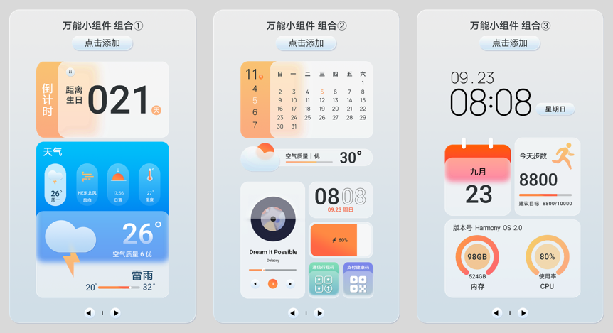


1. 全屏小组件是指将多个小组件组合起来全屏展示的小组件，便于用户一键添加多个组合好的小组件。
2. 制作全屏小组件时，可复用已制作完成的单个小组件。