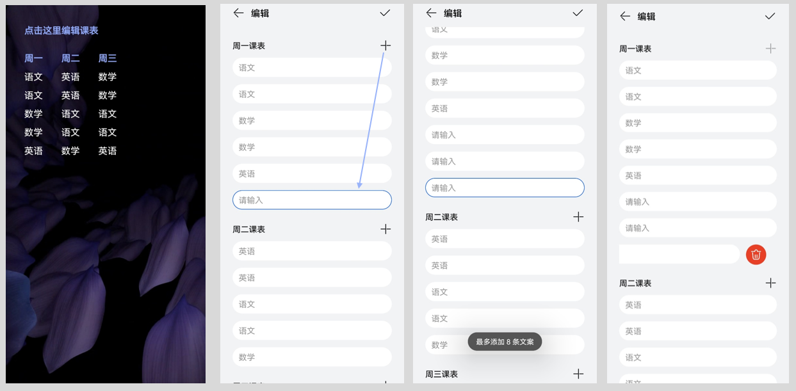
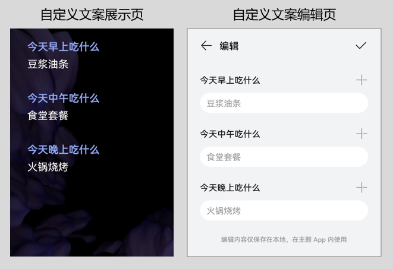
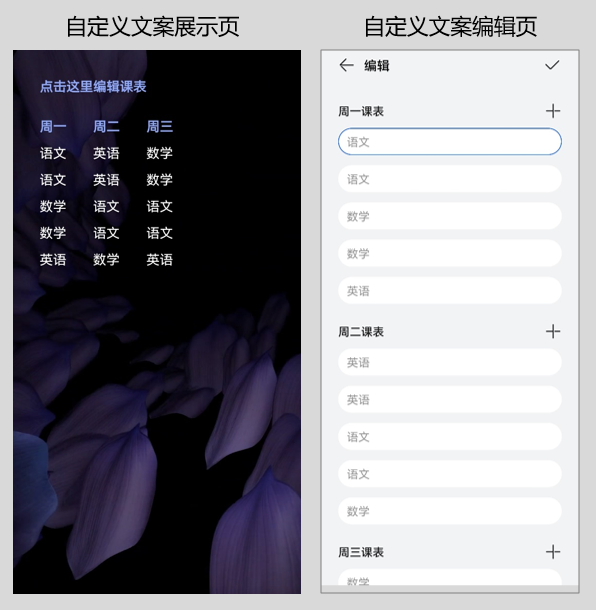

import MergeTable from '@site/src/components/MergeTable';

# 用户自定义文案

## 功能概述

支持开发出具有用户自定义文案功能的主题，该主题应用后，支持用户自定义编辑文案内容。

应用范围：桌面万象小组件和锁屏。

桌面万象小组件：用户在自定义文案展示页中点击指定区域，拉起自定义文案编辑页，在编辑页中进行文案编辑相关操作。编辑完成后返回桌面，查看编辑后的效果。

锁屏：与桌面万象小组件体验类似，但需解锁后才能拉起自定义文案编辑页。

## 应用场景

任何有设计文案的资源，都可以结合自定义文案功能，例如：

* 自定义编辑备忘录
* 自定义编辑待办事项
* 自定义编辑课程表中的课程名称
* 在锁屏自定义设置紧急联系人信息
* 自定义编辑装饰性文字（如：路牌、车牌）
* 自定义编辑接机、应援文案（如：全屏应援文字跑马灯）
* 自定义编辑倒计时事件（如：生日、考试日、纪念日）
* 自定义编辑运动目标

## 设计范围

开发用户自定义文案主题时，设计师需对以下内容进行设计：

### 自定义文案展示页


<MergeTable
  headers={['页面示例', '页面元素', '元素说明']}
  rows={
    [{ text: '', rowspan: 6, colspan: 1 }, '页面样式（背景图片等元素）', '支持个性化设计'],
    [null, '自定义文案分组-组名', '通过 文本&lt;Text&gt; 或 图片&lt;Image&gt; 呈现'],
    [null, '自定义文案分组-组数', '最多支持设置7组'],
    [null, '自定义文案-文案内容', '支持设置默认文案，用户进入编辑页后可自定义编辑文案内容，最多支持输入18个字符'],
    [null, '自定义文案-文案条数', '每组最多支持设置15条自定义文案，具体由设计师写的&lt;EditText&gt;的条数决定'],
    [null, '自定义文案-文案样式（大小、颜色等）', '支持个性化设计']
  }
/>


### 自定义文案编辑页拉起方式

通过[自定义文案编辑命令&lt;EditCommand&gt;](#section983319150408)，拉起自定义文案编辑页。

## 用户操作

用户自定义文案主题应用后，用户可通过设计好的拉起方式，进入自定义文案编辑页，进行文案编辑相关操作。

编辑结果将同步至自定义文案展示页，返回展示页即可查看效果。

### 自定义文案编辑页


<MergeTable
  headers={['页面示例', '页面元素', '元素说明']}
  rows={
    [{ text: '', rowspan: 6, colspan: 1 }, '页面样式', '固定样式，不支持个性化设计'],
    [null, '自定义文案分组-组名', '通过&lt;EditText&gt;或&lt;EditGroup&gt;的hint参数呈现，建议14个字符以内，并与展示页中的组名保持一致，便于用户一一对应'],
    [null, '自定义文案分组-组数', '最多支持设置7组'],
    [null, '自定义文案-文案内容', '支持设置默认文案，用户进入编辑页后可自定义编辑文案内容，最多支持输入18个字符'],
    [null, '自定义文案-文案条数', '每组最多支持设置15条自定义文案，具体由设计师写的&lt;EditText&gt;的条数决定'],
    [null, '自定义文案-文案样式（大小、颜色等）', '固定样式，不支持个性化设计，字体大小跟随系统设置']
  }
/>


### 用户操作说明

<strong>进入自定义文案编辑页后，用户可进行以下操作：</strong>

1. 添加每组的文案条数：用户点击“+”号可添加一条新文案，文案内容默认显示“请输入”。每组最多添加的条数，由设计师在脚本中已写好的&lt;EditText&gt;的条数决定：当添加至设计师写的&lt;EditText&gt;的最大条数时，弹窗提醒无法添加更多。说明：由于存在用户添加/删除自定义文案条数的场景，因此设计师需以&lt;EditText&gt;的最大条数进行展示页设计，预留足够空间。
2. 修改每条的文案内容：用户可修改每条自定义文案的内容。默认内容为&lt;EditText&gt;的text参数的值。
3. 删除每组的文案条数：用户左滑可删除当前文案（每组第1条不允许删除），删除后可再行添加。
4. 示例：设计师设计3组自定义文案，每组8条。用户进入编辑页后，点击“+”号，可为每组添加最多8条文案。添加至第8条时，弹窗提醒“最多添加8条文案”。除每组第1条文案外，其他几条均可删除，删除后可再行添加。

   

## 脚本结构

开发自定义文案主题时，有以下两种脚本结构，请根据实际场景进行选择：

* 每组一条自定义文案。
* 每组多条自定义文案。

每组一条自定义文案、每组多条自定义文案支持混搭使用，混搭使用时最多设置7组。

## 每组一条自定义文案

### 示例场景

详见[示例1：自定义每日菜单](#section13259145015461)。

### XML规范

```
<EditText name="" x="" y="" color="" size="" hint="" text=""  editId=""/>
```

### 参数说明

* <strong>EditText</strong>

&lt;EditText&gt;为自定义文案标签，支持[文本&lt;Text&gt;](/docs/distribute/content-dist/theme-center/development-tutorial-0000001054519376/themes-engine-0000001054452463/themes-engine4-0000002530591413/basic-function-0000001054908461/view-0000001073865717/text-0000001074068045)的基本功能，不支持换行（autoLineFeed）和滚动（scrollDisplay、marqueeRepeatLimit、clickable、delayTime）功能。

| 参 数 | 类 型 | 选 项 | 注 释 |
| --- | --- | --- | --- |
| hint | 字符串 | 必填 | 自定义文案编辑页中，每组的组名。字体大小跟随系统设置，建议不超过14个字符。 |
| editId | 数值 | 必填 | 自定义文案的id，同一个脚本中不允许重复。示例：10001。 |
| text | 字符串 | 选填 | 初始文案，为空则不显示。每组第一条建议不要为空。  自定义文案编辑页最多输入18个字符，建议初始文案也最多设置18个字符。 |

### 限制说明

1. 自定义文案组的数量：最多设置7组。
2. 每组自定义文案的条数：此结构下，每组仅支持设置1条自定义文案。

## 每组多条自定义文案

### 示例场景

详见[示例2：自定义每周课表](#section186511375233)。

### XML规范

```
<EditGroup hint="">
	<EditText x="" y="" text="" size="" editId=""/>
	<EditText x="" y="" text="" size="" editId=""/>
	<EditText x="" y="" text="" size="" editId=""/>
</EditGroup>
```

### 参数说明

* <strong>&lt;EditGroup&gt;</strong>

&lt;EditGroup&gt;为自定义文案分组标签。

| 参 数 | 类 型 | 选 项 | 注 释 |
| --- | --- | --- | --- |
| hint | 字符串 | 必填 | 自定义文案编辑页中，每组的组名。字体大小跟随系统设置，建议不超过14个字符。 |

* <strong>&lt;EditText&gt;</strong>

&lt;EditText&gt;为自定义文案标签，支持[文本&lt;Text&gt;](/docs/distribute/content-dist/theme-center/development-tutorial-0000001054519376/themes-engine-0000001054452463/themes-engine4-0000002530591413/basic-function-0000001054908461/view-0000001073865717/text-0000001074068045)的基本功能，不支持换行（autoLineFeed）和滚动（scrollDisplay、marqueeRepeatLimit、clickable、delayTime）功能。

| 参 数 | 类 型 | 选 项 | 注 释 |
| --- | --- | --- | --- |
| editId | 数值 | 必填 | 自定义文案的id，同一个脚本中不允许重复。示例：10001。 |
| text | 字符串 | 选填 | 初始文案，为空则不显示。每组第一条建议不要为空。  自定义文案编辑页最多输入18个字符，建议初始文案也最多设置18个字符。 |

### 限制说明

1. 自定义文案组的数量：最多设置7组。
2. 每组自定义文案的条数：每组最多设置15条自定义文案，具体由设计师写的&lt;EditText&gt;的条数决定。

## 全局变量editText

开放全局变量editText，获取自定义文案内容。

| 参 数 | 注 释 |
| --- | --- |
| editText\_x | 获取自定义文案内容，x为editId的值。 |

示例：#editText\_10001，即引用id为10001的自定义文案内容。

```
<Text x="100" y="200" color="#89a9fe" size="60" textExp="#editText_10001" bold="true" />
<EditText name="01" x="100" y="300" color="#FFFFFF" size="60" hint="今天早上吃什么" text="豆浆油条" editId="10001"/>
```

## 自定义文案编辑命令&lt;EditCommand&gt;

用于拉起自定义文案编辑页面，进行文案编辑相关操作。典型场景如下：

* 点击每一条自定义文案位置，拉起自定义文案编辑页面，并定位到其对应的编辑框，详见[示例1：自定义每日菜单](#section13259145015461)。
* 点击特定位置，拉起自定义文案编辑页面，并定位到某一条自定义文案对应的编辑框，详见[示例2：自定义每周课表](#section186511375233)。

### XML规范

```
<EditCommand editId=""/>
```

### 参数说明

| 参 数 | 类 型 | 选 项 | 注 释 |
| --- | --- | --- | --- |
| editId | 数值 | 必填 | 拉起自定义文案编辑页，定位到指定自定义文案对应的编辑框。根据editId的值进行指定。 |

## 应用示例

### 示例1：自定义每日菜单

点击“豆浆油条”、“食堂套餐”、“火锅烧烤”，拉起自定义文案编辑页，定位到其对应的编辑框，进行每日菜单编辑。

<strong>应用效果：</strong>



<strong>关键脚本：</strong>

```
<!-- 共设置3组，每组1条自定义文案 -->

<!-- 第1组 -->
<Text x="100" y="200" color="#89a9fe" size="60" text="今天早上吃什么" bold="true" />
<EditText name="01" x="100" y="300" color="#FFFFFF" size="60" hint="今天早上吃什么" text="豆浆油条" editId="10001"/>

<!-- 第2组 -->
<Text x="100" y="500" color="#89a9fe" size="60" text="今天中午吃什么" bold="true" />
<EditText name="02" x="100" y="600" color="#FFFFFF" size="60" hint="今天中午吃什么" text="食堂套餐" editId="20001"/>

<!-- 第3组 -->
<Text x="100" y="800" color="#89a9fe" size="60" text="今天晚上吃什么" bold="true" />
<EditText name="03" x="100" y="900" color="#FFFFFF" size="60" hint="今天晚上吃什么" text="火锅烧烤" editId="30001"/>

<!-- 拉起自定义文案编辑页 -->
<Button h="#01.text_height" w="#01.text_width" x="100" y="300">
     <Trigger action="up">
          <EditCommand editId="10001"/>
     </Trigger>
</Button>

<!-- 拉起自定义文案编辑页 -->
<Button h="#02.text_height" w="#02.text_width" x="100" y="600">
     <Trigger action="up">
          <EditCommand editId="20001"/>
     </Trigger>
</Button>

<!-- 拉起自定义文案编辑页 -->
<Button h="#03.text_height" w="#03.text_width" x="100" y="900">
     <Trigger action="up">
          <EditCommand editId="30001"/>
     </Trigger>
</Button>
```

### 示例2：自定义每周课表

点击“点击这里编辑课表”，拉起自定义文案编辑页，定位到第一个编辑框，进行每周课表编辑。

本示例仅展示周一至周三3组，每组8条自定义课程的关键脚本。实操时候请按需求添加自定义文案的组数和条数。

<strong>应用效果：</strong>



<strong>关键脚本：</strong>

```
<!-- 共设置3组，每组8条自定义文案 -->

<Text x="100" y="500" color="#89a9fe" size="50" text="周一" bold="true" />
<EditGroup hint="周一课表">
	<EditText x="100" y="600" text="语文" size="50" editId="10001" color="#FFFFFF" name="01"/>
	<EditText x="100" y="700" text="语文" size="50" editId="10002" color="#FFFFFF"/>
	<EditText x="100" y="800" text="数学" size="50" editId="10003" color="#FFFFFF"/>
        <EditText x="100" y="900" text="数学" size="50" editId="10004" color="#FFFFFF"/>
	<EditText x="100" y="1000" text="英语" size="50" editId="10005" color="#FFFFFF"/>
        <EditText x="100" y="1100" text="" size="50" editId="10006" color="#FFFFFF"/>
        <EditText x="100" y="1200" text="" size="50" editId="10007" color="#FFFFFF"/>
        <EditText x="100" y="1300" text="" size="50" editId="10008" color="#FFFFFF"/>
</EditGroup>

<Text x="300" y="500" color="#89a9fe" size="50" text="周二" bold="true" />
<EditGroup hint="周二课表">
	<EditText x="300" y="600" text="英语" size="50" editId="20001" color="#FFFFFF"/>
	<EditText x="300" y="700" text="英语" size="50" editId="20002" color="#FFFFFF"/>
	<EditText x="300" y="800" text="语文" size="50" editId="20003" color="#FFFFFF"/>
        <EditText x="300" y="900" text="语文" size="50" editId="20004" color="#FFFFFF"/>
	<EditText x="300" y="1000" text="数学" size="50" editId="20005" color="#FFFFFF"/>
        <EditText x="300" y="1100" text="" size="50" editId="20006" color="#FFFFFF"/>
        <EditText x="300" y="1200" text="" size="50" editId="20007" color="#FFFFFF"/>
        <EditText x="300" y="1300" text="" size="50" editId="20008" color="#FFFFFF"/>
</EditGroup>

<Text x="500" y="500" color="#89a9fe" size="50" text="周三" bold="true" />
<EditGroup hint="周三课表">
	<EditText x="500" y="600" text="数学" size="50" editId="30001" color="#FFFFFF"/>
	<EditText x="500" y="700" text="数学" size="50" editId="30002" color="#FFFFFF"/>
	<EditText x="500" y="800" text="语文" size="50" editId="30003" color="#FFFFFF"/>
        <EditText x="500" y="900" text="语文" size="50" editId="30004" color="#FFFFFF"/>
	<EditText x="500" y="1000" text="英语" size="50" editId="30005" color="#FFFFFF"/>
        <EditText x="500" y="1100" text="" size="50" editId="30006" color="#FFFFFF"/>
        <EditText x="500" y="1200" text="" size="50" editId="30007" color="#FFFFFF"/>
        <EditText x="500" y="1300" text="" size="50" editId="30008" color="#FFFFFF"/>
</EditGroup>

<!-- 拉起自定义文案编辑页 -->
<Text x="100" y="350" color="#89a9fe" size="50" text="点击这里编辑课表" bold="true" name="14" />
<Button x="100" y="350" h="100" w="500" >
     <Trigger action="up">
          <EditCommand editId="10001"/>
     </Trigger>
</Button>
```