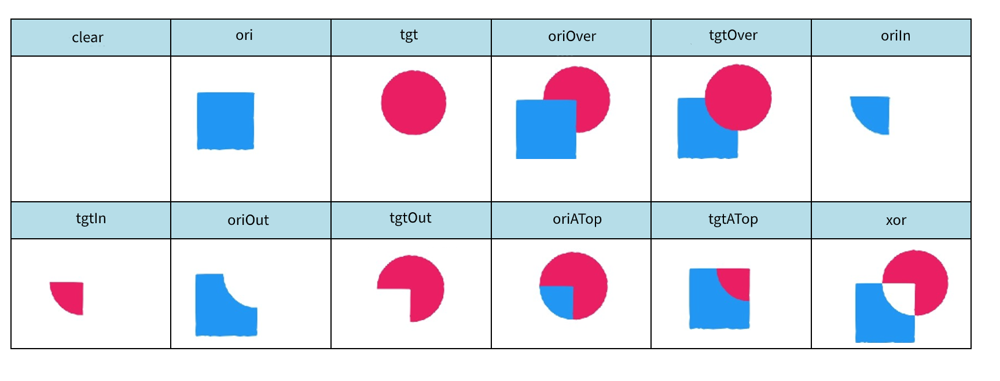

# 遮罩&lt;Mask&gt;

## 功能概述

该功能需要与Image共同使用，对Image标签中的图片（tgt.png）和mask标签中的图片（ori.png）进行混合，支持12种混合模式。例如，通过混合可起到遮罩效果，即按照ori图片对tgt图片进行裁剪，使tgt图片显示与ori图片重叠区域的内容。通过设置align参数，可以达到tgt图片移动但ori图片不移动的效果。

## 应用场景

* 可用于给图片增加一个蒙版的效果。
* 可用于对图片的一部分进行遮罩。
* 固定遮罩可制作局部展示，做头像。

## XML规范

```
<Image src="">
    <Mask src="" align="" hybridMode=""/>
</Image>
```

## 参数说明

| 参 数 | 类 型 | 选 项 | 注 释 |
| --- | --- | --- | --- |
| src | 字符串 | 必填 | src为遮罩图片的源地址 |
| align | 字符串 | 选填 | 取值为absolute或relative。其中，absolute表示绝对位置，即ori图片不随着tgt图片移动而移动，遮罩(Mask)x,y坐标为相对于屏幕左上角的坐标；如果为相对位置relative，则ori会随着tgt而移动，遮罩(Mask)x,y坐标为相对于图片左上角的坐标。 默认情况下为relative |
| hybridMode | 字符串 | 选填 | 设置两张图片之间的混合模式，共有12种混合模式供选择：clear(0)， ori(1)，tgt(2)，oriOver(3)，tgtOver(4)，oriIn(5)，tgtIn(6)，oriOut(7)，tgtOut(8)，oriATop(9)，tgtATop(10)，xor(11)。可以通过输入字符串或者对应的数字编号来选择混合模式，默认为6 |

<strong>混合模式示例</strong>



## 应用示例

<strong>示例一：</strong>通过输入字符串来选择混合模式，同时采用绝对位置，当移动源图片时，遮罩图片不移动。

```
<Image x="0" y="#screen_height-92" src="tgt.png">
    <Mask x="0" y="#screen_height-92" src="ori.png" align="absolute" hybridMode="tgtIn"/>
</Image>
```

<strong>示例二：</strong>通过输入数字编号来选择混合模式，同时采用相对位置，当移动源图片时，遮罩图片跟随移动。

```
<Image x="0" y="#screen_height-92" src="tgt.png">
    <PositionAnimation>
        <Position x="480" y="0" time="1000"/>
        <Position x="480" y="0" time="2000"/>
    </PositionAnimation>
    <Mask x="0" y="#screen_height-92" src="ori.png" align="relative" hybridMode="6"/>
</Image>
```

## 制作视频

[](https://alliance-communityfile-drcn.dbankcdn.com/FileServer/getFile/publicContent/011/111/111/0000000000011111111.20251218173506.95092680787635178085339146330832:20260601221834:2800:BEFC2853CE1FACDB6F586013BA37CDC5CC27E2FF6A9572344AFAF0DB7ED33F8B.mp4)