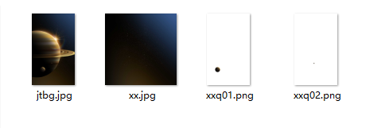

# 重力感应

## 动效概述

通过转动手机改变锁屏壁纸的视角，可在主题App搜索《本之恢弘》进行体验和参考。

## 素材准备

部分素材如下所示，完整体验请在主题App中搜索《本之恢弘》进行体验和参考。



## 效果和脚本展示

[](https://alliance-communityfile-drcn.dbankcdn.com/FileServer/getFile/publicContent/011/111/111/0000000000011111111.20251218173454.61624381328828367955038373776626:20260601221843:2800:09C484D1404998A3F3C15E93775F2DCED321266719F79FB7371987421F6048AA.mp4)

[](https://alliance-communityfile-drcn.dbankcdn.com/FileServer/getFile/publicContent/011/111/111/0000000000011111111.20251218173454.58305369084495058044249140189540:20260601221843:2800:740EA8C5A1D301500FA56BD7094DE52106D2404BB5D91D0FFFE46BE56BBF6533.mp4)

```
<?xml version="1.0" encoding="utf-8"?>
<Lockscreen version="1" frameRate="60"  displayDesktop="true" screenWidth="1080">
<!-- 加速传感器，可见性变量 -->
	<VariableBinders>
	<SensorBinder type="accelerometer">
	    <Variable name="x_1" index="0"/>
            <Variable name="y_1" index="1"/>
	</SensorBinder>
	</VariableBinders>
<!-- 星星背景引用加速传感器X轴方向，即左右转动手机，星星背景发生变化 -->
	<Image x="#screen_width/2-(#x_1)*30" y="#screen_height/2" align="center" alignV="center" src="xx.jpg" visibility="eq(#dt,1)"/>
<!-- 小星球引用加速传感器X轴Y轴方向，即上下左右转动手机，小星球发生变化 -->
	<Image x="#screen_width/2+(#x_1)*20" y="#screen_height/2-(#y_1)*10" align="center" alignV="center" src="xxq01.png" visibility="eq(#dt,1)">
		<SizeAnimation>
			<Size w="1152" h="1920" time="0"/>
			<Size w="1440" h="2400" time="900"/>
			<Size w="1440" h="2400" time="15000"/>
		</SizeAnimation>
	</Image>
	<Image x="#screen_width/2+(#x_1)*10" y="#screen_height/2-(#y_1)*5" align="center" alignV="center" src="xxq02.png" visibility="eq(#dt,1)">
		<SizeAnimation>
			<Size w="1152" h="1920" time="0"/>
			<Size w="1440" h="2400" time="900"/>
			<Size w="1440" h="2400" time="15000"/>
		</SizeAnimation>
	</Image>
<!--上滑解锁-->
	<Button x="0" y="0" w="#screen_width" h="#screen_height" visibility="eq(#stapp,1)">
            <Triggers>
              <Trigger action="up">
			   <ExternCommand command="unlock" condition="gt(#touch_begin_y-#touch_y,260)"/>
              </Trigger>
           </Triggers>
	</Button>
</Lockscreen>
```