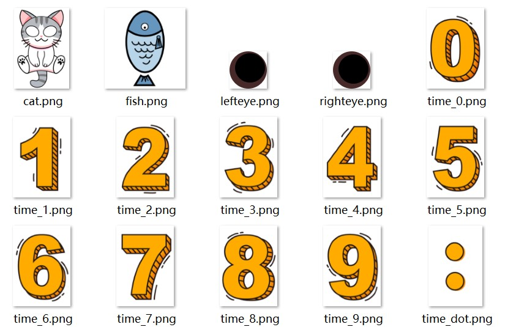

# 双粒子互动

## 动效概述

A区域或者物体可以影响B区域或者物体的状态。比如点击A，可以引起B爆炸。

## 素材准备



## 效果和脚本展示

[](https://alliance-communityfile-drcn.dbankcdn.com/FileServer/getFile/publicContent/011/111/111/0000000000011111111.20251218173446.93735406875637279163173189334496:20260601221845:2800:BE47FFE428BA64D74C4AAA8C75478F5FA8A4EFDED868CF52AD33F016F78C15D2.mp4)

```
<?xml version="1.0" encoding="utf-8"?>
<Lockscreen version="1" frameRate="30"  displayDesktop="true" screenWidth="1080" id="201706169895" xsdVersion="1" >
<!--初始化-->
   <Var name="move_final_x" expression="0"/>
   <Var name="move_final_y" expression="0"/>
   <Var name="temp_y" expression="0"/>
   <Var name="temp_y" expression="0"/>
   <Var name="touch_x" expression="400"/>
   <Var name="touch_y" expression="100"/>
   <Var name="touch_xx" expression="600"/>
   <Var name="touch_yy" expression="300"/>
   <!--手指滑动屏幕时根据手指所在x坐标计算时间rotationY值和猫咪眼睛的x轴位移值-->
   <Var name="move_x" expression="#touch_x-#touch_begin_x" threshold="1" >
<Trigger>
   <!--通过condition控制当手指落在时间图片附近时触发时间图片的旋转，expression中对touchx_xx值做左右最大值限制-->
           <VariableCommand name="touch_xx" expression="ifelse(le(#touch_x,100),100,ge(#touch_x,900),900,#touch_x)" condition="ge(#touch_x,100)*le(#touch_x,900)*ge(#touch_y,200)*le(#touch_y,600)"/>
   <!--临时变量，计算猫眼睛随手指移动后坐标值，其中500为猫眼睛向左偏移和向右偏移的临界点x轴坐标值，0.3位移动幅度系数-->
           <VariableCommand name="temp_x" expression="#move_final_x+(#touch_x-500)*0.3"/>
           <!--对猫眼睛移动范围做限定，计算猫眼睛最终随手指移动的值-->
           <VariableCommand name="move_final_x" expression="ifelse(le(#temp_x,-100),-100,gt(#temp_x,100),100,#temp_x"/>
       </Trigger>
   </Var>
<!--手指滑动屏幕时根据手指所在y坐标计算时间rotationX值和猫咪眼睛的y轴位移值。与x轴坐标计算同理-->
   <Var name="move_y" expression="#touch_y-#touch_begin_y" threshold="1" >
       <Trigger>
           <VariableCommand name="touch_yy" expression="ifelse(le(#touch_y,200),200,ge(#touch_y,600),600,#touch_y)" condition="ge(#touch_x,100)*le(#touch_x,900)*ge(#touch_y,200)*le(#touch_y,600)"/>
           <VariableCommand name="temp_y" expression="#move_final_y+(#touch_y-950)*0.3"/>
           <VariableCommand name="move_final_y" expression="ifelse(le(#temp_y,-50),-50,gt(#temp_y,110),110,#temp_y)"/>
       </Trigger>
    </Var>
 <!--背景-->
    <Rectangle x="0" y="0" w="#screen_width" h="#screen_height" fillColor="#ffffff"/>
    <!--猫咪眼睛-->
    <Group x="#move_final_x" y="620+#move_final_y">
       <Image src="lefteye.png" x="280" y="250" w="150" h="150"/>
       <Image src="righteye.png" x="630" y="250" w="150" h="150"/>
    </Group>
    <!--猫-->
    <Image src="cat.png" x="0" y="500" w="#screen_width" h="1080*#screen_width/734"/>
    <!--时间，设置旋转中心pivotX和pivotY（以Time的x,y为相对坐标原点），touchY的变化控制图片X轴旋转角度，touchX的变化控制图片Y轴旋转角度-->
    <Time src="time.png" space="20"  x="150" y="300" pivotX="400" pivotY="100" rotationX="-(#touch_yy-400)*0.1" rotationY="(#touch_xx-#screen_width/2)*0.05"/>
    <!--鱼，图片位置随手指落点移动-->
    <Image src="fish.png" x="#touch_x-100" y="#touch_y-100" w="300" h="300"/>
    <Button w="#screen_width" h="#screen_height">
       <Trigger action="double">
           <ExternCommand command="unlock"/>
       </Trigger>
    </Button>
</Lockscreen>
```