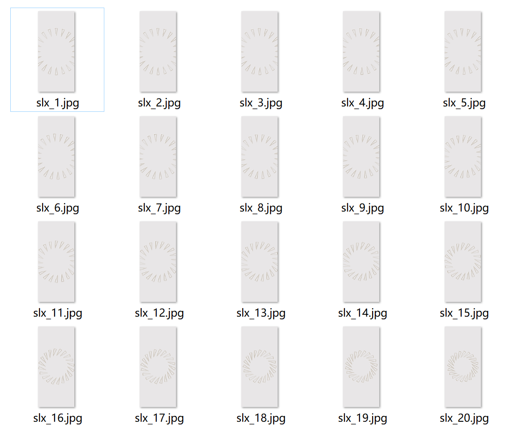

# 炫酷充电

## 动效概述

根据充电方式及电量的不同，展现不同的充电动画并替换系统自带的充电界面，让每次充电时都有不同的动态效果。

可在主题App中搜索《纸艺之境》进行体验和参考。

## 素材准备

部分素材如下所示，完整体验请在主题App中搜索《纸艺之境》进行体验和参考。



## 效果和脚本展示

[](https://alliance-communityfile-drcn.dbankcdn.com/FileServer/getFile/publicContent/011/111/111/0000000000011111111.20251218173455.49382197675014003670111561293694:20260601221847:2800:A8859579105DFA97C3F972CBF01478C5465B96BD26A31E700D98B8AFFA93778B.mp4)

部分代码如下所示，完整体验请在主题App中搜索《纸艺之境》进行体验和参考。

```
<?xml version="1.0" encoding="utf-8"?>
<Lockscreen version="1" frameRate="30"  displayDesktop="true" screenWidth="1080" chargeAnimTime="9">
	<Var name="w" expression="#screen_width" persist="true" const="true" />
	<Var name="h" expression="#screen_height" persist="true" const="true" />
	<Var name="qh" expression="(#screen_height-2400)/2" persist="true" const="true" />

    <!--滑动解锁的命令，当起始点（StartPoint）的x,y点随手指移动落入EndPoint目标矩形区域时，松开手指则触发解锁。-->
	<Unlocker name="unlocker" bounceInitSpeed="2000" bounceAcceleration="3000">
		<StartPoint x="0"  y="0" w="#screen_width" h="#screen_height" >
		</StartPoint>
		<EndPoint x="-1000"  y="-200-#screen_height" w="#screen_width+1000" h="#screen_height" >
		</EndPoint>
	</Unlocker>
        <!--充电效果-->
	<Group name="charge" >
		<Image name="charge-background" src="bg.jpg" w="#w" h="#h" x="0" y="0" visibility="eq(#charge_anim,1)" >
		</Image>
		<!--有线充电，电量低于20播放帧动画-->
		<Group name="wired-low" visibility="eq(#charge_anim,1)*eq(#charge_type_value,1)*le(#battery_level,20)" >
			<Image x="#w/2" y="#h/2" align="center" alignV="center" >
				<SourcesAnimation>
					<Source src="slx_1.jpg" time="0"/>
					<Source src="slx_1.jpg" time="80"/>
					<Source src="slx_2.jpg" time="160"/>
					<Source src="slx_3.jpg" time="240"/>
					<Source src="slx_4.jpg" time="320"/>
					<Source src="slx_5.jpg" time="400"/>
					<Source src="slx_6.jpg" time="480"/>
					<Source src="slx_7.jpg" time="560"/>
					<Source src="slx_8.jpg" time="640"/>
					<Source src="slx_9.jpg" time="720"/>
					<Source src="slx_10.jpg" time="800"/>
					<Source src="slx_11.jpg" time="880"/>
					<Source src="slx_12.jpg" time="960"/>
					<Source src="slx_13.jpg" time="1040"/>
					<Source src="slx_14.jpg" time="1120"/>
					<Source src="slx_15.jpg" time="1200"/>
					<Source src="slx_16.jpg" time="1280"/>
					<Source src="slx_17.jpg" time="1360"/>
					<Source src="slx_18.jpg" time="1440"/>
					<Source src="slx_19.jpg" time="1520"/>
					<Source src="slx_20.jpg" time="1600"/>
				</SourcesAnimation>
			</Image>
		</Group>

		<!--低电量，充电信息都在中间-->
		<Group name="charge-info" visibility="eq(#charge_anim,1)*le(#battery_level,20)" >
			<Text name="charge-status1" x="#w/2"  y="#h/2-195+336" align="center" color="#837561" size="44"  text="已充满" category="BatteryFull"/>
			<Text name="charge-status2" x="#w/2"  y="#h/2-195+336" align="center" color="#837561" size="44"  text="充电中" category="Charging"/>
			<Text name="charge-status3" x="#w/2"  y="#h/2-195+336" align="center" color="#837561" size="44"  text="电量不足" category="BatteryLow"/>
			<Text name="charge" text="#charge_level" size="150" x="#w/2-#chargetxt.text_width/2"  y="#h/2-195+136" align="center" color="#9b4545"  />
			<Text name="chargetxt" text="%" size="102" x="#w/2-#chargetxt.text_width/2+#charge.text_width/2"  y="#h/2-195+136+48" color="#9b4545"  />
			<Image src="ic_charge_standard2.png" name="charge-icon1" x="#w/2"  y="#h/2-195" w="106" h="106" align="center"  visibility="eq(#charge_anim,1)*eq(#charge_type_value,1)*eq(#charge_mode_value,1)"/>
			<Image src="ic_charge_quick2.png" name="charge-icon2" x="#w/2"  y="#h/2-195" w="106" h="106" align="center"  visibility="eq(#charge_anim,1)*eq(#charge_type_value,1)*eq(#charge_mode_value,2)"/>
			<Image src="ic_charge_super_v2.png" name="charge-icon3" x="#w/2"  y="#h/2-195" w="106" h="106" align="center"   visibility="eq(#charge_anim,1)*eq(#charge_type_value,1)*eq(#charge_mode_value,3)"/>
			<Image src="ic_charge_standard_wireless2.png" name="charge-icon4" x="#w/2"  y="#h/2-195"  w="106" h="106" align="center" visibility="eq(#charge_anim,1)*eq(#charge_type_value,2)*eq(#charge_mode_value,4)"/>
			<Image src="ic_charge_quick_wireless2.png" name="charge-icon5" x="#w/2"  y="#h/2-195" w="106" h="106" align="center"  visibility="eq(#charge_anim,1)*eq(#charge_type_value,2)*eq(#charge_mode_value,5)"/>
			<Image src="ic_charge_super_wireless2.png" name="charge-icon6" x="#w/2"  y="#h/2-195"  w="106" h="106" align="center" visibility="eq(#charge_anim,1)*eq(#charge_type_value,2)*eq(#charge_mode_value,6)"/>
		</Group>
	</Group>
</Lockscreen>
```