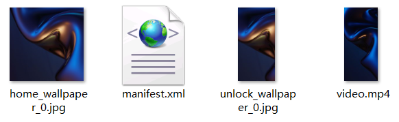
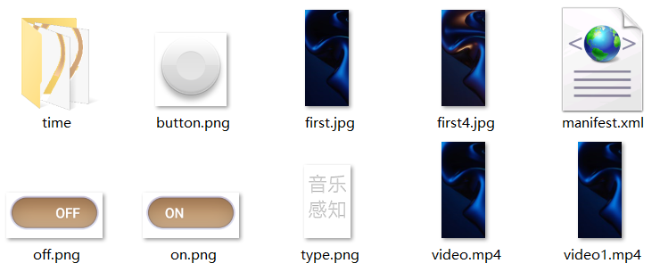

# 音乐感知

## 功能概述

实时感知音乐播放状态，在锁屏和桌面上驱动创意动效随音乐而变化。

可在主题App中搜索《影随声动》进行体验和参考。

## 素材准备

（素材来源于《影随声动》，可在主题App下载同款主题）

* <strong>桌面素材</strong>

  

* <strong>锁屏素材</strong>

  

## 效果和脚本展示

* <strong>效果展示</strong>

音乐响起，锁屏和桌面上的辉光会伴随音乐流淌，让您同时享受视觉与听觉的盛宴。

[](https://alliance-communityfile-drcn.dbankcdn.com/FileServer/getFile/publicContent/011/111/111/0000000000011111111.20251218173457.24681482522048084164054200911543:20260601221849:2800:602DC848C8C52EC380BD7CCCC1A74E2CC69409E9DD041EF9D45A8B34129F1898.mp4)

* <strong>桌面脚本</strong>

```
<?xml version="1.0" encoding="utf-8"?>
<LiveWallpaper version="1" frameRate="25" screenWidth="1080" id="201809057087" >
	<!-- 分辨率1920   src该分辨率的视频名称; frameSequence是配置视频播放帧区间，默认0s秒开始，用英文逗号分隔; haveVideoVoice是否有声音，默认false-->
	<VideoWallpaper src="video.mp4" haveVideoVoice="true" isMusic="true" turn="1"/>
</LiveWallpaper>
```


相关文档：[视频桌面&lt;LiveWallpaper&gt;](https://developer.huawei.com/consumer/cn/doc/content/livewallpaper-0000001073967005)。

* <strong>锁屏脚本</strong>

```
<?xml version="1.0" encoding="utf-8"?>
<Lockscreen version="1" frameRate="30"  displayDesktop="true" screenWidth="1080"  id="201706169895">
	<Var name="w" expression="#screen_width" persist="true" const="true" />
	<Var name="h" expression="#screen_height" persist="true" const="true" />
	<Var name="qh" expression="(#screen_height-2400)/2" persist="true" const="true" />
	<Var name="pos" expression="ifelse(gt(#screen_height,1920),260,120)" />

	<!--初始化-->
	<ExternalCommands>
		<Trigger action="resume"></Trigger>
	</ExternalCommands>

	<Var name="isOn" expression="0" type="number" globalPersist="true"/>
	<Rectangle x="0" y="0" w="#w" h="#h" fillColor="#000000"/>
	<!--背景-->
	<Var name="ratio" expression="max(#w/1080.0,#h/2400.0)"/>
	<Image x="0" y="0" w="1080*ratio" h="2400*ratio" src="first.jpg" />
	<Video name="js1" src="video1.mp4"  play="true" sound="0" looping="true" defaultBitmap="first.jpg" scaleType="fit_width" visibility="eq(#isOn,0)"/>
	<Video name="js2" src="video.mp4"  sound="0" scaleType="fit_width" play="true" defaultBitmap="first.jpg" defaultBitmapMusic="first4.jpg" looping="true" isMusic="true" turn="5" visibility="eq(#isOn,1)"/>
	<Image name="nzxh" x="#w/2+#pos2" y="#h/2" src="nzxh/nz_kcxh_1.png" align="center" alignV="center" visibility="eq(#isOn,0)*eq(#group,1)">
		<SourcesAnimation>
			<Source src="nzxh/nz_kcxh_1.png"  time="0"/>
			<Source src="nzxh/nz_kcxh_2.png"  time="50"/>
		</SourcesAnimation>
	</Image>

	<Button x="570" y="#qh+541" w="377" h="741" visibility="eq(#start,0)">
		<Trigger action="down">
			<VariableCommand name="isOn" expression="1"/>
		</Trigger>
	</Button>

	<!--时间日期-->
	<Group x="90" y="#h-780" >
		<Image x="0" y="0" src="time/A_number.png" srcid="#hour/10" />
		<Image x="118" y="0" src="time/A_number.png" srcid="#hour%10" />
		<Image x="0" y="149" src="time/number.png" srcid="#minute/10" />
		<Image x="118" y="149" src="time/number.png" srcid="#minute%10" />
		<Group x="20" y="149+158+35" >
			<Image name="m1" x="0" y="0" src="time/date.png" srcid="(#month+1)/10" />
			<Image name="m2" x="#m1.bmp_width" y="0" src="time/date.png" srcid="(#month+1)%10"/>
			<Image name="ms" x="#m1.bmp_width+#m2.bmp_width" y="0" src="time/line.png"/>
			<Image name="d1" x="#m1.bmp_width+#m2.bmp_width+#ms.bmp_width+5" y="82" src="time/date.png" srcid="#date/10" />
			<Image name="d2" x="#m1.bmp_width+#m2.bmp_width+#ms.bmp_width+#d1.bmp_width+5" y="82" src="time/date.png" srcid="#date%10"/>
			<Image name="wk" x="#m1.bmp_width+#m2.bmp_width+#ms.bmp_width+5" y="0" src="time/week.png" srcid="#day_of_week"/>
		</Group>
                <!--按钮-->
		<Group x="6" y="780-159-82">
			<Image x="0" y="0" src="on.png"  visibility="eq(#isOn,1)"/>
			<Image x="0" y="0" src="off.png" visibility="eq(#isOn,0)"/>
			<Image x="0" y="0" src="button.png" visibility="eq(#isOn,0)"/>
			<Image x="174-80" y="0" src="button.png" visibility="eq(#isOn,1)"/>
			<Image x="174" y="0" src="type.png" />
		</Group>
		<Button x="6" y="780-159-82" w="174" h="174">
			<Trigger action="down">
				<VariableCommand name="isOn" expression="1-#isOn"/>
			</Trigger>
		</Button>
		<AlphaAnimation>
			<Alpha a="0" time="0"/>
			<Alpha a="255" time="300"/>
			<Alpha a="255" time="10000000"/>
		</AlphaAnimation>
		<PositionAnimation repeat="1">
			<Position x="0" y="500" time="0" varSpeedFlag="SineFun_Out"/>
			<Position x="0" y="0" time="300" />
		</PositionAnimation>
	</Group>

	<!--上滑解锁-->
	<Button x="0" y="0" w="1080" h="#screen_height">
		<Trigger action="up">
			<ExternCommand command="unlock" condition="lt(#touch_y-#touch_begin_y,-300)" />
		</Trigger>
	</Button>

</Lockscreen>
```


相关文档：[视频&lt;Video&gt;](https://developer.huawei.com/consumer/cn/doc/content/video-0000001073497817)。