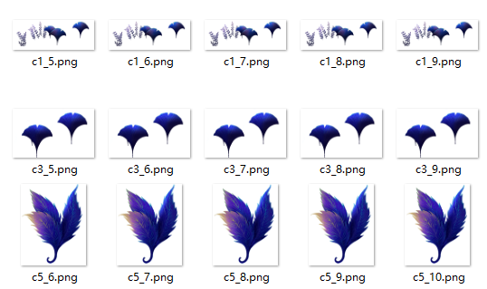

# 穿越动效

## 动效概述

通过长按或者点击的交互方式，来实现左右浏览或者调节图层远近，实现多个图层叠加的立体效果。

可在主题App中搜索《森林脉络》进行体验和参考。

## 素材准备

部分素材如下所示，完整体验请在主题App中搜索《森林脉络》进行体验和参考。



## 效果和脚本展示

[](https://alliance-communityfile-drcn.dbankcdn.com/FileServer/getFile/publicContent/011/111/111/0000000000011111111.20251218173452.06641153229556605226743271620130:20260601221853:2800:1ABC19DD2E8232255D299245BFC54F48DF2BC00E124CD18D6D41275BA485EA0B.mp4)

```
<MultiLayer gravityX="-#x_gra" gravityY="#y_gra" pitchAngle="15,-15" sidesAngle="8,-8" touchType="#touchtype" stepX="#stepX" stepZ="#step" >
<!--远处的图层-->
        <Layer x="(589-435+ 85)*((10-#c12)/3)-#w/(6/(7-#c12))"   y="(#qh+584)*((10-#c12)/3)-#h/(6/(7-#c12))"     z="#c12"  w="975*((10-#c12)/3)"    h="1200*((10-#c12)/3)"  src="c12.png"/>
<!--中间的图层-->
        <Layer x="(589-435+ 200)*((10-#c11)/3)-#w/(6/(7-#c11))"   y="(#qh+513)*((10-#c11)/3)-#h/(6/(7-#c11))"   z="#c11"  w="825*((10-#c11)/3)"    h="924*((10-#c11)/3)"  src="c11.png"/>
<!--近处的图层-->
        <Layer x="(442-435+ 200)*((10-#c10)/3)-#w/(6/(7-#c10))"   y="(#qh+518)*((10-#c10)/3)-#h/(6/(7-#c10))"   z="#c10"  w="1034*((10-#c10)/3)"   h="900*((10-#c10)/3)"  src="c10_1.png">
                        <Source frame="c10_1.png" time="0"/>
                        <Source frame="c10_2.png" time="50"/>
                        <Source frame="c10_3.png" time="100"/>
                        <Source frame="c10_4.png" time="150"/>
                        <Source frame="c10_5.png" time="200"/>
                        <Source frame="c10_6.png" time="250"/>
                        <Source frame="c10_7.png" time="300"/>
                        <Source frame="c10_8.png" time="350"/>
                        <Source frame="c10_9.png" time="400"/>
                        <Source frame="c10_10.png" time="450"/>
                        <Source frame="c10_11.png" time="500"/>
                        <Source frame="c10_12.png" time="550"/>
                        <Source frame="c10_13.png" time="600"/>
                        <Source frame="c10_14.png" time="650"/>
                        <Source frame="c10_15.png" time="700"/>
                        <Source frame="c10_16.png" time="750"/>
                        <Source frame="c10_17.png" time="800"/>
                        <Source frame="c10_18.png" time="850"/>
                        <Source frame="c10_19.png" time="900"/>
                        <Source frame="c10_20.png" time="950"/>
                        <Source frame="c10_21.png" time="1000"/>
                        <Source frame="c10_22.png" time="1050"/>
                        <Source frame="c10_23.png" time="1100"/>
                        <Source frame="c10_24.png" time="1150"/>
                        <Source frame="c10_25.png" time="1200"/>
                        <Source frame="c10_26.png" time="1250"/>
        </Layer>
​</MultiLayer>
```