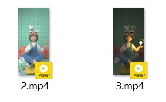

# 时间感知

## 动效概述

通过主题中的多场景、全局化的时间变量，让用户感知时间的流逝。

可在主题App中搜索《元気汽汽》进行体验和参考。

## 素材准备



## 效果和脚本展示

[](https://alliance-communityfile-drcn.dbankcdn.com/FileServer/getFile/publicContent/011/111/111/0000000000011111111.20251218173456.93306659621335060583756115652915:20260601221855:2800:811628A38097A32DDEC3E4854592F344DCD64CAE3D9B63B113ADF0FAB7C0BDF3.mp4)

```
<?xml version="1.0" encoding="utf-8"?>
<Lockscreen version="1" frameRate="60" displayDesktop="true" screenWidth="1080">
    <!--上滑解锁-->
    <Button x="0" y="0" w="#screen_width" h="#screen_height">
        <Triggers>
            <Trigger action="up">
                <ExternCommand command="unlock" condition="gt(#touch_begin_y-#touch_y,260)"/>
            </Trigger>
       </Triggers>
    </Button>

    <ExternalCommands>
	<!--action通常用来接收亮屏/熄屏消息，从而执行一些命令resume表示亮屏时执行的命令，pause表示熄屏时执行的命令-->
        <Trigger action="resume">
	<!--运用数字表达式ifelse/ge/lt与全局变量hour24结合：当时间大于上午6点和小于下午6点时，bh赋值为1，否则为0-->
			<VariableCommand name="bh" expression="ifelse(ge(#hour24, 6)*lt(#hour24, 18), 1, 0)" />
           <!--用视频命令控制视频的播放:亮屏时，视频vw2播放-->
			<VideoCommand name="vw2" play="true"/>
			<!--当bh=1时，vw2视频为可见状态-->
			<Command target="vw2.visibility" value="true" condition="eq(#bh, 1)" />
			<!--当bh=0时，vw2视频为不可见状态-->
			<Command target="vw2.visibility" value="false" condition="eq(#bh, 0)" />
			<!--用视频命令控制视频的播放:亮屏时，视频vw3播放-->
			<VideoCommand name="vw3" play="true"/>
			<!--当bh=1时，vw3视频为可见状态-->
			<Command target="vw3.visibility" value="true" condition="eq(#bh, 0)" />
			<!--当bh=0时，vw3视频为不可见状态-->
			<Command target="vw3.visibility" value="false" condition="eq(#bh, 1)" />
        </Trigger>

        <!--灭屏时，视频vw2与vw3都停止播放-->
		<Trigger action="pause">
			<VideoCommand name="vw2" play="false"/>
			<VideoCommand name="vw3" play="false"/>
		</Trigger>
    </ExternalCommands>

    <!--vw2对应的视频为2.mp4  vw3对应的视频为3.mp4-->
    <Video name="vw2" x="0" y="0" src="2.mp4" play="true"  looping="true" scaleType="fit_width" />
    <Video name="vw3" x="0" y="0" src="3.mp4" play="true"  looping="true" scaleType="fit_width" />

</Lockscreen>
```