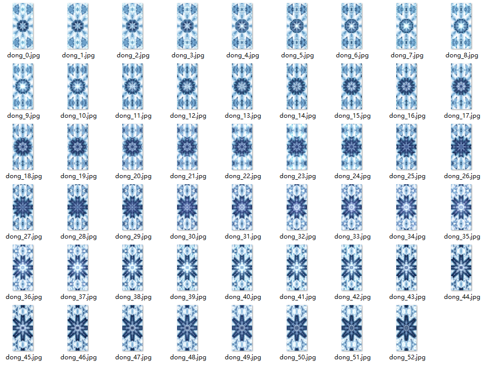

# 趣味按压

## 动效概述

按压屏幕的某个位置超过一定时间，在该位置对动画进行展开播放，松手时会停止/倒放。

可在主题App中搜索《优雅冰蓝万花筒》进行体验和参考。

## 素材准备

（素材来源于《优雅冰蓝万花筒》，可在主题App下载同款主题）



## 效果和脚本展示

[](https://alliance-communityfile-drcn.dbankcdn.com/FileServer/getFile/publicContent/011/111/111/0000000000011111111.20251218173444.18477052778834028085824768481773:20260601221857:2800:7F6BFAD844CD7B9FAEEDAF62A41B6EF1E241F9A9599CD8C5B3675CF0EB7ADD89.mp4)

```
<?xml version="1.0" encoding="utf-8"?>
<Lockscreen version="1" frameRate="30" displayDesktop="true" screenWidth="1080">
<Var name="w" expression="#screen_width" persist="true" const="true" />
<Var name="h" expression="#screen_height" persist="true" const="true" />
    <ExternalCommands>
        <!--灭屏-->
        <Trigger action="resume">
            <VariableCommand name="id" expression="0"/>
        </Trigger>
        <!--亮屏-->
        <Trigger action="pause">
        </Trigger>
    </ExternalCommands>
    <!--时间变量-->
    <Var name="sj">
        <VariableAnimation>
            <AniFrame value="0" time="0"/>
            <AniFrame value="999999999" time="999999999"/>
        </VariableAnimation>
    </Var>
    <!--判断动画正倒放-->
    <Var name="sx" expression="#sj" threshold="1">
        <Trigger>
            <!--id+1表示动画正放-->
            <VariableCommand name="id" expression="(#id+1)" condition="eq(#isTouched,1)*le(#id,51)"/>
            <!--id-1表示动画倒放-->
            <VariableCommand name="id" expression="#id-1" condition="eq(#isTouched,0)*ge(#id,1)"/>
        </Trigger>
    </Var>
    <!--按压延展效果 -->
    <Image x="#w/2" y="#h/2" src="dong.jpg" srcid="#id" align="center" alignV="center" />
    <Button x="0" y="0" w="#w" h="#h-160">
        <!--按下时开始播放-->
        <Triggers >
            <Trigger action="down">
                <VariableCommand name="isTouched" expression="1"/>
            </Trigger>
        <!--抬起时停止播放-->
            <Trigger action="up">
                <VariableCommand name="isTouched" expression="0"/>
            </Trigger>
        </Triggers>
    </Button>
     <!--上滑解锁-->
    <Button  y="0" x="0" h="#h" w="880">
        <Triggers>
            <Trigger action="up">
                <ExternCommand condition="gt(#touch_begin_y-#touch_y,300)" command="unlock"/>
            </Trigger>
        </Triggers>
    </Button>
</Lockscreen>
```