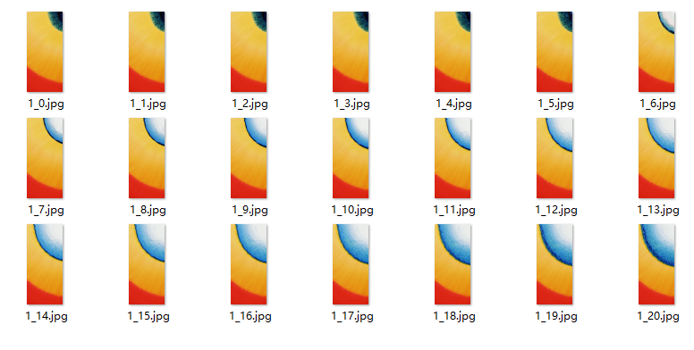

# 摇一摇

## 动效概述

摇一摇触发手机动效，同时通过#shake变量控制动画的可见性。

可在主题App中搜索《橙意漫屏》进行体验和参考。

## 素材准备



## 效果和脚本展示

[](https://alliance-communityfile-drcn.dbankcdn.com/FileServer/getFile/publicContent/011/111/111/0000000000011111111.20251218173455.14730663590410063010974415883123:20260601221901:2800:AF179BF26B3B19EEF3198D9B8959B352CDD760ABA97D6355FB3ADB7F8254972E.mp4)

```
<?xml version="1.0" encoding="utf-8"?>
<Lockscreen version="1" frameRate="30"  displayDesktop="true" screenWidth="1080" vibrate="true">
	<Var name="w" expression="#screen_width" persist="true" const="true" />
	<Var name="h" expression="#screen_height" persist="true" const="true" />
	<Var name="qh" expression="(#screen_height-2400)/2" persist="true" const="true" />
	<Var name="shake_rec" expression="ifelse(ge(#shake,1),1,0)"/>

	<ExternalCommands>
        <!--灭屏-->
		<Trigger action="resume">
			<VariableCommand name="cheng" expression="ifelse(ge(#cheng,2),0,#cheng+1)" condition="eq(#random_wallpaper,1)*eq(#chengyi2,1)" />
			<VariableCommand name="cheng" expression="2" condition="eq(#chengyi2,0)" />
			<VariableCommand name="shake_rec" expression="0"/>
			<Command target="anim_3.animation" value="stop" condition="eq(#cheng,2)*eq(#auto_play,0)"/>
		</Trigger>
        <!--亮屏-->
		<Trigger action="pause">
			<VariableCommand name="shake_rec" expression="0"/>
			<VariableCommand name="flag"      expression="0"/>
		</Trigger>
	</ExternalCommands>

	<Var name="vibrate" expression="0"/>
	<VariableBinders>
		<!--摇一摇触发-->
		<SensorBinder type="accelerometer" vibrate="#vibrate" shakeTime="1000" delay="640">
			<Variable name="x_acc" index="0"/>
		</SensorBinder>
	</VariableBinders>

	<Var name="shake_record" expression="#shake" threshold="1">
		<Trigger>
		        <!-- #shake_rec≥1且#auto_play≥0时，则执行变量赋值命令 -->
			<VariableCommand name="flag" expression="#flag+1" condition="eq(#shake_rec,1)*eq(#auto_play,0)"/>
			<Command target="anim_3.animation"  value="play"  condition="eq(#shake_rec,1)*eq(#cheng,2)*eq(#flag,1)*eq(#auto_play,0)" />
			<!-- #shake_rec≥1且#auto_play≥0时，则延时3210ms后执行变量赋值命令-->
			<VariableCommand name="shake_rec" expression="0"   delay="3210" condition="eq(#shake_rec,1)*eq(#flag,1)" />
			<!-- #shake_rec≥1且#flag≥1时，则延时3500ms后执行变量赋值命令-->
			<VariableCommand name="flag" expression="0"   condition="eq(#shake_rec,1)*eq(#flag,1)" delay="3500"/>
		</Trigger>
	</Var>

	<Image name="anim_3" x="#w/2" y="#h/2" align="center" alignV="center"  src="1_0.jpg"  visibility="eq(#cheng,2)">
		<SourcesAnimation repeat="1">
			<Source src="1_0.jpg" time="0"/>
			<Source src="1_1.jpg" time="50"/>
			<Source src="1_2.jpg" time="100"/>
			<Source src="1_3.jpg" time="150"/>
			<Source src="1_4.jpg" time="200"/>
			<Source src="1_5.jpg" time="250"/>
			<Source src="1_6.jpg" time="300"/>
			<Source src="1_7.jpg" time="350"/>
			<Source src="1_8.jpg" time="400"/>
			<Source src="1_9.jpg" time="450"/>
			<Source src="1_10.jpg" time="500"/>
			<Source src="1_11.jpg" time="550"/>
			<Source src="1_12.jpg" time="600"/>
			<Source src="1_13.jpg" time="650"/>
			<Source src="1_14.jpg" time="700"/>
			<Source src="1_15.jpg" time="750"/>
			<Source src="1_16.jpg" time="800"/>
			<Source src="1_17.jpg" time="850"/>
			<Source src="1_18.jpg" time="900"/>
			<Source src="1_19.jpg" time="950"/>
			<Source src="1_20.jpg" time="1000"/>
		</SourcesAnimation>
	</Image>
	<!--上滑解锁-->
	<Button x="0" y="0" w="1080"  h="#h-400">
		<Triggers>

			<Trigger action="up">
				<ExternCommand condition="gt((#touch_begin_y-#touch_y),150)" command="unlock"/>
				<VariableCommand name="chengyi2" expression="1" />
			</Trigger>
		</Triggers>
	</Button>
</Lockscreen>
```