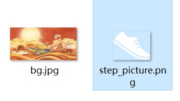

# 步数换景

## 动效概述

通过全局变量#steps\_value控制图片的变化。例如当步数达到一定数值时，背景图更改。

可在主题App中搜索《遇见博物》进行体验和参考。

## 素材准备

（素材来源于《遇见博物》，可在主题App下载同款主题）



## 效果和脚本展示

[](https://alliance-communityfile-drcn.dbankcdn.com/FileServer/getFile/publicContent/011/111/111/0000000000011111111.20251218173447.83022585576353326439264037311065:20260601221904:2800:C726BF6F699EDD2EB3900EF4466D16612DA6E763DCD2B46C203ADE0E1369266C.mp4)

```
<?xml version="1.0" encoding="utf-8"?>
<Lockscreen version="1" frameRate="60" displayDesktop="false" screenWidth="1080" >
    <!--背景图随着步数的改变而移动，4883是图片的宽度-->
    <Image src="bg.jpg" x="0-#steps_value" visibility="gt(-#steps_value,-4883+#screen_width)"/>
              <Image src="bg.jpg" x="-4883+#screen_width" y="0" visibility="le(-#steps_value,-4883+#screen_width)"/>
                <!--显示步数-->
    <Image src="step_picture.png" x="50" y="#screen_height*0.933" />
    <Text x="130" y="#screen_height*0.93" format="目前步数是: %d" paras="#steps_value" size="50" color="#fdfdfd"/>
      <!--解锁-->
    <Button x="0" y="0" w="#screen_width" h="#screen_height">
        <Trigger action="double">
             <ExternCommand command="unlock"/>
        </Trigger>
    </Button>
</Lockscreen>
```