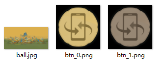

# VR全景

## 动效概述

根据手动或传感器方式改变锁屏壁纸视角，实现全景图片的360度全景功能。

可在主题App中搜索《千里四时全景VR.春》进行体验和参考。

## 素材准备



## 效果和脚本展示

[](https://alliance-communityfile-drcn.dbankcdn.com/FileServer/getFile/publicContent/011/111/111/0000000000011111111.20251218173449.70441509224288059364638130443849:20260601221905:2800:8B410DAE6BCF4CEA42AD2E29C31633748A2C14208ABF51A308798E2A8B0DFE9A.mp4)

```
<?xml version="1.0" encoding="utf-8"?>
<Lockscreen version="1" frameRate="30" displayDesktop="true" screenWidth="1080">
<Var name="w" expression="#screen_width" persist="true" const="true" />
<Var name="h" expression="#screen_height" persist="true" const="true" />
    <Var name="pop" expression="0" const="false" />
    <Var name="touchtype_chun" expression="1"/>
<!--球状全景图的解析-->
    <VR src="ball.jpg" imageType="SPHERICAL" touchType="#touchtype_chun" />
<!--切换控制姿态方式按钮-->
     <Image x="#w-174" y="#h-224" src="btn.png" srcid="#touchtype_chun" visibility="eq(#pop,0)"/>
    <Button x="#w-174" y="#h-224" w="125" h="125" visibility="eq(#pop,0)">
        <Trigger action="up">
            <VariableCommand name="touchtype_chun" expression="1-#touchtype_chun"/>
        </Trigger>
    </Button>
    <!--上滑解锁-->
    <Button  y="#h/3" x="0" h="#h*2/3" w="#w">
        <Triggers>
            <Trigger action="up">
                <ExternCommand condition="gt(#touch_begin_y-#touch_y,400)" command="unlock"/>
            </Trigger>
        </Triggers>
    </Button>
</Lockscreen>
```