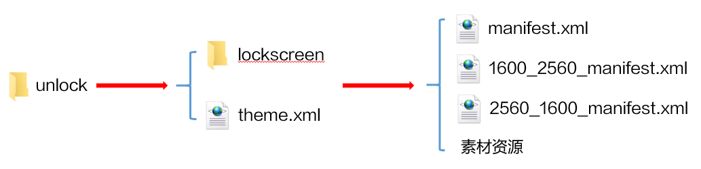

# 多分辨率机型适配（普通手机、平板、折叠屏）

为了使动态主题更好地适配不同分辨率的终端设备（普通手机、平板、折叠屏），引擎提供了以下多分辨率机型适配的方案：

[设计不同分辨率的脚本文件，以适配平板、折叠屏的不同状态](#section129052316616)

[背景等比缩放，居中裁剪，以适配同设备类型的不同机型](#section1141831673)

## 设计不同分辨率的脚本文件，以适配平板、折叠屏的不同状态

<strong>场景</strong> <strong>描述</strong>：普通手机仅有一个状态，动态主题只需设计一个脚本文件即可。<strong>平板</strong>、<strong>折叠屏</strong>具有多个状态（平板横屏态/竖屏态、折叠态/展开横屏态/展开竖屏态），且不同状态下分辨率差别较大，无法通过一个脚本文件进行适配。

<strong>适配方案</strong>：设计不同分辨率的脚本文件，使动态主题在<strong>平板</strong>、<strong>折叠屏</strong>不同状态的分辨率下应用时，都能有比较好的显示效果。脚本文件命名为：屏幕高度\_屏幕宽度\_manifest.xml，同时每个脚本文件中的screenWidth参数需根据不同状态分辨率的宽赋值。

<strong>示例</strong>：

平板的动态锁屏，需设计3个脚本文件：



折叠屏的动态锁屏，需设计4个脚本文件：


1. 平板不同分辨率的脚本详情，请查看《平板主题设计指导及规范》的[2.2 动态锁屏](https://developer.huawei.com/consumer/cn/doc/content/tablet-themes-specification-0000001078779076#section1963465181913)和[3.3 可交互桌面](https://developer.huawei.com/consumer/cn/doc/content/tablet-themes-specification-0000001078779076#section672919153612)。
2. 折叠屏不同分辨率的脚本详情，请查看《折叠屏主题设计指导及规范》的[2.2 动态锁屏](https://developer.huawei.com/consumer/cn/doc/content/foldable-display-themes-0000001102979830#section7572105011451)和[3.3 可交互桌面](https://developer.huawei.com/consumer/cn/doc/content/foldable-display-themes-0000001102979830#section468818539433)。

## 背景等比缩放，居中裁剪，以适配同设备类型的不同机型

<strong>场景描述</strong>：<strong>普通手机</strong>、<strong>折叠屏、平板</strong>的不同机型分辨率有轻微差别，可能出现背景拉伸变形的问题。

<strong>适配方案</strong>：用于背景的标签（[图片&lt;Image&gt;](https://developer.huawei.com/consumer/cn/doc/content/image-0000001073948153)、[视频&lt;Video&gt;](https://developer.huawei.com/consumer/cn/doc/content/video-0000001073497817)、[流体动效&lt;FluidsView&gt;](https://developer.huawei.com/consumer/cn/doc/content/fluidsview-0000001194289627)和[视频桌面&lt;LiveWallpaper&gt;](https://developer.huawei.com/consumer/cn/doc/content/livewallpaper-0000001073967005)）通过使用特定参数值isBackground="true" 且 scaleType="center\_crop"，实现背景等比缩放，居中裁剪的适配效果，使动态主题在同设备类型的不同机型上应用时，背景都不会拉伸变形。

### 图片&lt;Image&gt;作为背景适配

<strong>适配方案</strong>：设置 <strong>isBackground="true"</strong>且<strong>scaleType="center\_crop"</strong>。

* <strong>isBackground="true"</strong>

  该图片作为背景图使用。
* <strong>scaleType="center\_crop"</strong>

  该图片等比缩放并居中充满整个屏幕，多余部分裁剪。


详情请看[图片&lt;Image&gt;](https://developer.huawei.com/consumer/cn/doc/content/image-0000001073948153)。

```
     <!-- 该图片作为背景图使用，等比缩放并居中充满整个屏幕，多余部分裁剪-->
     <Image x="0" y="0" src="dong.jpg" scaleType="center_crop" isBackground="true"/>
```

### 视频&lt;Video&gt;作为背景适配

<strong>适配方案</strong>：设置 <strong>isBackground="true"</strong>且<strong>scaleType="center\_crop"</strong>。

* <strong>isBackground="true"</strong>

  该视频作为背景使用。

* <strong>scaleType="center\_crop"</strong>

  该视频等比缩放并居中充满整个屏幕，多余部分裁剪。


详情请查看[视频&lt;Video&gt;](https://developer.huawei.com/consumer/cn/doc/content/video-0000001073497817)。

```
    <!--解决视频加载中出现黑屏问题，配置一个image在视频加载完成前显示，图片为视频第一帧，以实现比较平滑的过渡效果-->
    <Image  scaleType="center_crop" isBackground="true" src="video_first.png" />
    <!--该视频作为背景使用，等比缩放并居中充满整个屏幕，多余部分裁剪-->
    <Video name="js"  src="video.mp4" play="true" sound="1" looping="true" scaleType="center_crop" isBackground="true"/>
```

### 流体动效&lt;FluidsView&gt;背景适配

<strong>适配方案</strong>：设置<strong>scaleType="center\_crop"</strong>。

* <strong>scaleType="center\_crop"</strong>

  流体动效的背景图等比缩放并居中充满整个屏幕，多余部分裁剪。


1. 如果在流体动效标签&lt;FluidsView&gt;的背景图之外，还使用了其他 &lt;Image&gt;作为背景，则&lt;FluidsView&gt;背景图和&lt;Image&gt;的缩放方式需保持一致。
2. 详情请查看[流体动效&lt;FluidsView&gt;](https://developer.huawei.com/consumer/cn/doc/content/fluidsview-0000001194289627)。

```
         <!--图片作为背景图使用，等比缩放并居中充满整个屏幕，多余部分裁剪-->
         <Image src="aaa2.png"  align="center"  scaleType="center_crop" isBackground="true"/>
         <!--<FluidsView>背景图和<Image>的缩放方式需保持一致-->
         <FluidsView scaleType="center_crop"  bgSrc="aaa1.png"  gravityRatio="" viscosity = "" color = "" waterAlpha=""	srcid="" persist="" waterAlphaThreshold="">
	     <CircleShape type="" radius="" xPosition="" yPosition=""/>
	     <PolygonShape type="" hx="" hy="" angle="" xPosition="" yPosition=""/>
         </FluidsView>
```

### 视频桌面&lt;LiveWallpaper&gt;背景适配

<strong>适配方案</strong>：设置<strong>scaleType="center\_crop"</strong>。

* <strong>scaleType="center\_crop"</strong>

  该视频作为桌面背景，等比缩放并居中充满整个屏幕，多余部分裁剪。


详情请查看[视频桌面&lt;LiveWallpaper&gt;](https://developer.huawei.com/consumer/cn/doc/content/livewallpaper-0000001073967005)。

```
        <LiveWallpaper version="1" frameRate="30" screenWidth="1080"  >
             <!--视频作为桌面背景，等比缩放并居中充满整个屏幕，多余部分裁剪-->
             <VideoWallpaper src="xianwanzi.mp4" timeSequences="0,10.5,20.9" haveVideoVoice="true" scaleType="center_crop"/>
        </LiveWallpaper>
```