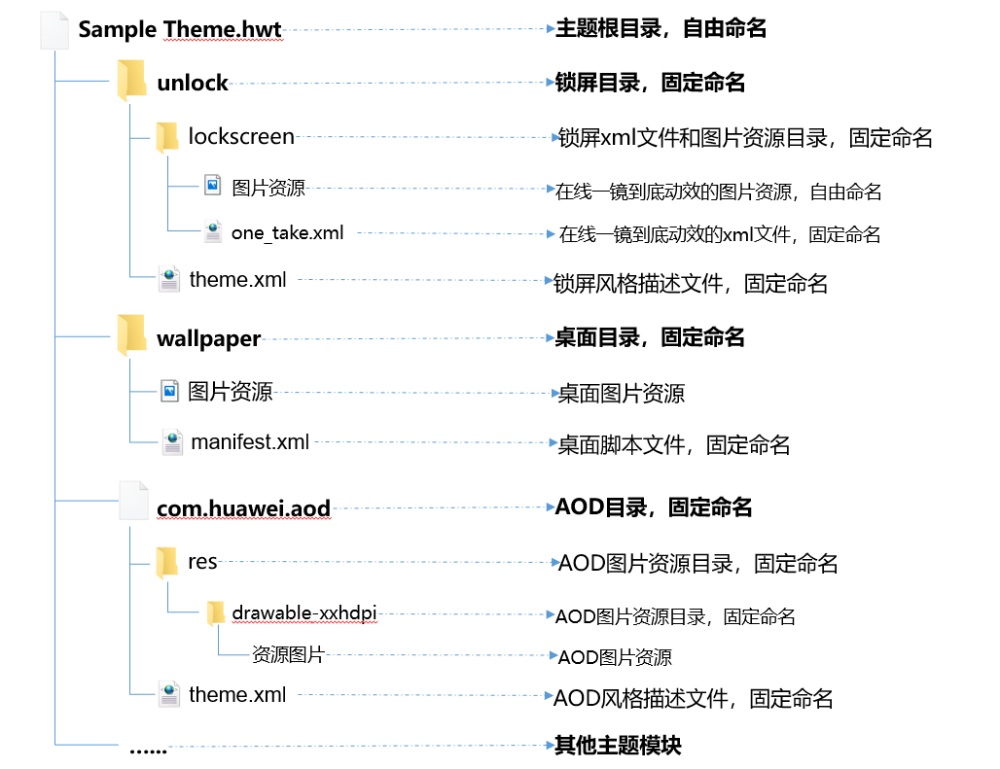
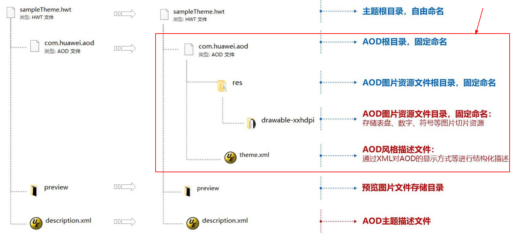
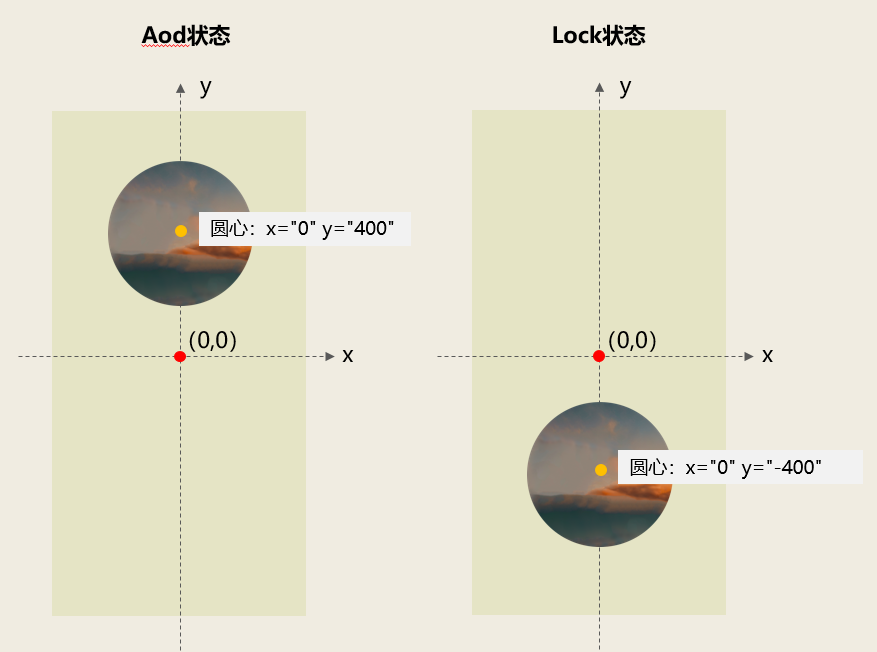
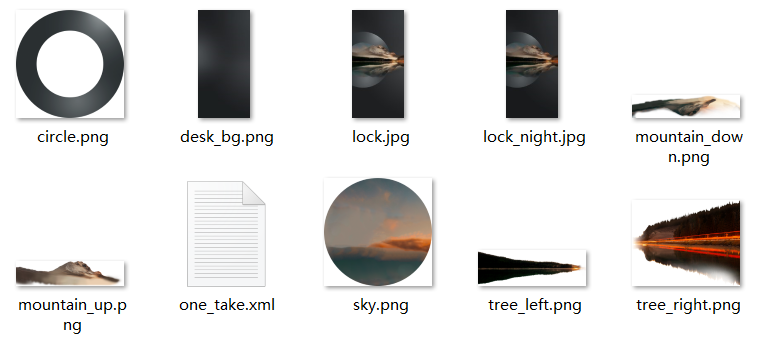

# 一镜到底

## 动效概述

一镜到底提供了一系列图片旋转、透明度设置和缩放设置的组合动效，实现锁屏→AOD、锁屏→桌面、AOD→桌面、AOD→锁屏和桌面→AOD这5个变化过程的动效展示。

## 使用说明

1. 一镜到底功能为独立模块，在锁屏和桌面上均不可和其他动效共同使用。
2. 手机系统EMUI11.0.0.165及以上版本、手机系统HarmonyOS 2.0版本、华为主题APP 12.0.14.300及以上版本才可使用一镜到底功能。
3. 一镜到底暂不支持应用于p50 Pocket、折叠屏、平板和以下直板机（Honor Hepburn、Honor Sandy、Honor Fennie、Honor Vinnie、Honor Magic 4、HONOR C-WAN30 Plus、Honor GBD、New Honor 60、New Honor 60 Pro、New Honor X30i、New Honor X30 Max、New Honor Play5、Honor X30、New Honor C-WAN 20 Pro、New Honor 60 SE、New Honor 10X Lite、New Honor 50 SE、New Honor 50、New Honor Magic3、New Honor 50 Pro、New Honor NTX、New Honor V40 轻奢版、New Honor X20 SE、New Honor X20、New Honor Play5等）。
4. 对于支持一镜到底动效的机型，设计师仅需制作一个一镜到底主题包，包含锁屏→AOD、锁屏→桌面、AOD→桌面、AOD→锁屏和桌面→AOD这5个变化过程的动效。引擎会根据用户机型进行适配：当用户机型支持AOD时，展示完整的变化动效，当用户机型不支持AOD时，仅展示锁屏→桌面的动效。
5. 设计师需要在预览图里明确告知用户：并非所有机型都支持AOD，机型支持AOD时，展示锁屏→AOD、锁屏→桌面、AOD→桌面、AOD→锁屏和桌面→AOD完整的变化动效，当机型不支持AOD时，仅展示锁屏→桌面的动效。
6. 配置一镜到底主题包时，必须要在description.xml中添加以下新增项：HWThemeEngine，示例如下：

   ```
   <?xml version="1.0" encoding="UTF-8"?>
     <HwTheme>
           <title>video_0402</title>
           <title-cn>无声1</title-cn>
           <author>author_name</author>
           <designer>designer_name</designer>
           <screen>FHD</screen>
           <version>10.0.0</version>
           <font>Default</font>
           <font-cn>默认</font-cn>
           //新增项
           <wallpaper>HWThemeEngine</wallpaper>
           <briefinfo>请在这里输入对主题的描述</briefinfo>
     </HwTheme>
   ```

## 主题包结构

制作一镜到底动效，必须在手机大主题包或小主题包中新增以下内容：

* 新增一个com.huawei.aod文件。
* 在wallpaper目录下新增一个manifest.xml文件和桌面图片资源。
* 在unlock/lockscreen目录下新增一个one\_take.xml文件和相关图片资源。



### com.huawei.aod

com.huawei.aod是AOD资源包，其目录结构和制作方法请看[AOD设计指导及规范](https://developer.huawei.com/consumer/cn/doc/content/aod-specification-0000001057549640)。




1. 从多种AOD中选择其中一种进行制作。
2. 锁屏→AOD和桌面→AOD变化过程结束后（即完全进入AOD状态时），展示com.huawei.aod中制作的AOD类型。
3. 建议com.huawei.aod使用的图片素材与unlock/lockscreen/one\_take.xml脚本中使用的图片素材相关联，以实现锁屏→AOD、锁屏→桌面、AOD→桌面、AOD→锁屏和桌面→AOD这5个变化过程中动效的自然过渡，获得比较好的一镜到底效果。

### wallpaper/manifest.xml

wallpaper目录下必须新增一个manifest.xml，作用是启动一镜到底动效。此manifest.xml文件内容固定如下：

```
<?xml version="1.0" encoding="utf-8"?>
<CommonWallpaper  version="1" frameRate="30" screenWidth="1080"  >
</CommonWallpaper>
```

wallpaper目录下的图片资源为桌面壁纸home\_wallpaper\_X.jpg和锁屏壁纸unlock\_wallpaper\_X.jpg。

### unlock/lockscreen/one\_take.xml

one\_take.xml是一镜到底动效的脚本文件，具体写法详见[one\_take.xml规范](#section1131721519203)和[one\_take.xml参数说明](#section1122592713171)。

one\_take.xml中，仅支持使用PNG、JPG格式的图片。


unlock/lockscreen目录下，如果新增了one\_take.xml文件，则不可再出现manifest.xml文件，两者不可共存。

此外，使用了一镜到底动效的主题包，必须要在unlock/theme.xml中设置： &lt;item style="magazine"/&gt;，如下所示：

```
<?xml version="1.0" encoding="UTF-8"?>
<HWTheme>
    <item style="magazine"/>
</HWTheme>
```

## one\_take.xml规范

```
<OneShot width="1080" height="1920" >

     <!--资源申明-->
     <Res>
         <Image src="desk_bg.png" id="deskBg" />
         <Image src="circle.png" id="circle" />
         ......
     </Res>

     <!--AOD状态-->
     <Aod>
         <Item resId="deskBg" x="0" y="0" alpha="0" />
         <Item resId="circle" alpha="0"    x="-255" y="418" scaleX="0.55" scaleY="0.55" rotationZ="-105"/>
         ......
     </Aod>

     <!--锁屏状态-->
     <Lock>
         <Item resId= "deskBg" alpha="1.0" x="0" y="0"/>
         <Item resId= "circle" alpha="1.0" x="-390" y="106" scaleX="1.0" scaleY="1.0" rotationZ="0" />
         ......
     </Lock>

     <!--桌面状态-->
     <Launcher>
         <Item resId="deskBg" alpha="0.0" x="0" y="0"/>
         <Item resId="circle" alpha="0.0" x="-444" y="238" scaleX="2" scaleY="2" rotationZ="50"/>
         ......
     </Launcher>

     <!--AOD变化到锁屏的动画过程-->
     <Aod2Lock>
         <Item resId="deskBg" delay="333" duration="667"  property="alpha,y" />
         <Item resId="sky" duration="1000" property="x,y" />
         ......
     </Aod2Lock>

     <!--AOD变化到桌面的动画过程-->
     <Aod2Launcher>
         <Item resId="deskBg" delay="333" duration="667" property="alpha,y" />
         <Item resId="sky" delay="333" duration="667"  property="alpha, scaleX, scaleY, x, y" />
         ......
     </Aod2Launcher>

     <!--桌面变化到AOD的动画过程-->
     <Launcher2Aod>
         <Item resId="deskBg" duration="583"  property="alpha" />
         <Item resId="sky" duration="1000"  property="alpha, scaleX, scaleY, x, y" />
         ......
     </Launcher2Aod>

     <!--锁屏变化到AOD的动画过程-->
     <Lock2Aod>
         <Item resId="deskBg" duration="583"  property="alpha" />
         <Item resId="sky" duration="583"  interpolators="default,Anticipate" keys="0,583" values="0,1" property="alpha" />
         ......
     </Lock2Aod>

     <!--锁屏变化到桌面的动画过程-->
     <Lock2Launcher>
         <Item resId="sky" duration="717"  property="alpha, scaleX, scaleY, x, y" />
         <Item resId="circle" duration="717"  property="alpha, scaleX, scaleY, x, y, rotationZ" />
         ......
     </Lock2Launcher>

 </OneShot>
```


1. one\_take.xml文件中需包含以下内容：资源声明、AOD状态下动效资源的属性、Lock状态下动效资源的属性、Launcher状态下动效资源的属性、Aod变化到Lock的动画过程、Lock变化到Aod的动画过程、Aod变化到Launcher的动画过程、Launcher变化到Aod的动画过程和Lock变化到Launcher的动画过程。
2. 锁屏→AOD和桌面→AOD变化过程结束后（即完全进入AOD状态时），展示com.huawei.aod中制作的AOD类型。
3. 锁屏→桌面、AOD→桌面和AOD→锁屏变化过程结束后，展示one\_take.xml中当前状态下设置的动效资源属性。

## one\_take.xml参数说明

* <strong>&lt;OneShot&gt;</strong>

&lt;OneShot&gt;是一镜到底动效的主标签。

| 参数 | 类型 | 选项 | 注释 |
| --- | --- | --- | --- |
| width | 数值 | 必填 | 表示动效设计时图纸的宽。 |
| height | 数值 | 必填 | 表示动效设计时图纸的高。 |


1. 一镜到底动效实际应用时，会根据屏幕宽高进行等比缩放，居中裁剪，以实现比较好的适配效果。
2. 建议width的值为1080，height的值为1920。

* <strong>&lt;Res&gt;</strong>

&lt;Res&gt;表示资源的声明，包含&lt;Image&gt;、&lt;Group&gt;两个子标签。

* <strong>&lt;Image&gt;</strong>

&lt;Image&gt;是&lt;Res&gt;的子标签，表示图片资源，可嵌套其它Image元素，实现资源分组。

可引用&lt;Image&gt;的id值，实现针对这一组资源设置动效。

| 参数 | 类型 | 选项 | 注释 |
| --- | --- | --- | --- |
| src | 字符串 | 必填 | 图片的源路径。 |
| id | 字符串 | 必填 | 表示图片对应的id，后续将通过id查找对应的图片。 |

使用&lt;Image&gt;，实现资源分组示例：

```
<Res>
      <Image id="sky_circle">
           <Image src="2.png" id="sky"/>
           <Image src="3.png" id="circle"/>
      </Image>
 </Res>
```

* <strong>&lt;Group&gt;</strong>

&lt;Group&gt;是&lt;Res&gt;的子标签，可嵌套Image标签，实现资源分组。

可引用&lt;Group&gt;的id值，实现针对这一组资源设置动效。

| 参数 | 类型 | 选项 | 注释 |
| --- | --- | --- | --- |
| id | 字符串 | 必填 | 标签的id，后续将通过id查找对应的资源组。 |

使用&lt;Group&gt;，实现资源分组示例：

```
<Res>
      <Group id="sky_circle">
           <Image src="2.png" id="sky"/>
           <Image src="3.png" id="circle"/>
      </Group>
 </Res>
```

* <strong>&lt;Aod&gt;</strong>

当处于Aod状态时，各动效资源的属性信息，包含资源子标签&lt;Item&gt;。

* <strong>&lt;Lock&gt;</strong>

当处于Lock状态时，各动效资源的属性信息，包含资源子标签&lt;Item&gt;。

* <strong>&lt;Launcher&gt;</strong>

当处于Launcher状态时，各动效资源的属性信息，包含资源子标签&lt;Item&gt;。

* <strong>&lt;Item&gt;</strong>

&lt;Item&gt;是&lt;Aod&gt;、&lt;Lock&gt;和&lt;Launcher&gt;的资源子标签，表示Aod/Lock/Launcher状态下某个资源的属性信息。

| 参数 | 类型 | 选项 | 注释 |
| --- | --- | --- | --- |
| resId | 字符串 | 必填 | 表示该Item对应的资源id。 |
| alpha | 字符串 | 选填 | 表示该Item的透明度，取值范围为[0,1]。 |
| x | 字符串 | 选填 | 表示该Item的x轴位置。 |
| y | 字符串 | 选填 | 表示该Item的y轴位置。 |
| z | 字符串 | 选填 | 表示该Item的z轴位置，屏幕外为z轴正方向。 |
| scaleX | 字符串 | 选填 | 表示该Item的x轴缩放比例。 |
| scaleY | 字符串 | 选填 | 表示该Item的y轴缩放比例。 |
| scaleZ | 字符串 | 选填 | 表示该Item的z轴缩放比例。 |
| rotationX | 字符串 | 选填 | 表示该Item的x轴旋转角度。 |
| rotationY | 字符串 | 选填 | 表示该Item的y轴旋转角度。 |
| rotationZ | 字符串 | 选填 | 表示该Item的z轴旋转角度。 |

&lt;Item&gt;标签使用说明：

1. 一镜到底动效中，以屏幕中心点为坐标原点（0,0)，同时x、y、z的值为切图中心点的值。示例：sky.png这张图片资源，在AOD状态时位置为： y="400" x="0"，在Lock状态时位置为：y="-400" x="0"。

   ```
   <Aod>
         <Item scaleY="1" scaleX="1" y="400" x="0" alpha="1" resId="sky"/>
   </Aod>
   <Lock>
         <Item scaleY="1.0" scaleX="1.0" y="-400" x="0" alpha="1.0" resId="sky"/>
   </Lock>
   ```

   则在屏幕上，在AOD和Lock状态下sky.png的位置分别为：

   
2. x、y、z、scaleX、scaleY、scaleZ、rotationX、rotationY和rotationZ 在Aod、Lock和Launcher中使用时，数量需保持一致。例如：当Aod中用到x、y、scaleX、scaleY和rotationZ时，Lock中需与其保持数量的一致：

   ```
   <Aod>
        <Item resId="circle" alpha="0" x="-255" y="418" scaleX="0.55" scaleY="0.55" rotationZ="-105"/>
   </Aod>
   <Lock>
        <Item resId= "circle" alpha="1.0" x="-390" y="106" scaleX="1.0" scaleY="1.0" rotationZ="0" />
   </Lock>
   ```
3. 如需实现图片等比缩放的效果，则scaleX、scaleY的值需保持一致。

* <strong>&lt;Aod2Lock&gt;</strong>

表示一镜到底Aod变化到Lock的动画过程，包含动画子标签&lt;Item&gt;。

* <strong>&lt;Lock2Aod&gt;</strong>

表示一镜到底Lock变化到Aod的动画过程，包含动画子标签&lt;Item&gt;。

* <strong>&lt;Aod2Launcher&gt;</strong>

表示一镜到底Aod变化到Launcher的动画过程，包含动画子标签&lt;Item&gt;。

* <strong>&lt;Launcher2Aod&gt;</strong>

表示一镜到底Launcher变化到Aod的动画过程，包含动画子标签&lt;Item&gt;。

* <strong>&lt;Lock2Launcher&gt;</strong>

表示一镜到底Lock变化到Launcher的动画过程，包含动画子标签&lt;Item&gt;。

* <strong>&lt;Item&gt;</strong>

&lt;Item&gt;是&lt;Aod2Lock&gt;、&lt;Lock2Aod&gt;、&lt;Aod2Launcher&gt;、&lt;Launcher2Aod&gt;和&lt;Lock2Launcher&gt;的动画子标签，表示动画过程的参数和资源。

| 参数 | 类型 | 选项 | 注释 |
| --- | --- | --- | --- |
| resId | 字符串 | 必填 | 表示该Item对应的资源id。 |
| property | 字符串 | 选填 | 指定此动画过程中需要改变的资源属性。示例：property="alpha"表示此过程中只对该资源的alpha属性做改变；property="x,y"表示只对该resId代表的资源做x、y属性的改变，其余属性保持不变 。 |
| delay | 数值 | 选填 | 表示动画的延迟执行时间，单位为毫秒ms。 |
| duration | 数值 | 必填 | 表示动画的持续时间，单位为毫秒ms。duration的最大值为1000ms，如果设置了delay，则duration最大值为1000减去delay的值。 |
| keys | 字符串 | 选填 | 表示关键帧的时间点，数值之间用","隔开，keys个数最少2个，最后一个值不得大于1000ms。  示例：keys="0,500,1000"。  说明：  1. keys需要和values、interpolators一起使用。 2. 建议keys最后一个值小于duration的值。 |
| values | 字符串 | 选填 | 代表对应关键帧的值，数值之间用","隔开。  示例：values="0,200,400"。  说明：  1. values需要和keys、interpolators一起使用。 2. values个数需要和keys时间点个数保持一致。 3. 建议values在property中涉及到的属性的最小值和最大值之间进行取值。 |
| interpolators | 字符串 | 选填 | 代表关键帧对应的运动速率类型，数值之间用","隔开，写法为：interpolators="default,xx,xx,...,xx" 。  提供以下10种运动速率类型，可选择其中1种或多种进行制作：Accelerate、Decelerate、AccelerateDecelerate、Anticipate、AnticipateOvershoot、Bounce、FastOutLinear、FastOutSlowIn、Linear和LinearOutSlowIn  说明：  1. interpolators需要和keys、values一起使用。 2. interpolators个数需要和keys时间点个数保持一致。 3. interpolators="default,xx,xx,...,xx"写法中，default为第一个值的固定写法，后面几个值根据需要进行添加。 4. 当interpolators参数匹配设置的运动速率类型失败时，默认使用AccelerateDecelerate。 5. 如需了解10种运动速率类型的应用效果，请点击：[运动速率类型说明](#section2016042315175)。 |

&lt;Item&gt;标签使用说明：

1. 锁屏→AOD、锁屏→桌面、AOD→桌面、AOD→锁屏和桌面→AOD这5个动画过程的时间均固定为1000毫秒，所以duration的值最大为1000毫秒。如果设置了delay，则duration的值最大为1000毫秒减去delay的毫秒。
2. 通过设置property，可以指定动画过程中涉及到的资源属性；通过设置keys、values和interpolators ，可以针对property中涉及到的资源属性，个性化设置一个或多个动画运动速率类型。

   以下为一个AOD→锁屏的图片位置变化实例：sky.png这张资源图片，在Aod状态下位置为y="400" x="0" ，在Lock状态下位置为y="-400" x="0" ，从AOD→锁屏变化过程中，设置property="y"（动画过程中涉及到y的变化），duration="1000"（动画持续时间为1000毫秒），keys="0,1000"（时间点为0、1000毫秒），values="400.0,-400.0"（0毫秒时y的值为400，1000毫秒时y的值为-400），interpolators="default,Bounce"（0-1000毫秒时间段使用Bounce这种运动速率类型，Bounce效果为弹跳）：

   ```
   <OneShot height="2772" width="1344">
       <Res>
           <Image id="sky" src="sky.png"/>
       </Res>
       <Aod>
           <Item scaleY="1" scaleX="1" y="400" x="0" alpha="1" resId="sky"/>
       </Aod>
       <Lock>
           <Item scaleY="1.0" scaleX="1.0" y="-400" x="0" alpha="1.0" resId="sky"/>
       </Lock>
       <Launcher>
           <Item scaleY="1" scaleX="1" y="400" x="0" alpha="1.0" resId="sky"/>
       </Launcher>
       <Aod2Lock>
           <Item resId="sky" property="y" values="400.0,-400.0" keys="0,1000" interpolators="default,Bounce" duration="1000"/>
       </Aod2Lock>
       ......
    </OneShot>
   ```

   则实际应用效果为：

   [](https://alliance-communityfile-drcn.dbankcdn.com/FileServer/getFile/publicContent/011/111/111/0000000000011111111.20251218173441.96007363206678393040112882249334:20260601221914:2800:BBDE662AC50AD3859ACBFA579161D25B139057491C39B2E1BDC751E56C8A0432.mp4)
3. 若用户熄屏显示设置成定时显示或者全天显示场景，由于系统对屏幕保护，会自动移动aod位置，导致aod的实际坐标可能与Aod标签内定义的资源坐标不一致。因此在设计aod-&gt;其他动效时，若目标位置明确，建议对Item的property属性配置y，防止因屏幕保护产生的效果异常 。以Aod2Lock过程为例：

   a. 当Aod2Lock中Item的property属性配置y时，则aod至锁屏过程，锁屏deskBg最终位置为Lock中定义的y坐标；

   b. 当Aod2Lock中Item的property属性未配置y时，则aod至锁屏过程，锁屏deskBg最终位置为aod的实际y坐标。

   ```
   <Aod2Lock>
        <Item resId="deskBg" delay="333" duration="667" property="alpha,y" />
        <Item resId="sky" duration="1000" property="x,y" />
        ......
   </Aod2Lock>
   ```

## 应用举例

下面的示例实现了完整的一镜到底动效：锁屏→AOD、锁屏→桌面、AOD→桌面、AOD→锁屏和桌面→AOD这5个变化过程的动效。

<strong>AOD→锁屏和锁屏→桌面动画过程展示：</strong>

[](https://alliance-communityfile-drcn.dbankcdn.com/FileServer/getFile/publicContent/011/111/111/0000000000011111111.20251218173441.73020288421306085991487527460400:20260601221914:2800:A6AEF9591F901B84A4EE8AECF6F90570EC4D5809E10282154C1D28C7E669D56C.mp4)

<strong>相关图片素材：</strong>



<strong>one\_take.xml脚本</strong>：

```
<OneShot width="1080" height="1920" >

      <!--资源申明-->
      <Res>
          <Image src="desk_bg.png" id="deskBg" />
          <Image src="circle.png" id="circle" />
          <Image src="sky.png" id="sky" />
          <Image src="mountain_down.png" id="mountainDown" />
          <Image src="mountain_up.png" id="mountainUp" />
          <Image src="tree_left.png" id="treeLeft" />
          <Image src="tree_right.png" id="treeRight" />
     </Res>

     <!--AOD状态-->
     <Aod>
         <Item resId="deskBg" x="0" y="0" alpha="0" />
         <Item resId="circle" alpha="0"    x="-255" y="418" scaleX="0.55" scaleY="0.55" rotationZ="-105"/>
         <Item resId="sky" alpha="0" x="-255" y="418" scaleX="0.55" scaleY="0.55" />
         <Item resId="mountainDown" x="-44" y="274" scaleX="0.55" scaleY="0.55" />
         <Item resId="mountainUp" x="-92" y="498" scaleX="0.55" scaleY="0.55" />
         <Item resId="treeLeft" x="-170" y="392" scaleX="0.55" scaleY="0.55" />
         <Item resId="treeRight" x="418" y="392" scaleX="0.55" scaleY="0.55" />
     </Aod>

     <!--锁屏状态-->
     <Lock>
         <Item resId= "deskBg" alpha="1.0" x="0" y="0"/>
         <Item resId= "circle" alpha="1.0" x="-390" y="106" scaleX="1.0" scaleY="1.0" rotationZ="0" />
         <Item resId= "sky" alpha="1.0" x="-390" y="106" scaleX="1.0" scaleY="1.0"/>
         <Item resId= "mountainDown" x="-51" y="-144" scaleX="1.0" scaleY="1.0"/>
         <Item resId= "mountainUp" x="-137" y="256" scaleX="1.0" scaleY="1.0"/>
         <Item resId= "treeLeft" x="-284" y="69" scaleX="1.0" scaleY="1.0"/>
         <Item resId= "treeRight" x="789" y="72" scaleX="1.0" scaleY="1.0"/>
     </Lock>

     <!--桌面状态-->
     <Launcher>
         <Item resId="deskBg" alpha="0.0" x="0" y="0"/>
         <Item resId="circle" alpha="0.0" x="-444" y="238" scaleX="2" scaleY="2" rotationZ="50"/>
         <Item resId="sky" alpha="0.0" x="-444" y="238" scaleX="2" scaleY="2"/>
         <Item resId="mountainDown" alpha="0.0" x="-22" y="-52" scaleX="2" scaleY="2"/>
         <Item resId="mountainUp" alpha="0.0" x="-126" y="419" scaleX="2" scaleY="2"/>
         <Item resId="treeLeft" alpha="0.0" x="-299" y="201" scaleX="2" scaleY="2"/>
         <Item resId="treeRight" alpha="0.0" x="977" y="201" scaleX="2" scaleY="2"/>
     </Launcher>

     <!--AOD变化到锁屏动画过程-->
     <Aod2Lock>
         <Item resId="deskBg" delay="333" duration="667"  property="alpha,y" />
         <Item resId="sky" duration="1000" property="x,y" />
         <Item resId="sky" duration="800" delay="222"  property="alpha,scaleX, scaleY" />
         <Item resId="circle" duration="1000" interpolators="default,Anticipate" keys="0,1000" values="400.0,-400.0" property="x,y" />
         <Item resId="circle" duration="800" delay="222"  property="alpha,scaleX, scaleY,rotationZ" />
         <Item resId="mountainDown" duration="1000"  property="x,y,scaleX,scaleY" />
         <Item resId="mountainUp" duration="1000"  property="x,y,scaleX,scaleY" />
         <Item resId="treeLeft" duration="1000"  property="x,y,scaleX,scaleY" />
         <Item resId="treeRight" duration="1000"  property="x,y,scaleX,scaleY" />
     </Aod2Lock>

     <!--AOD变化到桌面动画过程-->
     <Aod2Launcher>
         <Item resId="deskBg" delay="333" duration="667" property="alpha,y" />
         <Item resId="sky" delay="333" duration="667"  property="alpha, scaleX, scaleY, x, y" />
         <Item resId="circle" delay="333" duration="667"  property="alpha, scaleX, scaleY, x, y, rotationZ" />
         <Item resId="mountainDown" duration="1000"  property="scaleX, scaleY, x, y" />
         <Item resId="mountainUp" duration="1000"  property="scaleX, scaleY, x, y" />
         <Item resId="treeLeft" duration="950"  property="scaleX, scaleY, x, y" />
         <Item resId="treeRight" duration="933"  property="scaleX, scaleY, x, y" />
     </Aod2Launcher>

     <!--桌面变化到AOD动画过程-->
     <Launcher2Aod>
         <Item resId="deskBg" duration="583"  property="alpha" />
         <Item resId="sky" duration="1000"  property="alpha, scaleX, scaleY, x, y" />
         <Item resId="circle" duration="1000"  property="alpha, scaleX, scaleY, x, y, rotationZ" />
         <Item resId="mountainDown" duration="1000"  property="scaleX, scaleY, x, y" />
         <Item resId="mountainUp" duration="1000"  property="scaleX, scaleY, x, y" />
         <Item resId="treeLeft" duration="1000"  property="scaleX, scaleY, x, y" />
         <Item resId="treeRight" duration="1000"  property="scaleX, scaleY, x, y" />
     </Launcher2Aod>

     <!--锁屏变化到AOD动画过程-->
     <Lock2Aod>
         <Item resId="deskBg" duration="583"  property="alpha" />
         <Item resId="sky" duration="583"  interpolators="default,Anticipate" keys="0,583" values="0,1" property="alpha" />
         <Item resId="sky" duration="1000"  property="x, y" />
         <Item resId="circle" duration="583"  property="scaleX, scaleY, rotationZ" />
         <Item resId="circle" duration="1000"  property="alpha, x, y" />
         <Item resId="mountainDown" duration="1000"  property="scaleX, scaleY, x, y" />
         <Item resId="mountainUp" duration="1000"  property="scaleX, scaleY, x, y" />
         <Item resId="treeLeft" duration="1000"  property="scaleX, scaleY, x, y" />
         <Item resId="treeRight" duration="1000" property="scaleX, scaleY, x, y" />
     </Lock2Aod>

     <!--锁屏变化到桌面动画过程-->
     <Lock2Launcher>
         <Item resId="sky" duration="717"  property="alpha, scaleX, scaleY, x, y" />
         <Item resId="circle" duration="717"  property="alpha, scaleX, scaleY, x, y, rotationZ" />
         <Item resId="mountainDown" duration="717"  property="scaleX, scaleY, x, y" />
         <Item resId="mountainUp" duration="567"  property="scaleX, scaleY, x, y" />
         <Item resId="treeLeft" duration="500"  property="scaleX, scaleY, x, y" />
         <Item resId="treeRight" duration="500"  property="scaleX, scaleY, x, y" />
     </Lock2Launcher>

 </OneShot>
```

## 运动速率类型说明

视频基于以下示例对运动速率类型进行展示，示例为AOD→锁屏的图片位置变化动画：

sky.png这张资源图片，在Aod状态下位置为y="400" x="0" ，在Lock状态下位置为y="-400" x="0" ，从AOD→锁屏变化过程中，设置property="y"（动画过程中涉及到y的变化），duration="1000"（动画持续时间为1000毫秒），keys="0,1000"（时间点为0、1000毫秒），values="400.0,-400.0"（0毫秒时y的值为400，1000毫秒时y的值为-400），interpolators="default,xx"（0-1000毫秒时间段使用xx这种运动速率类型）：

```
<OneShot height="2772" width="1344">
    <Res>
        <Image id="sky" src="sky.png"/>
    </Res>
    <Aod>
        <Item scaleY="1" scaleX="1" y="400" x="0" alpha="1" resId="sky"/>
    </Aod>
    <Lock>
        <Item scaleY="1.0" scaleX="1.0" y="-400" x="0" alpha="1.0" resId="sky"/>
    </Lock>
    <Launcher>
        <Item scaleY="1" scaleX="1" y="400" x="0" alpha="1.0" resId="sky"/>
    </Launcher>
    <Aod2Lock>
        <Item resId="sky" property="y" values="400.0,-400.0" keys="0,1000" interpolators="default,xx" duration="1000"/>
    </Aod2Lock>
    ......
 </OneShot>
```

<strong>Accelerate</strong>：加速

则设置interpolators="default,Accelerate"时，应用效果如下：

[](https://alliance-communityfile-drcn.dbankcdn.com/FileServer/getFile/publicContent/011/111/111/0000000000011111111.20251218173441.93592584600027381154544233847339:20260601221914:2800:1BB07EA2FF956A75036C69CAE06E73E767B33F792F2E3EAF7D19039E0F781145.mp4)

<strong>Decelerate</strong>：减速

则设置interpolators="default,Decelerate"时，应用效果如下：

[](https://alliance-communityfile-drcn.dbankcdn.com/FileServer/getFile/publicContent/011/111/111/0000000000011111111.20251218173441.44432660691420216756578770003714:20260601221914:2800:8DE5C7BE1376CB187B289D2293C7F1DE9AAB90766B4698381C4D13DD3C4B3D81.mp4)

<strong>AccelerateDecelerate</strong>：先加速后减速

则设置interpolators="default,AccelerateDecelerate"时，应用效果如下：

[](https://alliance-communityfile-drcn.dbankcdn.com/FileServer/getFile/publicContent/011/111/111/0000000000011111111.20251218173441.49086291768236109912025843008719:20260601221914:2800:32771EABBD098E57ABE8A8D64352C6F8ACC16108D0B5A71097BFB9ADCD1A590B.mp4)

<strong>Anticipate</strong>：先加速后减速至0，正方向加速运动，速度越来越快

则设置interpolators="default,Anticipate"时，应用效果如下：

[](https://alliance-communityfile-drcn.dbankcdn.com/FileServer/getFile/publicContent/011/111/111/0000000000011111111.20251218173441.32456496412814547467996459735736:20260601221914:2800:10A09402FD9E67CC14527A62540B092AE62720D2CCB50B0638A41B806B69C8B5.mp4)

<strong>AnticipateOvershoot</strong>：Anticipate和Overshoot叠加起来的效果

则设置interpolators="default,AnticipateOvershoot"时，应用效果如下：

[](https://alliance-communityfile-drcn.dbankcdn.com/FileServer/getFile/publicContent/011/111/111/0000000000011111111.20251218173441.42825448679978268991246120069738:20260601221914:2800:D24B712DD3C3EA8B75B1010E37A7A7C42284D85E98BA2ACA0C49529C09FC8AA7.mp4)

<strong>Bounce</strong>：弹跳

则设置interpolators="default,Bounce"时，应用效果如下：

[](https://alliance-communityfile-drcn.dbankcdn.com/FileServer/getFile/publicContent/011/111/111/0000000000011111111.20251218173441.41422103237699382824957111438039:20260601221914:2800:D6E5064E0F9717A5A1943FCF8E226526BB7E002048AEDEF2D7644985A936D15C.mp4)

<strong>FastOutLinear</strong>：加速迅速并一直加速到结束

则设置interpolators="default,FastOutLinear"时，应用效果如下：

[](https://alliance-communityfile-drcn.dbankcdn.com/FileServer/getFile/publicContent/011/111/111/0000000000011111111.20251218173441.57080097193963439048400055508260:20260601221914:2800:4DFAB3AD730BE693E1A2F19CFE7705F11DDC3A1E4AF7F4AC2D4E40C59D9A84CC.mp4)

<strong>FastOutSlowIn</strong>：加速快但减速慢

则设置interpolators="default,Accelerate"时，应用效果如下：

[](https://alliance-communityfile-drcn.dbankcdn.com/FileServer/getFile/publicContent/011/111/111/0000000000011111111.20251218173441.23863874421457826961935789209015:20260601221914:2800:F2FCA0381F9AE1062D6FCDBE85233CA7781FF8889304BB42A76E6DEC938B84E1.mp4)

<strong>Linear</strong>：线性

则设置interpolators="default,Linear"时，应用效果如下：

[](https://alliance-communityfile-drcn.dbankcdn.com/FileServer/getFile/publicContent/011/111/111/0000000000011111111.20251218173441.70683073074075531785829599998722:20260601221914:2800:9CF39190BC36C60F04CB3C0DA26EC542917025797C9D7CFEC5B5D7C2243008D0.mp4)

<strong>LinearOutSlowIn</strong>：先匀速再减速

则设置interpolators="default,LinearOutSlowIn"时，应用效果如下：

[](https://alliance-communityfile-drcn.dbankcdn.com/FileServer/getFile/publicContent/011/111/111/0000000000011111111.20251218173441.28679557401743033890892769149778:20260601221914:2800:5745EACDDB42D8EB32155181658A0EF07E7E2E4EA4FEFDE59BECD74E18121BBE.mp4)