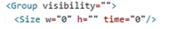
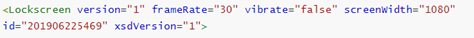
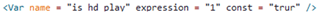
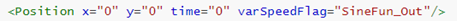

# 脚本规范

1. <strong>参数值的内容不能为空</strong>

   <strong>描述：</strong>没有参数值的属性可以直接删除，如果声明了属性，该属性的值不能为空，否则会导致加载失败显示默认锁屏。

   <strong>错误示范：</strong>

   

   图中visibility和h属性为空值，会导致引擎报错，请直接删除这两个属性或填充属性值。
2. <strong>Lockscreen和Root等根标签写法不能有误</strong>

   <strong>描述：</strong>根标签的编写必须依据文档中的描述，如果错误的编写会导致加载失败显示默认锁屏。

   <strong>正确示范：</strong>

   
3. <strong>文档中不支持表达式的字符串布尔值，属性只能为"true"和"false"</strong>

   <strong>描述：</strong>对于不能使用expression的布尔值属性，注意写法为"true"和"false"其他的写法会导致加载错误显示默认锁屏。

   <strong>错误示范：</strong>

   
4. <strong>文档中没有明确支持表达式的数值类型，属性值只能为数字类型</strong>

   <strong>描述：</strong>对于文档中约束是不支持表达式的数值类型的，参数值只能写为数字，写其他类型（例如字符串、表达式等）会加载错误显示默认锁屏。

   <strong>错误示范：</strong>

   

   图中time属性值为数值类型，不支持表达式，上图在数值属性中写入了表达式导致加载错误显示默认锁屏。
5. <strong>变速函数的属性值必须与文档中变速函数类型的字符串匹配</strong>

   <strong>描述：</strong>使用变速函数需要参照文档，变速函数的具体的写法需要与文档保持一致，否则会导致加载失败显示默认锁屏。

   <strong>正确示范：</strong>

   
6. <strong>禁止使用特殊字符</strong>

   <strong>描述：</strong>避免在文档中属性值使用特殊字符, &lt;（小于符号） &gt;（大于符号） &（与符号） '（单引号） "（双引号），特殊字符会直接导致加载错误显示默认锁屏。

## 与华为主题动态引擎（原掌酷引擎）差异部分

1. <strong>variable变量中的const常量属性，如果设置为true，则变量初始化后不可再改变</strong>。

   <strong>建议：</strong>variable中的const属性为设置该变量为常量，在值初始化之后禁止该值再次改变，如果没有该需求，请勿设置variable的const属性或者设置const="false"。
2. <strong>xsdVersion如果有值的话默认不持久化，如果无xsdVersion则默认持久化</strong>。

   <strong>建议：</strong>由于默认持久化会导致部分不需要持久化的变量被存为变量，对于某些快速变化的变量会影响引擎性能。推荐不使用默认持久化，而通过显示声明按需持久化变量。
3. <strong>华为官方主题引擎与华为主题动态引擎（原掌酷引擎）差异化的新增标签、功能和属性，请按照开发文档中的描述开发</strong>。

   <strong>建议：</strong>新增标签、功能和属性请按照开发文档中的描述进行开发。华为官方主题引擎标签和属性与其他引擎有些许差异，代码迁移时请根据开发规范进行检视。