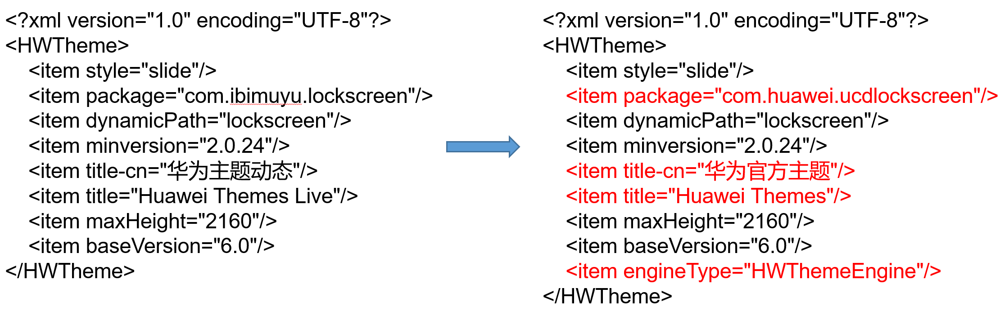

# 更新指导


EMUI8.0版本不支持华为官方主题引擎。

## 引擎名称变化

路径：unlock/theme.xml



## 支持const属性

路径：unlock/lockscreen/manifest.xml

旧引擎变量&lt;Var&gt;不支持const属性，现华为官方主题引擎支持该属性，主题包可能因变量设置该属性而影响锁屏最终效果（新引擎默认const=“false”）。

示例：

```
<Var name="bj" expression="0" const="true"/>
```

1. 此时定义变量bj 为常量，不会改变；
2. 如果需要变量bj可更改，可删除const=“true”或更改const=“false"/&gt;。

## 支持space属性

路径：unlock/lockscreen/manifest.xml

旧引擎时间&lt;Time&gt;不支持space属性, 现华为官方主题引擎新增该属性功能，主题包可能因时间设置该属性而影响锁屏最终效果（新引擎默认space=“0”）。

示例：

```
<Time align="center" space="20" src="time/number.png" x="540" y="#screen_height/2"/>
```

1. 此时定义图片素材number.png之间的间距为20px；

2. 如果需要更改间距，直接更改参数即可。例如不需要间距space=“0” 或更大space=“50”等。

## 支持vibrate属性

路径：unlock/lockscreen/manifest.xml

旧引擎震动变量vibrate不生效, 现华为官方主题引擎新增该属性功能，主题包可能因vibrate=“true”而影响锁屏最终效果（新引擎默认vibrate=“false”)。

示例：

```
<Lockscreen version="1" frameRate="30" vibrate="true" displayDesktop="true" screenWidth="1080" >
```

1. 此时定义变量vibrate=“true” ，点击锁屏会有震动效果；

2. 如果不需要锁屏有震动效果，可以删除vibrate=“true”或更改vibrate=“false”。

## 加强安全校验

路径：unlock/lockscreen/manifest.xml

因安全需要，现华为官方主题引擎中应用打开功能对intent进行允许清单校验，主题包中涉及应用打开功能需要确认设计师设置的action、package、class是否符合要求。

1. 拉起安全相机和电话，拉起安全相机后面不能写解锁命令，拉起电话后面需要写解锁命令才能正常拉起；

   action=”android.media.action.STILL\_IMAGE\_CAMERA\_SECURE”

   action=”android.intent.action.DIAL”
2. action=”android.intent.action.MAIN”时，Package、Component、Type至少有一项写正确才能通过。

示例：拉起微信

```
<IntentCommand action="android.intent.action.MAIN" package="com.tencent.mm" class="com.tencent.mm.ui.LauncherUI" />
```

## 转化工具说明

使用转换工具默认更改主题包内unlock/lockscreen/manifest.xml中的三个变量：

space不论何值 ----&gt; space=“0”

const=“true”----&gt; const=“false”

操作指导详见视频：

[](https://alliance-communityfile-drcn.dbankcdn.com/FileServer/getFile/publicContent/011/111/111/0000000000011111111.20251218173444.24216751506880596778007559330554:20260601221933:2800:D4CFAF895C5029A496768046CFC40BF9693A385ECBBA5CEBFC1EA9662AEE5296.mp4)

## 转化工具下载

转化工具下载：[updateHwtTool.zip](https://alliance-communityfile-drcn.dbankcdn.com/FileServer/getFile/cmtyPub/011/111/111/0000000000011111111.20251218173444.00231583382720608428722219973056%3A50001231000000%3A2800%3A3CFBC7CC414145325203752078EB751FB698F65E9109349F9853C5C01F63DEC1.zip?needInitFileName=true)