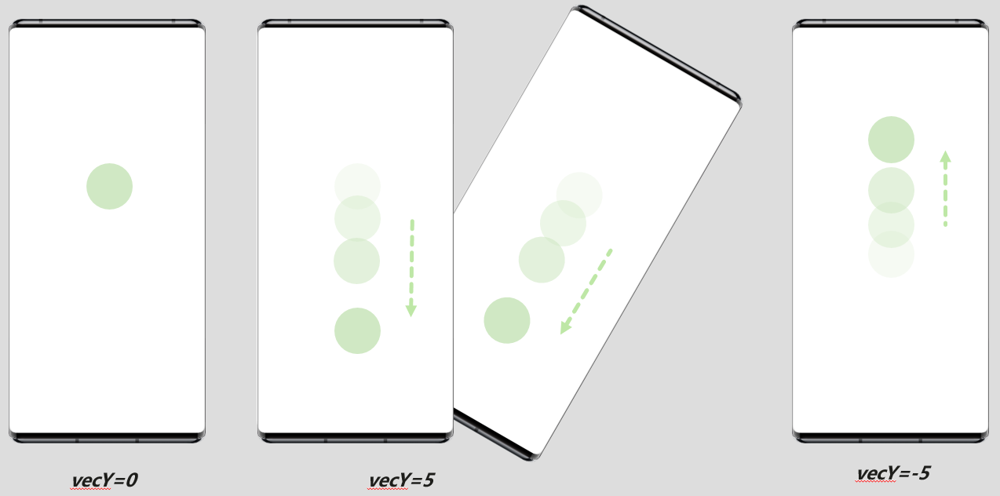
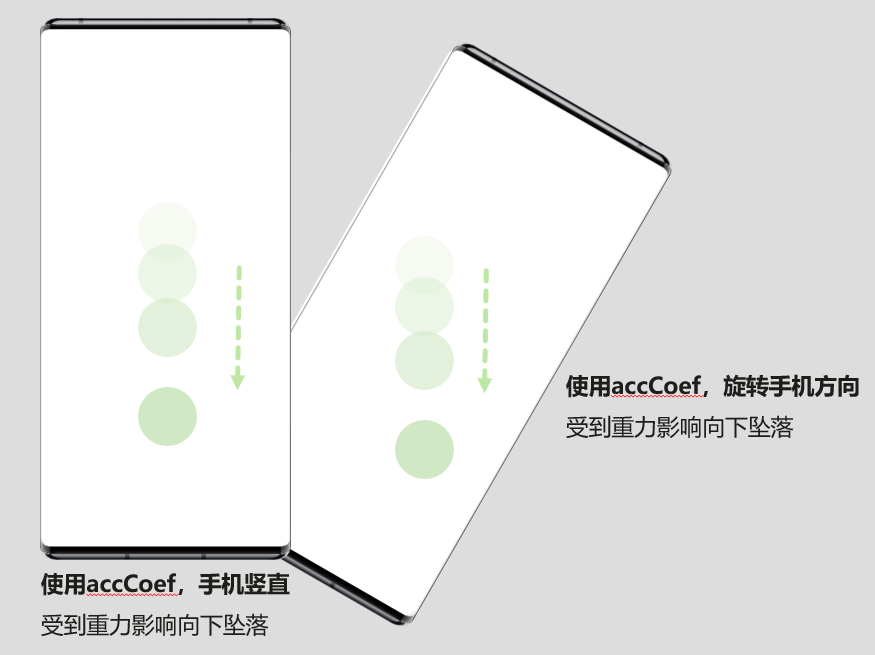
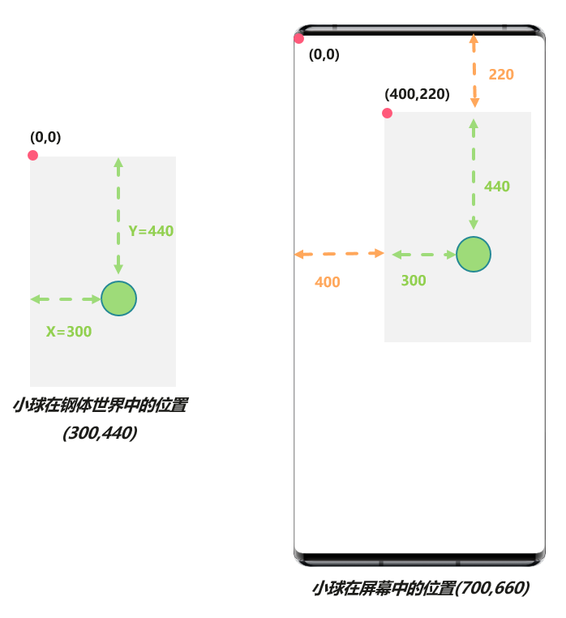
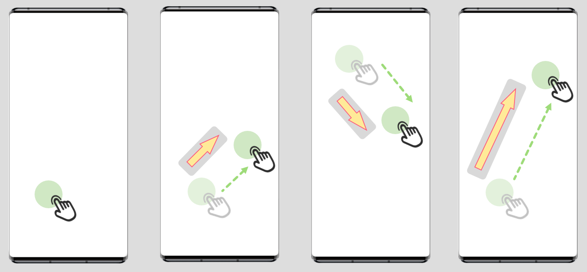

# 2D物理碰撞&lt;CollisionWorld&gt;

## 动效概述

2D物理碰撞作为常见的游戏引擎能力，通过为平面刚性物体赋予真实的物理属性的方式，来计算刚体运动、碰撞情况，进而制作各类趣味交互主题。设计师可以创造一个刚体世界，设置刚体世界的大小、重力等参数，并给需要运动的素材赋予刚体属性（重力、密度、初始力、初始速度等），模拟真实世界的运动和碰撞效果。

## 场景举例

* 模拟台球游戏，小球之间互相碰撞以及碰撞到台球桌边缘后反弹的效果。
* 模拟冰壶运动，手指滑动给物体施加力，根据刚体世界的重力，冰壶的质量等参数，模拟真实世界让冰壶做惯性运动。

## XML规范

```
<!-- 刚体世界-->
<CollisionWorld vecX="" vecY="" x="" y=""  width="" height="" worldImgSrc="" worldImgType="" defBourderLine="" minShake="" shakeCoef=""  minMicroDb="" microCoef="" accCoef=""  gwidth="" gheight="" gsrc="" >
    <Texture width="" height="" src="" srcid="" scaleType=""/>

    <!-- 内部刚体-->
    <CollBody id="" type="" shape="" imgsrc="" x="0" y="" width="" height= ""  friction="" restitution="" density="" isActive="" statevar=""/>
       <IntentCommand action="" class="" imgsrc="" package="" />
       <Texture x="" y=""  w="" h="" src="" srcid="" />
    <CollBody id="" type="" shape="" imgsrc="" x="" y="" width="" height= ""  friction="" restitution="" density="" isActive="" />

</CollisionWorld>
```

## 参数说明

* <strong>&lt;CollisionWorld&gt;</strong>

刚体世界，主要用于设置刚体世界的属性。

| 参数 | 类型 | 选项 | 注释 |
| --- | --- | --- | --- |
| vecX | 数值 | 选填 | 刚体世界x方向的重力数值，支持表达式，默认值为0。该值大于0物体向右移动，小于0物体向左移动，为0时无x轴位移效果。 |
| vecY | 数值 | 选填 | 刚体世界y方向的重力数值，支持表达式，默认值为0。该值大于0物体向下移动，小于0物体向上移动，为0时无y轴位移效果。 |
| x | 数值 | 选填 | 刚体世界左上角的x坐标，默认值为0。 |
| y | 数值 | 选填 | 刚体世界左上角的y坐标，默认值为0。 |
| width | 数值 | 选填 | 刚体世界的宽度。 |
| height | 数值 | 选填 | 刚体世界的高度。 |
| worldImgSrc | 字符串 | 选填 | 刚体世界的背景图。 |
| worldImgType | 字符串 | 选填 | 刚体世界背景图的适配方式，默认填满view的为fit\_xy，居中截取为center\_crop。 |
| defBourderLine | 数值 | 选填 | 刚体世界四周是否添加不可见边界刚体线，默认为0不添加，非零则添加。 |
| minShake | int 数值 | 选填 | 触发摇一摇感应力的最小值，值越大越难触发摇一摇，默认无限大即不触发摇一摇，建议取值18-50。  当手机摇一摇的幅度达到该值后，刚体会受到手机摇动方向的力。  说明：  摇一摇幅度值在18-50之间。 |
| shakeCoef | float 数值 | 选填 | 摇一摇感应力系数，默认为1。刚体受力为minShake与shakeCoef的乘积， 建议取值范围【-10000000——10000000】，负值表示受力方向相反。 |
| minMicroDb | int 数值 | 选填 | 触发手机麦克风音量感应力的最小值，值越大越难触发麦克风音量感知，默认无限大即不触发麦克风音量感知，建议取值58-80。  当麦克风的音量达到该值后，刚体会受到手机屏幕垂直向上的力。  说明：  麦克风音量感知的值在58-80之间。 |
| microCoef | float 数值 | 选填 | 手机麦克风音量感应力系数，默认为1。刚体受力为minMicroDb与microCoef的乘积，建议取值范围【-10000000——10000000】，负值表示受力方向相反。 |
| accCoef | float 数值 | 选填 | 手机重力感应力系数，默认为0不受重力感应。刚体受力为重力感应力与accCoef的乘积，建议取值范围【-10000000——10000000】，负值表示受力方向相反。 |
| gwidth | int 数值 | 选填 | 支持按照手指滑动方向受力时，受力大小和方向的可视化图标的初始宽度。  说明：  刚体设置了gesture属性且值为非0时，此刚体支持按照手指滑动方向受力移动。 |
| gheight | int 数值 | 选填 | 支持按照手指滑动方向受力时，受力大小和方向的可视化图标的初始高度。  说明：  刚体设置了gesture属性且值为非0时，此刚体支持按照手指滑动方向受力移动。 |
| gsrc | 字符串 | 选填 | 支持按照手指滑动方向受力时，受力大小和方向的可视化图标的图片资源。  说明：  1. 刚体设置了gesture属性且值为非0时，此刚体支持按照手指滑动方向受力移动。 2. 手指滑动范围越长，图标显示的高度越长，因此存在图标拉升变形的情况，设计时需注意这一点。 |
| visibility | 数值 | 选填 | 大于0表示可见，小于等于0表示不可见。 |

注意，vecX、vecY的重力方向是人为设定的，accCoef取正值时，刚体受到的重力方向与地球真实的重力方向一致。在同一个刚体世界中，建议vecX、vecY不要与accCoef同时使用。





* <strong>&lt;CollBody&gt;</strong>

刚体世界中的刚体的属性，可以设置圆形或者方形的刚体，来实现碰撞、振动和播放音乐等动效。

刚体数量创建过多会导致主题卡顿，因此桌面万象小组件和锁屏中刚体数量建议不要超出30个，桌面中刚体数量建议不要超出10个，超出个数限制的刚体不会显示。

| 参数 | 类型 | 选项 | 注释 |
| --- | --- | --- | --- |
| id | 字符串 | 必填 | 区分不同刚体的身份id，该值的唯一要求是不能重复，即不同的CollBody不能用同一个id值。 |
| type | 数值 | 选填 | 刚体类型，2为动态刚体，其他值或默认值为静态刚体。  说明：  动态刚体：受力会运动，可以设置运动速度。  静态刚体：静止不动，质量无穷大的刚体。 |
| shape | 数值 | 选填 | 刚体的形状，1是圆形，其他值或者默认值为方形。 |
| imgsrc | 字符串 | 必填 | 刚体的背景图。 |
| x | 数值 | 选填 | 刚体的初始坐标x。  此初始坐标x，以刚体世界&lt;CollisionWorld&gt;左上角为原点（0,0）计算，而不是以手机屏幕左上角为原点计算。   |
| y | 数值 | 选填 | 刚体的初始坐标y。  说明：  计算方式同x。 |
| width | 数值 | 方形刚体必填 | 刚体的宽度，方形刚体必填。 |
| height | 数值 | 方形刚体必填 | 刚体的高度，方形刚体必填。 |
| radius | 数值 | 圆形刚体必填 | 刚体的半径，圆形刚体必填。 |
| friction | float 数值 | 选填 | 刚体的摩擦力系数，默认0.5。 |
| restitution | float 数值 | 选填 | 刚体的恢复系数（碰撞后反弹系数），默认0.5。 |
| density | float 数值 | 选填 | 刚体的密度，默认0.5。 |
| forceX | float 数值 | 选填 | 刚体创建时x方向的初始受力值，默认0，建议取值范围【-10000000——10000000】，正负值表示方向相反。 |
| forceY | float 数值 | 选填 | 刚体创建时y方向的初始受力值，默认0，建议取值范围【-10000000——10000000】，正负值表示方向相反。 |
| vx | float 数值 | 选填 | 刚体创建时x方向的初始速度，默认0，建议取值范围【-10000000——10000000】，正负值表示方向相反。 |
| vy | float 数值 | 选填 | 刚体创建时y方向的初始速度，默认0，建议取值范围【-10000000——10000000】，正负值表示方向相反。 |
| isActive | int 数值 | 选填 | 刚体属性，0为非刚体，其他值及默认值1为刚体。  说明：  刚体不能被穿过，碰撞时反弹。非刚体可被穿过。 |
| musicSrc | 字符串 | 选填 | 被碰撞后播放音乐的资源路径，mp3资源，建议资源不大于2M。 |
| musicloop | int 数值 | 选填 | 是否循环播放音乐，默认0播放一次，-1为无限循环，其他值为播放musicloop+1次。 |
| vibrateTime | 字符串 | 选填 | 被碰撞后产生振动效果时长，单位毫秒。 |
| statevar | 字符串 | 选填 | 刚体碰撞状态监听变量，该刚体碰撞时此变量取值为1，碰撞前和碰撞后取值为0。  给statevar设置任意且唯一的变量名，如statevar="body\_5\_state"，则通过#body\_5\_state即可获取该刚体的碰撞状态值。 |
| clickable | 数值 | 选填 | 是否支持点击执行初始受力值和初始速，默认值为0不支持，1为支持。  说明：  clickable="1"时，支持为刚体设置 [&lt;IntentCommand&gt;命令](/docs/distribute/content-dist/theme-center/development-tutorial-0000001054519376/themes-engine-0000001054452463/themes-engine4-0000002530591413/basic-function-0000001054908461/orders-0000001073987886/intentcommand-0000001074006732)，实现点击刚体跳转到目标应用程序，详见[示例2](#section336916454134)。 |
| gesture | 字符串 | 选填 | 是否支持按照手指滑动方向受力移动，默认值为0表示不支持，其他值为支持。刚体受力为 f\*gesture，f为对应刚体世界的gscr手势力。  手指滑动范围越长，施加给刚体的力越大。  支持按照手指滑动方向受力时，受力大小和方向可以通过图标可视化显示出来：手指滑动的力越大，图标长度越长；图标的方向为手指滑动的方向。此图标的初始宽度、初始高度和图片资源分别通过刚体世界&lt;CollisionWorld&gt;中的gwidth、gheight和gsrc设置。   |
| opx | 字符串 | 选填 | 获取刚体实时的x坐标。给opx设置任意且唯一的变量名，如opx="body\_1\_x"，则通过#body\_1\_x即可获取该刚体实时的x坐标。 |
| opy | 字符串 | 选填 | 获取刚体实时的y坐标。给opx设置任意且唯一的变量名，如opy="body\_1\_y"，则通过#body\_1\_y即可获取该刚体实时的y坐标。 |


通过[刚体变速受力命令&lt;CollBodyCommand&gt;](/docs/distribute/content-dist/theme-center/development-tutorial-0000001054519376/themes-engine-0000001054452463/themes-engine4-0000002530591413/basic-function-0000001054908461/orders-0000001073987886/collbodycommand-0000001236339954)，可以改变刚体的运动速度、受力方向、刚体属性和刚体类型，详见[示例2](#section336916454134)。

* <strong>&lt;Texture&gt;</strong>

&lt;Texture&gt;是刚体世界&lt;CollisionWorld&gt;和刚体&lt;CollBody&gt;的子标签。通过&lt;Texture&gt;可以为刚体世界和刚体设置动态图片，支持srcid、[gif](/docs/distribute/content-dist/theme-center/development-tutorial-0000001054519376/themes-engine-0000001054452463/themes-engine4-0000002530591413/basic-function-0000001054908461/view-0000001073865717/dynamicimage-0000001074184128) 和[apng](/docs/distribute/content-dist/theme-center/development-tutorial-0000001054519376/themes-engine-0000001054452463/themes-engine4-0000002530591413/basic-function-0000001054908461/view-0000001073865717/apng-0000001252739922)格式动态效果。


&lt;Texture&gt;中的图片优先级低于&lt;CollisionWorld&gt;中worldImgSrc和&lt;CollBody&gt;中imgsrc图片的优先级。因此，使用&lt;Texture&gt;设置动态图片时，不能填写&lt;CollisionWorld&gt;中的worldImgSrc和&lt;CollBody&gt;中的imgsrc。

| 参数 | 类型 | 选项 | 注释 |
| --- | --- | --- | --- |
| x | 字符串 | 选填 | 相对父标签的x坐标，默认0。 |
| y | 数值 | 选填 | 相对父标签的y坐标，默认0。 |
| w | 数值 | 选填 | 图片资源宽度，默认0。 |
| h | 字符串 | 选填 | 图片资源高度，默认0。 |
| src | 数值 | 选填 | 图片名称的相对路径，图片文件名例如：image.png。图片大小须小于5M。图片支持png/jpg/gif格式。 |
| srcid | 数值 | 选填 | 图片序列后缀数字，一般用变量表示，可以根据变量显示不同的图片，如果src="pic.png" srcid="1" 则最后会显示图片 "pic\_1.png"，大于0， 正整数，支持数字表达式。 |
| scaleType | 字符串 | 方形刚体必填 | 图片的缩放模式，目前支持三种模式：fill、center\_crop和hold\_center\_crop，默认为center\_crop模式。fill 表示填充满屏幕，若图片比例与屏幕不匹配会导致图片拉伸。 center\_crop 表示按照屏幕宽高的比例进行缩放，使图片居中充满整个屏幕，多余部分裁剪。 hold\_center\_crop 表示图片不进行缩放处理，居中裁剪脚本中设置的w、h区域。 |
| supportApng | 字符串 | 选填 | 当且仅当该参数为true时，&lt;Texture&gt;支持Apng类型的资源文件播放，此时资源文件类型为APNG，后缀名应为".png"。  说明：  需自行制作.png格式的APNG动图。 |
| apngLoopCount | 数值 | 选填 | APNG动画循环播放次数，当该参数为-1时，无限循环播放APNG动画。 |

## 应用示例

### 示例1

创建一个刚体世界，并在四周添加不可见边界刚体线。在这个刚体世界中：创建3个动态刚体，受到重力和摇一摇的力碰撞运动。同时，刚体世界随时间而变化，8-17点显示浅色的刚体世界，其他时间显示深色的刚体世界。

[](https://alliance-communityfile-drcn.dbankcdn.com/FileServer/getFile/publicContent/011/111/111/0000000000011111111.20251218173443.31617826234549288438197787330824:20260601221936:2800:D1D60DC2DC6F5CEEFB4AA7E5C085D9C2ECB86668DB3CC519FC69CFDFA427C192.mp4)

```
<!-- 浅色的刚体世界-->
<CollisionWorld vecX="0" vecY="0" width="2433" height="2920" defBourderLine="1" minShake="18" shakeCoef="100000" accCoef="10000" gwidth="60" gheight="300" visibility="ge(#hour,8)*le(#hour,17)" x="-262" y="-262">
       <CollBody x="0" y="0" shape="1" imgsrc="shallow/big_ball.png" radius="777" friction="0.5" restitution="0.5" density="1" forceX="0" forceY="0" vx="1" vy="1" isActive="1" type="2" id="body_1"/>
       <CollBody x="1227" y="1713" shape="1" imgsrc="shallow/center_ball.png" radius="592" friction="0.5" restitution="0.6" density="1" forceX="0" forceY="0" vx="1" vy="1" isActive="1" type="2" id="body_2"/>
       <CollBody x="847" y="1673" shape="1" imgsrc="shallow/small_ball.png" radius="240" vx="1" vy="1" isActive="1" type="2" id="body_3"/>
</CollisionWorld>

<!-- 深色的刚体世界-->
<CollisionWorld vecX="0" vecY="0" width="2433" height="2920" defBourderLine="1" minShake="18" shakeCoef="100000" accCoef="10000" gwidth="60" gheight="300" visibility="not(ge(#hour,8)*le(#hour,17))" x="-262" y="-262">
       <CollBody x="0" y="0" shape="1" imgsrc="deep/big_ball.png" radius="777" friction="0.5" restitution="0.5" density="1" forceX="0" forceY="0" vx="1" vy="1" isActive="1" type="2" id="body_1"/>
       <CollBody x="1227" y="1713" shape="1" imgsrc="deep/center_ball.png" radius="592" friction="0.5" restitution="0.6" density="1" forceX="0" forceY="0" vx="1" vy="1" isActive="1" type="2" id="body_2"/>
       <CollBody x="847" y="1673" shape="1" imgsrc="deep/small_ball.png" radius="240" vx="1" vy="1" isActive="1" type="2" id="body_3"/>
</CollisionWorld>
```

### 示例2

创建一个刚体世界，在这个刚体世界中：创建4个静态刚体为边界，并将其中一个边界刚体body\_4设置为被碰撞后产生音乐和振动；监听body\_4刚体的碰撞状态；body\_5可以点击执行初始设置的速度和受力，也可以根据滑动手势滑动的距离及方向进行受力；通过刚体变速受力命令改变body\_5刚体的运动速度和受力方向，改变body\_2的属性为非刚体。同时将刚体8的坐标x、y 的值及后续变化值开放成全局变量，点击刚体8打开华为应用市场app并跳转到首页。

```
<!-- 刚体世界-->
<CollisionWorld vecX="0" vecY="0" x="40" y="200"  width="1000" height="1600" worldImgSrc="bg_x.jpg" worldImgType="center_crop" defBourderLine="0" minShake="18" shakeCoef="1"  accCoef="0"  minMicroDb="55" microCoef="1000" gwidth="60" gheight="300" gsrc="jiantou.png" >

        <!-- 内部刚体 围边静态刚体-->
        <CollBody id="body_1" type="1" shape="2" imgsrc="body/wshu1.png" x="0" y="0" width="100" height= "1600"  friction="0.2" restitution="0.2" density="3" isActive="1" />
        <CollBody id="body_2" type="1" shape="2" imgsrc="body/heng1.png" x="0" y="0" width="1000" height= "100"  friction="0.2" restitution="0.2" density="3"  isActive="1" />
        <CollBody id="body_3" type="1" shape="2" imgsrc="body/wshu2.png" x="900" y="0" width="100" height= "1600"  friction="0.2" restitution="0.2" density="3"  isActive="1" />
        <CollBody id="body_4" type="1" shape="2" imgsrc="body/heng2.png" x="0" y="1500" width="1000" height= "100"  friction="0.2" restitution="0.2" density="3"  isActive="1" musicSrc="body/music.mp3" musickeepCur="0"  musicloop="0"  vibrateTime="150" statevar="body_4_state"/>

        <!-- 内部刚体 动态刚体-->
        <CollBody id="body_5" type="2" shape="1" imgsrc="ch1.png" x="100" y="100"  radius="65" friction="0.5" restitution="0.5" density="1" forceX="10" forceY="10" vx="10" vy="200"  statevar="body_5_state" clickable="1"  gesture="10"/>
        <CollBody id="body_6" type="2" shape="1" imgsrc="ch2.png" x="300" y="100"  radius="50" friction="0.5" restitution="0.6" density="1" forceX="10" forceY="10" vx="10" vy="5"/>
        <CollBody id="body_7" type="2" shape="1" imgsrc="ch3.png" x="100" y="400" radius="80" />
        <!--将刚体8的坐标x y 的值及后续变化值开放成全局变量 opx="body_8_opx" opy="body_8_opy"，刚体8点击打开华为应用市场app并跳转到首页。兼容IntentCommand的跳转写法，对应刚体要支持点击事件clickable="1"-->
        <CollBody id="body_8" type="2" shape="1" imgsrc="ch1.png" x="100" y="100"  opx="body_8_opx" opy="body_8_opy" radius="65" friction="0.5" restitution="0.5" density="1" forceX="1000" forceY="1000" vx="10" vy="200" isActive="1"   vibrateTime="0"  statevar="body_5_state" clickable="1"  gesture="500" >
            <IntentCommand action="android.intent.action.MAIN" class="com.huawei.appmarket.MainActivity" package="com.huawei.appmarket" />
        </CollBody>

</CollisionWorld>

<!-- 获取刚体body_8的x及y坐标 -->
<Text x="40" y="1050"  alignV="top" color="#ffffff" size="30"   format="body_8_opx: %s"  width="1000"  autoLineFeed="true" paras="#body_8_opx"/>
<Text x="40" y="1100"  alignV="top" color="#ffffff" size="30"   format="body_8_opy: %s"  width="1000"  autoLineFeed="true" paras="#body_8_opy"/>

<!-- 命令绑定特定刚体 点击触发对应刚体body_5受力及速度大小 -->
<Image x="200" y="1800"  w="200" h="200" src="ch1.png"  />
<Button x="200" y="1800" w="200" h="200" >
    <Triggers>
        <Trigger action="up">
            <!-- collbodyid 要绑定的刚体id   forceX  forceY 要给刚体施加的力 vx vy 要改变的刚体速度 -->
            <CollBodyCommand collbodyid="body_5"  forceX="100" forceY="100" vx="100" vy="100"/>
            <!-- collbodyid 要绑定的刚体id   body_2的属性为非刚体-->
            <CollBodyCommand collbodyid="body_2" isActive="0"/>
        </Trigger>
    </Triggers>
</Button>

<!-- 碰撞状态变量值 只有碰撞时才会是1-->
<Text x="20" y="2160"  alignV="top"  color="#ffffff" size="40" format="碰撞状态b4:%s" width="1000" autoLineFeed="true" paras="#body_4_state"/>
<Text x="20" y="2220"  alignV="top"  color="#ffffff" size="40" format="碰撞状态b5:%s" width="1000" autoLineFeed="true" paras="#body_5_state"/>
```