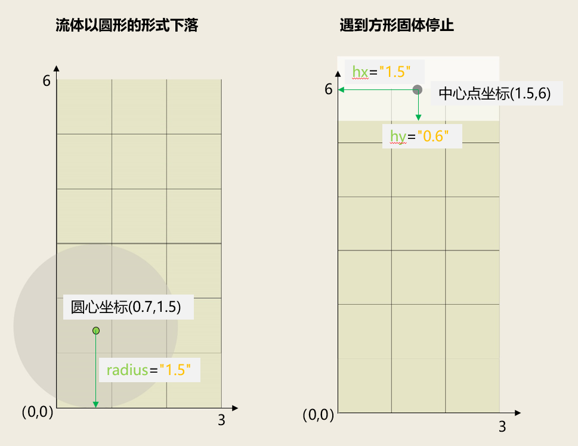
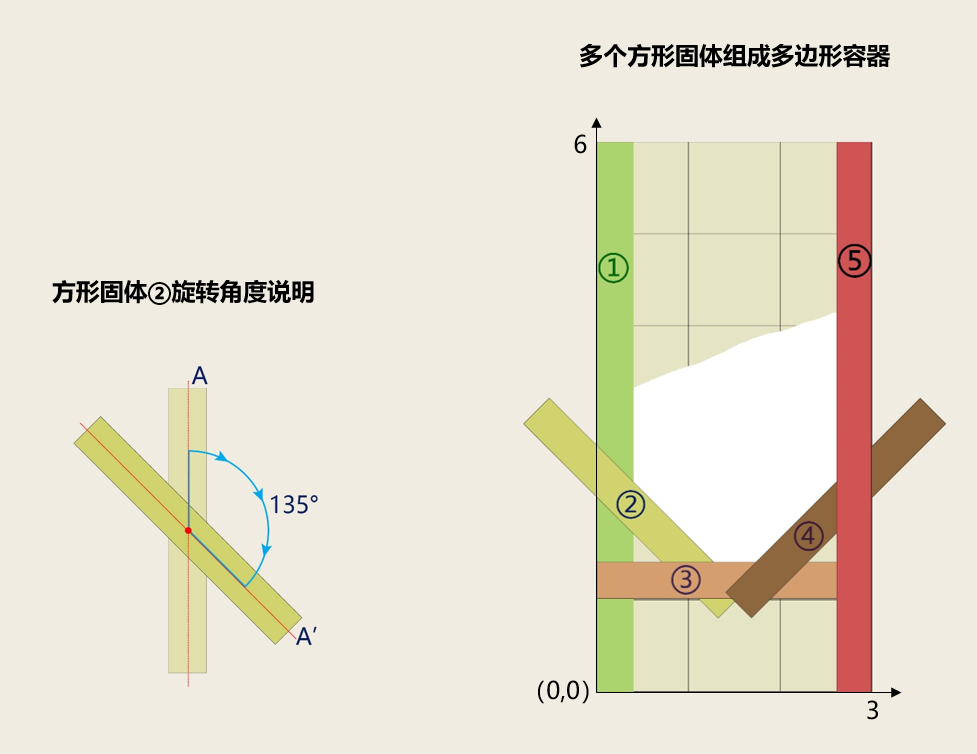
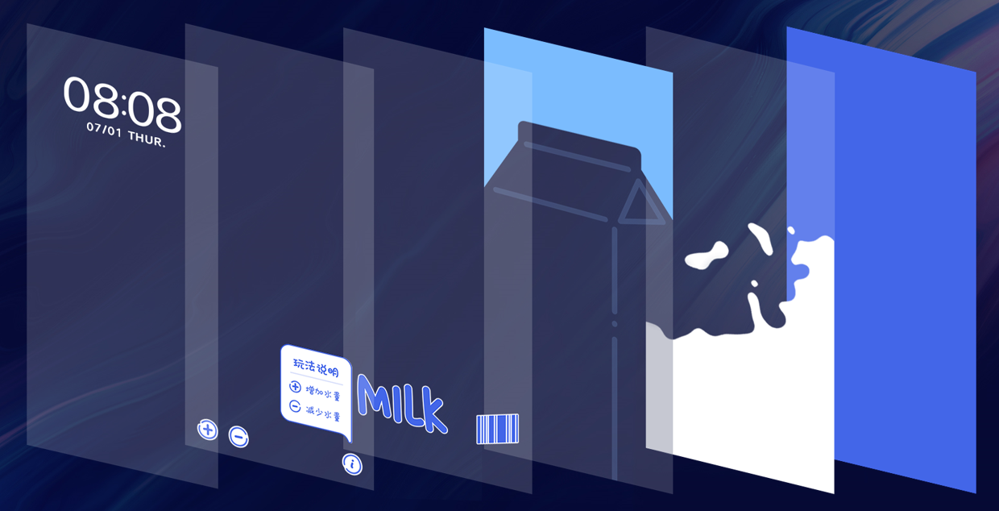
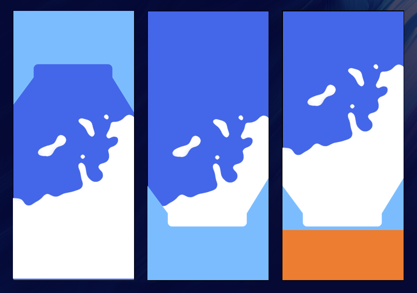

# 流体动效&lt;FluidsView&gt;

## 功能概述

模拟流体流动效果，可以设置流体的颜色，数量以及区域等，可以应用在锁屏和桌面上。


1、流体动效在桌面应用时，不可以与其他动效共用。

2、折叠屏展开状态和横竖屏状态均不支持流体功能。

3、平板横竖屏状态均不支持流体功能。

## XML规范

```
 <FluidsView gravityRatio="" viscosity = "" color = "" waterAlpha="" bgSrc="" scaleTyp="" srcid="" persist="" waterAlphaThreshold="">
	<CircleShape type="" radius="" xPosition="" yPosition=""/>
	<PolygonShape type="" hx="" hy="" angle="" xPosition="" yPosition=""/>
 </FluidsView>
```

## 参数说明

* <strong>FluidsView</strong>

| 参数 | 类型 | 选项 | 注释 |
| --- | --- | --- | --- |
| bgSrc | 字符串 | 选填 | 设置流体的背景 |
| color | 表达式 | 选填 | 设置流体的颜色 |
| gravityRatio | 表达式 | 选填 | 设置流体的重力系数，取值范围为（0-1） |
| viscosity | 表达式 | 选填 | 设置流体的粘滞系数，取值范围为（0-1） |
| waterAlpha | 表达式 | 选填 | 设置流体的透明度，取值范围为（0-1） |
| waterAlphaThreshold | 表达式 | 选填 | 设置流体混和的透明度阈值，取值范围为（0-1） |
| CircleShape | 子元素 | 选填 | 流体的形状（圆形） |
| PolygonShape | 子元素 | 选填 | 流体的形状（方形） |
| scaleType | 字符串 | 选填 | 背景图片的缩放模式，目前支持两种模式，默认为center\_crop模式。   * fill 表示填充满屏幕，若图片比例与屏幕不匹配会导致图片拉伸；  * center\_crop 表示图片等比缩放并居中充满整个屏幕的宽高，多余部分裁剪。 |

* <strong>CircleShape</strong>

| 参数 | 类型 | 选项 | 注释 |
| --- | --- | --- | --- |
| type | 字符串 | 选填 | 设置该形状是流体（water）或固体（solid），默认为流体（water） |
| xPosition | float | 必填 | 圆心的x轴坐标，取值范围为（0-3）。固定将实际屏幕的宽映射为3，故xPosition取值范围为（0-3） |
| yPosition | float | 必填 | 圆心的Y轴坐标，与xPosition取值的映射关系保持一致，同时与实际屏幕的宽高比保持一致 |
| radius | float | 必填 | 圆形流体的半径，与xPosition取值的映射关系保持一致，决定圆形流体的范围大小 |

* <strong>PolygonShape</strong>

| 参数 | 类型 | 选项 | 注释 |
| --- | --- | --- | --- |
| type | 字符串 | 选填 | 设置该形状是流体（water）或固体（solid），默认为流体（water） |
| xPosition | float | 必填 | 中心点的x轴坐标，取值范围为（0-3），固定将实际屏幕的宽映射为3，故xPosition取值范围为（0-3）。中心点为对角线的交点 |
| yPosition | float | 必填 | 中心点的Y轴坐标，与xPosition取值的映射关系保持一致，同时与实际屏幕的宽高比保持一致 |
| hx | float | 必填 | 方形流体的半宽，与xPosition取值的映射关系保持一致，决定方形流体的范围大小 |
| hy | float | 必填 | 方形流体的半高，与xPosition取值的映射关系保持一致，决定方形流体的范围大小 |
| angle | float | 必填 | 方形流体旋转的角度（0-360），围绕中心点进行旋转，顺时针计算角度 |

## 应用示例

<strong>示例1</strong> <strong>：流体以圆形的形式出现下落，遇到方形固体停止。</strong>

流体的背景为bg.jpg，重力系数为1，粘滞系数为0.1，颜色为argb(255, 255,255,255)，透明度为1。

圆形流体的坐标为（0.7,1.5），半径为1.5。方形固体的中心点坐标为（1.5,6），半宽为1.5，半高为0.6。

```
<FluidsView gravityRatio="1" viscosity = "1" color = "argb(255, 255,255,255)" waterAlpha="1" bgSrc="bg.jpg">
	<CircleShape radius="1.5" xPosition="0.7" yPosition="1.5"/>
	<PolygonShape type="solid" hx="1.5" hy="0.6" xPosition="1.5" yPosition="6"/>
</FluidsView>
```

在1080\*2160屏幕上的效果图：




1. 流体动效中，以屏幕左下角为坐标原点（0,0)，后面示例同理。
2. 流体动效中固定将实际屏幕的宽映射为3。以1080\*2160的屏幕为例，宽高比为1:2，则计算出将流体动效中屏幕的高为6。
3. 本示例圆形流体的范围如上面-左图的灰色部分所示。屏幕为一个默认的容器，超出屏幕的流体部分不会显示。本示例就有一部分流体超出屏幕，不会显示。
4. 本示例方形固体的范围如上面-右图白色的部分所示。由于方形固体设置在屏幕最上方，高于圆形流体的下落位置，因此屏幕正放时，不影响圆形流体的下落；当屏幕倒放时，则会在接触到方形固体时停止，无法触达屏幕最下方。
5. 流体的颜色由color的值决定，固体没有颜色，效果图仅为展示流体和固体的范围，不代表实际颜色。
6. 方形固体为单纯的碰撞体，目前不支持交互、移动或者受重力影响。

<strong>示例2</strong> <strong>：流体以方形的形式出现下落，遇到多个方形固体组成的多边形容器停止。</strong>

流体的背景为bg.jpg，重力系数为#gravityRatio，粘滞系数为#viscosity，颜色为argb(255,#color,198,88)，透明度为0.5，混合时的透明度阈值为0.7。

方形流体的中心点坐标为（1.5,4.5），半宽为0.5，半高为2。

5个方形固体①②③④⑤组合成多边形容器，其和屏幕顶端组合成的封闭空间，就是流体的运动范围，详见效果图。

```
<FluidsView gravityRatio="#gravityRatio" viscosity = "#viscosity" color = "argb(255,#color,0,22)" waterAlpha="0.5" bgSrc="bg.jpg" waterAlphaThreshold="0.7">
		<!--流体以方形的形式出现下落，遇到固体停止-->
		<PolygonShape  hx="0.5" hy="2" angle="0" xPosition="1.5" yPosition="4.5"/>
		<!--效果图①处的方形固体-->
		<PolygonShape  hx="0.2" hy="3" angle="0" xPosition="0.2" yPosition="3" type="solid"/>
		<!--效果图②处的方形固体-->
		<PolygonShape  hx="0.2" hy="1.5" angle="135" xPosition="0.4" yPosition="2" type="solid"/>
		<!--效果图③处的方形固体-->
		<PolygonShape  hx="0.2" hy="1.5" angle="90" xPosition="1.5" yPosition="1.2" type="solid"/>
		<!--效果图④处的方形固体-->
		<PolygonShape  hx="0.2" hy="1.5" angle="45" xPosition="2.6" yPosition="2" type="solid"/>
		<!--效果图⑤处的方形固体-->
		<PolygonShape  hx="0.2" hy="3" angle="0" xPosition="2.8" yPosition="3" type="solid"/>
</FluidsView>
```

在1080\*2160屏幕上的效果图：




1. 以方形固体②为例，其 hx="0.2" hy="1.5" ，A位置为其初始位置；A’位置为其围绕中心点顺时针旋转135°后得到的位置，即angle="135"时的位置。
2. 流体的颜色由color的值决定。固体没有颜色，效果图仅为展示流体和固体的范围，不代表实际颜色。
3. 使用多个圆形/方形固体，可组合成各种类型的多边形容器。

## 效果和代码展示

<strong>流体动效示例：</strong>

晃动手机牛奶翻滚；点击“+”按钮增加水量；点击“-”按钮减少水量。其中动态增加或减少流体数量，通过[流体增减命令&lt;ParticleCommand&gt;](/docs/distribute/content-dist/theme-center/development-tutorial-0000001054519376/themes-engine-0000001054452463/themes-engine4-0000002530591413/basic-function-0000001054908461/orders-0000001073987886/particlecommand-0000001197827299)配合流体动效实现。

[](https://alliance-communityfile-drcn.dbankcdn.com/FileServer/getFile/publicContent/011/111/111/0000000000011111111.20251218173445.63024523120986422216688354501816:20260601221947:2800:50D545BE89929D4DB6E2F4CD2E7C62662F4A4CCA53B810B6A6323C2D2AB2496E.mp4)

```
<?xml version="1.0" encoding="utf-8"?>
<Lockscreen version="1" frameRate="30" displayDesktop="true" screenWidth="1080" id="201805221979" >
	<Var name="w" expression="#screen_width" persist="true" const="true" />
	<Var name="h" expression="#screen_height" persist="true" const="true" />
	<Var name="gravityRatio" expression="1"/>
	<Var name="viscosity" expression="0.1"/>
	<Var name="show" expression="0"/>

	<FluidsView gravityRatio="#gravityRatio" viscosity = "#viscosity" color = "argb(255, 255,255,255)" waterAlpha="1" bgSrc="bg.jpg">
		<CircleShape radius="1.5" xPosition="0.7" yPosition="1.5"/>
		<PolygonShape type="solid" hx="1.5" hy="0.6" xPosition="1.5" yPosition="6"/>
	</FluidsView>

	<Image x="0" y="0" src="top_0.png"/>
	<Image x="106" y="#h-237-272" src="lable_0.png"/>
	<Image x="60" y="#h-158" src="add.png"/>
	<Button x="30" y="#h-218" w="158" h="218">
		<Trigger action="down">
			<ParticleCommand type="add" color="argb(255, 255,255,255)" condition="1">
				<CircleShape radius="0.3" xPosition="0.8" yPosition="1.5"/>
			</ParticleCommand>
		</Trigger>
	</Button>

	<Image x="60+158" y="#h-160" src="reduce.png"/>
	<Button x="60+128" y="#h-220" w="155" h="220">
		<Trigger action="down">
			<VariableCommand name="delete" expression="#delete+40" condition="lt(#delete,255)"/>
			<VariableCommand name="delete" expression="0" condition="gt(#delete,255)"/>
			<ParticleCommand type="delete" deleteNum="#delete" condition="1"/>
		</Trigger>
	</Button>

	<Image x="#w-155" y="#h-160" src="info.png"/>
	<Button x="#w-155" y="#h-160" w="95" h="100">
		<Triggers>
			<Trigger action="down">
				<VariableCommand name="show" expression="ifelse(eq(#show,0), 1, 0)" />
			</Trigger>
		</Triggers>
	</Button>

	<Image x="#w-80-441" y="#h-148-45-514" src="pop_0.png" visibility="eq(#show,1)"/>
	<Time x="#w/2" y="165" src="number.png" align="center"/>
	<Group x="#w/2-(#m1.bmp_width+#m2.bmp_width+#ms.bmp_width+#t1.bmp_width+#t2.bmp_width+20+#w2.bmp_width)/2" y="165+160" >
		<Image name="m1" x="0"    y="0" src="date.png" srcid="(#month+1)/10" />
		<Image name="m2" x="#m1.bmp_width" y="0" src="date.png" srcid="(#month+1)%10"/>
		<Image name="ms" x="#m1.bmp_width+#m2.bmp_width" y="0" src="yue.png"/>
		<Image name="t1" x="#m1.bmp_width+#m2.bmp_width+#ms.bmp_width" y="0" src="date.png" srcid="#date/10" />
		<Image name="t2" x="#m1.bmp_width+#m2.bmp_width+#ms.bmp_width+#t1.bmp_width" y="0" src="date.png" srcid="#date%10"/>
		<Image name="w2" x="#m1.bmp_width+#m2.bmp_width+#ms.bmp_width+#t1.bmp_width+#t2.bmp_width+20" y="0" src="week.png" srcid="#day_of_week" />
	</Group>

	<!--上滑解锁-->
	<Button x="0" y="0" w="1080"  h="#h">
		<Triggers>
			<Trigger action="up">
				<ExternCommand condition="gt(#touch_begin_y-#touch_y,150)" command="unlock"/>
			</Trigger>
		</Triggers>
	</Button>
</Lockscreen>
```

设计思路：本示例通过<strong>多层图片叠加</strong>的方式，快速制作牛奶瓶容器，使牛奶仅在牛奶瓶设计区域中运动。同时在屏幕顶端设置方形固体，解决屏幕倒放时牛奶流出牛奶瓶的问题。



